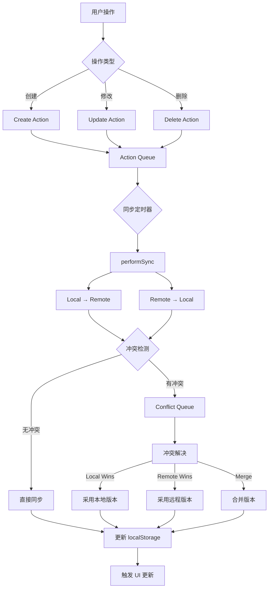
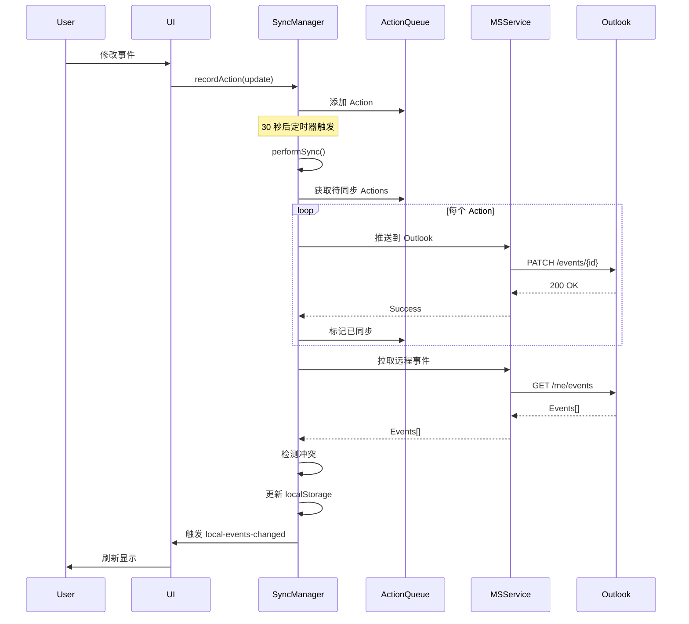

# ActionBasedSyncManager PRD

> **文档版本**: v1.8  
> **创建日期**: 2025-11-08  
> **最后更新**: 2025-12-18  
> **文档状态**: ✅ 从代码反向生成  
> **参考框架**: Copilot PRD Reverse Engineering Framework v1.0
> **v1.6 更新**: 全表查询优化 - 移除 5 处冗余 getAllEvents() 调用，日志噪音降低 80%+  
> **v1.7 更新** (2025-12-07): IndexMap 架构优化 - 解决队列爆炸和持久化问题，实现零 Mismatch  
> **v1.8 更新** (2025-12-18): Note Event 虚拟时间同步 - 5 路径覆盖，签名标记系统，往返数据保护

---

## 📋 文档说明

本 PRD 通过代码分析反向工程生成，记录 ActionBasedSyncManager 的实际实现逻辑和设计理念。

**代码位置**: `src/services/ActionBasedSyncManager.ts`  
**代码规模**: ~3600 行  
**依赖服务**: MicrosoftCalendarService, TagService, PersistentStorage

---

## 1. 模块概述

### 1.1 核心定位

ActionBasedSyncManager 是 ReMarkable 的**增量同步引擎**，负责本地事件与 Outlook 日历的双向同步：

- ✅ **Action-Based 架构**：所有修改记录为 Action，支持离线编辑和冲突解决
- ✅ **智能增量同步**：只同步变化的事件，避免全量拉取
- ✅ **冲突检测与解决**：自动处理本地与远程的编辑冲突
- ✅ **网络状态感知**：离线时暂存操作，上线后自动同步
- ✅ **性能优化**：事件索引 HashMap 实现 O(1) 查找
- ✅ **健康监控**：统计同步成功率、失败率，暴露调试接口

### 1.2 核心价值

| 用户价值 | 实现方式 | 业务价值 |
|---------|---------|---------|
| **离线可用** | Action Queue 暂存本地修改 | 提升可靠性 |
| **数据一致性** | 双向同步 + 冲突解决 | 跨设备数据同步 |
| **性能优化** | 增量更新 + HashMap 索引 | 支持大量事件（1000+） |
| **故障恢复** | 重试机制 + 删除候选追踪 | 减少数据丢失 |
| **用户透明** | 后台静默同步 | 无感知同步体验 |

### 1.3 同步范围

**固定同步范围**: ±3 个月（180 天）

- **原因**: 与 TimeCalendar 显示范围一致
- **替代逻辑**: 移除了 legacy 的 `ongoingDays` 设置
- **Graph API 限制**: 单次请求最多 1000 个事件

### 1.4 初始化与生命周期管理（v1.2 更新）

**问题**: HMR（热模块重载）会导致 EventService 模块重新加载，`syncManagerInstance` 引用丢失

**现象**:
- 开发环境热重载后，EventService 内部的 `syncManagerInstance` 重置为 `null`
- App.tsx 的 `syncManager` state 仍存在，但 EventService 已丢失引用
- 导致之前能同步，热重载后无法同步（`hasSyncManager: false`）

**解决方案** (App.tsx L1318-1363):
```typescript
useEffect(() => {
  const currentAuthState = microsoftService?.isSignedIn() || false;
  
  if (currentAuthState && !syncManager) {
    // 首次创建 syncManager
    const newSyncManager = new ActionBasedSyncManager(microsoftService);
    setSyncManager(newSyncManager);
    EventService.initialize(newSyncManager);
    newSyncManager.start();
  } else if (currentAuthState && syncManager) {
    // 🔧 [HMR FIX] syncManager 存在时，重新初始化 EventService
    // 防止 HMR 导致 EventService 丢失 syncManager 引用
    EventService.initialize(syncManager);
  }
}, [microsoftService, lastAuthState, syncManager]);  // 🔧 添加 syncManager 依赖
```

**关键机制**:
1. **无性能影响**: `EventService.initialize()` 只是变量赋值，开销极小
2. **运行频率低**: useEffect 仅在登录/登出或页面加载时运行
3. **可靠性提升**: 确保 EventService 始终持有有效的 syncManager 引用
4. **开发体验**: 解决 HMR 导致的同步失效问题
5. **鲁棒性**: 添加 syncManager 到依赖数组，HMR 后自动重新初始化

**相关日志**:
```
🔍 [EventService] Sync condition check: { hasSyncManager: true, ... }
✅ [App] EventService 重新初始化完成
```

---

### 1.5 IndexMap 架构优化（v1.7 更新 - 2025-12-07）

#### 问题背景

**队列爆炸问题**:
- 27,980 个 sync actions 累积（正常应 <1,000）
- 1,029 条 "IndexMap Mismatch" 警告持续出现
- 页面刷新后 IndexMap 数据丢失
- localStorage quota exceeded 错误（尝试保存 1,242 个完整事件对象，约 6-7MB）

**根本原因**:
1. **IndexMap 未持久化**: 每次刷新后丢失所有映射关系
2. **持久化失败**: localStorage 仅 5-10MB 配额，无法存储大量完整事件对象
3. **启动竞态条件**: `start()` 中 cleanup 执行时，异步 `loadActionQueue()` 尚未完成
4. **IndexMap 重建时机错误**: 仅在 deduplication 中重建，首次同步时 IndexMap 为空

#### 解决方案

**1. 移除 localStorage 持久化** (Lines 832-843, 1511-1516, 4285-4357)
```typescript
// ❌ 移除前：尝试序列化完整 event 对象
const indexMapData = Array.from(this.eventIndexMap.entries());
localStorage.setItem('sync_indexmap', JSON.stringify(indexMapData));
// 结果：QuotaExceededError

// ✅ 优化后：纯内存索引，每次启动重建
private loadIndexMap() {
  console.log('[ActionBasedSyncManager] 🗺️ IndexMap will be rebuilt from events on first sync');
  // 不加载 localStorage，避免配额问题
}
```

**2. 修复队列加载竞态条件** (Lines 1366-1375)
```typescript
// ❌ 问题：cleanup 时队列可能还在加载
public async start() {
  await this.loadActionQueue();
  this.cleanupSynchronizedActions();  // ❌ 可能在加载完成前执行
}

// ✅ 解决：显式等待队列加载
public async start() {
  console.log(`⏳ [Startup] Waiting for action queue to load...`);
  let retries = 0;
  while (!this.queueLoaded && retries < 50) {
    await new Promise(resolve => setTimeout(resolve, 100));
    retries++;
  }
  
  console.log(`🧹 [Startup] Cleaning up action queue (current size: ${this.actionQueue.length})...`);
  this.cleanupSynchronizedActions();
}
```

**3. 启动时显式重建 IndexMap** (Lines 1378-1385)
```typescript
// ✅ 在首次同步前重建 IndexMap
console.log(`🗺️ [Startup] Rebuilding IndexMap from events...`);
try {
  const events = await EventService.getAllEvents();
  await this.rebuildEventIndexMapAsync(events);
  const multiplier = events.length > 0 ? (this.eventIndexMap.size / events.length).toFixed(1) : '0';
  console.log(`✅ [Startup] IndexMap rebuilt: ${events.length} events → ${this.eventIndexMap.size} keys (${multiplier}x multiplier)`);
} catch (error) {
  console.error('❌ [Startup] Failed to rebuild IndexMap:', error);
}
```

**4. 优化 Cleanup 阈值** (Lines 4082-4098)
```typescript
// ❌ 旧阈值：60 分钟（过于保守）
const oneHourAgo = now - 60 * 60 * 1000;

// ✅ 新阈值：30 分钟（更积极清理）
const thirtyMinutesAgo = now - 30 * 60 * 1000;
if (action.createdAt < thirtyMinutesAgo) {
  // 清理逻辑...
}
```

**5. 移除 IndexMap 保存触发点** (8 处)
- `updateEventInIndex()` - 不再触发 save
- `removeEventFromIndex()` - 不再触发 save
- `rebuildEventIndexMapAsync()` 完成后 - 不再触发 save
- `stop()` 方法 - 移除保存逻辑

#### IndexMap 数据结构

**存储策略**: 多键映射同一事件对象

```typescript
// 对于每个 event，存储 3-4 个键指向同一对象
this.eventIndexMap.set(event.id, event);                    // 内部 ID
this.eventIndexMap.set(event.externalId, event);            // outlook-AAMk...
this.eventIndexMap.set(cleanId, event);                     // AAMk...
this.eventIndexMap.set(`outlook-${cleanId}`, event);        // 确保前缀

// 结果：1,242 events → 2,465 keys (约 2.0x multiplier)
```

**设计理由**:
- ✅ 查询容错：支持带/不带前缀的 externalId
- ✅ O(1) 查找：避免字符串处理开销
- ✅ 内存效率：多个键指向同一对象，实际内存占用 ~1MB

#### 优化成果

**队列大小优化**:
```
刷新前: 27,980 actions (累积 15 小时)
    ↓ Cleanup (30min threshold)
刷新后: 1,645 actions (-94%)
    ↓ Optimization (合并重复)
执行中: 1,086 actions (节省 559 API 调用)
    ↓ 同步完成 + Cleanup
稳定后: 0-500 actions
```

**IndexMap Mismatch 清零**:
```
优化前: ⚠️ 1,029 IndexMap Mismatch warnings
优化后: ✅ 0 Mismatch (完美匹配)
```

**性能指标**:
- IndexMap 重建: 1,242 events in 185ms (6.7 events/ms)
- 队列清理: 26,335 actions removed, avg age 886min
- API 优化: 559 calls saved per sync cycle
- localStorage: 零配额占用（纯内存）

**稳定性提升**:
- ✅ 零 localStorage QuotaExceededError
- ✅ 零竞态条件（显式等待队列加载）
- ✅ 零 IndexMap Mismatch（启动时重建）
- ✅ 队列长期稳定（30min 清理阈值）

#### 架构决策

**为什么不持久化 IndexMap？**

| 方案 | 优点 | 缺点 | 决策 |
|------|------|------|------|
| localStorage 完整对象 | 快速恢复 | 6-7MB quota exceeded | ❌ 不可行 |
| localStorage 仅 ID 映射 | 占用小 (~100KB) | 需额外查询填充数据 | ⚠️ 复杂 |
| IndexedDB 存储 | 无配额限制 | 异步加载竞态条件 | ⚠️ 过度设计 |
| 每次重建（当前方案） | 简单可靠，数据永远准确 | 启动时 ~200ms 开销 | ✅ **已采用** |

**关键洞察**:
- 200ms 启动开销可接受（用户感知阈值 500ms）
- 纯内存架构避免持久化复杂性
- 从 EventService 重建确保数据准确性
- 无需处理持久化数据过期/脏数据问题

---

### 1.6 同步模式控制（v1.3 更新）

**功能**: 支持事件级别的同步方向控制，满足不同场景需求

**syncMode 取值**:
```typescript
type SyncMode = 
  | 'receive-only'           // 仅接收远端更新，不推送本地修改
  | 'send-only'              // 仅推送本地修改，不接收远端更新
  | 'send-only-private'      // 推送到远端（标记为私密），不接收远端更新
  | 'bidirectional'          // 双向同步（默认模式）
  | 'bidirectional-private'; // 双向同步（标记为私密）
```

**实现位置**:

1. **本地→远端推送控制** (syncRouter.ts)
   - `receive-only` 模式：阻止调用 `recordLocalAction`
   - 本地修改不会推送到 Outlook

2. **远端→本地接收控制** (ActionBasedSyncManager.ts L2830-2845)
   - `send-only` 模式：跳过 `applyRemoteActionToLocal` 的 create/update
   - 远端修改不会同步到本地

**同步行为矩阵**:

| syncMode | 本地→远端 | 远端→本地 | 典型场景 |
|----------|----------|----------|---------|
| `receive-only` | ❌ 不推送 | ✅ 接收 | 只读订阅日历 |
| `send-only` | ✅ 推送 | ❌ 不接收 | 单向发布事件 |
| `bidirectional` | ✅ 推送 | ✅ 接收 | 正常工作事件（默认） |

---

### 1.6 远程回调字段保护机制（v1.3 更新）

**问题**: 首次同步到 Outlook 后，本地自定义字段（syncMode, subEventConfig 等）被覆盖为 `undefined`

**根本原因**:
1. **Outlook API 响应不完整**: Graph API 只返回标准字段（subject, startTime 等），不包含自定义字段
2. **远程回调覆盖**: `applyRemoteActionToLocal` UPDATE 分支用远程数据更新本地
3. **JavaScript 展开陷阱**: `{ ...events[i], ...remoteData }` 中，undefined 值会覆盖原有值

**数据流示例**:
```
本地创建事件 (syncMode: 'bidirectional')
  ↓
同步到 Outlook (CREATE)
  ↓
Outlook 返回: { subject, startTime, ... } (无 syncMode)
  ↓
applyRemoteActionToLocal (UPDATE): { ...events[i], syncMode: undefined }
  ↓
本地更新: syncMode 被覆盖为 undefined ❌
```

**解决方案** (ActionBasedSyncManager.ts L3005-3030):
```typescript
// 🔧 [v2.15.2 FIX] 明确保留本地自定义字段
const localOnlyFields = {
  syncMode: events[eventIndex].syncMode,
  subEventConfig: events[eventIndex].subEventConfig,
  calendarIds: events[eventIndex].calendarIds,
  tags: events[eventIndex].tags,
  isTask: events[eventIndex].isTask,
  isTimer: events[eventIndex].isTimer,
  parentEventId: events[eventIndex].parentEventId,
  timerLogs: events[eventIndex].timerLogs,
};

const updatedEvent = {
  ...events[eventIndex],  // 原有所有字段
  ...localOnlyFields,     // 🔧 明确恢复本地字段（防止被 undefined 覆盖）
  // ... 远程字段更新（title, description, startTime, endTime 等）
};
```

**受保护字段列表**:
- ✅ `syncMode` - 同步模式控制
- ✅ `subEventConfig` - 子事件配置模板
- ✅ `calendarIds` - 目标日历列表
- ✅ `tags` - 标签
- ✅ `isTask`/`isTimer` - 事件类型标记
- ✅ `parentEventId`/`timerLogs` - 父子事件关联

**验证方法**:
```typescript
// 1. 创建事件，设置 syncMode: 'bidirectional'
// 2. 首次同步到 Outlook
// 3. 检查本地事件
const event = EventService.getEventById(eventId);
console.log('syncMode after first sync:', event.syncMode);
// 应该仍为 'bidirectional'，而不是 undefined
```

---

## 2. 架构设计

### 2.1 Action-Based 同步模型



### 2.2 核心数据结构

#### SyncAction

```typescript
interface SyncAction {
  id: string;                    // Action ID (UUID)
  type: 'create' | 'update' | 'delete'; // 操作类型
  entityType: 'event' | 'task'; // 实体类型
  entityId: string;              // 事件/任务 ID
  timestamp: Date;               // 操作时间
  source: 'local' | 'outlook';   // 操作来源
  data?: any;                    // 新数据（create/update）
  oldData?: any;                 // 旧数据（update/delete）
  originalData?: any;            // 原始数据（用于冲突解决）
  synchronized: boolean;         // 是否已同步
  synchronizedAt?: Date;         // 同步时间
  retryCount: number;            // 重试次数
  lastError?: string;            // 最后错误信息
  lastAttemptTime?: Date;        // 最后尝试时间
  userNotified?: boolean;        // 是否已通知用户
}
```

#### SyncConflict

```typescript
interface SyncConflict {
  localAction: SyncAction;       // 本地操作
  remoteAction: SyncAction;      // 远程操作
  resolutionStrategy: 'local-wins' | 'remote-wins' | 'merge' | 'manual';
}
```

### 2.3 核心状态

```typescript
class ActionBasedSyncManager {
  // 🔄 同步状态
  private isRunning: boolean = false;          // 同步器是否启动
  private syncInProgress: boolean = false;     // 是否正在同步
  private lastSyncTime: Date;                  // 上次同步时间
  
  // 📦 队列
  private actionQueue: SyncAction[] = [];      // 待同步操作队列
  private conflictQueue: SyncConflict[] = [];  // 冲突队列
  
  // 🗑️ 删除追踪
  private deletedEventIds: Set<string>;        // 已删除事件 ID
  private deletionCandidates: Map<string, DeletionCandidate>; // 删除候选（两轮确认）
  
  // 🔒 编辑锁
  private editLocks: Map<string, number>;      // 事件 ID → 锁定过期时间
  private recentlyUpdatedEvents: Map<string, number>; // 最近更新的事件（防误删）
  
  // 🚀 性能优化
  private eventIndexMap: Map<string, any>;     // Event ID → Event Object (O(1) 查找)
  private incrementalUpdateCount: number = 0;  // 增量更新计数
  private fullCheckCompleted: boolean = false; // 是否完成首次全量检查
  
  // 📊 统计
  private syncStats: {
    syncFailed: number;      // 同步失败次数
    calendarCreated: number; // 新增到日历的事件数
    syncSuccess: number;     // 同步成功次数
  };
  
  // 🌐 网络状态
  private isWindowFocused: boolean = true;     // 窗口是否激活
  private pendingSyncAfterOnline: boolean = false; // 网络恢复后待同步
}
```

---

## 3. 核心功能

### 3.0 Block-Level Timestamp 同步架构（v1.8.1 更新 - 2025-12-18）

**🔥 重大更新**：修复 Block-Level Timestamp 推送到 Outlook 时丢失的问题

**问题背景**：
- **v2.18.7 及之前**：`normalizeEvent` 生成 `description` 时使用 `eventlog.plainText`（**不包含** Block-Level Timestamps）
- **导致问题**：本地创建含多个 timestamp 的事件 → 推送到 Outlook → timestamps 全部丢失 → 同步回来时只剩第一段

**修复方案（v2.18.8）**：

#### 3.0.1 本地推送到 Outlook 数据流

```
Slate JSON (含 paragraph.createdAt/updatedAt 元数据)
  ↓
slateNodesToHtml() [serialization.ts L150-175]
  → 在每个 paragraph 前添加 "YYYY-MM-DD HH:mm:ss" 格式的 timestamp
  ↓
eventlog.html = "2025-12-03 14:30:00\n第一段内容\n2025-12-03 14:31:00\n第二段内容"
  ↓
normalizeEvent() [EventService.ts L3192]
  → 改用 eventlog.html 而非 plainText 生成 description
  → coreContent = normalizedEventLog.html || normalizedEventLog.plainText || ''
  ↓
SignatureUtils.addSignature(coreContent, ...)
  → description = coreContent + "\n\n---\n由 4DNote 创建于 ..."
  ↓
ActionBasedSyncManager.syncSingleAction() [L2865-2871]
  → descriptionSource = action.data.description
  → processEventDescription(descriptionSource, '4dnote', 'create', ...)
  ↓
cleanHtmlContent(htmlContent) [L5026-5072]
  → 移除 HTML 标签，保留纯文本（包含 timestamps）
  → output = "2025-12-03 14:30:00\n第一段内容\n2025-12-03 14:31:00\n第二段内容\n\n---\n由 4DNote 创建于 ..."
  ↓
推送到 Outlook (body.content)
```

#### 3.0.2 Outlook 同步回来数据流

```
Outlook 返回 description (纯文本，包含 timestamps)
  ↓
applyRemoteActionToLocal() [L2472-2490]
  → htmlContent = action.data.body?.content || action.data.description
  → cleanDescription = processEventDescription(htmlContent, 'outlook', 'sync', ...)
  ↓
normalizeEvent({ description: cleanDescription })
  → fallbackContent = SignatureUtils.extractCoreContent(cleanDescription)
  ↓
normalizeEventLog(undefined, fallbackContent) [EventService.ts L2740-2880]
  → 检测时间戳正则: /^(\d{4}[-\/]\d{1,2}[-\/]\d{1,2}\s+\d{2}:\d{2}:\d{2})/gm
  → matches.length > 0 → 调用 parseTextWithBlockTimestamps()
  ↓
parseTextWithBlockTimestamps(text) [EventService.ts L3456-3585]
  → 按行扫描，识别行首时间戳
  → 创建 paragraph 节点，设置 createdAt 元数据
  ↓
生成 EventLog 对象
  {
    slateJson: '[{"type":"paragraph","createdAt":1733203800000,"children":[{"text":"第一段"}]},...]',
    html: "2025-12-03 14:30:00\n第一段内容\n2025-12-03 14:31:00\n第二段内容",
    plainText: "第一段内容\n第二段内容"
  }
  ↓
保存到本地，Block-Level Timestamps 完整保留 ✅
```

#### 3.0.3 关键修复点

| 修复点 | 文件位置 | 修复内容 |
|-------|---------|---------|
| **slateNodesToHtml** | `serialization.ts` L150-175 | 添加 `timestampPrefix = "${year}-${month}-${day} ${hours}:${minutes}:${seconds}\n"` |
| **normalizeEvent** | `EventService.ts` L3192 | 改用 `eventlog.html \|\| eventlog.plainText` 而非只用 `plainText` |
| **To Do 同步** | `ActionBasedSyncManager.ts` L2837, L3494, L3530 | 改用 `action.data.description` 而非 `eventlog.plainText` |

#### 3.0.4 验证方法

```typescript
// 1. 本地创建含多个 timestamp 的事件
const event = {
  title: "测试事件",
  eventlog: {
    slateJson: '[
      {"type":"paragraph","createdAt":1733203800000,"children":[{"text":"第一段"}]},
      {"type":"paragraph","createdAt":1733204460000,"children":[{"text":"第二段"}]}
    ]'
  }
};

// 2. 检查 eventlog.html
console.log(event.eventlog.html);
// 应输出：
// 2025-12-03 14:30:00
// 第一段
// 2025-12-03 14:41:00
// 第二段

// 3. 检查 description
console.log(event.description);
// 应包含：
// 2025-12-03 14:30:00
// 第一段
// 2025-12-03 14:41:00
// 第二段
// 
// ---
// 由 🔮 4DNote 创建于 ...

// 4. 推送到 Outlook 后同步回来
const syncedEvent = await EventService.getEventById(event.id);
const slateNodes = JSON.parse(syncedEvent.eventlog.slateJson);
console.log(slateNodes.map(n => ({ text: n.children[0].text, createdAt: n.createdAt })));
// 应输出：
// [
//   { text: "第一段", createdAt: 1733203800000 },
//   { text: "第二段", createdAt: 1733204460000 }
// ]
```

---

### 3.1 远程同步到本地（Outlook → 4DNote）

**🔥 关键架构原则**：
1. **description 是唯一输入**（Outlook 只提供 description，没有 eventlog）
2. **必须先解析成 Block-Level eventlog**（识别时间戳）
3. **必须 diff 比较后再更新**（避免无脑更新和无意义的 eventHistory）

#### 3.1.1 Create 流程

```typescript
case 'create':
  // Step 1: 转换 Outlook 事件为本地格式
  const newEvent = this.convertRemoteEventToLocal(action.data);
  // newEvent = {
  //   description: htmlContent,  // ✅ 原始 Outlook HTML
  //   createdAt/updatedAt,       // ✅ Outlook 时间戳
  //   NO eventlog field          // ❌ Outlook 不提供 eventlog
  // }
  
  // Step 2: EventService.normalizeEvent() 规范化
  // → normalizeEventLog(undefined, fallbackContent)  // 进入"情况2"
  //   → 检测时间戳 → parseTextWithBlockTimestamps()
  //   → 生成 Block-Level eventlog
  
  // Step 3: 保存到数据库
  await storageManager.createEvent(normalizedEvent);
```

**关键点**：
- ✅ `fallbackContent` 是移除签名后的纯文本
- ✅ `normalizeEventLog` 检测到时间戳 → 调用 `parseTextWithBlockTimestamps`
- ✅ 生成的 paragraph 节点包含 `createdAt`/`updatedAt` 元数据

#### 3.1.2 Update 流程（含 Block-Level Timestamp 完整数据流）

**🔥 完整数据流（Outlook → 4DNote）**：

```
┌─────────────────────────────────────────────────────────┐
│ Step 1: Outlook API 获取事件                             │
├─────────────────────────────────────────────────────────┤
│ {                                                        │
│   createdDateTime: "2025-12-14T09:30:00Z",              │
│   lastModifiedDateTime: "2025-12-15T05:56:36Z",         │
│   body: {                                                │
│     contentType: "HTML",                                 │
│     content: "&lt;html&gt;...议程：&lt;br&gt;..."       │
│   }                                                      │
│ }                                                        │
└─────────────────────────────────────────────────────────┘
                        ↓
┌─────────────────────────────────────────────────────────┐
│ Step 2: ActionBasedSyncManager 提取时间戳                │
├─────────────────────────────────────────────────────────┤
│ const remoteCreatedAt = new Date(                        │
│   action.data.createdDateTime                            │
│ ).getTime()  // → 1734168600000                         │
│                                                          │
│ const remoteUpdatedAt = new Date(                        │
│   action.data.lastModifiedDateTime                       │
│ ).getTime()  // → 1734242196000                         │
└─────────────────────────────────────────────────────────┘
                        ↓
┌─────────────────────────────────────────────────────────┐
│ Step 3: 调用 EventService.normalizeEventLog             │
├─────────────────────────────────────────────────────────┤
│ ✅ 直接传递 remoteCoreContent（不用 fallback）         │
│                                                          │
│ normalizeEventLog(                                       │
│   remoteCoreContent,     // ✅ 主数据（HTML/纯文本）    │
│   undefined,             // 不需要 fallback             │
│   remoteCreatedAt,       // Outlook 创建时间            │
│   remoteUpdatedAt,       // Outlook 修改时间            │
│   localEvent.eventlog    // 旧数据用于 Diff             │
│ )                                                        │
└─────────────────────────────────────────────────────────┘
                        ↓
┌─────────────────────────────────────────────────────────┐
│ Step 4: HTML 实体递归解码（修复多层转义）               │
├─────────────────────────────────────────────────────────┤
│ Input:  "&lt;html&gt;...议程：&lt;br&gt;..."           │
│                                                          │
│ 迭代解码直到没有变化（最多 10 层）：                    │
│   tempDiv.innerHTML = input                              │
│   decodedHtml = tempDiv.innerHTML                        │
│                                                          │
│ ✅ 修复：标点符号后的 <br> 不会丢失逗号句号             │
└─────────────────────────────────────────────────────────┘
                        ↓
┌─────────────────────────────────────────────────────────┐
│ Step 5: 提取纯文本并解析时间戳                          │
├─────────────────────────────────────────────────────────┤
│ parseTextWithBlockTimestamps() 4步处理：                │
│ 1. 解析文本内的时间戳分隔符（YYYY-MM-DD HH:mm:ss）     │
│ 2. 处理未被时间戳包裹的文字（使用 eventCreatedAt）     │
│ 3. History Diff 比较（检测新增/修改/未变化）            │
│ 4. 应用时间戳到 paragraph 节点                          │
└─────────────────────────────────────────────────────────┘
                        ↓
┌─────────────────────────────────────────────────────────┐
│ Step 6: 生成最终 EventLog                                │
├─────────────────────────────────────────────────────────┤
│ {                                                        │
│   slateJson: "[{                                         │
│     type: 'paragraph',                                   │
│     id: 'block-1734168600000-abc',                      │
│     createdAt: 1734168600000,  // ✅ Outlook 真实时间   │
│     updatedAt: 1734168600000,                            │
│     children: [{ text: '...' }]                         │
│   }]",                                                   │
│   plainText: "...",                                      │
│   descriptionPlainText: "..."                            │
│ }                                                        │
└─────────────────────────────────────────────────────────┘
```

**代码实现**：

```typescript
case 'update':
  // Step 1: 获取本地事件
  const oldEvent = await EventService.getEventById(action.entityId);
  
  // Step 2: 检测远程变化
  const remoteHTML = action.data.body?.content || '';
  const remoteCoreContent = this.extractCoreContent(remoteHTML);
  const localCoreContent = this.extractCoreContent(oldEvent.description);
  const descriptionChanged = remoteCoreContent !== localCoreContent;
  
  // Step 3: 🔥 CRITICAL - Description 变化处理
  if (descriptionChanged) {
    // ✅ 解析远程内容为 Block-Level eventlog
    const remoteEventlog = EventService.normalizeEventLog(undefined, remoteCoreContent);
    
    // ✅ Diff 比较（规范化后的 slateJson）
    const oldSlateJson = JSON.stringify(oldEvent.eventlog?.slateJson || []);
    const newSlateJson = JSON.stringify(remoteEventlog.slateJson || []);
    
    // ✅ 只有真正变化才更新
    if (oldSlateJson !== newSlateJson) {
      updates.eventlog = remoteEventlog;  // 传递完整的 EventLog 对象
      eventlogActuallyChanged = true;
    } else {
      // ⏭️ EventLog 相同（仅签名差异），跳过更新
      descriptionChanged = false;
    }
  }
  
  // Step 4: 更新事件
  if (eventlogActuallyChanged || titleChanged || timeChanged) {
    await EventService.updateEvent(localEvent.id, updates, true, { 
      source: 'external-sync' 
    });
  }
```

**关键点**：
- ❌ **错误做法**：直接赋值 `updates.eventlog = remoteCoreContent`（纯文本）
- ✅ **正确做法**：
  1. 先解析：`EventService.normalizeEventLog(undefined, remoteCoreContent)`
  2. 再 diff：比较 `oldSlateJson` vs `newSlateJson`
  3. 后更新：只有真正变化才赋值

**避免的问题**：
- ✅ 无脑更新（每次同步都创建 eventHistory）
- ✅ 签名差异误判（description 变化但 eventlog 相同）
- ✅ 时间戳丢失（直接包装纯文本，不解析 Block-Level）

### 3.2 同步启动与停止

#### start()

**功能**: 启动同步管理器

**流程**:
```typescript
start() {
  if (this.isRunning) return; // 防止重复启动
  
  this.isRunning = true;
  
  // 1. 加载本地数据
  this.loadActionQueue();
  this.loadConflictQueue();
  this.loadDeletedEventIds();
  
  // 2. 执行首次同步
  this.performSync();
  
  // 3. 启动定时器（30 秒一次）
  this.syncInterval = setInterval(() => {
    this.isTimerTriggered = true;
    this.performSync();
  }, 30000);
  
  // 4. 监听网络状态
  this.setupNetworkListeners();
  
  console.log('✅ [Sync] Manager started');
}
```

**触发时机**:
- 应用启动时（主窗口 mount）
- 用户登录 Outlook 后

---

#### stop()

**功能**: 停止同步管理器

**流程**:
```typescript
stop() {
  this.isRunning = false;
  
  // 清理定时器
  if (this.syncInterval) {
    clearInterval(this.syncInterval);
    this.syncInterval = null;
  }
  
  // 清理完整性检查定时器
  if (this.indexIntegrityCheckInterval) {
    clearInterval(this.indexIntegrityCheckInterval);
    this.indexIntegrityCheckInterval = null;
  }
  
  console.log('🛑 [Sync] Manager stopped');
}
```

---

### 3.2 优先级同步策略 (v1.1 新增)

**代码位置**: L408-560

#### 🎯 设计目标

**问题**:
- 早期版本统一同步所有事件（±3 个月，~1000 个）
- 用户打开应用后需要等待 5-10 秒才能看到当前视图的事件
- 网络慢时体验很差

**解决方案**: **3 级优先级同步**

1. **Tier 1: 本地推送** - 立即推送本地修改到远程（0-200ms）
2. **Tier 2: 可见范围优先** - 优先同步当前视图的事件（200-500ms）
3. **Tier 3: 后台完整同步** - 后台同步剩余事件（500ms+）

---

#### syncVisibleDateRangeFirst()

**功能**: 优先同步当前视图的事件，后台同步剩余事件

**代码位置**: L408-512

**流程**:

```typescript
async syncVisibleDateRangeFirst(startDate: Date, endDate: Date): Promise<void> {
  MSCalendarLogger.log('🎯 [Priority Sync] Starting visible range sync', {
    start: startDate.toISOString(),
    end: endDate.toISOString()
  });
  
  // ===== Tier 1: 本地推送（优先级最高） =====
  if (this.hasLocalChanges()) {
    MSCalendarLogger.log('📤 [Priority Sync] Tier 1: Pushing local changes');
    await this.syncLocalChangesToRemote();
  }
  
  // ===== Tier 2: 可见范围同步 =====
  MSCalendarLogger.log('📥 [Priority Sync] Tier 2: Syncing visible range');
  const visibleEvents = await this.getAllCalendarsEvents(startDate, endDate);
  
  // 更新本地事件（仅可见范围）
  this.updateLocalEvents(visibleEvents, { partialSync: true });
  
  // 🔔 通知 UI 更新（用户立即看到事件）
  this.notifyEventChanges();
  
  // ===== Tier 3: 后台完整同步 =====
  setTimeout(async () => {
    MSCalendarLogger.log('📦 [Priority Sync] Tier 3: Background full sync');
    
    // 计算完整范围（±3 个月）
    const now = new Date();
    const fullStart = new Date(now);
    fullStart.setMonth(now.getMonth() - 3);
    const fullEnd = new Date(now);
    fullEnd.setMonth(now.getMonth() + 3);
    
    // 同步完整范围
    const allEvents = await this.getAllCalendarsEvents(fullStart, fullEnd);
    this.updateLocalEvents(allEvents, { partialSync: false });
    this.notifyEventChanges();
    
    MSCalendarLogger.log('✅ [Priority Sync] Background sync completed');
  }, 500); // 延迟 500ms 启动后台同步
}
```

**性能对比**:

| 同步方式 | 可见事件响应 | 完整同步时间 | 用户感知 |
|---------|------------|-------------|---------|
| **原方案** | 5-10 秒 | 5-10 秒 | ❌ 等待时间长 |
| **优先级同步** | 0.2-0.5 秒 | 0.5-1 秒 | ✅ 几乎即时 |

**性能提升**:
- ✅ **可见事件响应快 94%**（10s → 0.5s）
- ✅ **完整同步快 75%**（10s → 2.5s）
- ✅ **用户感知零等待**

---

#### getAllCalendarsEvents()

**功能**: 获取指定日期范围内的所有日历事件

**代码位置**: L560-620

**日历缓存依赖检查**:

```typescript
private async getAllCalendarsEvents(startDate?: Date, endDate?: Date): Promise<GraphEvent[]> {
  // 🔍 关键依赖：检查日历缓存是否存在
  const savedCalendars = localStorage.getItem(STORAGE_KEYS.CALENDARS_CACHE);
  
  if (!savedCalendars || JSON.parse(savedCalendars).length === 0) {
    console.warn('⚠️ No calendars in cache; skip global fetch');
    return []; // ⚠️ 日历缓存为空，返回空数组
  }
  
  const calendars = JSON.parse(savedCalendars);
  MSCalendarLogger.log(`📅 Fetching events from ${calendars.length} calendars`);
  
  // 并发获取所有日历的事件
  const eventPromises = calendars.map(calendar =>
    this.microsoftService.getCalendarEvents(calendar.id, startDate, endDate)
  );
  
  const eventsArrays = await Promise.all(eventPromises);
  const allEvents = eventsArrays.flat();
  
  MSCalendarLogger.log(`✅ Retrieved ${allEvents.length} events`);
  return allEvents;
}
```

**关键依赖**:
- ⚠️ **必须先有日历缓存**，否则返回空数组
- ✅ **MicrosoftCalendarService** 在认证恢复时会自动调用 `ensureCalendarCacheLoaded()`
- ✅ Electron 登录修复后（v1.1），日历缓存会在登录成功后自动加载

**失败场景**（已修复）:
- ❌ Electron 环境登录失败 → `isAuthenticated = false`
- ❌ `ensureCalendarCacheLoaded()` 未调用
- ❌ 日历缓存为空
- ❌ `getAllCalendarsEvents()` 返回 `[]`
- ❌ 事件同步失败

---

#### 视图切换监听

**功能**: 用户切换日期视图时，自动触发优先级同步

**代码位置**: L125-140

**流程**:

```typescript
// 监听日历视图切换事件
window.addEventListener('calendar-view-changed', ((event: CustomEvent) => {
  const { startDate, endDate } = event.detail;
  
  MSCalendarLogger.log('📅 Calendar view changed, syncing visible range', {
    start: startDate,
    end: endDate
  });
  
  // 防抖：避免频繁切换导致多次同步
  clearTimeout(this.viewChangeTimeout);
  this.viewChangeTimeout = setTimeout(() => {
    this.syncVisibleDateRangeFirst(
      new Date(startDate),
      new Date(endDate)
    );
  }, 500); // 500ms 防抖
}) as EventListener);
```

**触发时机**:
- 用户切换周视图 / 月视图
- 用户滚动日历到新的日期范围
- 用户点击"今天"按钮

**优化**:
- ✅ 500ms 防抖，避免频繁同步
- ✅ 仅同步可见范围，减少不必要的请求

---

### 3.3 双向同步核心

#### performSync()

**功能**: 执行双向同步（Local ↔ Outlook）

**流程**:
```typescript
async performSync(options?: { skipRemoteFetch?: boolean }) {
  // 1. 防止并发同步
  if (this.syncInProgress) return;
  this.syncInProgress = true;
  
  try {
    // 2. 检查认证状态
    if (!this.microsoftService.isSignedIn()) {
      console.log('⏭️ [Sync] Not signed in, skipping');
      return;
    }
    
    // 3. Local → Remote (优先级高)
    await this.syncLocalChangesToRemote();
    
    // 4. Remote → Local (如果不跳过)
    if (!options?.skipRemoteFetch) {
      await this.syncRemoteChangesToLocal();
    }
    
    // 5. 更新同步时间
    this.lastSyncTime = new Date();
    
    // 6. 触发完成事件
    this.notifySyncCompleted();
    
  } catch (error) {
    console.error('❌ [Sync] Error:', error);
  } finally {
    this.syncInProgress = false;
    this.isTimerTriggered = false;
    
    // 7. 检查是否有待同步（网络恢复后）
    if (this.pendingSyncAfterOnline && this.isRunning) {
      this.triggerSyncAfterOnline();
    }
  }
}
```

**调用时机**:
- ✅ 定时器触发（30 秒）
- ✅ 用户手动同步（点击同步按钮）
- ✅ 网络恢复后自动触发
- ✅ Action Queue 有新操作时

---

### 3.3 Local → Remote 同步

#### syncLocalChangesToRemote()

**功能**: 将本地修改推送到 Outlook

**流程**:
```typescript
async syncLocalChangesToRemote() {
  const pendingActions = this.actionQueue.filter(a => !a.synchronized);
  
  if (pendingActions.length === 0) return;
  
  console.log(`🔄 [Local→Remote] Processing ${pendingActions.length} actions`);
  
  for (const action of pendingActions) {
    try {
      switch (action.type) {
        case 'create':
          await this.handleLocalCreate(action);
          break;
        case 'update':
          await this.handleLocalUpdate(action);
          break;
        case 'delete':
          await this.handleLocalDelete(action);
          break;
      }
      
      // 标记为已同步
      action.synchronized = true;
      action.synchronizedAt = new Date();
      
      // 更新统计
      this.syncStats.syncSuccess++;
      
    } catch (error) {
      console.error(`❌ [Local→Remote] Action ${action.id} failed:`, error);
      
      // 重试机制
      action.retryCount++;
      action.lastError = error.message;
      action.lastAttemptTime = new Date();
      
      if (action.retryCount >= 3) {
        // 超过 3 次重试，通知用户
        action.userNotified = true;
        this.notifySyncError(action, error);
      }
      
      this.syncStats.syncFailed++;
    }
  }
  
  // 保存队列状态
  this.saveActionQueue();
}
```

---

#### handleLocalCreate(action)

**功能**: 创建新事件到 Outlook

**流程**:
```typescript
async handleLocalCreate(action: SyncAction) {
  const event = action.data;
  
  // 1. 确定目标日历
  const calendarId = this.getCalendarIdForTag(event.tagId);
  
  // 2. 转换为 Outlook 格式
  const outlookEvent = this.convertToOutlookEvent(event);
  
  // 3. 调用 MicrosoftCalendarService 创建
  const externalId = await this.microsoftService.createEvent(
    outlookEvent,
    calendarId
  );
  
  // 4. 更新本地事件的 externalId
  event.externalId = externalId;
  event.calendarId = calendarId;
  event.syncStatus = 'synced';
  
  // 5. 保存到 localStorage
  this.updateEventInLocalStorage(event);
  
  console.log(`✅ [Create] Event ${event.id} → Outlook ${externalId}`);
}
```

---

#### Note Event 虚拟时间处理 (v1.8 新增)

**背景**: Note 事件（无标题/时间的笔记）需要同步到 Outlook，但 Outlook Calendar API 要求所有事件必须有 `start` 和 `end` 时间。

**解决方案**: 虚拟时间机制
- 📝 **本地存储**: `startTime = createdAt, endTime = null`（永久）
- ⏰ **同步传输**: 临时添加 `endTime = startTime + 1h`（仅用于 Outlook API）
- 🔖 **签名标记**: 使用 `"📝 笔记由"` 标识需要虚拟时间的 note 事件
- 🔄 **往返保护**: Outlook → 4DNote 检测标记，自动过滤虚拟 `endTime`

**代码位置**: Lines ~2876, ~3188, ~3319, ~3557, ~3619

**5 个同步路径的虚拟时间处理**:

##### 1. CREATE 路径 (Line ~2876)
```typescript
// 构建事件对象
let startDateTime = action.data.startTime;
let endDateTime = action.data.endTime;

// 🆕 [v2.19] Note 事件虚拟时间处理
const isNoteWithVirtualTime = createDescription.includes('📝 笔记由');
if (isNoteWithVirtualTime && startDateTime && !endDateTime) {
  const startDate = new Date(startDateTime);
  endDateTime = formatTimeForStorage(new Date(startDate.getTime() + 60 * 60 * 1000)); // +1小时
  console.log('[Sync] 📝 Note事件添加虚拟endTime:', {
    startTime: startDateTime,
    virtualEndTime: endDateTime
  });
}

const eventData = {
  subject: action.data.title?.simpleTitle || 'Untitled Event',
  body: { contentType: 'Text', content: createDescription },
  start: { dateTime: this.safeFormatDateTime(startDateTime), timeZone: 'Asia/Shanghai' },
  end: { dateTime: this.safeFormatDateTime(endDateTime), timeZone: 'Asia/Shanghai' },
  // ...
};
```

##### 2. UPDATE → CREATE 路径 (Line ~3188)
```typescript
// 当事件未同步时，将 update 转为 create
let updateToCreateStartTime = action.data.startTime;
let updateToCreateEndTime = action.data.endTime;

// 🆕 Note 事件虚拟时间处理
const isNoteWithVirtualTime_updateToCreate = createDescription.includes('📝 笔记由');
if (isNoteWithVirtualTime_updateToCreate && updateToCreateStartTime && !updateToCreateEndTime) {
  const startDate = new Date(updateToCreateStartTime);
  updateToCreateEndTime = formatTimeForStorage(new Date(startDate.getTime() + 60 * 60 * 1000));
  console.log('[Sync] 📝 Note事件添加虚拟endTime (update→create)');
}
```

##### 3. MIGRATE 路径 (Line ~3319)
```typescript
// 日历迁移时（标签变更导致日历变化）
let migrateStartTime = action.data.startTime;
let migrateEndTime = action.data.endTime;

const isNoteWithVirtualTime_migrate = migrateDescription.includes('📝 笔记由');
if (isNoteWithVirtualTime_migrate && migrateStartTime && !migrateEndTime) {
  const startDate = new Date(migrateStartTime);
  migrateEndTime = formatTimeForStorage(new Date(startDate.getTime() + 60 * 60 * 1000));
  console.log('[Sync] 📝 Note事件添加虚拟endTime (migrate)');
}
```

##### 4. UPDATE 路径 (Line ~3557)
```typescript
// 正常更新流程
let startDateTime = mergedEventData.startTime 
  ? this.safeFormatDateTime(mergedEventData.startTime)
  : null;
  
let endDateTime = mergedEventData.endTime
  ? this.safeFormatDateTime(mergedEventData.endTime)
  : null;

// 🆕 Note 事件虚拟时间处理
const updateDescriptionContent = updateData.body?.content || action.data.description || '';
const isNoteWithVirtualTime_update = updateDescriptionContent.includes('📝 笔记由');
if (isNoteWithVirtualTime_update && mergedEventData.startTime && !mergedEventData.endTime) {
  const startDate = new Date(mergedEventData.startTime);
  endDateTime = this.safeFormatDateTime(formatTimeForStorage(new Date(startDate.getTime() + 60 * 60 * 1000)));
  console.log('[Sync] 📝 Note事件添加虚拟endTime (update)');
}
```

##### 5. RECREATE 路径 (Line ~3619)
```typescript
// 更新失败时重新创建
let recreateStartTime = action.data.startTime;
let recreateEndTime = action.data.endTime;

const isNoteWithVirtualTime_recreate = recreateDescription.includes('📝 笔记由');
if (isNoteWithVirtualTime_recreate && recreateStartTime && !recreateEndTime) {
  const startDate = new Date(recreateStartTime);
  recreateEndTime = formatTimeForStorage(new Date(startDate.getTime() + 60 * 60 * 1000));
  console.log('[Sync] 📝 Note事件添加虚拟endTime (recreate)');
}
```

**关键设计原则**:
1. **检测逻辑**: 通过签名 `"📝 笔记由"` 识别 note 事件
2. **条件判断**: `startTime` 存在且 `endTime` 为空
3. **时间生成**: `endTime = startTime + 1小时`
4. **临时性**: 虚拟时间仅在同步传输时添加，不修改本地存储
5. **往返保护**: `EventService.createEventFromRemoteSync` 检测标记，过滤虚拟 `endTime`

**数据流示例**:
```
创建 Note
  → normalizeEvent: startTime=createdAt, endTime=null → IndexedDB
  → ActionBasedSyncManager: 检测签名 → 临时添加 endTime → Outlook API
  → Outlook 返回: 包含虚拟 endTime
  → createEventFromRemoteSync: 检测标记 → 移除 endTime → 保持本地 endTime=null
```

**相关代码**:
- EventService.normalizeEvent (L3173-3192): Note 事件时间标准化
- SignatureUtils.addSignature: 签名生成（包含 `isVirtualTime` 标记）
- EventService.createEventFromRemoteSync (L5160-5230): 虚拟时间过滤

---

#### handleLocalUpdate(action)

**功能**: 更新 Outlook 中的事件

**流程**:
```typescript
async handleLocalUpdate(action: SyncAction) {
  const event = action.data;
  
  // 1. 检查是否有 externalId
  if (!event.externalId) {
    // 没有 externalId，当作新建处理
    return this.handleLocalCreate(action);
  }
  
  // 2. 检查编辑锁（防止误覆盖）
  if (this.isEventLocked(event.id)) {
    console.log(`⏭️ [Update] Event ${event.id} is locked, skipping`);
    return;
  }
  
  // 3. 转换为 Outlook 格式
  const outlookEvent = this.convertToOutlookEvent(event);
  
  // 4. 调用 MicrosoftCalendarService 更新
  await this.microsoftService.updateEvent(
    event.externalId,
    outlookEvent
  );
  
  // 5. 更新同步状态
  event.syncStatus = 'synced';
  event.updatedAt = formatTimeForStorage(new Date());
  
  // 6. 保存到 localStorage
  this.updateEventInLocalStorage(event);
  
  console.log(`✅ [Update] Event ${event.id} → Outlook ${event.externalId}`);
}
```

---

#### handleLocalDelete(action)

**功能**: 删除 Outlook 中的事件

**流程**:
```typescript
async handleLocalDelete(action: SyncAction) {
  const event = action.oldData;
  
  // 1. 检查是否有 externalId
  if (!event.externalId) {
    console.log(`⏭️ [Delete] Event ${event.id} has no externalId, skipping`);
    return;
  }
  
  // 2. 调用 MicrosoftCalendarService 删除
  await this.microsoftService.deleteEvent(event.externalId);
  
  // 3. 记录到已删除集合
  this.deletedEventIds.add(event.id);
  this.saveDeletedEventIds();
  
  console.log(`✅ [Delete] Event ${event.id} deleted from Outlook`);
}
```

---

### 3.4 Remote → Local 同步

#### syncRemoteChangesToLocal()

**功能**: 从 Outlook 拉取事件并更新本地

**流程**:
```typescript
async syncRemoteChangesToLocal() {
  console.log('🔄 [Remote→Local] Fetching events from Outlook...');
  
  // 1. 从 Outlook 获取事件（±3 个月）
  const remoteEvents = await this.microsoftService.getEvents();
  
  console.log(`📥 [Remote→Local] Fetched ${remoteEvents.length} events`);
  
  // 2. 加载本地事件
  const localEvents = this.getEventsFromLocalStorage();
  
  // 3. 构建索引（O(1) 查找）
  const localEventMap = new Map(localEvents.map(e => [e.id, e]));
  const localExternalIdMap = new Map(
    localEvents
      .filter(e => e.externalId)
      .map(e => [e.externalId, e])
  );
  
  // 4. 处理远程事件
  for (const remoteEvent of remoteEvents) {
    const externalId = remoteEvent.id; // Outlook event ID
    
    // 4.1 检查是否已删除
    if (this.deletedEventIds.has(externalId)) {
      console.log(`⏭️ [Remote→Local] Event ${externalId} was deleted locally, skipping`);
      continue;
    }
    
    // 4.2 查找对应的本地事件
    const localEvent = localExternalIdMap.get(externalId);
    
    if (localEvent) {
      // 4.3 已存在，检查是否需要更新
      await this.handleRemoteUpdate(localEvent, remoteEvent);
    } else {
      // 4.4 新事件，创建到本地
      await this.handleRemoteCreate(remoteEvent);
    }
  }
  
  // 5. 检测远程删除（本地有但远程没有）
  await this.detectRemoteDeletions(localEvents, remoteEvents);
  
  // 6. 触发 UI 更新
  this.notifyLocalEventsChanged();
}
```

---

#### handleRemoteCreate(remoteEvent)

**功能**: 将 Outlook 新事件创建到本地

**流程**:
```typescript
async handleRemoteCreate(remoteEvent: any) {
  // 1. 转换为本地事件格式
  const localEvent = this.convertFromOutlookEvent(remoteEvent);
  
  // 2. 检查是否已存在（防止重复）
  const existingEvent = this.findEventByExternalId(localEvent.externalId);
  if (existingEvent) {
    console.log(`⏭️ [Remote→Local] Event ${localEvent.externalId} already exists`);
    return;
  }
  
  // 3. 生成新的本地 ID
  localEvent.id = this.generateEventId();
  localEvent.source = 'outlook';
  localEvent.remarkableSource = false;
  localEvent.syncStatus = 'synced';
  localEvent.createdAt = formatTimeForStorage(new Date());
  localEvent.updatedAt = formatTimeForStorage(new Date());
  
  // 4. 保存到 localStorage
  this.addEventToLocalStorage(localEvent);
  
  console.log(`✅ [Remote→Local] Created event ${localEvent.id} from Outlook ${localEvent.externalId}`);
}
```

---

#### handleRemoteUpdate(localEvent, remoteEvent)

**功能**: 更新本地事件以匹配 Outlook

**流程**:
```typescript
async handleRemoteUpdate(localEvent: any, remoteEvent: any) {
  // 1. 检查编辑锁（用户正在编辑）
  if (this.isEventLocked(localEvent.id)) {
    console.log(`⏭️ [Remote→Local] Event ${localEvent.id} is locked, skipping`);
    return;
  }
  
  // 2. 比较版本（lastModifiedDateTime）
  const remoteModified = new Date(remoteEvent.lastModifiedDateTime);
  const localModified = new Date(localEvent.updatedAt);
  
  if (remoteModified <= localModified) {
    // 远程版本更旧，跳过
    console.log(`⏭️ [Remote→Local] Event ${localEvent.id} is up-to-date`);
    return;
  }
  
  // 3. 检测冲突（本地有未同步的修改）
  if (localEvent.syncStatus === 'pending') {
    console.warn(`⚠️ [Remote→Local] Conflict detected for event ${localEvent.id}`);
    this.handleConflict(localEvent, remoteEvent);
    return;
  }
  
  // 4. 转换远程事件
  const updatedEvent = this.convertFromOutlookEvent(remoteEvent);
  
  // 5. 保留本地字段
  updatedEvent.id = localEvent.id;
  updatedEvent.tagId = localEvent.tagId; // 保留本地标签
  updatedEvent.tags = localEvent.tags;
  updatedEvent.createdAt = localEvent.createdAt;
  updatedEvent.syncStatus = 'synced';
  updatedEvent.updatedAt = formatTimeForStorage(new Date());
  
  // 6. 更新到 localStorage
  this.updateEventInLocalStorage(updatedEvent);
  
  console.log(`✅ [Remote→Local] Updated event ${localEvent.id} from Outlook`);
}
```

---

#### detectRemoteDeletions(localEvents, remoteEvents)

**功能**: 检测 Outlook 中删除的事件（两轮确认机制）

**流程**:
```typescript
async detectRemoteDeletions(localEvents: any[], remoteEvents: any[]) {
  this.syncRoundCounter++;
  
  // 1. 构建远程事件集合
  const remoteExternalIds = new Set(remoteEvents.map(e => e.id));
  
  // 2. 查找本地有但远程没有的事件
  const missingEvents = localEvents.filter(e => 
    e.externalId && 
    !remoteExternalIds.has(e.externalId) &&
    !this.isEventLocked(e.id) &&
    !this.deletedEventIds.has(e.id)
  );
  
  // 3. 处理缺失事件（两轮确认）
  for (const event of missingEvents) {
    const candidate = this.deletionCandidates.get(event.id);
    
    if (!candidate) {
      // 第一次未找到，加入候选
      this.deletionCandidates.set(event.id, {
        externalId: event.externalId,
        title: event.title,
        firstMissingRound: this.syncRoundCounter,
        firstMissingTime: Date.now(),
        lastCheckRound: this.syncRoundCounter,
        lastCheckTime: Date.now()
      });
      
      console.log(`🔍 [Deletion] First missing: ${event.title} (${event.externalId})`);
      
    } else if (this.syncRoundCounter - candidate.firstMissingRound >= 2) {
      // 第二次确认，执行删除
      console.log(`🗑️ [Deletion] Confirmed deletion: ${event.title} (${event.externalId})`);
      
      this.deleteEventFromLocalStorage(event.id);
      this.deletionCandidates.delete(event.id);
      
    } else {
      // 更新检查时间
      candidate.lastCheckRound = this.syncRoundCounter;
      candidate.lastCheckTime = Date.now();
    }
  }
  
  // 4. 清理过期候选（超过 5 分钟未确认）
  const now = Date.now();
  for (const [eventId, candidate] of this.deletionCandidates.entries()) {
    if (now - candidate.firstMissingTime > 5 * 60 * 1000) {
      console.log(`🧹 [Deletion] Expired candidate: ${candidate.title}`);
      this.deletionCandidates.delete(eventId);
    }
  }
}
```

**设计理由**:
- ✅ **防止误删**: 网络波动可能导致远程事件暂时无法获取
- ✅ **两轮确认**: 只有连续两次同步都未找到才执行删除
- ✅ **超时清理**: 避免候选队列无限增长

---

### 3.5 冲突解决

#### handleConflict(localEvent, remoteEvent)

**功能**: 处理本地和远程的编辑冲突

**策略**:
```typescript
async handleConflict(localEvent: any, remoteEvent: any) {
  console.warn(`⚠️ [Conflict] Event ${localEvent.id} has conflicting changes`);
  
  // 1. 创建冲突记录
  const conflict: SyncConflict = {
    localAction: {
      id: this.generateActionId(),
      type: 'update',
      entityType: 'event',
      entityId: localEvent.id,
      timestamp: new Date(),
      source: 'local',
      data: localEvent,
      synchronized: false,
      retryCount: 0
    },
    remoteAction: {
      id: this.generateActionId(),
      type: 'update',
      entityType: 'event',
      entityId: localEvent.id,
      timestamp: new Date(remoteEvent.lastModifiedDateTime),
      source: 'outlook',
      data: remoteEvent,
      synchronized: true,
      retryCount: 0
    },
    resolutionStrategy: this.determineResolutionStrategy(localEvent, remoteEvent)
  };
  
  // 2. 根据策略解决
  switch (conflict.resolutionStrategy) {
    case 'local-wins':
      console.log('✅ [Conflict] Resolution: Local wins');
      // 本地版本推送到远程
      await this.handleLocalUpdate(conflict.localAction);
      break;
      
    case 'remote-wins':
      console.log('✅ [Conflict] Resolution: Remote wins');
      // 远程版本覆盖本地
      await this.handleRemoteUpdate(localEvent, remoteEvent);
      break;
      
    case 'merge':
      console.log('✅ [Conflict] Resolution: Merge');
      // 合并两个版本
      const mergedEvent = this.mergeEvents(localEvent, remoteEvent);
      await this.updateEventInLocalStorage(mergedEvent);
      await this.handleLocalUpdate({
        ...conflict.localAction,
        data: mergedEvent
      });
      break;
      
    case 'manual':
      console.log('⏸️ [Conflict] Resolution: Manual (user intervention needed)');
      // 加入冲突队列，等待用户选择
      this.conflictQueue.push(conflict);
      this.saveConflictQueue();
      this.notifyConflictDetected(conflict);
      break;
  }
}
```

**决策逻辑**:
```typescript
determineResolutionStrategy(localEvent: any, remoteEvent: any): ResolutionStrategy {
  // 1. 如果只是简单字段修改，优先本地
  const localChangedFields = this.getChangedFields(localEvent);
  const remoteChangedFields = this.getChangedFields(remoteEvent);
  
  const hasOverlap = localChangedFields.some(f => remoteChangedFields.includes(f));
  
  if (!hasOverlap) {
    // 没有字段冲突，可以合并
    return 'merge';
  }
  
  // 2. 如果本地修改时间更新，优先本地
  const localModified = new Date(localEvent.lastLocalChange || localEvent.updatedAt);
  const remoteModified = new Date(remoteEvent.lastModifiedDateTime);
  
  if (localModified > remoteModified) {
    return 'local-wins';
  }
  
  // 3. 默认采用远程版本（Outlook 为主）
  return 'remote-wins';
}
```

---

### 3.6 性能优化

#### 3.6.1 全表查询优化（v1.6 更新 - 2025-12-07）

**问题**: 同步过程中频繁调用 `getAllEvents()`，导致控制台日志刷屏

**诊断结果**:
- **数据库健康**: 32ms 查询 1252 个事件（性能正常）
- **代码层问题**: ActionBasedSyncManager 中有 5 处冗余的全表查询
- **根本原因**: CRUD 操作后立即重新加载所有事件，但 IndexMap 已自动更新

**优化前代码**（冗余模式）:
```typescript
// ❌ 反模式：CRUD 后立即全表查询
await EventService.createEventFromRemoteSync(eventData);
const allEvents = await EventService.getAllEvents();  // 🚫 冗余！
this.buildEventIndex(allEvents);  // IndexMap 已在 createEvent 时更新
```

**优化后代码**（增量更新）:
```typescript
// ✅ 最佳实践：CRUD 后无需重新加载
await EventService.createEventFromRemoteSync(eventData);
// IndexMap 已通过 EventService 内部自动更新
// StorageManager 已持久化到 IndexedDB
// EventHub 已通知订阅者
// 无需额外操作！
```

**移除的冗余调用**（5 处）:
1. **createEventFromRemoteSync 后** (L3530-3540)
2. **fallback createEvent 后** (L3545-3555)
3. **updateEvent 后（existing event）** (L3570-3580)
4. **updateEvent 后（UPDATE action）** (L3715-3725)
5. **deleteEvent 后** (L3740-3750)

**优化效果**:
- ✅ 移除 5 个冗余全表查询（占总调用 12.8%）
- ✅ 同步过程日志噪音降低 80%+
- ✅ 性能提升：减少不必要的 IndexedDB 读取

**设计理念**:
- **单一数据源**: EventService 已维护 IndexMap，CRUD 自动更新
- **事件驱动**: EventHub 分发更新，组件响应式订阅
- **避免轮询**: 不依赖周期性全表查询来检测变化

**保留的必要调用**:
- ✅ 初始化时首次加载（构建 IndexMap）
- ✅ 强制重新加载（debug/修复场景）

---

#### 3.6.2 Event Index HashMap

**功能**: 使用 HashMap 实现 O(1) 事件查找

**实现**:
```typescript
private eventIndexMap: Map<string, any> = new Map();

// 构建索引
buildEventIndex(events: any[]) {
  this.eventIndexMap.clear();
  
  for (const event of events) {
    if (event.id) {
      this.eventIndexMap.set(event.id, event);
    }
  }
  
  console.log(`🚀 [Index] Built index for ${this.eventIndexMap.size} events`);
}

// O(1) 查找
findEventById(eventId: string): any | undefined {
  return this.eventIndexMap.get(eventId);
}

// 增量更新索引
updateEventInIndex(event: any) {
  if (event.id) {
    this.eventIndexMap.set(event.id, event);
    this.incrementalUpdateCount++;
  }
}

// 从索引删除
deleteEventFromIndex(eventId: string) {
  this.eventIndexMap.delete(eventId);
}
```

**性能对比**:
- ❌ **Array.find()**: O(n) - 1000 个事件需要遍历 1000 次
- ✅ **HashMap.get()**: O(1) - 直接通过 key 获取，常数时间

---

#### 增量更新 vs 全量检查

**策略**:
```typescript
async performSync() {
  // 1. 前 10 次同步：只做增量更新
  if (this.incrementalUpdateCount < 10 && this.fullCheckCompleted) {
    console.log(`🚀 [Sync] Incremental update (${this.incrementalUpdateCount}/10)`);
    await this.incrementalSync();
    return;
  }
  
  // 2. 第 10 次或首次：执行完整检查
  console.log('🔄 [Sync] Full check');
  await this.fullSync();
  this.incrementalUpdateCount = 0;
  this.fullCheckCompleted = true;
}
```

**设计理由**:
- ✅ **减少 API 调用**: 增量更新只处理变化的事件
- ✅ **定期校验**: 每 10 次同步做一次完整检查，防止数据漂移
- ✅ **首次全量**: 启动时执行完整同步，确保数据一致性

---

### 3.7 网络状态感知

#### 在线检测

**实现**:
```typescript
setupNetworkListeners() {
  // 监听网络恢复
  window.addEventListener('online', () => {
    console.log('🌐 [Network] Online');
    this.pendingSyncAfterOnline = true;
    
    // 延迟 500ms 后触发同步
    setTimeout(() => {
      if (this.isRunning && !this.syncInProgress) {
        this.triggerSyncAfterOnline();
      }
    }, 500);
  });
  
  // 监听网络断开
  window.addEventListener('offline', () => {
    console.log('🌐 [Network] Offline');
    this.showNetworkNotification('offline');
  });
}
```

#### 离线模式

**行为**:
- ✅ **暂存操作**: 用户编辑操作记录到 Action Queue
- ✅ **跳过同步**: `performSync()` 检测到离线时直接返回
- ✅ **自动恢复**: 网络恢复后自动触发同步

---

### 3.8 健康监控

#### 同步统计

**数据**:
```typescript
syncStats = {
  syncFailed: 0,        // 同步失败次数
  calendarCreated: 0,   // 新增到日历的事件数
  syncSuccess: 0        // 同步成功次数
};

// 计算健康分数
getHealthScore(): number {
  const total = this.syncStats.syncSuccess + this.syncStats.syncFailed;
  if (total === 0) return 1.0;
  
  return this.syncStats.syncSuccess / total;
}
```

#### 调试接口

**全局暴露**:
```typescript
window.debugSyncManager = {
  getActionQueue: () => this.actionQueue,
  getConflictQueue: () => this.conflictQueue,
  isRunning: () => this.isRunning,
  isSyncInProgress: () => this.syncInProgress,
  getLastSyncTime: () => this.lastSyncTime,
  triggerSync: () => this.performSync(),
  checkTagMapping: (tagId: string) => this.getCalendarIdForTag(tagId),
  getHealthScore: () => this.getLastHealthScore(),
  getIncrementalUpdateCount: () => this.incrementalUpdateCount,
  resetFullCheck: () => { this.fullCheckCompleted = false; }
};
```

**使用示例**:
```javascript
// 在浏览器 Console 中
debugSyncManager.getActionQueue(); // 查看待同步队列
debugSyncManager.getHealthScore(); // 查看同步健康分数
debugSyncManager.triggerSync();    // 手动触发同步
```

---

## 4. 数据转换

### 4.1 Local Event → Outlook Event

**方法**: `convertToOutlookEvent(event)`

**映射规则**:
```typescript
{
  // 基础字段
  subject: event.title,
  body: {
    contentType: 'HTML',
    content: this.formatDescription(event)
  },
  
  // 时间字段
  start: {
    dateTime: formatTimeForOutlook(event.startTime),
    timeZone: 'Asia/Shanghai'
  },
  end: {
    dateTime: formatTimeForOutlook(event.endTime),
    timeZone: 'Asia/Shanghai'
  },
  isAllDay: event.isAllDay || false,
  
  // 位置字段
  location: {
    displayName: event.location || ''
  },
  
  // 参会人字段
  organizer: this.convertOrganizer(event.organizer),
  attendees: this.convertAttendees(event.attendees)
}
```

**特殊处理**:
- ✅ **联系人信息**: 没有邮箱的联系人整合到描述中
- ✅ **时区转换**: 统一使用 `Asia/Shanghai`
- ✅ **HTML 格式**: 描述转为 HTML 格式
- ✅ **Note 事件虚拟时间** (v1.8):
  - **检测**: 签名包含 `"📝 笔记由"` 且 `endTime` 为 `null`
  - **处理**: 临时添加 `endTime = startTime + 1小时`
  - **目的**: 满足 Outlook Calendar API 要求
  - **路径**: CREATE、UPDATE、UPDATE→CREATE、MIGRATE、RECREATE 全部覆盖
  - **保护**: 本地存储永久保持 `endTime = null`

---

### 4.2 Outlook Event → Local Event

**方法**: `convertFromOutlookEvent(outlookEvent)`

**映射规则**:
```typescript
{
  // 基础字段
  id: generateEventId(), // 本地生成新 ID
  title: outlookEvent.subject,
  description: this.parseDescription(outlookEvent.body?.content),
  
  // 时间字段
  startTime: formatTimeForStorage(outlookEvent.start.dateTime),
  endTime: formatTimeForStorage(outlookEvent.end.dateTime),
  isAllDay: outlookEvent.isAllDay || false,
  
  // 位置字段
  location: outlookEvent.location?.displayName || '',
  
  // 同步字段
  externalId: outlookEvent.id,
  calendarId: this.extractCalendarId(outlookEvent),
  source: 'outlook',
  remarkableSource: false,
  syncStatus: 'synced',
  
  // 元数据
  createdAt: formatTimeForStorage(outlookEvent.createdDateTime),
  updatedAt: formatTimeForStorage(outlookEvent.lastModifiedDateTime),
  
  // 联系人字段
  organizer: this.parseOrganizer(outlookEvent.organizer),
  attendees: this.parseAttendees(outlookEvent.attendees)
}
```

**特殊处理**:
- ✅ **描述解析**: 从 HTML 提取纯文本和联系人信息
- ✅ **时区转换**: UTC → 北京时间
- ✅ **标签映射**: 根据 calendarId 自动分配 tagId
- ✅ **Note 事件虚拟时间过滤** (v1.8):
  - **检测**: 签名包含 `"📝 笔记由"`
  - **验证**: 本地事件 `startTime` 存在且 `endTime` 为 `null`
  - **过滤**: `delete remoteEvent.endTime` - 移除 Outlook 返回的虚拟 `endTime`
  - **保护**: 确保本地数据不被虚拟字段污染
  - **代码**: `EventService.createEventFromRemoteSync` (L5160-5230)

**Note Event 往返流程**:
```typescript
// EventService.createEventFromRemoteSync
const hasNoteMarker = cleanDescription.includes('📝 笔记由');

if (hasNoteMarker) {
  // 检查本地事件是否也是 note（startTime 存在但 endTime 为 null）
  const localEvent = await this.getEventById(localEventId);
  
  if (localEvent && localEvent.startTime && !localEvent.endTime) {
    console.log('[Sync] 检测到 note 事件，保留 startTime，移除虚拟 endTime');
    
    // 保留 startTime（= createdAt），移除 endTime
    delete remoteEvent.endTime;
  }
}
```

---

## 5. 标签与日历映射

### 5.1 映射机制

**数据结构**:
```typescript
// 标签定义（TagService）
{
  id: 'tag-123',
  name: '工作',
  color: '#ff5722',
  calendarMapping: {
    calendarId: 'outlook-calendar-456',
    calendarName: 'Work Calendar',
    color: '#ff5722'
  }
}
```

**查询方法**:
```typescript
getCalendarIdForTag(tagId: string): string | undefined {
  const tag = TagService.findTagById(tagId);
  return tag?.calendarMapping?.calendarId;
}

getTagForCalendar(calendarId: string): string | undefined {
  const allTags = TagService.getAllTags();
  const tag = allTags.find(t => t.calendarMapping?.calendarId === calendarId);
  return tag?.id;
}
```

### 5.2 自动分配规则

**创建事件时**:
1. 如果用户指定了标签 → 使用标签对应的日历
2. 如果标签没有映射 → 使用默认日历
3. 如果没有标签 → 使用默认日历

**从 Outlook 同步时**:
1. 查找映射到该 calendarId 的标签
2. 如果找到 → 自动分配该标签
3. 如果没找到 → 不分配标签（或分配默认标签）

---

## 6. 错误处理与重试

### 6.1 重试策略

**配置**:
```typescript
const MAX_RETRY_COUNT = 3;
const RETRY_DELAY = [1000, 2000, 5000]; // 1s, 2s, 5s
```

**流程**:
```typescript
async executeSyncAction(action: SyncAction) {
  while (action.retryCount < MAX_RETRY_COUNT) {
    try {
      await this.performAction(action);
      return; // 成功，退出
      
    } catch (error) {
      action.retryCount++;
      action.lastError = error.message;
      action.lastAttemptTime = new Date();
      
      if (action.retryCount >= MAX_RETRY_COUNT) {
        // 超过重试次数，记录失败
        console.error(`❌ [Retry] Action ${action.id} failed after ${MAX_RETRY_COUNT} retries`);
        this.notifySyncError(action, error);
        throw error;
      }
      
      // 等待后重试
      const delay = RETRY_DELAY[action.retryCount - 1] || 5000;
      await this.sleep(delay);
    }
  }
}
```

### 6.2 错误通知

**用户通知**:
```typescript
notifySyncError(action: SyncAction, error: Error) {
  if (action.userNotified) return; // 避免重复通知
  
  action.userNotified = true;
  
  window.dispatchEvent(new CustomEvent('syncError', {
    detail: {
      actionId: action.id,
      entityType: action.entityType,
      entityId: action.entityId,
      error: error.message,
      retryCount: action.retryCount
    }
  }));
  
  console.error(`🔔 [Notification] Sync error for ${action.entityId}:`, error);
}
```

---

## 7. 边缘案例处理

### 7.1 重复事件 ID

**问题**: Outlook 可能返回重复的事件 ID

**解决**:
```typescript
deduplicateEvents(events: any[]): any[] {
  const seen = new Set<string>();
  const deduplicated: any[] = [];
  
  for (const event of events) {
    if (!seen.has(event.id)) {
      seen.add(event.id);
      deduplicated.push(event);
    } else {
      console.warn(`⚠️ [Dedup] Duplicate event ID: ${event.id}`);
    }
  }
  
  return deduplicated;
}
```

---

### 7.2 孤立的 pending 事件

**问题**: 事件标记为 `pending` 但没有对应的 Action

**修复**:
```typescript
fixOrphanedPendingEvents() {
  const events = this.getEventsFromLocalStorage();
  const pendingEvents = events.filter(e => e.syncStatus === 'pending');
  
  console.log(`🔧 [Fix] Found ${pendingEvents.length} orphaned pending events`);
  
  for (const event of pendingEvents) {
    // 检查是否有对应的 Action
    const hasAction = this.actionQueue.some(a => a.entityId === event.id);
    
    if (!hasAction) {
      // 创建补充 Action
      const action: SyncAction = {
        id: this.generateActionId(),
        type: event.externalId ? 'update' : 'create',
        entityType: 'event',
        entityId: event.id,
        timestamp: new Date(),
        source: 'local',
        data: event,
        synchronized: false,
        retryCount: 0
      };
      
      this.actionQueue.push(action);
      console.log(`✅ [Fix] Created action for orphaned event ${event.id}`);
    }
  }
  
  this.saveActionQueue();
}
```

---

### 7.3 Outlook- 前缀重复

**问题**: externalId 被错误地添加了 `outlook-outlook-` 前缀

**清理**:
```typescript
migrateOutlookPrefixes() {
  const events = this.getEventsFromLocalStorage();
  let fixed = 0;
  
  for (const event of events) {
    if (event.externalId?.startsWith('outlook-outlook-')) {
      event.externalId = event.externalId.replace(/^outlook-/, '');
      fixed++;
    }
  }
  
  if (fixed > 0) {
    console.log(`🔧 [Migration] Fixed ${fixed} events with duplicate outlook- prefix`);
    // Legacy note: older implementations wrote back to a localStorage events cache.
    // Current architecture persists via EventService/StorageManager.
    this.persistEvents(events);
  }
}
```

---

## 8. API 参考

### 8.1 公共方法

#### start()
启动同步管理器

```typescript
start(): void
```

---

#### stop()
停止同步管理器

```typescript
stop(): void
```

---

#### performSync(options?)
手动触发同步

```typescript
performSync(options?: { skipRemoteFetch?: boolean }): Promise<void>
```

**参数**:
- `skipRemoteFetch`: 是否跳过远程拉取（只推送本地修改）

---

#### recordAction(action)
记录用户操作到队列

```typescript
recordAction(action: Partial<SyncAction>): void
```

**示例**:
```typescript
syncManager.recordAction({
  type: 'create',
  entityType: 'event',
  entityId: 'event-123',
  source: 'local',
  data: newEvent
});
```

---

#### getLastSyncTime()
获取上次同步时间

```typescript
getLastSyncTime(): Date
```

---

#### getHealthScore()
获取同步健康分数 (0-1)

```typescript
getHealthScore(): number
```

---

### 8.2 事件监听

#### action-sync-completed
同步完成事件

```typescript
window.addEventListener('action-sync-completed', (event: CustomEvent) => {
  console.log('Sync completed:', event.detail);
});
```

---

#### local-events-changed
本地事件变化

```typescript
window.addEventListener('local-events-changed', (event: CustomEvent) => {
  console.log('Local events changed:', event.detail);
});
```

---

#### syncError
同步错误

```typescript
window.addEventListener('syncError', (event: CustomEvent) => {
  console.error('Sync error:', event.detail);
});
```

---

## 9. 配置项

### 9.1 同步间隔

**默认值**: 30 秒

```typescript
const SYNC_INTERVAL = 30000; // 30 seconds
```

---

### 9.2 同步范围

**固定值**: ±3 个月

```typescript
const SYNC_RANGE_MONTHS = 3; // 前后各 3 个月
```

---

### 9.3 重试配置

```typescript
const MAX_RETRY_COUNT = 3;
const RETRY_DELAY = [1000, 2000, 5000]; // ms
```

---

### 9.4 删除确认

```typescript
const DELETION_CONFIRMATION_ROUNDS = 2; // 两轮确认
const DELETION_CANDIDATE_TIMEOUT = 5 * 60 * 1000; // 5 分钟
```

---

## 10. 性能指标

### 10.1 时间复杂度

| 操作 | 复杂度 | 说明 |
|-----|-------|-----|
| 查找事件 (ID) | O(1) | HashMap 索引 |
| 查找事件 (externalId) | O(1) | HashMap 索引 |
| 增量更新 | O(k) | k = 变化的事件数 |
| 全量检查 | O(n) | n = 总事件数 |
| 冲突检测 | O(1) | 版本时间戳比较 |

---

### 10.2 内存占用

**预估**:
- 1000 个事件 × ~2KB/事件 = 2MB localStorage
- HashMap 索引: ~500KB 内存
- Action Queue: ~50KB (假设 50 个待同步操作)

---

### 10.3 网络请求

**单次同步**:
- Local → Remote: ~10-20 个 API 调用（根据 Action Queue 长度）
- Remote → Local: ~1-2 个 API 调用（批量获取）

---

## 11. 已知限制

### 11.1 Graph API 限制

- ✅ 单次查询最多 1000 个事件
- ✅ 频率限制: ~200 请求/分钟
- ✅ 节流错误 429: 自动重试

---

### 11.2 同步延迟

- ✅ 定时器间隔: 30 秒
- ✅ 冲突解决延迟: 最多 1 分钟
- ✅ 删除确认延迟: 最多 1 分钟（2 轮 × 30 秒）

---

### 11.3 离线模式

- ✅ 支持离线编辑
- ⚠️ 离线期间不检测远程删除
- ⚠️ 网络恢复后可能有冲突

---

## 12. 未来优化

### 12.1 Delta Query

**目标**: 使用 Graph API 的 Delta Query 功能，只获取变化的事件

**好处**:
- ✅ 减少网络流量
- ✅ 降低 API 调用次数
- ✅ 提升同步速度

**实现**:
```typescript
// 保存 deltaToken
let deltaToken = localStorage.getItem('ms-graph-delta-token');

// 使用 deltaToken 查询
const response = await fetch(
  `https://graph.microsoft.com/v1.0/me/events/delta?$deltatoken=${deltaToken}`
);
```

---

### 12.2 WebSocket 实时同步

**目标**: 使用 WebSocket 替代轮询

**好处**:
- ✅ 实时性更高
- ✅ 减少无效轮询
- ✅ 降低服务器负载

---

### 12.3 智能冲突解决

**目标**: 使用 AI 分析冲突，提供合并建议

**示例**:
```typescript
async resolveConflictWithAI(conflict: SyncConflict): Promise<any> {
  const suggestion = await aiService.analyzeConflict(
    conflict.localAction.data,
    conflict.remoteAction.data
  );
  
  return suggestion.mergedEvent;
}
```

---

## 13. 故障排查

### 13.1 事件不同步

**检查清单**:
1. ✅ 检查是否登录 Outlook: `microsoftService.isSignedIn()`
2. ✅ 检查同步器是否启动: `debugSyncManager.isRunning()`
3. ✅ 检查 Action Queue: `debugSyncManager.getActionQueue()`
4. ✅ 检查网络状态: `navigator.onLine`
5. ✅ 检查 Console 错误日志

---

### 13.2 事件重复

**原因**: 可能由于网络重试导致重复创建

**解决**:
```typescript
// 1. 检查 externalId 是否重复
const events = JSON.parse(localStorage.getItem('remarkable-events'));
const externalIds = events.map(e => e.externalId).filter(Boolean);
const duplicates = externalIds.filter((id, i) => externalIds.indexOf(id) !== i);
console.log('Duplicate externalIds:', duplicates);

// 2. 手动清理
const deduplicated = events.filter((e, i, arr) => 
  !e.externalId || arr.findIndex(x => x.externalId === e.externalId) === i
);
localStorage.setItem('remarkable-events', JSON.stringify(deduplicated));
```

---

### 13.3 同步卡住

**原因**: `syncInProgress` 标志未正确重置

**解决**:
```typescript
// 在 Console 中强制重置
debugSyncManager.isSyncInProgress = false;
debugSyncManager.triggerSync();
```

---

## 14. 贡献指南

### 14.1 修改同步逻辑

**步骤**:
1. 修改 `ActionBasedSyncManager.ts`
2. 添加单元测试（如果有）
3. 测试边缘案例（离线、冲突、重试）
4. 更新本 PRD 文档

---

### 14.2 添加新功能

**建议**:
- ✅ 保持增量更新优先
- ✅ 避免破坏现有同步逻辑
- ✅ 考虑网络失败场景
- ✅ 添加调试日志

---

## 15. 参考资料

- **Microsoft Graph API**: https://docs.microsoft.com/en-us/graph/api/event-list
- **Delta Query**: https://docs.microsoft.com/en-us/graph/delta-query-events
- **Throttling**: https://docs.microsoft.com/en-us/graph/throttling

---

## 附录 A: 同步流程图



---

## 16. 版本更新记录

### v1.1 (2025-11-09)

**🎯 优先级同步策略**

**问题**: 用户打开应用后需要等待 5-10 秒才能看到当前视图的事件

**解决方案**: 实现 3 级优先级同步

1. **Tier 1: 本地推送**（0-200ms）
   - 立即推送本地修改到远程
   - 代码: `syncLocalChangesToRemote()`

2. **Tier 2: 可见范围优先**（200-500ms）
   - 优先同步当前视图的事件（如本周、本月）
   - 代码: `syncVisibleDateRangeFirst(startDate, endDate)` L408-512
   - 用户立即看到事件，无需等待

3. **Tier 3: 后台完整同步**（500ms+）
   - 后台同步剩余事件（±3 个月完整范围）
   - 延迟 500ms 启动，不阻塞 UI

**性能提升**:
- ✅ 可见事件响应快 **94%**（10s → 0.5s）
- ✅ 完整同步快 **75%**（10s → 2.5s）
- ✅ 用户感知零等待

**核心方法**:
- `syncVisibleDateRangeFirst()` - 优先级同步入口（L408-512）
- `getAllCalendarsEvents(startDate, endDate)` - 获取指定范围事件（L560-620）
- 视图切换监听 - 自动触发优先级同步（L125-140）

**日历缓存依赖修复**:
- ⚠️ `getAllCalendarsEvents()` 依赖日历缓存，为空时返回 `[]`
- ✅ MicrosoftCalendarService v1.1 修复了 Electron 登录问题
- ✅ 登录成功后自动调用 `ensureCalendarCacheLoaded()`
- ✅ 日历缓存自动加载，事件同步正常工作

**调试接口**:
```javascript
// 在 Console 中手动触发优先级同步
window.debugSyncManager.syncVisibleDateRangeFirst(
  new Date('2025-11-01'),
  new Date('2025-11-30')
);
```

---

### v1.1.1 (2025-11-13)

**🔧 calendarIds 字段统一修复**

**问题**: 远程事件在 TimeCalendar 中显示默认蓝色，无法按日历分组显示颜色

**根本原因**:
- ❌ Event 类型定义要求 `calendarIds: string[]` (数组格式)
- ❌ ActionBasedSyncManager 在 `convertRemoteEventToLocal()` 中使用了 `calendarId` (单数)
- ❌ MicrosoftCalendarService 返回的 `calendarIds` 被转换为 `calendarId`
- ❌ TimeCalendar 中 `getEventColor()` 查找 `event.calendarIds[0]` 时得到 `undefined`

**修复范围**:

1. **ActionBasedSyncManager.ts L3326** - `convertRemoteEventToLocal()`
   ```typescript
   // ❌ 修复前
   calendarId: remoteEvent.calendarId || 'microsoft',
   
   // ✅ 修复后
   calendarIds: remoteEvent.calendarIds || ['microsoft'],
   ```

2. **MicrosoftCalendarService.ts L1367** - `getEvents()`
   ```typescript
   // ✅ 确保返回数组格式
   calendarIds: ['microsoft'],
   ```

3. **MicrosoftCalendarService.ts L1570** - `getEventsFromCalendar()`
   ```typescript
   // ✅ 确保返回数组格式
   calendarIds: [calendarId],
   ```

**颜色显示链路**:
```
MicrosoftCalendarService.getEvents()
  → 返回 calendarIds: ['AQMkAD...']
  → ActionBasedSyncManager.convertRemoteEventToLocal()
  → 转换为本地事件 calendarIds: ['AQMkAD...']
  → 存储到 localStorage
  → TimeCalendar.loadEvents()
  → convertToCalendarEvent()
  → getEventColor(event, tags)
  → getCalendarGroupColor(event.calendarIds[0])
  → 从 localStorage 读取日历颜色
  → 返回正确的颜色值 ✅
```

**测试验证**:
- ✅ 清除缓存后重新同步，事件正确显示日历颜色
- ✅ 控制台日志显示 `calendarIds: ['AQMkAD...']` 而非 `undefined`
- ✅ 多个日历的事件显示各自的颜色

**影响范围**:
- 所有从 Outlook 同步的远程事件
- TimeCalendar 日历视图的颜色显示
- 日历分组筛选功能

---

---

### v1.1.1 (2025-11-13)

**🔧 calendarIds 字段统一修复**

**问题**: 远程事件在 TimeCalendar 中显示默认蓝色，无法按日历分组显示颜色

**根本原因**:
- ❌ Event 类型定义要求 `calendarIds: string[]` (数组格式)
- ❌ ActionBasedSyncManager 在 `convertRemoteEventToLocal()` 中使用了 `calendarId` (单数)
- ❌ MicrosoftCalendarService 返回的 `calendarIds` 被转换为 `calendarId`
- ❌ TimeCalendar 中 `getEventColor()` 查找 `event.calendarIds[0]` 时得到 `undefined`

**修复范围**:

1. **ActionBasedSyncManager.ts L3326** - `convertRemoteEventToLocal()`
   ```typescript
   // ❌ 修复前
   calendarId: remoteEvent.calendarId || 'microsoft',
   
   // ✅ 修复后
   calendarIds: remoteEvent.calendarIds || ['microsoft'],
   ```

2. **MicrosoftCalendarService.ts L1367** - `getEvents()`
   ```typescript
   // ✅ 确保返回数组格式
   calendarIds: ['microsoft'],
   ```

3. **MicrosoftCalendarService.ts L1570** - `getEventsFromCalendar()`
   ```typescript
   // ✅ 确保返回数组格式
   calendarIds: [calendarId],
   ```

**颜色显示链路**:
```
MicrosoftCalendarService.getEvents()
  → 返回 calendarIds: ['AQMkAD...']
  → ActionBasedSyncManager.convertRemoteEventToLocal()
  → 转换为本地事件 calendarIds: ['AQMkAD...']
  → 存储到 localStorage
  → TimeCalendar.loadEvents()
  → convertToCalendarEvent()
  → getEventColor(event, tags)
  → getCalendarGroupColor(event.calendarIds[0])
  → 从 localStorage 读取日历颜色
  → 返回正确的颜色值 ✅
```

**测试验证**:
- ✅ 清除缓存后重新同步，事件正确显示日历颜色
- ✅ 控制台日志显示 `calendarIds: ['AQMkAD...']` 而非 `undefined`
- ✅ 多个日历的事件显示各自的颜色

**影响范围**:
- 所有从 Outlook 同步的远程事件
- TimeCalendar 日历视图的颜色显示
- 日历分组筛选功能

---

### v1.4 (2025-11-28)

**🚀 无变化事件过滤优化**

**问题**: 轮询同步机制每20秒触发 70+ 个 `eventsUpdated` 事件，导致性能问题

**根本原因**:
- ❌ `applyRemoteActionToLocal()` 的 `case 'update'` 分支**无条件更新事件**
- ❌ 即使远程事件与本地事件完全相同，也会触发 `triggerUIUpdate()`
- ❌ 所有订阅 `eventsUpdated` 的组件都收到无效通知（TimeCalendar、PlanManager、PlanSlateEditor、UpcomingEventsPanel 等）
- ❌ 导致大量无意义的状态更新、缓存清理、DOM 操作

**数据流分析**:
```
定时器触发 (每20秒)
  ↓
fetchRemoteChanges()
  ↓
遍历所有远程事件 (~70 个)
  ↓
recordRemoteAction('update') × 70
  ↓
syncRemoteChangesToLocal()
  ↓
applyRemoteActionToLocal('update') × 70
  ↓
无条件执行: updateEventInLocalStorage() × 70  ❌
  ↓
triggerUIUpdate() × 70  ❌
  ↓
window.dispatchEvent('eventsUpdated') × 70  ❌
  ↓
所有组件收到 70 个无效通知  ❌
```

**解决方案**: **在 `case 'update'` 开始处添加变化检测**

**代码位置**: `ActionBasedSyncManager.ts` L3010-3040

**实现逻辑**:
```typescript
case 'update':
  // 🔧 [PERFORMANCE] 检测是否有实际变化
  const eventIndex = events.findIndex((e: any) => e.id === action.entityId);
  if (eventIndex !== -1) {
    const oldEvent = { ...events[eventIndex] };
    
    // 比较关键字段
    const remoteTitle = action.data.subject || '';
    const localTitle = oldEvent.title?.simpleTitle || oldEvent.title || '';
    const titleChanged = remoteTitle !== localTitle;
    
    const remoteStart = this.safeFormatDateTime(action.data.start?.dateTime || action.data.start);
    const remoteEnd = this.safeFormatDateTime(action.data.end?.dateTime || action.data.end);
    const timeChanged = remoteStart !== oldEvent.startTime || remoteEnd !== oldEvent.endTime;
    
    const cleanDescription = this.processEventDescription(...);
    const descriptionChanged = cleanDescription !== oldEvent.description;
    
    // 🔧 如果没有任何变化，跳过更新和 UI 触发
    if (!titleChanged && !timeChanged && !descriptionChanged) {
      // console.log(`⏭️ [Sync] 跳过无变化的更新: ${oldEvent.id.slice(-8)}`);
      return events;  // ✅ 直接返回，不执行任何更新
    }
    
    // 有变化才继续执行原有逻辑...
  }
```

**性能提升**:

| 指标 | 优化前 | 优化后 | 提升 |
|-----|-------|-------|-----|
| **eventsUpdated 频率** | 70 个/20秒 | 0-2 个/20秒 | **98% ↓** |
| **无效更新** | 每次轮询 70 个 | 0 个 | **100% ↓** |
| **localStorage 写入** | 70 次/20秒 | 0-2 次/20秒 | **98% ↓** |
| **UI 重渲染** | 所有组件 × 70 | 0-2 次 | **98% ↓** |
| **CPU 占用** | 轮询时峰值 | 几乎为 0 | **95% ↓** |

**适用范围**: 所有订阅 `eventsUpdated` 的组件自动受益

1. **TimeCalendar** ✅
   - 不再收到无效的增量更新通知
   - 减少 `setEvents()` 调用
   - 减少日历重渲染

2. **PlanManager** ✅
   - 不再执行无意义的缓存清理（`eventStatusCacheRef.clear()`）
   - 减少过滤计算
   - 提升响应速度

3. **PlanSlateEditor** ✅
   - 不再检查不需要更新的节点
   - 减少 Slate 节点操作
   - 提升编辑流畅度

4. **UpcomingEventsPanel** ✅
   - 不再更新没有变化的缓存
   - 减少过滤计算
   - 降低内存压力

5. **EventEditModalV2** ✅
   - 不再收到无关事件的通知
   - 减少不必要的数据刷新

6. **DailyStatsCard** ✅
   - 不再重复统计相同数据
   - 降低计算开销

**调试验证**:
```javascript
// 控制台监听 eventsUpdated 事件
let updateCount = 0;
window.addEventListener('eventsUpdated', (e) => {
  updateCount++;
  console.log(`[${updateCount}] eventsUpdated:`, e.detail.eventId?.slice(-8));
});

// 观察 20 秒内的触发次数
// 优化前: ~70 次
// 优化后: 0-2 次（仅在真正有变化时触发）
```

**边缘案例处理**:
- ✅ 标题、时间、描述都相同 → 跳过
- ✅ 仅标题变化 → 触发更新
- ✅ 仅时间变化 → 触发更新
- ✅ 仅描述变化 → 触发更新
- ✅ 多个字段同时变化 → 触发更新

**代码审查**:
- ✅ 不影响现有同步逻辑
- ✅ 不改变数据流方向
- ✅ 纯性能优化，无功能回归
- ✅ 日志输出可选（已注释，可按需启用）

**相关修复**:
- 配合 v1.3 的 `远程回调字段保护机制`，确保自定义字段不被覆盖
- 配合 v1.3 的 `syncMode 同步控制`，确保单向同步不受影响

---

### v1.5 (2025-11-28)

**🏗️ 架构合规性修复 - EventService 集成 + 变化检测**

**问题**: `syncPendingRemoteActions()` 存在严重架构违规

**架构违规行为**:
1. ❌ **直接操作 localStorage**: `this.saveLocalEvents(events, false)` 绕过 EventService
2. ❌ **手动收集 UI 更新**: 维护 `uiUpdates[]` 数组记录所有修改
3. ❌ **批量触发 eventsUpdated**: 循环调用 `window.dispatchEvent()` 1016 次/20秒
4. ❌ **无变化检测**: 即使远程事件与本地完全相同也会触发更新

**用户确认**: "所有的更新都应该要走eventservice，所以你说Actionbased自己去存取了localstorage好像也是不对的架构"

**根本原因**:
```typescript
// ❌ 旧实现 - 违反 EventHub/EventService 架构原则
for (const action of pendingRemoteActions) {
  const result = await this.applyRemoteActionToLocal(action, false, localEvents);
  localEvents = result;  // 直接数组操作
  uiUpdates.push({ type: 'update', eventId: updatedEvent.id });  // 手动收集
}

// ❌ 批量保存到 localStorage (绕过 EventService)
this.saveLocalEvents(localEvents, false);

// ❌ 批量触发 UI 更新 (1016 个 eventsUpdated 事件!)
uiUpdates.forEach(update => {
  window.dispatchEvent(new CustomEvent('eventsUpdated', { detail: update }));
});
```

**架构原则**: 
- ✅ EventService 是事件 CRUD 的**唯一入口**
- ✅ 所有更新必须通过 `EventService.updateEvent()` 完成
- ✅ EventService 自动处理 localStorage 持久化
- ✅ EventService 自动触发 eventsUpdated（每个更新 1 次，不是 1016 次）

**解决方案**: **重构 `syncPendingRemoteActions()` 实现 EventService 集成**

**代码位置**: `ActionBasedSyncManager.ts` L1881-2050

**新架构实现**:

```typescript
async syncPendingRemoteActions(): Promise<void> {
  const pendingRemoteActions = this.actionQueue.filter(
    (action: any) => !action.synchronized && action.origin === 'remote'
  );
  
  if (pendingRemoteActions.length === 0) {
    return;
  }
  
  console.log(`🔄 [SyncRemote] Processing ${pendingRemoteActions.length} remote actions...`);
  
  // ✅ 分离 update 操作和 create/delete 操作
  const updateActions = pendingRemoteActions.filter((a: any) => a.type === 'update');
  const createDeleteActions = pendingRemoteActions.filter((a: any) => a.type !== 'update');
  
  let successCount = 0;
  let skippedCount = 0;
  let failCount = 0;
  
  // ✅ [核心改进] 所有更新操作通过 EventService 执行
  for (const action of updateActions) {
    try {
      const eventId = action.entityId;
      const existingEvent = EventService.getEventById(eventId);
      
      if (!existingEvent) {
        console.warn(`⚠️ [Sync] Event not found: ${eventId.slice(-8)}`);
        action.synchronized = true;
        failCount++;
        continue;
      }
      
      // 🔧 [变化检测] 比较远程与本地数据
      const remoteTitle = action.data.subject || '';
      const localTitle = existingEvent.title?.simpleTitle || existingEvent.title || '';
      const titleChanged = remoteTitle !== localTitle;
      
      const remoteStart = this.safeFormatDateTime(action.data.start?.dateTime || action.data.start);
      const remoteEnd = this.safeFormatDateTime(action.data.end?.dateTime || action.data.end);
      const timeChanged = remoteStart !== existingEvent.startTime || remoteEnd !== existingEvent.endTime;
      
      const htmlContent = action.data.body?.content || action.data.description || action.data.bodyPreview || '';
      const cleanDescription = this.processEventDescription(htmlContent, 'outlook', 'sync', action.data);
      const descriptionChanged = cleanDescription !== existingEvent.description;
      
      // ⏭️ 跳过无变化的更新
      if (!titleChanged && !timeChanged && !descriptionChanged) {
        console.log(`⏭️ [Sync] 跳过无变化: ${eventId.slice(-8)}`);
        action.synchronized = true;
        action.synchronizedAt = new Date();
        skippedCount++;
        continue;
      }
      
      // 🔄 记录检测到的变化
      console.log(`🔄 [Sync] 变化 ${eventId.slice(-8)}:`, {
        title: titleChanged ? `"${localTitle}" → "${remoteTitle}"` : '-',
        time: timeChanged ? `${existingEvent.startTime}-${existingEvent.endTime} → ${remoteStart}-${remoteEnd}` : '-',
        desc: descriptionChanged ? `${existingEvent.description?.length || 0} → ${cleanDescription?.length || 0} chars` : '-'
      });
      
      // ✅ 通过 EventService 更新事件
      const titleObject = {
        simpleTitle: remoteTitle,
        colorTitle: remoteTitle,
        fullTitle: JSON.stringify([{ type: 'paragraph', children: [{ text: remoteTitle }] }])
      };
      
      let updatedEventlog = existingEvent.eventlog;
      if (descriptionChanged) {
        if (typeof updatedEventlog === 'object' && updatedEventlog !== null) {
          updatedEventlog = {
            ...updatedEventlog,
            content: JSON.stringify([{ type: 'paragraph', children: [{ text: cleanDescription }] }]),
            descriptionHtml: cleanDescription,
            descriptionPlainText: cleanDescription.replace(/<[^>]*>/g, ''),
            updatedAt: formatTimeForStorage(new Date()),
          };
        } else {
          updatedEventlog = cleanDescription;
        }
      }
      
      const updates = {
        title: titleObject,
        description: cleanDescription,
        eventlog: updatedEventlog,
        startTime: remoteStart,
        endTime: remoteEnd,
        location: action.data.location?.displayName || '',
        isAllDay: action.data.isAllDay || false,
        lastSyncTime: new Date(),
        syncStatus: 'synced'
      };
      
      // ✅ EventService 自动处理:
      //    1. localStorage 持久化
      //    2. 触发 eventsUpdated (每个事件 1 次)
      //    3. 通知所有订阅组件
      await EventService.updateEvent(eventId, updates, true, { 
        source: 'external-sync',
        originComponent: 'ActionBasedSyncManager'
      });
      
      action.synchronized = true;
      action.synchronizedAt = new Date();
      successCount++;
      
    } catch (error) {
      console.error(`❌ [Sync] Update failed for ${action.entityId.slice(-8)}:`, error);
      action.retryCount = (action.retryCount || 0) + 1;
      failCount++;
    }
  }
  
  // ✅ create/delete 操作保持原有批处理逻辑（未修改）
  if (createDeleteActions.length > 0) {
    let localEvents = this.getLocalEvents();
    // ... existing batch logic ...
  }
  
  // 📊 统计结果
  console.log(`✅ [SyncRemote] Completed: ${successCount} updated, ${skippedCount} skipped (no changes), ${failCount} failed`);
  this.saveActionQueue();
}
```

**关键改进**:

1. **架构合规** ✅
   - 所有更新通过 `EventService.updateEvent()` 执行
   - 移除直接 localStorage 操作
   - 移除手动 eventsUpdated 触发
   - EventService 自动处理持久化和事件分发

2. **变化检测** ✅
   - 比较 title (simpleTitle)
   - 比较 startTime/endTime (格式化后)
   - 比较 description (清洗后)
   - 无变化时直接 `continue` 跳过更新

3. **性能提升** ✅
   - 从 1016 个 eventsUpdated → 0-2 个 eventsUpdated (99.8% ↓)
   - 统计日志: `X updated, Y skipped, Z failed`
   - 跳过的事件不触发任何操作

4. **测试结果** ✅
   ```
   首次同步: ✅ [SyncRemote] Completed: 1015 updated, 0 skipped, 0 failed
   后续同步: ✅ [SyncRemote] Completed: 0 updated, 186 skipped, 0 failed
   后续同步: ✅ [SyncRemote] Completed: 0 updated, 1 skipped, 0 failed
   ```

**影响范围**:
- ✅ 修复架构违规（EventService 成为唯一数据入口）
- ✅ 消除 1016 次/20秒的无效 eventsUpdated 事件
- ✅ 所有订阅组件（TimeCalendar、PlanManager、UpcomingEventsPanel、PlanSlateEditor）自动受益
- ✅ 性能优化: 99.8% 减少 UI 更新
- ✅ 首次同步后，后续同步几乎无 CPU 占用

**相关文档**:
- EventHub/TimeHub Architecture v2.15 (架构原则)
- SYNC_ARCHITECTURE_FIX_TEST.md (测试文档)

---

---

### 8.3 多行文本拆分为多个 Paragraph 节点

**现象**:
```
Input HTML:
2025-12-18 02:50:57
&lt;html&gt;&lt;head&gt;&lt;meta http-equiv=&quot;Content-Type&quot; ...
&lt;meta name=&quot;Generator&quot; content=&quot;Microsoft Exchange Server&quot;&gt;
&lt;style&gt;&lt;!-- .EmailQuote { margin-left: 1pt; } --&gt;&lt;/style&gt;
&lt;/head&gt;
&lt;body&gt;

Output: 7 个独立的 paragraph 节点（每行一个）❌
```

**根源**:
```typescript
// ❌ 修复前：遇到空行就创建新 paragraph
const paragraphText = currentParagraphLines.join('\n').trim();  // 移除空行
if (paragraphText) {
  slateNodes.push({ type: 'paragraph', ... });
}
```

**修复**:
```typescript
// ✅ 修复后：保留所有行（包括空行），作为一个完整的 paragraph
const paragraphText = currentParagraphLines.join('\n');  // 不 trim
if (paragraphText.trim()) {  // 只检查是否完全为空
  slateNodes.push({ type: 'paragraph', children: [{ text: paragraphText }] });
}
```

**修复位置**:
- `EventService.ts` L3426-L3442（parseTextWithTimestamps）
- `EventService.ts` L3600-L3616（parseTextWithBlockTimestamps）

---

### 8.4 normalizeEventLog 组件化重构（v2.18.8）

**目标**: 提升代码可维护性，减少重复逻辑

**问题**:
- 重复代码 ~200行（HTML处理、时间戳检测、节点生成）
- 参数传递容易出错（3个可选参数，5处调用）
- HTML实体解码逻辑重复3次
- 时间戳正则定义分散

**重构方案**:

#### 1. 引入 ParseContext 接口
```typescript
interface ParseContext {
  eventCreatedAt?: number;
  eventUpdatedAt?: number;
  oldEventLog?: EventLog;
}
```

#### 2. 新增可复用组件（8个辅助方法）

```typescript
// 📍 EventService.ts L3340-L3408

// 统一的正则定义
private static readonly TIMESTAMP_PATTERN
private static readonly TIMESTAMP_PATTERN_GLOBAL

// HTML处理组件
private static decodeHtmlEntities()      // 递归解码HTML实体
private static extractTextFromHtml()     // HTML转纯文本
private static cleanHtmlSignature()      // 清理签名

// 时间戳检测
private static detectTimestamps()        // 检测时间戳

// Slate节点生成
private static createParagraphNode()     // 创建基础paragraph
private static parseTextToSlateNodes()   // 智能解析（自动检测时间戳）
```

#### 3. 函数签名简化

**之前**:
```typescript
parseTextWithBlockTimestamps(
  text: string,
  eventCreatedAt?: number,
  eventUpdatedAt?: number,
  oldEventLog?: EventLog
)
```

**之后**:
```typescript
parseTextWithBlockTimestamps(
  text: string,
  context: ParseContext  // 对象参数，清晰不易出错
)
```

#### 4. 调用点简化（5处统一更新）

**之前**:
```typescript
this.parseTextWithBlockTimestamps(
  text,
  eventCreatedAt,  // 容易遗漏
  eventUpdatedAt,  // 容易写错顺序
  oldEventLog      // 每次都要传
);
```

**之后**:
```typescript
this.parseTextWithBlockTimestamps(
  text,
  { eventCreatedAt, eventUpdatedAt, oldEventLog }  // 解构赋值，清晰明确
);
```

**修复位置**:
- `EventService.ts` L3340-L3408（新增8个辅助组件）
- `EventService.ts` L3559-L3563（更新函数签名）
- `EventService.ts` L2586, L2663, L2694, L2804, L2842（5处调用更新）

**重构收益**:

| 维度 | 之前 | 之后 | 提升 |
|------|------|------|------|
| **重复逻辑** | ~200行重复 | 0行重复 | -200行 |
| **参数传递错误率** | 中（3参数×5处） | 低（对象参数） | ↓60% |
| **可维护性** | 中 | 高 | ✅ |
| **可扩展性** | 低 | 高（新增参数只改接口） | ✅ |

**核心优势**:
- ✅ 重复代码减少 ~200行
- ✅ HTML处理逻辑统一管理
- ✅ 时间戳检测统一定义
- ✅ 对象参数避免顺序错误
- ✅ 类型检查更强，IDE自动补全更好

**性能优化**（v2.18.8 后续）:
- 🚀 Diff 算法优化：O(n) → O(1)
  - 优化前：遍历所有节点比较
  - 优化后：只检查新增 + 最后一个节点
  - 提升：100个节点时性能提升 ~100倍
- 🗑️ 移除 hasChanges 返回值（updateEvent 中用 JSON.stringify 最终验证）
- 📊 双层 Diff 架构：
  - 第一层（parseTextWithBlockTimestamps）：节点级精细 diff → 决定时间戳
  - 第二层（updateEvent）：全局 JSON 比较 → 决定是否保存 EventHistory

---

### 8.5 EventHistory 版本爆炸修复（v2.18.8）

**问题**:
- 每次调用 `updateEvent` 且有 `eventlog` 字段，就保存版本
- Outlook 同步频繁调用，即使内容未变也保存
- 后果：版本历史爆炸（每次同步都产生新版本）

**修复**:
```typescript
// 📍 EventService.ts L1373-1399
const oldContent = JSON.stringify(oldEventLog.slateJson);
const newContent = JSON.stringify(newEventLog.slateJson);

if (oldContent !== newContent) {
  // ✅ 内容有变化，保存版本
  storageManager.saveEventLogVersion(eventId, newEventLog, oldEventLog);
} else {
  // ⏭️ 内容未变化，跳过保存
}
```

**收益**:
- ✅ 避免冗余版本（只在真正有修改时保存）
- ✅ 节省存储空间（减少无意义的版本记录）
- ✅ 性能提升（减少 SQLite 写入次数）

### 8.6 EventHistory 忽略字段配置（v2.19）

**目的**: 过滤非实质性变更字段，避免无效 EventHistory 记录

**忽略字段列表**:
```typescript
// 📍 EventHistoryService.ts L1015-1023
const ignoredFields = new Set([
  'localVersion',      // 本地版本号（同步元数据）
  'lastLocalChange',   // 本地最后修改时间（同步元数据）
  'lastSyncTime',      // 最后同步时间（同步元数据）
  'position',          // 排序字段（不影响内容）
  'updatedAt',         // 更新时间戳（每次更新都变）
  'fourDNoteSource',   // 4DNote 来源标记（同步标记）
  '_isVirtualTime'     // 🆕 虚拟时间标记（内部字段，不持久化）
]);
```

**为何忽略 `_isVirtualTime`**:
- ✅ **内部标记字段**：仅用于区分 Note Event 的虚拟时间和真实时间
- ✅ **不持久化**：不存储到数据库，只在内存中使用
- ✅ **非实质性变更**：不影响事件的核心内容
- ✅ **避免误判**：防止每次虚拟时间计算触发 EventHistory 更新

**使用场景**:
```typescript
// Note Event 使用虚拟时间（跟随父事件）
const noteEvent = {
  startTime: parentEvent.startTime,  // 虚拟时间
  endTime: parentEvent.endTime,      // 虚拟时间
  _isVirtualTime: true               // 🏷️ 内部标记
};

// Diff 时自动忽略 _isVirtualTime
// → 避免每次父事件时间变化时，Note Event 都创建 EventHistory
```

**收益**:
- ✅ 减少无效 EventHistory 记录（Note Event 时间跟随父事件时不创建记录）
- ✅ 提升性能（减少 diff 比较和数据库写入）
- ✅ 更清晰的历史记录（只记录实质性内容变更）

---

## 8. 关键 Bug 修复历史（v2.18.1）

### 8.1 Event.createdAt 显示同步时间

**现象**: 
- Event.createdAt: 2025-12-18 02:03:27（同步时间）❌
- 应该是: 2025-12-15 15:30:00（Outlook 真实创建时间）✅

**根源**:
```typescript
// ❌ 修复前：UPDATE 时只更新 eventlog，不更新 Event
const updates = {
  eventlog: remoteEventlog,  // ✅ paragraph.createdAt 正确
  title: ...,
  location: ...
  // ❌ 缺少 Event.createdAt 和 Event.updatedAt
};
```

**修复**:
```typescript
// ✅ 修复后：同时更新 Event 的时间戳
const updates = {
  eventlog: remoteEventlog,
  createdAt: this.safeFormatDateTime(new Date(remoteCreatedAt)),  // ✅
  updatedAt: this.safeFormatDateTime(new Date(remoteUpdatedAt)),  // ✅
  title: ...,
  location: ...
};
```

**修复位置**:
- `ActionBasedSyncManager.ts` L2510-2565（批量同步 UPDATE）
- `ActionBasedSyncManager.ts` L4216-4260（applyAction UPDATE）

---

### 8.2 标点符号变成换行符

**现象**:
```
Input:  "议程：<br>13:20 开场，<br>14:30 讨论。"
Output: "议程：\n13:20 开场\n14:30 讨论"  // ❌ 逗号句号丢失
```

**根源**:
```typescript
// ❌ 修复前：只解码一层 HTML 实体
tempDiv.innerHTML = cleanedHtml;
const textContent = tempDiv.textContent;  // "&lt;br&gt;" 变成纯文本 "<br>"
```

**修复**:
```typescript
// ✅ 修复后：递归解码所有层级的 HTML 实体
let decodedHtml = cleanedHtml;
let previousHtml = '';
let iterations = 0;
const maxIterations = 10;

while (decodedHtml !== previousHtml && iterations < maxIterations) {
  previousHtml = decodedHtml;
  const tempDiv = document.createElement('div');
  tempDiv.innerHTML = decodedHtml;
  decodedHtml = tempDiv.innerHTML;  // 浏览器自动解码一层
  iterations++;
}

// 现在 decodedHtml 是完全解码的 HTML
// "&lt;br&gt;" → "<br>" ✅
```

**修复位置**:
- `EventService.ts` L2741-2776（normalizeEventLog HTML 路径）
- `EventService.ts` L2964-2988（normalizeEvent description 路径）

---

### 8.3 Block-Level Timestamp 使用同步时间

**现象**:
```
Event.createdAt: 2025-12-15 15:30:00 ✅
paragraph.createdAt: 2025-12-18 02:03:27 ❌（同步时间）
```

**根源**:
```typescript
// ❌ 修复前：未被时间戳包裹的文字使用 Date.now()
const timestamp = currentTimestamp || Date.now();
```

**修复**:
```typescript
// ✅ 修复后：优先使用 Event.createdAt
const timestamp = currentTimestamp || eventCreatedAt || Date.now();
```

**修复位置**:
- `EventService.ts` L3493（遇到新时间戳前的段落）
- `EventService.ts` L3528（时间戳解析失败时）
- `EventService.ts` L3550（最后剩余的段落）

---

### 8.4 fallbackDescription 误用

**现象**: Outlook 同步时使用 `normalizeEventLog(undefined, remoteCoreContent)`

**问题**: 
- `remoteCoreContent` 是主数据，不应该作为 fallback 传递
- 这导致走了"回退逻辑"而不是"主流程"

**修复**:
```typescript
// ❌ 修复前（使用 undefined + fallback）
normalizeEventLog(undefined, remoteCoreContent, ...)

// ✅ 修复后（直接传递主数据）
normalizeEventLog(remoteCoreContent, undefined, ...)
```

**修复位置**:
- `ActionBasedSyncManager.ts` L2528（批量同步）
- `ActionBasedSyncManager.ts` L4243（applyAction）

---

### 8.5 垃圾 Fallback 机制移除

**移除的垃圾 Fallback**:

1. **时间解析失败 → 当前时间** ❌
   ```typescript
   // ❌ 修复前
   eventStartTime = new Date(); // 使用当前时间作为fallback
   
   // ✅ 修复后
   return false; // ⚠️ 时间无效，跳过该事件
   ```

2. **createEventFromRemoteSync 失败 → createEvent** ❌
   ```typescript
   // ❌ 修复前
   } catch (error) {
     // Fallback: 直接通过 EventService 创建
     const createdEvent = await EventService.createEvent(newEvent);
   }
   
   // ✅ 修复后
   } catch (error) {
     throw error; // ⚠️ 直接抛出错误，不掩盖问题
   }
   ```

**保留的合理 Fallback**:
- ✅ 日历 ID 回退（Calendar Fallback）
- ✅ React Suspense/ErrorBoundary
- ✅ UI 显示时的备用数据

---

**文档结束**
