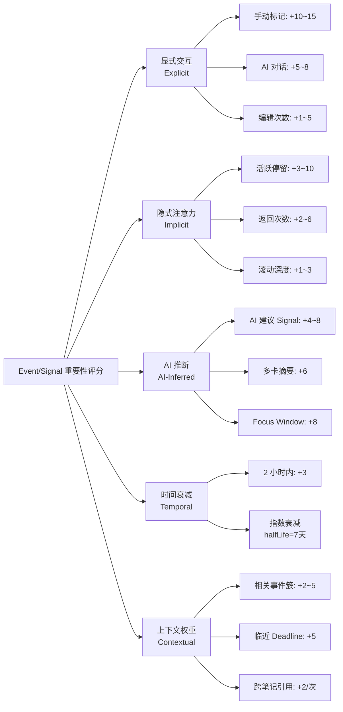

# Eventlog Enhanced — 产品需求文档 v3.0

**产品名称：** 4DNote — 智能记忆与叙事系统  
**版本：** v3.0（AI-Native 增强版）  
**状态：** 已批准开发  
**最后更新：** 2026-01-08

**架构对齐**：严格遵循 [EVENT_FIELD_CONTRACT_SSOT_ARCHITECTURE.md](../architecture/EVENT_FIELD_CONTRACT_SSOT_ARCHITECTURE.md) § 0.4 Signal 字段契约

---

## 0. 执行摘要

**产品愿景**  
将碎片化的日常交互（思考、会议、AI 对话、网页剪藏）转化为结构化、可回顾的叙事记忆，用户投入最少精力。

**核心价值主张**  
- **对于忙碌的专业人士**：通过自动生成的时间骨架叙事，获得"今天我做了什么"的安心感
- **对于知识工作者**：通过智能收获捕获和基于证据的回顾，提炼"今天我理解了什么"
- **对于 AI 深度用户**：通过自动结算机制，将长时间 AI 协作会话转化为清晰、可复用的收获
- **对于会议参与者**：用智能定帧快照捕获视觉证据，而非侵入性的全程录屏
- **对于音频笔记用户**：通过 RECNote 锚点将音频与文字笔记同步，实现轻松的回放导航

**设计哲学**  
- **基于来源的信号优于语义猜测**：用户行为（高亮、手动标记、疑问）驱动优先级排序
- **复利式回顾**：每日 → 每周 → 每月叙事通过证据积累相互构建
- **本地优先的隐私保护**：音频和截图默认存储在设备上；云同步可选
- **零焦虑归档**：所有交互自动捕获为潜在证据，可随时过滤/检索

---

## 0.A 核心架构决策（SSOT 对齐）

> **本节目的**：明确 Eventlog Enhanced 的核心架构约束，确保所有功能实施遵循 SSOT。

### 0.A.1 Format vs Signal 架构边界

| 维度 | Format（格式） | Signal（信号） |
|------|---------------|---------------|
| **定位** | Presentation Layer（表现层） | Semantic/Domain Layer（语义层） |
| **存储** | `EventLog.slateJson`（Slate JSON） | `signals` 表（独立存储） |
| **示例** | `{ text: "重点", bold: true, backgroundColor: "#FFFF00" }` | `{ type: 'highlight', content: "重点", eventId: 'xxx' }` |
| **查询** | 需解析完整 JSON | 直接 SQL/索引查询 |
| **同步** | ✅ 同步到 Outlook（`EventLog.html` 包含样式） | ❌ 本地专属，不同步 |
| **Owner** | UI 层 + EventService（序列化） | SignalService（CRUD + 一致性） |
| **AI 可用性** | ❌ 需要解析 JSON，效率低 | ✅ 直接查询聚合，支持 RAG |

**关键约束**：
1. ❌ **Event 不得存储 Signal 细节**（`isHighlight`/`signalCount` 等禁止）
2. ✅ **允许 Derived Store/Index**（可重建、独立表；不得写回 Event 字段）
3. ❌ **SignalService 不得修改** `EventLog.slateJson`
4. ✅ **EventService 可只读** `slateJson` 提取格式信息（用于 AI 辅助识别）

### 0.A.2 Session 分层架构（Attention/Dwell vs User Event）

**问题**：Eventlog Enhanced 里的“timer”主要指 **页面停留/专注窗口（dwell/attention）计时**，它是后台统计字段，用于重要性评分与日报/日记生成；不应被建模为可同步的 Behavior(Timeblock)，也不应创建额外 Event 以免污染树结构。

**解决方案**：
- **dwell/attention 计时只产生本地派生数据**（例如 `Signal.behaviorMeta.totalDwellTime`、`focus_time` 信号、或独立的 `event_attention_stats` Derived Store），不创建新的 Event。
- Plan/Library 等视图只消费 `events`，可通过 **facets + view configuration** 做显示策略（但与 dwell/attention timer 无强绑定）。

```typescript
// Facets 是 Derived Index（可重建），不是 Event 字段
type EventFacet = 'inbox' | 'archived' | 'system' | 'hidden';

interface EventFacetsIndex {
  getFacets(eventId: string): Set<EventFacet>;
}

interface EventViewConfig {
  excludeFacets?: EventFacet[];
}

const planView: EventViewConfig = {
  excludeFacets: ['system', 'hidden'],
};

EventTreeAPI.buildTree(events, {
  view: planView,
  facetsIndex,
});
```

> 说明：这里的 **Attention** 指“用户注意力/停留（dwell）”的产品语义，不是 Transformer 模型里的 attention 机制。

**dwell/attention Timer → AttentionSession 流程（本地、后台）**：
```typescript
// 1. Start tracking → 打开一次注意力会话（仅本地）
const attentionSessionId = await AttentionTracker.start({
  eventId: userEventId,
  startTime: formatTimeForStorage(new Date()),
});

// 2. 写笔记 → 仍写入该 Event 的 EventLog
const timestampNode = {
  type: 'timestamp',
  time: formatTimeForStorage(new Date()),
  children: [/* paragraphs */]
};

// 3. Stop tracking → 关闭会话并触发 Session Brief（target = attentionSessionId）
await AttentionTracker.stop(attentionSessionId, {
  endTime: formatTimeForStorage(new Date()),
});
await SessionBriefService.generateForAttentionSession(attentionSessionId);
```

### 0.A.3 Artifact 架构（整理产物）

**问题**：Session Brief / Daily Review 等 AI 生成内容存哪里？

**解决方案**：引入独立的 `Artifact` 实体

```typescript

```typescript
interface Artifact {
  id: string;                     // artifact_${nanoid(21)}
  scope: 'session' | 'event' | 'daily' | 'weekly' | 'monthly' | 'quarterly' | 'yearly';
  
  /**
   * 目标对象 ID
   * 格式: 取决于 scope
   * 用途: 标识 Artifact 生成的目标对象
   * 示例:
   *   - scope='session' → targetId = attentionSessionId (如 "attentionSession_abc123")
   *   - scope='daily' → targetId = 日期字符串 (如 "2026-01-08")
   *   - scope='weekly' → targetId = 周标识 (如 "2026-W02")
   *   - scope='monthly' → targetId = 月标识 (如 "2026-01")
   *   - scope='event' → targetId = eventId (如 "event_xyz789")
   */
  targetId: string;
  
  type: 'brief' | 'rolling_summary' | 'action_items' | 'qa' | 'outline';
  contentJson: {                  // 结构化内容（固定 schema）
    tldr?: string[];
    key_points?: Array<{ id: string; text: string; confidence: number }>;
    decisions?: Array<{ id: string; text: string; confidence: number }>;
    action_items?: Array<{ id: string; text: string; owner?: string; due?: string }>;
    open_questions?: Array<{ id: string; text: string }>;
  };
  createdAt: string;              // YYYY-MM-DD HH:mm:ss
  updatedAt: string;
  modelInfo?: {                   // AI 模型信息
    model: string;
    version: string;
    promptHash: string;
  };
  status: 'draft' | 'accepted' | 'edited';
}
```

**Owner**：`ArtifactService`（待实施）

**存储**：`artifacts` 表（IndexedDB）

**与 EventNode 的关系**：
- `Artifact.contentJson` 中的引用用 `claimId`（内部稳定 ID）
- `EvidenceLink` 表关联到 `EventNode.nodeId` 或 `timestampId`

### 0.A.4 EvidenceLink 架构（证据链）

**用途**：每条 AI 生成的结论必须带证据，可点击回跳

```typescript
interface EvidenceLink {
  id: string;
  targetArtifactId: string;       // 关联的 Artifact
  claimId: string;                // Artifact 内某条结论的 ID
  sourceType: 'eventlog_timestamp' | 'transcript_chunk' | 'signal';
  sourceRef: {
    // timestamp: { eventId, timestampId }
    // transcript: { attentionSessionId, chunkId, tStart, tEnd }
    // signal: { signalId }
    [key: string]: any;
  };
  quote?: string;                 // 引用的原文片段
  confidence: number;             // 置信度 (0-1)
}
```

**硬规则**：
- ❌ **无证据不输出**（或降级为 "Needs review"）
- ✅ 每条 claim 至少 1 条 EvidenceLink（推荐 1-3 条）

### 0.A.5 Summary 生成策略（roots vs sprout）

**系统主动生成**（roots）：
```typescript
type RootsSummary = 
  | 'daily'      // 每日叙事（晚 9 点或手动）
  | 'weekly'     // 每周综合（周日晚）
  | 'monthly'    // 每月回顾（月末）
  | 'quarterly'  // 季度总结（季末）
  | 'yearly';    // 年度回顾（年末）

// 自动触发 + 复利式聚合
daily → weekly → monthly → quarterly → yearly
```

**用户手动触发**（sprout）：
```typescript
type SproutSummary = 
  | 'ai_chat';    // AI 对话总结（按需生成，不参与自动聚合）

// 独立存在，不参与 roots 的复利式聚合
```

### 0.A.6 SignalEmbedding 架构（RAG 向量索引）

**问题**：embedding 作为 signals 表字段过重，且模型名写死

**解决方案**：embedding 拆到独立表 + 模型版本抽象化

```typescript
interface SignalEmbedding {
  signalId: string;              // 主键，外键 → signals.id
  modelVersion: EmbeddingModelVersion; // 抽象版本（隐藏供应商细节）
  embedding: Float32Array;       // 向量数据 (1536/3072 维)
  dimension: number;
  generatedAt: string;
  status: 'valid' | 'stale' | 'pending';
  computeTimeMs?: number;
}

type EmbeddingModelVersion = 
  | 'v1'        // 内部代号（隐藏 OpenAI/Cohere/本地模型）
  | 'v2' | 'v3' | 'legacy';

// 实际映射（实现层，不写入 PRD）
const MODEL_IMPL = {
  'v1': { provider: 'openai', model: 'text-embedding-3-small', dim: 1536 },
  'v2': { provider: 'openai', model: 'text-embedding-3-large', dim: 3072 },
};
```

**Owner**：`RAGIndexService`（Phase 4 实施）

**存储**：`signal_embeddings` 表（IndexedDB）

**优势**：
- ✅ 核心 signals 表轻量（~1KB/条 vs ~7KB/条）
- ✅ 整表可删除重建，不影响 Signal 本身
- ✅ 模型升级时可并存多版本（A/B 测试）
- ✅ 供应商无关（可随时替换 OpenAI → 本地模型）

**状态转换**：
- Signal 创建 → 异步生成 embedding (`status=pending`)
- Signal.content 更新 → 标记 `status=stale`，异步重建
- Signal 删除 → 级联删除 embedding

### 0.A.7 行为数据存储策略

**behaviorMeta 存储内容**（SSOT 确认）：

✅ **必须存储**（用于 AI 生成 Daily Review）：
```typescript
behaviorMeta: {
  // 文本内容（RAG 检索 + AI 总结）
  selectedText: string;       // 用户选中的文字
  nodeSummary: string;        // Node summary as chunk
  articleSummary: string;     // Article summary
  
  // 聚合统计（只存总量）
  actionCount: number;
  totalDwellTime: number;     // 毫秒
}
```

❌ **禁止存储**（避免数据膨胀）：
```typescript
// 不存储原始事件流
mouseMovements: MouseEvent[];  // ❌
scrollEvents: ScrollEvent[];   // ❌
```

**例外**（Focus Window，可选）：
- 会议重点时段可存储详细流到 `session_details` 表（独立于 signals）

---

## 1. 产品背景与用户问题

### 1.1 目标用户

**核心人群**
1. **知识工作者**（研究者、工程师、分析师）
   - 重度笔记用户，常困惑"那个想法我在哪儿见过？"
   - 与 AI 深度对话产生大量洞见，但淹没在聊天记录中
   
2. **会议密集型专业人士**（管理者、咨询师）
   - 需要会议纪要但厌恶手动记录
   - 对全程录屏有隐私顾虑
   
3. **反思型学习者**（学生、自我提升爱好者）
   - 希望回顾"这周什么引起了我的共鸣"
   - 难以保持日记习惯的连续性

### 1.2 用户痛点

**P1：碎片化与丢失**（碎碎念维护成本高）
- 笔记分散在各种工具中（聊天记录、文档、便签）
- 没有自动整合机制 → 手动复制粘贴负担
- 重要想法淹没在噪音中

**P2：情感语境不可检索**（情绪/挣扎不可搜索）
- "我记得上周二对某事很兴奋" → 无法搜索
- 关键挣扎/突破在没有刻意记录时丢失

**P3：AI 对话沉淀困难**（AI 对话沉淀难）
- 长时间 AI 协作会话产生价值但缺乏结构化输出
- 洞见仅以聊天历史形式存在，无法成为可复用的知识卡片

**P4：会议证据过载**（会议证据成本高）
- 全程录屏 = 存储膨胀 + 隐私担忧
- 手动截图时机把握困难，错过关键时刻
- 音频-笔记同步需要手动打时间戳

### 1.3 市场机会

**市场空白**
- Granola：会议笔记出色但缺乏日常叙事连续性
- Reflect/Mem：适合手动输入，自动证据捕获能力弱
- Notion/Obsidian：功能强大但需要前期手动组织

**我们的差异化优势**：自动证据收集 + 智能回顾合成 + 隐私优先设计

---

## 2. 核心概念与术语

### 2.1 结构原语

**Note** (文档)  
代表一天、一个项目或一个主题的顶层容器。包含多个 Paragraph。

**Paragraph** (段落)  
块级内容单元。可以是：
- Text body（思考、记录）
- Heading（标题）
- AI Answer（Q&A 结果）
- Summary Card（多卡集成总结）
- Web Clip（带来源的引用）

**Anchor** (锚点)  
对其他 Paragraph/Card 的内联引用，实现双向链接。

**Card** (卡片)  
各种内容类型的统一抽象（Answer、Summary、Clip、Resonance）。所有卡片以特殊 Paragraph 形式存储，带 `meta.card_type`。

### 2.2 证据与记忆系统

**EventLog** (事件日志)  
所有用户交互的不可变日志，带时间戳元数据：
- `ASK_AI`（提问 AI）、`ANSWER_RECEIVED`（收到回答）
- `CARD_EXPANDED`（展开卡片）、`CARD_COLLAPSED`（折叠卡片）
- `HIGHLIGHT_ADDED`（添加高亮）、`TAG_CHANGED`（标签变更）
- `SESSION_STARTED`（会话开始）、`SESSION_ENDED`（会话结束）

**Signal** (重点信号)  
**独立的语义层实体**，与 Event 通过 `eventId` 松耦合。用户主动标记或系统捕获的重要性指示。

**架构定位**：
- **存储**：独立 `signals` 表（IndexedDB/SQLite），**不存储在 Event 中**
- **Owner**：`SignalService`（唯一写入者，CRUD + 去重 + 一致性）
- **同步**：❌ 本地专属，不同步到 Outlook/To Do
- **RAG**：✅ 支持 embedding 向量检索（Phase 4，独立表 `signal_embeddings`）
- **备份**：✅ 随 Event 数据一起导出（GDPR 合规）

详见：[EVENT_FIELD_CONTRACT_SSOT_ARCHITECTURE.md § 0.4](../architecture/EVENT_FIELD_CONTRACT_SSOT_ARCHITECTURE.md#04-signal-字段契约完整-schema)

---

### 2.2.1 Signal Schema 字段契约

```typescript
/**
 * Signal 实体（独立存储，本地专属）
 * Owner: SignalService（唯一写入者）
 * 存储: signals 表（IndexedDB/SQLite）
 * 同步: ❌ 不同步到外部系统（Outlook/To Do）
 */
interface Signal {
  // ===== 核心字段（必填） =====
  
  /**
   * Signal 唯一标识符
   * 格式: signal_${nanoid(21)}
   * 用途: 主键，关联 EvidenceLink、SignalEmbedding 等派生数据
   */
  id: string;
  
  /**
   * 关联的 Event ID
   * 格式: event_${nanoid(21)}
   * 约束: 外键 → events.id（强制，级联删除）
   * 用途: Signal 必须附着在某个 Event 上，Event 删除时级联删除所有关联 Signal
   */
  eventId: string;
  
  /**
   * Signal 类型
   * 枚举: SignalType（见下文）
   * 用途: 区分语义标记、用户行为、时间停留、AI 推断等不同信号类型
   */
  type: SignalType;
  
  /**
   * 标记的文本内容
   * 约束: ≤500 字符
   * 用途: 存储用户标记的文本片段或 Signal 的核心内容
   * 示例: 
   *   - type='highlight': "这是重点内容"
   *   - type='user_copy': 用户复制的文本
   *   - type='ai_highlight_suggested': AI 建议高亮的文本
   */
  content: string;
  
  /**
   * 创建时间
   * 格式: YYYY-MM-DD HH:mm:ss（本地时间）
   * 用途: Signal 创建时间戳，用于时间排序、Focus Window 聚类
   */
  timestamp: string;
  
  /**
   * 创建者类型
   * 枚举: 'user' | 'ai' | 'system'
   * 用途: 
   *   - 'user': 用户手动标记（高亮、问题、待办）
   *   - 'ai': AI 自动推断（需用户确认）
   *   - 'system': 系统自动捕获（复制、编辑、停留时长）
   */
  createdBy: 'user' | 'ai' | 'system';
  
  /**
   * Signal 状态
   * 枚举: SignalStatus（见下文）
   * 用途: 追踪 Signal 生命周期（活跃/确认/拒绝/过期）
   * 转换: 见 SSOT § 0.4.1 状态转换规则
   */
  status: SignalStatus;
  
  // ===== 定位信息（可选） =====
  
  /**
   * Slate 节点路径
   * 格式: number[] - 如 [0, 1, 2] 表示第 1 个段落的第 2 个子节点的第 3 个子节点
   * 用途: 定位 Signal 在 EventLog.slateJson 中的精确位置，支持跳转和高亮
   */
  slateNodePath?: number[];
  
  /**
   * 文本范围
   * 格式: { start: number; end: number }
   * 用途: 标记 Signal 在段落文本中的起止位置（字符索引），用于精确高亮
   */
  textRange?: {
    start: number;
    end: number;
  };
  
  // ===== 行为元数据（聚合数据，不存原始流） =====
  
  /**
   * 行为统计与上下文元数据
   * 约束: 只存聚合统计 + AI 所需文本，不存原始事件流
   */
  behaviorMeta?: {
    // ----- 统计聚合（只存总量，不存明细） -----
    
    /**
     * 操作次数
     * 用途: 统计该 Signal 关联内容被操作的次数（复制、编辑、引用等）
     * 示例: 某段文字被复制 3 次 → actionCount = 3
     */
    actionCount?: number;
    
    /**
     * 累计停留时长
     * 单位: 毫秒
     * 用途: 记录用户在该 Signal 关联内容上的总停留时间
     * 示例: 用户在某段落停留 5 分钟 → totalDwellTime = 300000
     */
    totalDwellTime?: number;
    
    // ----- AI 生成所需的文本内容（必须存储） -----
    
    /**
     * 选中的文字内容
     * 用途: 用户选中的文本片段，用于 Daily Review AI 生成时提供上下文
     * 示例: 用户选中"重要发现"并标记为高亮 → selectedText = "重要发现"
     */
    selectedText?: string;
    
    /**
     * Node summary as chunk
     * 用途: 节点级别的摘要文本，作为 RAG 检索的 chunk
     * 示例: 某个段落的 AI 摘要
     */
    nodeSummary?: string;
    
    /**
     * Article summary
     * 用途: 文章级别的摘要文本
     * 示例: 整篇笔记的 AI 摘要
     */
    articleSummary?: string;
    
    // ----- 上下文关联 -----
    
    /**
     * 关联的 AI 对话 ID
     * 用途: 将 Signal 与某次 AI 对话关联（如用户在对话中提到的重点）
     */
    relatedConversationId?: string;
    
    /**
     * 关联的注意力会话 ID
     * 格式: attentionSession_${nanoid(21)}
     * 用途: 将 Signal 与某次专注会话关联（Focus Window）
     */
    relatedAttentionSessionId?: string;
    
    /**
     * Signal 来源
     * 枚举: 'format' | 'behavior' | 'ai_suggestion'
     * 用途: 
     *   - 'format': 从 EventLog.slateJson 格式提取（如黄色高亮）
     *   - 'behavior': 从用户行为统计提取（如高频复制）
     *   - 'ai_suggestion': AI 推断建议
     */
    extractedFrom?: 'format' | 'behavior' | 'ai_suggestion';
  };
  
  // ===== AI 推断专用字段（createdBy='ai' 时有效） =====
  
  /**
   * 置信度
   * 范围: 0-1
   * 用途: AI 推断 Signal 时的置信度分数，用于过滤低质量推断
   * 示例: confidence=0.85 表示 AI 85% 确信这是一个重点
   */
  confidence?: number;
}

/**
 * Signal 类型枚举
 */
type SignalType = 
  // ===== 语义标记（用户显式标注） =====
  | 'highlight'      // ⭐ 重点
  | 'question'       // ❓ 疑问/Open Loop
  | 'action_item'    // ✅ 行动项
  | 'objection'      // 🧊 反对/风险
  | 'advantage'      // 👍 优势
  | 'disadvantage'   // 👎 劣势
  | 'brilliant'      // 💡 精彩洞察
  | 'confirm'        // ✔️ 确认
  
  // ===== 用户操作行为（自动捕获） =====
  | 'user_question'  // 用户提问 AI
  | 'user_copy'      // 用户复制内容
  | 'ai_insert'      // AI 插入内容
  | 'user_edit'      // 用户编辑内容
  | 'user_star'      // 用户星标段落
  
  // ===== 时间停留行为 =====
  | 'dwell_time_event'      // Event 级别停留
  | 'dwell_time_paragraph'  // Paragraph 级别停留
  | 'focus_time'            // Focus Window 内的重点时段
  
  // ===== 键盘/鼠标行为（可选扩展） =====
  | 'typing_rhythm'    // 打字节奏异常（长停顿 = 思考）
  | 'delete_rewrite'   // 删除重写（修改次数多 = 重要）
  | 'mouse_hover'      // 鼠标悬停
  | 'scroll_behavior'  // 滚动行为
  
  // ===== AI 推断（待确认） =====
  | 'ai_highlight_suggested'  // AI 建议的重点
  | 'ai_question_detected';   // AI 检测的疑问

/**
 * SignalStatus / 状态转换规则以 SSOT 为准：
 * - docs/architecture/EVENT_FIELD_CONTRACT_SSOT_ARCHITECTURE.md（§0.4.1）
 */
```
```

**AttentionSession** (注意力会话)
**原始计时记录**，追踪用户在某个 Event 上的工作时段：

**定位**：
- **不是总结**：只记录开始/结束时间、来源类型
- **不是 Event**：独立实体，不污染 Event 树结构
- **不是 Behavior/Timeblock**：不是用户可见的计划/时间块，是后台统计数据

**用途**：
- 📊 统计用户在某个 Event 上的专注时长（dwell time）
- 🎯 识别 Focus Window（高密度交互时段）
- 🔗 作为时间窗口，聚合该时段内的 Signal（高亮/复制/编辑）
- 📝 触发 AI 生成 Session Brief（Artifact）
- 🎙️ 可选关联音频/转写/快照（本地存储）

**数据流**：
```
AttentionSession (原始计时)
    ↓ 时间窗 [14:00-15:00]
    ↓ 聚合这段时间内的...
Signal (用户标记) + EventLog (笔记内容) + 音频转写
    ↓ 喂给 AI
Session Brief (Artifact) ← AI 生成的总结文字
```

**AttentionSession 架构约束**：
```typescript
/**
 * AttentionSession（注意力会话）
 * Owner: AttentionTracker（本地后台服务）
 * 存储: attention_sessions 表（IndexedDB，本地专属）
 * 同步: ❌ 不同步到外部系统
 * 
 * 用途: 追踪用户在某个 Event 上的工作时段（类似 Toggl/RescueTime）
 */
interface AttentionSession {
  // ===== 核心字段 =====
  id: string;                     // attentionSession_${nanoid(21)}
  eventId: string;                // 必须挂在一个 event 下
  source: 'focus_window'          // Focus Window（高密度交互）
        | 'background_dwell'      // 后台停留（标签页打开但未活跃）
        | 'manual';               // 用户手动启动（如录音）
  
  // ===== 时间记录（原始数据） =====
  startTime: string;              // YYYY-MM-DD HH:mm:ss（本地存储格式）
  endTime?: string;               // YYYY-MM-DD HH:mm:ss（结束后填入）
  
  // ===== 会话增强（可选，用于会议场景） =====
  meta?: {
    // 参会人员（手动输入或 AI 识别）
    attendees?: Array<{
      id?: string;
      name: string;
      aliases?: string[];
      role?: string;
    }>;
    
    // 说话人映射（音频转写时使用）
    speakerMap?: Record<string, {
      attendeeName?: string;
      confidence: number;
    }>;
  };
}
```

**TakeawayCandidate** (候选收获)  
从交互中提取的微观结论：
- 从 AI 回答、摘要、会话关键时刻自动生成
- 用户手动标记的高亮
- 通过复利式回顾聚合：每日 → 每周 → 每月 → 季度 → 年度

**Artifact** (整理产物)  
AI 生成的结构化摘要/报告，支持**多粒度复利式聚合**：

**核心概念**：
- **通用容器**：所有 AI 生成的文字内容（Session Brief / Daily Narrative / Weekly Summary 等）
- **多粒度**：从 30 分钟会话 → 日 → 周 → 月 → 年，层层聚合
- **可追溯**：每条结论通过 EvidenceLink 回溯到原始 Signal/EventLog

**scope 与 AI 输入映射**：

| scope | targetId 示例 | AI 消费的输入 | 输出示例 |
|-------|-------------|-------------|----------|
| `session` | `attentionSession_abc` | 该 session 时间窗内的 Signal + EventLog + 音频转写 | "30分钟会议：确定了 GraphQL 方案" |
| `daily` | `2026-01-09` | **当天所有 AttentionSession** + Signal + Event | "今天专注于 Q1 规划（3h），2次会议" |
| `weekly` | `2026-W02` | **本周所有 daily Artifact**（复利式） | "本周主线：Q1 规划，3条重要决策" |
| `monthly` | `2026-01` | **本月所有 weekly Artifact** | "1月主题：架构决策，完成 GraphQL 迁移" |
| `yearly` | `2026` | **本年所有 monthly Artifact** | "2026年度回顾：产品重构，团队成长" |

```typescript
interface Artifact {
  id: string;
  scope: 'session' | 'daily' | 'weekly' | 'monthly' | 'quarterly' | 'yearly';
  targetId: string;              // 见上表（attentionSessionId / 日期字符串）
  type: 'brief' | 'rolling_summary' | 'action_items';
  contentJson: {
    tldr?: string[];
    key_points?: Array<{ id: string; text: string; confidence: number }>;
    decisions?: Array<{ id: string; text: string }>;
    action_items?: Array<{ id: string; text: string; owner?: string }>;
    open_questions?: Array<{ id: string; text: string }>;
  };
  createdAt: string;
  updatedAt: string;
  status: 'draft' | 'accepted' | 'edited';
}
```

**EvidenceLink** (证据链)  
关联 Artifact 的结论到源数据：
```typescript
interface EvidenceLink {
  id: string;
  targetArtifactId: string;
  claimId: string;               // Artifact 内结论的 ID
  sourceType: 'eventlog_timestamp' | 'transcript_chunk' | 'signal';
  sourceRef: any;                // 具体引用
  quote?: string;
  confidence: number;
}
```

### 2.3 回顾与合成输出

**Daily Narrative** (每日叙事)  
从证据生成的结构化回顾输出：
1. **叙事摘要**：时间骨架概览（上午/下午/晚上）
2. **核心收获**：3-7 条关键学习，带证据链接
3. **开放循环**：未解答的问题
4. **行动项**：标记的任务
5. **共鸣**：跨笔记连接（可选）

**Focus Window** (重点窗口)  
Signal 周围的时间范围（如 [t-20s, t+60s]），标记为需详细处理：
- 更高的 ASR 转写精度
- 更细粒度的分段
- 为关键时刻保留逐字引用

**Holographic Map** (全息目录)  
自动生成的可过滤大纲，展示笔记结构：
- 基于 Signal 的高亮（⭐/❓/✅）
- 可折叠层级
- 点击跳转导航

---

## 3. 用户体验设计

### 3.1 核心用户流程

#### 流程 A：日常知识捕获（知识工作者场景）

**上午：创建笔记**
1. 用户创建笔记 "2025-01-23 Project Alpha 研究"
2. 输入初步想法 → 自动记录 `INSERT_TEXT` 事件
3. 问 AI "X 的最佳实践是什么？" → 记录 `ASK_AI`
4. AI 详细回复 → 系统生成：
   - Answer Card（带 `card_type: ai_answer` 的段落）
   - TakeawayCandidate："X 的最佳实践是 Y"（自动提取）
5. 用户标记 AI 回答为高亮（⭐）→ 每日回顾权重提升

**下午：多源整合**
1. 用户选择 3 个现有卡片（来自不同笔记）
2. 点击"一起总结" → 记录 `MULTI_SELECT_SUMMARIZE`
3. 系统生成 Summary Card，包含：
   - 整合的综述
   - 3-5 个 TakeawayCandidate（每个关键点一条）
   - 指向所有源 card ID 的 `evidence_refs`

**晚间：自动每日回顾**
1. 系统触发每日叙事生成（晚 9 点或手动）
2. 读取证据：
   - 时间线：会话、Signal 时间戳
   - 交互：Ask AI、卡片切换、高亮
   - 产出：Answer 卡片、Summary 卡片
3. 输出每日叙事：
   - "今天你专注于 Project Alpha（3h），进行了 2 次关键 AI 讨论"
   - 前 5 条收获（可点击到源卡片）
   - 2 个开放循环（未解答的问题）
4. 用户 <3 分钟内审阅，标记满意 → 归档到知识库

#### 流程 B：带智能证据捕获的会议（会议场景）

**会前**
1. 用户在日程事件中点击"开始会议会话"
2. 系统请求权限：
   - 屏幕捕获（用于智能定帧快照，**不是完整视频**）
   - 麦克风（音频**仅本地保存**）
3. 开始监控：
   - 屏幕内容变化 → 页面/幻灯片切换时自动截图
   - 音频录制 → 本地文件，带时间戳对齐

**会议中**
1. **幻灯片出现**：系统检测场景变化 → 捕获截图
2. **幻灯片动画**：系统保持候选槽，仅保存信息最全的最终帧
3. **用户记笔记**：输入"决定：迁移到新 API" → 自动记录带音频偏移
4. **用户按下高亮热键**（`Ctrl+Shift+H`）：创建 `HIGHLIGHT` Signal
   - 标记当前音频时间戳
   - 标记当前截图 ID
   - 打开 Focus Window [t-20s, t+60s] 进行详细转写
5. **检测到语音提示**：用户说"重点" → 效果同热键

**会后**
1. 系统对保存的截图运行 OCR（节流、按需）
2. 生成会议要点笔记：
   ```
   - 决定：迁移到新 API [ref: image 20250123143012]
   - 风险：向后兼容性问题 [ref: image 20250123143145]
   - 行动：@John 准备迁移清单 [ref: image 20250123143230]
   ```
3. 用户点击 `[ref: image ...]` → 打开截图 + 定位音频到该时间戳
4. 要点笔记自动添加为 TakeawayCandidate，供每日聚合

#### 流程 C：带 RECNote 同步的语音备忘（语音记录场景）

**场景**：边走边录制想法

1. 用户打开笔记，通过 RECNote 开始录音
2. 持续说话，偶尔输入关键词
3. 每个输入的段落在元数据中获得 `audioAnchor`：
   ```typescript
   meta: {
     audioAnchor: {
       recordingId: "rec_20250123_1430",
       offsetMs: 125000  // 录音 2 分 5 秒处
     }
   }
   ```
4. 稍后回顾：点击段落 → 音频播放器定位到 `offsetMs` 并播放
5. 音频以 **16kHz 单声道 Opus @ 24kbps** 本地存储 → 约 12MB/小时
6. 桌面应用在空闲时自动运行本地 Whisper → 生成 FTS 索引
7. 用户搜索"原型反馈" → 找到音频片段 + 关联段落

### 3.2 UI 组件规范

#### 3.2.1 全息目录（Holographic Map）

**位置**：右侧边栏（可折叠）

**视觉设计**
```
📄 每日研究日志 2025-01-23

├─ 🔹 上午回顾
│   ├─ ⭐ API 设计的关键洞察
│   └─ ❓ 如何处理边界情况？
├─ 🔹 会议笔记
│   ├─ 决定：使用 GraphQL
│   ├─ ✅ @Alice: 周五前起草 schema
│   └─ 🧊 担忧：团队上手成本
└─ 🔹 晚间总结
    └─ 收集了 3 条收获
```

**交互**
- 点击任意行 → 滚动到段落 + 短暂高亮
- 过滤按钮：[⭐ 高亮] [❓ 疑问] [✅ 行动项] [全部]
- 编辑时自动更新（防抖 500ms）
- 折叠/展开章节

#### 3.2.2 每日叙事面板（Daily Narrative Panel）

**触发**：手动调用或定时（每天晚 9 点）

**布局**
```
┌─────────────────────────────────────────────────┐
│ 每日叙事 — 2025-01-23                           │
├─────────────────────────────────────────────────┤
│                                                  │
│ 📖 叙事摘要                                      │
│ ─────────────────────────────────────────────   │
│ 上午：专注于 Project Alpha 研究（2.5h）。        │
│ 与 AI 就 API 架构模式进行了富有成效的讨论。      │
│                                                  │
│ 下午：团队会议（1h），敲定 Q1 路线图。           │
│ 轻度代码审查会话。                               │
│                                                  │
│ 🎯 核心收获（5 条）                              │
│ ─────────────────────────────────────────────   │
│ 1. REST vs GraphQL 在我们场景下的权衡           │
│    [📎 见：AI 回答卡片 #abc123]                  │
│                                                  │
│ 2. 团队共识：优先实现用户认证功能                │
│    [📎 见：会议总结 #def456]                     │
│ ...                                              │
│                                                  │
│ ❓ 开放循环（2 个）                              │
│ ─────────────────────────────────────────────   │
│ • 如何迁移现有 REST 客户端？                     │
│ • 需要 GraphQL 性能基准测试                      │
│                                                  │
│ ✅ 行动项（3 个）                                │
│ ─────────────────────────────────────────────   │
│ • @我：周四前起草 API 迁移计划                   │
│ • @Alice：搭建 GraphQL 开发环境                  │
│ • @团队：审查安全检查清单                        │
│                                                  │
│ 🔗 共鸣（可选）                                  │
│ ─────────────────────────────────────────────   │
│ 关联到："API 设计原则"笔记（3 个月前）           │
│                                                  │
└─────────────────────────────────────────────────┘
[归档并标记完成]  [重新生成]  [导出]
```

**交互**
- 所有 `[📎 见：...]` 链接在上下文中打开源卡片
- 行动项可一键导出到任务管理器（未来）
- 如果用户编辑了源笔记，重新生成时使用更新的权重/过滤器

#### 3.2.3 文档全息缩略图（Canvas Minimap）

**位置**：左侧边栏（固定，可最小化）

**设计目标**
提供全文档的视觉鸟瞰，快速导航和 Signal 位置可视化，与右侧 Holographic Map 形成互补。

**视觉设计**
```
┌─┬─────────────────────────────────┬──────────────┐
│M│ 笔记内容                         │ Holographic │
│i│                                 │ Map（树形）   │
│n│ 段落 1 ████████████              │              │
│i│                                 │ ├─ 上午回顾   │
│m│ Event 卡片 ████████              │ │  ├─ ⭐洞察 │
│a│                             ❓  │ │  └─ ❓问题 │
│p│ 段落 2 ████████████              │ ├─ 会议笔记   │
│ │                                 │ │  ├─ 决定    │
││ AI Answer ████████████            │ │  ├─ ✅行动  │
│ │                         🤖      │ │  └─ 🧊担忧 │
│ │ 段落 3 ████████████              │ └─ 晚间总结   │
│ │                                 │              │
│ │ Thinking ████████████            │              │
│ │                         💭      │              │
│ │ ▓▓▓▓▓▓▓▓▓ (当前视窗)            │              │
└─┴─────────────────────────────────┴──────────────┘
  ↑ 视觉缩略                        ↑ 结构大纲
```

**核心功能**

1. **内容块渲染**
   - 普通段落：深灰色矩形块（`#3e3e3e`）
   - Event 卡片：中灰色矩形块（`#5e5e5e`）
   - AI Answer：绿色矩形块（`#4caf50`）
   - Summary Card：蓝色矩形块（`#2196f3`）
   - Web Clip：橙色矩形块（`#ff9800`）

2. **Signal 可视化**
   - ⭐ `HIGHLIGHT`：金色圆点，右侧边缘
   - ❓ `QUESTION`：红色圆点
   - ✅ `ACTION_ITEM`：紫色圆点
   - 🧊 `OBJECTION`：冰蓝色圆点
   - 💭 思考/备注：天蓝色圆点

3. **Focus Window 高亮**（会话录制时）
   - 半透明金色背景（`rgba(255, 215, 0, 0.2)`）
   - 左侧 3px 金色边框强调
   - 实时更新：用户添加 Signal 时立即显示

4. **当前视窗指示**
   - 半透明蓝色矩形框（`rgba(0, 122, 204, 0.3)`）
   - 2px 蓝色边框（`#007acc`）
   - 跟随主内容滚动实时更新

5. **Takeaway 密度热力图**（可选）
   - 一段时间内多个 Takeaway → 渐变绿色热区
   - 密度越高颜色越亮：`rgba(76, 175, 80, ${alpha})`

**交互行为**

```typescript
// 点击跳转
onClick: (e: MouseEvent) => {
  const clickY = e.offsetY;
  const scale = canvas.height / container.scrollHeight;
  container.scrollTop = clickY / scale - container.clientHeight / 2;
};

// 拖动滚动
onMouseDown: (e: MouseEvent) => {
  isDragging = true;
  updateScrollFromMouse(e);
};

// Hover 提示
onMouseMove: (e: MouseEvent) => {
  const hoveredBlock = getBlockAtPosition(e.offsetY);
  if (hoveredBlock) {
    showTooltip({
      type: hoveredBlock.type,
      preview: hoveredBlock.textPreview,
      signals: hoveredBlock.signals,
    });
  }
};
```

**技术实现要点**

1. **Canvas 分层渲染**（性能优化）
```typescript
// 静态层：段落/卡片块（缓存）
const staticLayer = document.createElement('canvas');
function renderStaticLayer() {
  const ctx = staticLayer.getContext('2d')!;
  paragraphs.forEach(p => {
    const y = p.offsetTop * scale;
    const height = Math.max(2, p.offsetHeight * scale);
    ctx.fillStyle = getBlockColor(p.type);
    ctx.fillRect(0, y, canvas.width - 15, height);
  });
}

// 动态层：Signal、视窗、Focus Window（每帧重绘）
function renderDynamicLayer() {
  ctx.clearRect(0, 0, canvas.width, canvas.height);
  ctx.drawImage(staticLayer, 0, 0); // 复制静态层
  
  drawFocusWindows(ctx, focusWindows);
  drawSignals(ctx, signals);
  drawViewport(ctx, viewport);
}
```

2. **响应式更新策略**
```typescript
const updateMinimap = debounce(() => {
  renderStaticLayer(); // 内容变化时重建静态层
  renderDynamicLayer();
}, 100);

// 监听内容变化
const observer = new MutationObserver(updateMinimap);
observer.observe(container, { 
  childList: true, 
  subtree: true, 
  attributes: true,
  attributeFilter: ['class'] // 卡片展开/折叠
});

// 监听滚动（高频）
container.addEventListener('scroll', () => {
  renderDynamicLayer(); // 仅重绘动态层
}, { passive: true });
```

3. **Signal 数据结构映射**
```typescript
interface MinimapSignal {
  position: number;      // offsetTop
  type: SignalType;
  color: string;
  icon: string;         // emoji 或 SVG path
  timestamp?: number;   // 用于 Focus Window 关联
}

function collectSignals(container: HTMLElement): MinimapSignal[] {
  const signals: MinimapSignal[] = [];
  
  container.querySelectorAll('[data-signal-type]').forEach(el => {
    const type = el.getAttribute('data-signal-type') as SignalType;
    signals.push({
      position: (el as HTMLElement).offsetTop,
      type,
      color: SIGNAL_COLORS[type],
      icon: SIGNAL_ICONS[type],
      timestamp: Number(el.getAttribute('data-timestamp')),
    });
  });
  
  return signals;
}
```

4. **Focus Window 绘制**
```typescript
function drawFocusWindows(
  ctx: CanvasRenderingContext2D,
  windows: FocusWindow[],
  scale: number
) {
  windows.forEach(window => {
    const startY = window.startMs * scale;
    const endY = window.endMs * scale;
    
    // 背景高亮
    ctx.fillStyle = 'rgba(255, 215, 0, 0.2)';
    ctx.fillRect(0, startY, canvas.width, endY - startY);
    
    // 左侧强调条
    ctx.strokeStyle = '#ffd700';
    ctx.lineWidth = 3;
    ctx.beginPath();
    ctx.moveTo(0, startY);
    ctx.lineTo(0, endY);
    ctx.stroke();
    
    // 窗口边框
    ctx.strokeStyle = 'rgba(255, 215, 0, 0.5)';
    ctx.lineWidth = 1;
    ctx.strokeRect(0, startY, canvas.width, endY - startY);
  });
}
```

**与 Holographic Map 的协同**

| 特性 | Canvas Minimap（左） | Holographic Map（右） |
|------|---------------------|----------------------|
| **视图类型** | 视觉鸟瞰 | 逻辑结构 |
| **导航方式** | 拖动/点击定位 | 点击树节点跳转 |
| **信息密度** | 全文档压缩视图 | 展开/折叠分级 |
| **Signal 展示** | 位置可视化（图标） | 过滤列表（图标+文字） |
| **适用场景** | 快速浏览、位置感知 | 精确导航、筛选查找 |
| **数据源** | 共享 DocumentStructure | 共享 DocumentStructure |

**性能目标**
- 初始渲染：<100ms（1000 段落）
- 滚动更新：60fps（仅动态层重绘）
- 内容变化响应：<200ms（含防抖）
- 内存占用：<10MB（包含离屏 Canvas）

#### 3.2.4 重点窗口指示器（Granola 风格）

**会话录制中**
```
🎙️ 录制中：00:12:34

时间线：
█████░░░░░░░░░░░░░░█████░░░░░░
 ↑                    ↑
关键时刻 1         关键时刻 2
（用户高亮）
```

**会话后摘要模板**
```
会议摘要：Q1 规划
时长：45 分钟 | 3 个关键时刻 | 8 张截图

📌 关键时刻
─────────────────────────────────
1. [00:03:12 - 00:04:30] 决定：采用 GraphQL
   "我们一致认为灵活性胜过学习曲线"
   [🖼️ 截图] [🔊 音频]

2. [00:15:44 - 00:17:10] 风险：团队产能担忧
   "Alice 提出了关于当前冲刺负载的合理观点"
   [🖼️ 截图] [🔊 音频]

📝 支持性笔记
─────────────────────────────────
- 简短介绍和团队更新（00:00-00:03）
- 行政后勤讨论（00:25-00:30）
```

---

## 3.A AI 生成管道（核心算法）

> **本节目的**：定义重要性评分、Signal 聚合、叙事生成的核心算法，支撑 Daily Review / Session Brief 等功能。

### 3.A.1 重要性评分算法（多维度模型）

**设计目标**：从海量交互中识别真正重要的事件和内容，避免"噪声淹没信号"。

**评分维度**：



**完整评分算法实现**：

```typescript
/**
 * 计算 Event 或 Signal 的重要性评分
 */
interface ImportanceInput {
  eventId: string;
  signals: Signal[];              // 关联的 Signal
  behaviorData?: {
    totalViewTime: number;        // 总停留时长（ms）
    activeViewTime: number;       // 活跃停留时长
    revisitCount: number;         // 返回次数
    scrollDepth: number;          // 滚动深度 (0-1)
    editCount: number;            // 编辑次数
    aiChatRounds: number;         // AI 对话轮次
  };
  contextData?: {
    relatedEventIds: string[];    // 相关事件簇
    referenceCount: number;       // 被引用次数
    isDeepWorkHour: boolean;      // 是否在深度工作时段
    daysUntilDeadline?: number;   // 距离截止日期天数
  };
  timestamp: string;              // 事件/Signal 创建时间
}

interface WeightConfig {
  // 显式交互权重
  manualHighlight: number;        // 10
  manualQuestion: number;         // 12
  manualAction: number;           // 15
  aiChatRound: number;            // 5
  editCount: number;              // 每次 1，最多 5
  
  // 隐式注意力权重
  activeMinute: number;           // 每分钟 3，最多 10
  revisit: number;                // 每次 2，最多 6
  scrollDepthFull: number;        // 滚动到底 3
  
  // AI 推断权重
  aiSuggested: number;            // 4-8（按 confidence）
  multiCardSummary: number;       // 6
  focusWindowMoment: number;      // 8
  
  // 时间相关权重
  recencyBoost: number;           // 2 小时内 +3
  temporalDecayHalfLife: number;  // 7 天
  
  // 上下文权重
  relatedCluster: number;         // 每个相关事件 +1
  reference: number;              // 每次引用 +2
  nearDeadline: number;           // <3 天 +5
}

const DEFAULT_WEIGHTS: WeightConfig = {
  manualHighlight: 10,
  manualQuestion: 12,
  manualAction: 15,
  aiChatRound: 5,
  editCount: 1,
  activeMinute: 3,
  revisit: 2,
  scrollDepthFull: 3,
  aiSuggested: 6,
  multiCardSummary: 6,
  focusWindowMoment: 8,
  recencyBoost: 3,
  temporalDecayHalfLife: 7,
  relatedCluster: 1,
  reference: 2,
  nearDeadline: 5
};

function calculateImportance(
  input: ImportanceInput,
  config: WeightConfig = DEFAULT_WEIGHTS
): number {
  let score = 0;
  
  // 1. 显式交互评分（Signal 驱动）
  for (const signal of input.signals) {
    switch (signal.type) {
      case 'highlight':
        score += config.manualHighlight;
        break;
      case 'question':
        score += config.manualQuestion;
        break;
      case 'action_item':
        score += config.manualAction;
        break;
      case 'user_question':
        score += config.aiChatRound;
        break;
      // ... 其他 Signal 类型
    }
    
    // AI 推断 Signal 的置信度加权
    if (signal.createdBy === 'ai' && signal.confidence) {
      score += config.aiSuggested * signal.confidence;
    }
  }
  
  // 2. 隐式注意力评分（行为数据驱动）
  if (input.behaviorData) {
    const { activeViewTime, revisitCount, scrollDepth, editCount, aiChatRounds } = input.behaviorData;
    
    // 活跃停留时长
    const activeMinutes = Math.floor(activeViewTime / 60000);
    score += Math.min(activeMinutes * config.activeMinute, 10);
    
    // 返回次数
    score += Math.min(revisitCount * config.revisit, 6);
    
    // 滚动深度
    if (scrollDepth > 0.8) {
      score += config.scrollDepthFull;
    }
    
    // 编辑次数
    score += Math.min(editCount * config.editCount, 5);
    
    // AI 对话轮次
    score += Math.min(aiChatRounds * config.aiChatRound, 20);
  }
  
  // 3. 上下文权重
  if (input.contextData) {
    const { relatedEventIds, referenceCount, isDeepWorkHour, daysUntilDeadline } = input.contextData;
    
    // 相关事件簇
    score += relatedEventIds.length * config.relatedCluster;
    
    // 引用次数
    score += referenceCount * config.reference;
    
    // 深度工作时段额外加权
    if (isDeepWorkHour) {
      score *= 1.2;
    }
    
    // 临近 Deadline
    if (daysUntilDeadline !== undefined && daysUntilDeadline <= 3) {
      score += config.nearDeadline;
    }
  }
  
  // 4. 时间衰减
  const ageMs = Date.now() - new Date(input.timestamp).getTime();
  const ageDays = ageMs / (1000 * 60 * 60 * 24);
  
  // 时效性提升（2 小时内）
  if (ageMs < 2 * 60 * 60 * 1000) {
    score += config.recencyBoost;
  }
  
  // 指数衰减
  score = temporalDecay(score, ageDays, config.temporalDecayHalfLife);
  
  return score;
}

/**
 * 时间衰减函数（指数衰减）
 */
function temporalDecay(
  score: number,
  daysSinceInteraction: number,
  halfLife: number = 7
): number {
  return score * Math.pow(0.5, daysSinceInteraction / halfLife);
}
```

**分层过滤策略**：

```typescript
/**
 * 多阶段过滤，平衡"全面"与"无噪声"
 */
function filterImportantEvents(
  allEvents: Event[],
  signals: Map<string, Signal[]>,
  behaviorData: Map<string, any>,
  options: {
    minScore: number;          // 最低分数阈值（默认 5）
    maxResults: number;        // 最多返回数量（默认 20）
    maxPerCategory: number;    // 每类最多数量（默认 5）
    diversityBoost: boolean;   // 是否启用多样性约束
  }
): Event[] {
  // 第 1 层：基础过滤（去除明显的噪声）
  const candidates = allEvents.filter(event => {
    const eventSignals = signals.get(event.id) || [];
    const behavior = behaviorData.get(event.id);
    
    const score = calculateImportance({
      eventId: event.id,
      signals: eventSignals,
      behaviorData: behavior,
      timestamp: event.createdAt
    });
    
    return score >= options.minScore;
  });
  
  // 第 2 层：评分排序
  const scored = candidates.map(event => ({
    event,
    score: calculateImportance({
      eventId: event.id,
      signals: signals.get(event.id) || [],
      behaviorData: behaviorData.get(event.id),
      timestamp: event.createdAt
    })
  })).sort((a, b) => b.score - a.score);
  
  // 第 3 层：多样性约束（避免同一类型事件占满）
  if (options.diversityBoost) {
    const diversified = ensureDiversity(scored, {
      maxPerCategory: options.maxPerCategory,
      maxPerProject: options.maxPerCategory
    });
    return diversified.slice(0, options.maxResults).map(item => item.event);
  }
  
  // 第 4 层：Top N 选择
  return scored.slice(0, options.maxResults).map(item => item.event);
}

/**
 * 确保多样性（避免同一类型事件过多）
 */
function ensureDiversity(
  scoredEvents: Array<{ event: Event; score: number }>,
  options: { maxPerCategory: number; maxPerProject: number }
): Array<{ event: Event; score: number }> {
  const result: Array<{ event: Event; score: number }> = [];
  const categoryCount = new Map<string, number>();
  const projectCount = new Map<string, number>();
  
  for (const item of scoredEvents) {
    const category = item.event.tags?.[0] || 'uncategorized';
    const project = item.event.parentId || 'standalone';
    
    const catCount = categoryCount.get(category) || 0;
    const projCount = projectCount.get(project) || 0;
    
    if (catCount < options.maxPerCategory && projCount < options.maxPerProject) {
      result.push(item);
      categoryCount.set(category, catCount + 1);
      projectCount.set(project, projCount + 1);
    }
    
    if (result.length >= scoredEvents.length) break;
  }
  
  return result;
}
```

### 3.A.2 Session Brief 生成管道（Granola 风格）

**设计目标**：每次 Session 结束自动生成结构化、可追溯、可执行的笔记与行动项。

**核心原则**：
1. **固定 schema**（UI 与输出对齐）
2. **先抽取再综合**（extract → synthesize，提高可靠性）
3. **证据链**（每条结论必须带 1-3 条 EvidenceLink）
4. **上下文卫生**（只喂"本 session"）
5. **可执行闭环**（行动项一键落地）

**Pipeline 流程**：

```typescript
/**
 * Phase 0: 构建 AttentionSession 上下文块（严格限定输入范围）
 */
interface ContextBlock {
  kind: 'note' | 'transcript' | 'signal';
  id: string;
  ts: number;
  tsEnd?: number;
  text: string;
  ref: {
    eventId?: string;
    timestampId?: string;
    attentionSessionId?: string;
    chunkId?: string;
    signalId?: string;
  };
};

async function buildSessionContextBlocks(attentionSessionId: string): Promise<ContextBlock[]> {
  const blocks: ContextBlock[] = [];
  
  // 0. 读取会话元数据
  const session = await AttentionSessionService.get(attentionSessionId);
  const parentEvent = await EventService.getEvent(session.eventId);
  const eventlog = parentEvent.eventlog;
  
  if (eventlog) {
    const slateJson = JSON.parse(eventlog.slateJson);
    for (const node of slateJson) {
      // 1. Notes：筛选时间窗内的 timestamp nodes
      if (node.type === 'timestamp') {
        const t = parseTimeFromStorage(node.time);
        const start = parseTimeFromStorage(session.startTime);
        const end = parseTimeFromStorage(session.endTime || formatTimeForStorage(new Date()));
        if (t < start || t > end) continue;
        for (const para of node.children) {
          blocks.push({
            kind: 'note',
            id: `note_${node.timestampId}_${para.id}`,
            ts: t,
            text: extractPlainText(para),
            ref: {
              eventId: parentEvent.id,
              timestampId: node.timestampId
            }
          });
        }
      }
    }
  }
  
  // 2. Transcript：筛选 transcript.attentionSessionId === attentionSessionId（或时间窗内）
  const transcripts = await TranscriptService.getByAttentionSession(attentionSessionId);
  for (const chunk of transcripts) {
    blocks.push({
      kind: 'transcript',
      id: `transcript_${chunk.id}`,
      ts: chunk.tsStart,
      tsEnd: chunk.tsEnd,
      text: chunk.text,
      ref: {
        attentionSessionId,
        chunkId: chunk.id
      }
    });
  }
  
  // 3. Signals：时间窗内聚合
  const signals = await SignalService.getSignalsInTimeRange(
    session.startTime,
    session.endTime || formatTimeForStorage(new Date()),
    { types: ['highlight', 'question', 'action_item'] }
  );
  for (const signal of signals) {
    blocks.push({
      kind: 'signal',
      id: signal.id,
      ts: parseTimeFromStorage(signal.createdAt),
      text: signal.content,
      ref: {
        signalId: signal.id
      }
    });
  }
  
  return blocks.sort((a, b) => a.ts - b.ts);
}

/**
 * Phase 1: Extract（高召回抽取候选）
 */
interface ExtractedClaim {
  type: 'action' | 'decision' | 'question' | 'key_point';
  text: string;
  sourceRefs: string[];  // ContextBlock.id 列表
  confidence: number;
}

async function extractClaims(
  contextBlocks: ContextBlock[]
): Promise<ExtractedClaim[]> {
  // 调用 AI 模型（prompt 示例见下文）
  const prompt = `
你是会议纪要助手。请从以下上下文中抽取所有可能的行动项、决定、疑问和关键点。
要求：
1. 高召回率（宁可多抽取，后续去重）
2. 每条必须带 sourceRefs（引用原文 ID）
3. 给出置信度 (0-1)

上下文：
${contextBlocks.map(b => `[${b.id}] ${b.text}`).join('\n')}

输出 JSON 格式：
[
  {
    "type": "action",
    "text": "张三负责周五前完成 API 文档",
    "sourceRefs": ["note_xxx_yyy", "transcript_zzz"],
    "confidence": 0.85
  },
  ...
]
  `.trim();
  
  const response = await AIService.call(prompt);
  return JSON.parse(response);
}

/**
 * Phase 2: Synthesize（高精度去重归并）
 */
interface SynthesizedClaim {
  id: string;              // 稳定 ID（kp_xxx / dc_xxx / ai_xxx / q_xxx）
  type: 'key_point' | 'decision' | 'action_item' | 'open_question';
  text: string;
  owner?: string;          // action_item 专用
  due?: string;
  priority?: 'high' | 'medium' | 'low';
  confidence: number;
  evidenceRefs: string[];  // 最终选择的 1-3 个 sourceRefs
}

async function synthesizeClaims(
  extracted: ExtractedClaim[]
): Promise<SynthesizedClaim[]> {
  const prompt = `
你是会议纪要助手（综合阶段）。请对以下候选进行去重、归并、补齐字段。

要求：
1. 去重：合并语义相似的条目
2. 补齐：尽量填写 owner/due/priority（从上下文推断）
3. 证据：每条选择 1-3 个最强的 sourceRefs
4. 生成稳定 ID（kp_001, dc_001, ai_001, q_001）

候选：
${JSON.stringify(extracted, null, 2)}

输出 JSON 格式：
[
  {
    "id": "ai_001",
    "type": "action_item",
    "text": "张三负责周五前完成 API 文档",
    "owner": "张三",
    "due": "2026-01-10",
    "priority": "high",
    "confidence": 0.9,
    "evidenceRefs": ["note_xxx", "transcript_yyy"]
  },
  ...
]
  `.trim();
  
  const response = await AIService.call(prompt);
  return JSON.parse(response);
}

/**
 * Phase 3: 生成最终 Session Brief
 */
async function generateSessionBrief(attentionSessionId: string): Promise<Artifact> {
  // 1. 构建上下文
  const contextBlocks = await buildSessionContextBlocks(attentionSessionId);
  
  // 2. Extract
  const extracted = await extractClaims(contextBlocks);
  
  // 3. Synthesize
  const synthesized = await synthesizeClaims(extracted);
  
  // 4. 按类型分组
  const keyPoints = synthesized.filter(c => c.type === 'key_point');
  const decisions = synthesized.filter(c => c.type === 'decision');
  const actionItems = synthesized.filter(c => c.type === 'action_item');
  const openQuestions = synthesized.filter(c => c.type === 'open_question');
  
  // 5. 生成 TL;DR（可选，单独调用 AI）
  const tldr = await generateTLDR(contextBlocks);
  
  // 6. 创建 Artifact
  const artifact = await ArtifactService.create({
    scope: 'session',
    targetId: attentionSessionId,
    type: 'brief',
    contentJson: {
      tldr,
      key_points: keyPoints,
      decisions,
      action_items: actionItems,
      open_questions: openQuestions
    },
    status: 'draft'
  });
  
  // 7. 创建 EvidenceLink
  for (const claim of synthesized) {
    for (const ref of claim.evidenceRefs) {
      const block = contextBlocks.find(b => b.id === ref);
      if (block) {
        await EvidenceLinkService.create({
          targetArtifactId: artifact.id,
          claimId: claim.id,
          sourceType: block.kind === 'note' ? 'eventlog_timestamp' : 
                     block.kind === 'transcript' ? 'transcript_chunk' : 'signal',
          sourceRef: block.ref,
          quote: block.text.substring(0, 200),
          confidence: claim.confidence
        });
      }
    }
  }
  
  return artifact;
}
```

### 3.A.3 Daily Narrative 生成管道

**设计目标**：生成"像用户自己写的日记"，而非冰冷的数据报告。

**核心原则**：
1. **第一人称叙事**（"我"而非"你"）
2. **情感表达**（适当加入主观感受）
3. **知识沉淀**（不只记录行为，还记录收获）
4. **自然流畅**（避免机械列举数据）
5. **可编辑性**（用户可修改 AI 生成内容）

**生成流程**：

```typescript
async function generateDailyNarrative(date: string): Promise<Artifact> {
  // 1. 收集当天所有证据
  const evidence = await collectDailyEvidence(date);
  
  // 2. 筛选重要事件（基于评分算法）
  const importantEvents = filterImportantEvents(
    evidence.events,
    evidence.signals,
    evidence.behaviorData,
    {
      minScore: 5,
      maxResults: 20,
      maxPerCategory: 5,
      diversityBoost: true
    }
  );
  
  // 3. 提取用户高亮内容
  const highlights = await extractUserHighlights(importantEvents);
  
  // 4. 生成叙事摘要（调用 AI）
  const narrative = await generateNarrativeText({
    date,
    events: importantEvents,
    highlights,
    sessions: evidence.sessions,
    takeaways: evidence.takeaways
  });
  
  // 5. 创建 Artifact
  return ArtifactService.create({
    scope: 'daily',
    targetId: date,
    type: 'rolling_summary',
    contentJson: {
      tldr: narrative.summary,
      key_points: narrative.learnings,
      open_questions: narrative.openLoops,
      action_items: narrative.actionItems
    },
    status: 'draft'
  });
}

/**
 * Prompt 模板（第一人称 + 情感表达）
 */
function generateNarrativePrompt(data: any): string {
  return `
你是用户的个人日记助手。请根据以下结构化数据，生成一篇**第一人称、自然流畅**的日记。

## 要求：
1. **使用第一人称**（"我"而非"你"）
2. **自然的语言**（不要像数据报告，要像人在写日记）
3. **融入学习收获**（用户高亮的内容、从 AI 对话中学到的知识）
4. **适当的情感表达**（"感觉有点复杂"、"进展顺利"等）
5. **有反思**（"看来需要调整计划"、"可以借鉴这个思路"）

## 数据：
### 主线任务：
- 项目：${data.mainProject?.title}
- 投入时间：${formatTime(data.mainProject?.activeTime)}
- 主要行动：${data.mainProject?.actions.join('、')}

### 学习收获（用户高亮的内容）：
${data.learnings.map(l => `- ${l.text}`).join('\n')}

### 会议记录：
${data.meetings.map(m => `
- ${m.title}（${formatTime(m.timestamp)}）
- 摘要：${m.summary}
- 关键收获：${m.keyTakeaways.join('；')}
`).join('\n')}

---

请生成一篇 200-300 字的日记，包含：
1. 开头段落：今天主要做了什么 + 学到了什么
2. 后续段落：会议/协作事项（如果有）
3. 结尾部分：待办事项 + 明天重点

注意：
- 不要说"今天你..."，要说"今天我..."
- 不要机械列举数据（如"与 AI 进行了 12 轮对话"），而是说"深入研究了..."
- 适当加入主观感受（如"感觉流程比想象中复杂"）
- 如果用户高亮了某些内容，要自然地融入正文（而非单独列举）
  `.trim();
}
```

---

## 4. 详细功能需求

### 4.1 证据收集系统

**FR-Evidence-1：EventLog 捕获**  
系统**必须**记录所有用户交互的不可变、带时间戳的事件：
- 必需字段：`event_id`、`user_id`、`timestamp`、`event_type`、`metadata`
- 最低捕获事件：`ASK_AI`、`ANSWER_RECEIVED`、`CARD_EXPANDED`、`HIGHLIGHT_ADDED`、`TAG_CHANGED`、`SESSION_STARTED`、`SESSION_ENDED`
- 日志存储：仅追加，按 `timestamp` 和 `event_type` 索引

**FR-Evidence-2：Signal 记录**  
系统**必须**支持用户发起的 Signal：
- 热键支持（全局快捷键，可自定义）
- 语音提示词检测（关键词触发："重点"、"问题"、"待办"）
- UI 按钮访问（录制面板）
- 存储：链接到 `note_id`、`paragraph_id`、`audio_offset_ms`、`image_id`（如适用）

**FR-Evidence-3：时间线证据**  
系统**应该**整合日历事件（可选）和会话时间范围作为证据输入。

### 4.2 智能转写与快照

**FR-Audio-1：RECNote 集成**  
系统**必须**通过 RECNote 规范实现音频-笔记同步：
- 音频格式：**16kHz 单声道 Opus @ 24kbps**（目标 <12MB/小时）
- 锚点存储：段落元数据中的 `audioAnchor { recordingId, offsetMs }`
- 回放：点击段落 → 音频定位到 `offsetMs` 并播放
- 本地处理：空闲时 Whisper 转写 → FTS5 索引
- 隐私：音频文件默认本地存储，云同步可选

**FR-Audio-2：Focus Window 处理**  
对于 Focus Window 内的音频片段（Signal ± 时间增量）：
- 更高转写质量（保留逐字记录）
- 更细分段（句子级）
- Focus Window 外：激进压缩（1-2 句摘要）

**FR-Snapshot-1：智能帧捕获**  
在屏幕录制会话期间，系统**必须**：
- 检测场景变化（阈值：>5% 像素差异为小变化，>20% 为场景边界）
- 实现候选槽机制：每个场景仅保存信息最丰富的帧
- **不**保存完整视频文件（仅离散截图）
- 生成带元数据的截图：`image_id`、`scene_id`、`created_at_ms`、`hash_32x32`、`similarity_to_prev`

**FR-Snapshot-2：OCR 集成**  
系统**应该**对保存的截图运行 OCR：
- 执行：节流/按需，避免阻塞 UI
- 输出：`ocr_text` + `ocr_confidence` 存储在图像中
- 用途：可搜索，包含在会议笔记生成中

**FR-Snapshot-3：证据链接**  
每个 Highlight/Signal **必须**记录当前/最近截图的 `image_id`，以便在生成的笔记中提供可点击引用。

### 4.3 收获结算层

**FR-Takeaway-1：自动候选生成**  
系统**必须**在以下情况下自动生成 TakeawayCandidate：
- `AI_ANSWERED`：从回答摘要生成 1 个候选
- `SUMMARY_GENERATED`：从关键点生成 3-5 个候选
- `SESSION_ENDED`：从关键时刻（focus window）生成 N 个候选

**FR-Takeaway-2：手动标记**  
用户**必须**能够手动标记任何段落/卡片为 Takeaway：
- UI：星标/书签图标或右键菜单
- 创建 `source_type: manual` 候选，权重最高

**FR-Takeaway-3：候选 Schema**  
TakeawayCandidate 存储**必须**包含：
```typescript
{
  takeaway_id: string;
  user_id: string;
  date: string; // YYYY-MM-DD
  source_type: 'card' | 'session' | 'web_clip' | 'manual';
  source_id: string;
  created_at: timestamp;
  text: string; // ≤200 字符
  topic?: string;
  embedding?: Float32Array; // 可选，用于聚类
  weight: number;
  evidence_refs: Array<{type: string, id: string}>;
  status: 'active' | 'archived' | 'rejected';
}
```

**FR-Takeaway-4：权重计算**  
权重公式：`manual_signal + system_signal + behavior_signal + recency_signal`

| Signal 类型 | 权重分量 | MVP 包含 |
|-------------|----------|----------|
| 手动 HIGHLIGHT | +10 | ✅ 是 |
| 手动 ACTION_ITEM | +15 | ✅ 是 |
| 手动 QUESTION | +12 | ✅ 是 |
| 来自 Focus Window 关键时刻 | +8 | ✅ 是 |
| 来自多卡摘要 | +6 | ✅ 是 |
| 卡片展开次数 | 每次 +1（最多 +5） | ⚠️ 可选 |
| 引用次数 | 每次 +2 | ⚠️ 可选 |
| 时效性提升 | 最近 2h 内 +3 | ❌ MVP 后 |

### 4.4 每日/每周/每月回顾生成

**FR-Review-1：每日叙事生成**  
系统**必须**支持按需或定时的每日叙事生成：
- 输入：目标日期的所有证据（时间线、交互、产出）
- 输出章节：
  1. **叙事摘要**：2-4 段，按时间分段（上午/下午/晚上或基于会话）
  2. **核心收获**：3-7 项，按权重排序，每项带可点击的 `evidence_refs`
  3. **开放循环**：提取的疑问 + AI 检测的未解决项
  4. **行动项**：从 `ACTION_ITEM` Signal 提取 + 摘要解析
  5. **共鸣**（可选）：通过嵌入相似度的跨笔记连接

**FR-Review-2：每周/每月综合**  
系统**应该**支持复利式回顾：
- 每周：聚合过去 7 天的每日叙事 → 元综合
- 每月：聚合每周摘要 → 主题趋势
- 所有回顾保持向原子源的后向 `evidence_refs`

**FR-Review-3：重新生成支持**  
用户**必须**能够在以下情况后重新生成任何回顾：
- 编辑源笔记
- 更改 Signal 标签
- 调整过滤器（例如排除某些主题）

### 4.5 全息目录与视觉缩略图

#### 4.5.1 Holographic Map（右侧树形大纲）

**FR-Map-1：自动生成**  
系统**必须**从笔记结构自动生成大纲：
- 层级：H1/H2/H3 → 嵌套列表
- Signal 装饰：根据段落 Signal 为行添加 ⭐/❓/✅ 图标前缀
- 更新触发：任何笔记编辑后防抖（500ms 延迟）

**FR-Map-2：过滤**  
用户**必须**能够按 Signal 类型过滤大纲：
- 按钮：[⭐ 高亮] [❓ 疑问] [✅ 行动项] [全部]
- 过滤视图隐藏不匹配项，显示祖先以保持上下文

**FR-Map-3：导航**  
点击任何大纲项 → 滚动到段落 + 短暂高亮动画（500ms）

#### 4.5.2 Canvas Minimap（左侧视觉缩略图）

**FR-Minimap-1：内容映射**  
系统**必须**在 Canvas 上渲染全文档缩略图：
- 段落/卡片映射为矩形块，颜色区分类型（段落/AI Answer/Summary/Event/Clip）
- 高度按比例缩放：`blockHeight = Math.max(2, originalHeight * scale)`
- 宽度固定：100px（Signal 图标区预留 15px）

**FR-Minimap-2：Signal 可视化**  
系统**必须**在对应位置渲染 Signal 图标：
- 位置：Signal 所在段落的 `offsetTop * scale`
- 图标：圆点（半径 3px）或 emoji（10px 字体）
- 颜色映射：
  - `HIGHLIGHT` → 金色 `#ffd700`
  - `QUESTION` → 红色 `#f44336`
  - `ACTION_ITEM` → 紫色 `#9c27b0`
  - `OBJECTION` → 冰蓝 `#00bcd4`

**FR-Minimap-3：实时更新**  
系统**必须**响应内容变化和滚动：
- 内容变化（增删段落、卡片展开/折叠）：防抖 100ms 后重绘静态层
- 滚动事件：立即重绘动态层（视窗指示器），目标 60fps
- 监听机制：`MutationObserver` + `scroll` 事件监听器

**FR-Minimap-4：交互导航**  
用户**必须**能够通过 Minimap 快速导航：
- 点击：跳转到对应位置（点击 Y 坐标 / scale → scrollTop）
- 拖动：按住鼠标拖动视窗滑块实现连续滚动
- Hover：显示悬浮提示（段落类型、Signal 列表、文字预览前 50 字符）

**FR-Minimap-5：Focus Window 集成**  
在会话录制期间，系统**应该**在 Minimap 上高亮 Focus Window：
- 半透明金色背景覆盖窗口时间范围
- 左侧 3px 金色边框强调
- 实时更新：用户添加 HIGHLIGHT Signal 时立即显示新窗口

**FR-Minimap-6：性能优化**  
系统**必须**采用分层渲染策略：
- 静态层（离屏 Canvas）：缓存段落/卡片矩形块，仅在内容变化时重绘
- 动态层（主 Canvas）：每帧绘制 Signal、视窗、Focus Window
- 虚拟渲染（可选）：大文档（>2000 段落）时仅渲染可见区域 ±1 屏内容

**FR-Minimap-7：数据共享**  
系统**必须**与 Holographic Map 共享数据源：
```typescript
interface DocumentStructure {
  paragraphs: Array<{
    id: string;
    type: 'text' | 'heading' | 'card';
    cardType?: 'ai_answer' | 'summary' | 'event' | 'clip';
    offsetTop: number;
    offsetHeight: number;
    signals: Signal[];
  }>;
  signals: Signal[];
  focusWindows?: FocusWindow[];
}
```

### 4.6 共鸣（跨笔记连接）

**FR-Resonance-1：查询机制**  
系统**必须**支持共鸣查询：
- 输入：选定文本/段落嵌入
- 搜索：跨所有笔记（排除当前）的向量相似度
- 阈值：可配置相似度分数（默认 0.75）
- 输出：相关段落的排序列表，带预览片段

**FR-Resonance-2：共鸣卡片**  
用户可以将共鸣结果保存为卡片：
- 卡片类型：`resonance`
- 存储：查询源 + 匹配结果 + 相似度分数
- 双向链接：源和目标段落都获得反向链接

**FR-Resonance-3：回顾集成**  
每日/每周叙事**应该**包含共鸣章节，显示：
- "今天的想法与 [3 个月前的笔记 X] 相关"
- 通过高于阈值的最高相似度匹配自动检测

---

## 5. 技术架构

### 5.1 数据模型

#### EventLog Schema（不可变）
```sql
CREATE TABLE event_log (
  event_id TEXT PRIMARY KEY,
  user_id TEXT NOT NULL,
  timestamp INTEGER NOT NULL,  -- Unix 毫秒
  event_type TEXT NOT NULL,    -- 'ASK_AI', 'HIGHLIGHT_ADDED' 等
  note_id TEXT,
  paragraph_id TEXT,
  session_id TEXT,
  metadata JSON,               -- 灵活的事件特定数据
  
  INDEX idx_timestamp (timestamp),
  INDEX idx_event_type (event_type),
  INDEX idx_user_date (user_id, date(timestamp/1000, 'unixepoch'))
);
```

#### Signals Schema

Signals 的字段契约与存储细节以 SSOT 为准：
- docs/architecture/EVENT_FIELD_CONTRACT_SSOT_ARCHITECTURE.md（§0.4：`signals` / `signal_embeddings`）
- docs/architecture/SIGNAL_ARCHITECTURE_PROPOSAL.md（Signal / AttentionSession 领域语义与示例）

#### TakeawayCandidate Schema
```sql
CREATE TABLE takeaway_candidates (
  takeaway_id TEXT PRIMARY KEY,
  user_id TEXT NOT NULL,
  date TEXT NOT NULL,          -- YYYY-MM-DD
  source_type TEXT NOT NULL,   -- 'card', 'session', 'manual'
  source_id TEXT NOT NULL,
  created_at INTEGER NOT NULL,
  text TEXT NOT NULL,          -- 最多 200 字符
  topic TEXT,
  embedding BLOB,              -- 序列化的 Float32Array
  weight REAL NOT NULL,
  evidence_refs JSON NOT NULL, -- [{type, id}, ...]
  status TEXT DEFAULT 'active',
  
  INDEX idx_user_date (user_id, date),
  INDEX idx_weight (weight DESC)
);
```

#### Session Schema（音频/会议）
```sql
CREATE TABLE sessions (
  session_id TEXT PRIMARY KEY,
  user_id TEXT NOT NULL,
  note_id TEXT,
  session_type TEXT,           -- 'meeting', 'voice_memo', 'study'
  started_at INTEGER NOT NULL,
  ended_at INTEGER,
  duration_ms INTEGER,
  audio_file_path TEXT,        -- 本地文件系统路径
  audio_remote_url TEXT,       -- R2/S3 URL（可选）
  metadata JSON,
  
  INDEX idx_user_sessions (user_id, started_at)
);
```

#### Image（快照）Schema
```sql
CREATE TABLE images (
  image_id TEXT PRIMARY KEY,   -- 基于时间戳：YYYYMMDDHHmmssSSS
  session_id TEXT NOT NULL,
  created_at_ms INTEGER NOT NULL,
  scene_id TEXT NOT NULL,
  hash_32x32 TEXT,
  similarity_to_prev REAL,
  sharpness REAL,
  density REAL,
  blob_uri TEXT NOT NULL,      -- IndexedDB 或文件系统引用
  thumb_uri TEXT,
  ocr_text TEXT,
  ocr_confidence REAL,
  
  FOREIGN KEY (session_id) REFERENCES sessions(session_id),
  INDEX idx_session_images (session_id, created_at_ms)
);
```

### 5.2 权重计算实现

```typescript
interface WeightConfig {
  manualHighlight: number;    // 10
  manualQuestion: number;     // 12
  manualAction: number;       // 15
  focusWindowMoment: number;  // 8
  multiCardSummary: number;   // 6
  cardExpand: number;         // 每次展开 1，最多 5
  referenceCount: number;     // 每次引用 2
  recencyBoost: number;       // 2 小时内 3
}

function calculateTakeawayWeight(
  candidate: TakeawayCandidate,
  config: WeightConfig,
  behaviorData?: {
    expandCount: number;
    refCount: number;
    ageMs: number;
  }
): number {
  let weight = 0;
  
  // 手动信号（最高优先级）
  const signalType = candidate.metadata?.signalType;
  if (signalType === 'HIGHLIGHT') weight += config.manualHighlight;
  if (signalType === 'QUESTION') weight += config.manualQuestion;
  if (signalType === 'ACTION_ITEM') weight += config.manualAction;
  
  // 系统信号
  if (candidate.source_type === 'session' && candidate.metadata?.isFocusWindow) {
    weight += config.focusWindowMoment;
  }
  if (candidate.source_type === 'card' && candidate.metadata?.isMultiCardSummary) {
    weight += config.multiCardSummary;
  }
  
  // 行为信号（可选）
  if (behaviorData) {
    weight += Math.min(behaviorData.expandCount * config.cardExpand, 5);
    weight += behaviorData.refCount * config.referenceCount;
    if (behaviorData.ageMs < 2 * 60 * 60 * 1000) { // <2h
      weight += config.recencyBoost;
    }
  }
  
  return weight;
}
```

### 5.3 Focus Window 检测

```typescript
interface Signal {
  timestamp: number; // Unix 毫秒
  type: 'HIGHLIGHT' | 'QUESTION' | 'ACTION_ITEM';
}

interface FocusWindow {
  startMs: number;
  endMs: number;
  signals: Signal[];
}

function detectFocusWindows(
  signals: Signal[],
  config: {
    preBuffer: number;  // 20000 (20秒)
    postBuffer: number; // 60000 (60秒)
    mergeThreshold: number; // 30000 (30秒)
    maxWindowDuration: number; // 300000 (5分钟)
  }
): FocusWindow[] {
  const windows: FocusWindow[] = [];
  
  signals
    .filter(s => s.type === 'HIGHLIGHT') // 主要关注高亮
    .sort((a, b) => a.timestamp - b.timestamp)
    .forEach((signal, idx) => {
      const start = signal.timestamp - config.preBuffer;
      const end = signal.timestamp + config.postBuffer;
      
      // 尝试与最后一个窗口合并
      const lastWindow = windows[windows.length - 1];
      if (lastWindow && start - lastWindow.endMs < config.mergeThreshold) {
        // 合并并扩展
        lastWindow.endMs = Math.min(end, lastWindow.startMs + config.maxWindowDuration);
        lastWindow.signals.push(signal);
      } else {
        // 创建新窗口
        windows.push({
          startMs: start,
          endMs: Math.min(end, start + config.maxWindowDuration),
          signals: [signal]
        });
      }
    });
  
  return windows;
}
```

### 5.4 智能快照算法

```typescript
interface FrameMetadata {
  timestamp: number;
  hash: string;      // 32x32 感知哈希
  sharpness: number; // Laplacian 方差
  density: number;   // 边缘数 / 熵
}

class SnapshotManager {
  private candidateSlot: FrameMetadata | null = null;
  private lastSavedHash: string | null = null;
  
  processFrame(frame: ImageData, timestamp: number): boolean {
    const meta = this.analyzeFrame(frame, timestamp);
    
    // 检测场景变化
    const diffRatio = this.lastSavedHash 
      ? this.hammingDistance(meta.hash, this.lastSavedHash) / 1024
      : 1.0;
    
    if (diffRatio > 0.20) {
      // 重大场景变化 → 保存候选并开始新槽
      this.saveCandidate();
      this.candidateSlot = meta;
      return true;
    } else if (diffRatio > 0.05) {
      // 小变化 → 如果更有信息量则更新候选
      if (!this.candidateSlot || this.isMoreInformative(meta, this.candidateSlot)) {
        this.candidateSlot = meta;
      }
      return false;
    }
    
    return false; // 无显著变化
  }
  
  private isMoreInformative(newFrame: FrameMetadata, oldFrame: FrameMetadata): boolean {
    // 加权评分：偏好更清晰 + 更密集的帧
    const newScore = newFrame.sharpness * 0.6 + newFrame.density * 0.4;
    const oldScore = oldFrame.sharpness * 0.6 + oldFrame.density * 0.4;
    return newScore > oldScore * 1.1; // 10% 阈值避免抖动
  }
  
  private analyzeFrame(frame: ImageData, timestamp: number): FrameMetadata {
    // 实现：计算感知哈希、Laplacian 方差、边缘密度
    // 占位返回
    return {
      timestamp,
      hash: 'computed_hash',
      sharpness: 120.5,
      density: 0.34
    };
  }
  
  private saveCandidate(): void {
    if (this.candidateSlot) {
      // 持久化到 IndexedDB/文件系统
      this.lastSavedHash = this.candidateSlot.hash;
      // ... 存储逻辑
      this.candidateSlot = null;
    }
  }
  
  private hammingDistance(hash1: string, hash2: string): number {
    // 计算不同位数
    let distance = 0;
    for (let i = 0; i < hash1.length; i++) {
      if (hash1[i] !== hash2[i]) distance++;
    }
    return distance;
  }
}
```

---

## 6. 外部集成与依赖

### 6.1 RECNote 音频模块

**用途**：为点击播放导航提供音频-笔记时间戳同步

**集成点**
1. **录音 API**：
   ```typescript
   interface RECNoteRecorder {
     startRecording(noteId: string): Promise<{ recordingId: string }>;
     stopRecording(): Promise<{ duration: number; filePath: string }>;
     getCurrentOffset(): number; // 自开始以来的毫秒数
   }
   ```

2. **回放 API**：
   ```typescript
   interface RECNotePlayer {
     loadRecording(recordingId: string): Promise<void>;
     seekTo(offsetMs: number): void;
     play(): void;
     pause(): void;
   }
   ```

3. **锚点存储**：带音频锚点的段落存储：
   ```typescript
   meta: {
     audioAnchor: {
       recordingId: string;
       offsetMs: number;
     }
   }
   ```

**技术规格**（来自 RECNote PRD）
- 音频格式：**16kHz 单声道 Opus @ 24kbps** → 约 12MB/小时
- 本地处理：空闲 CPU 时间运行 Whisper 转写
- FTS 索引：`FTS5` + `sqlite-vss` 用于语义搜索
- 隐私：本地优先存储，云同步可选

**职责划分**
- RECNote 处理：录音、编码、回放、转写
- Eventlog 处理：锚点元数据、UI 触发、回顾集成

### 6.2 智能快照模块

**用途**：无需完整视频录制即可捕获会议/屏幕证据

**集成点**
1. **会话生命周期**：
   ```typescript
   interface SnapshotSession {
     startCapture(config: CaptureConfig): Promise<{ sessionId: string }>;
     stopCapture(): Promise<{ imageCount: number; totalSize: number }>;
     onFrameCaptured: (imageId: string, timestamp: number) => void;
   }
   ```

2. **图像检索**：
   ```typescript
   interface SnapshotAPI {
     getImage(imageId: string): Promise<{ blob: Blob; ocr?: string }>;
     getSessionImages(sessionId: string): Promise<ImageRecord[]>;
     runOCR(imageId: string): Promise<{ text: string; confidence: number }>;
   }
   ```

3. **高亮绑定**：用户在会话期间创建 `HIGHLIGHT` Signal 时：
   ```typescript
   // EventLog 创建带当前上下文的 Signal
   const signal = {
     signal_id: uuid(),
     signal_type: 'HIGHLIGHT',
     created_at: Date.now(),
     image_id: await snapshotAPI.getCurrentImageId(), // 最新或强制捕获
     audio_offset_ms: recnoteRecorder.getCurrentOffset()
   };
   ```

**技术规格**（来自快照 PRD）
- 场景检测：>20% 变化 → 新场景，>5% → 候选更新
- 候选槽：每个场景仅保存信息最丰富的帧
- 质量指标：清晰度（Laplacian 方差）+ 密度（边缘数）
- 存储：IndexedDB（web）或文件系统（Electron），压缩 WebP/JPEG

**职责划分**
- 快照模块处理：帧捕获、场景检测、OCR 执行
- Eventlog 处理：Signal 到图像绑定、回顾中的引用渲染

---

## 7. 实施路线图

> **架构对齐**：所有 Phase 必须遵循 [EVENT_FIELD_CONTRACT_SSOT_ARCHITECTURE.md § 0.4](../architecture/EVENT_FIELD_CONTRACT_SSOT_ARCHITECTURE.md#04-signal-字段契约完整-schema) 的 Signal 契约。

### 前置依赖（必须先完成）

**PD-1：SSOT 更新**
- [ ] 明确 dwell/attention timer 为本地派生数据（不纳入 Behavior(Timeblock)；不新增 Event 的“分类/可见性”类字段）
- [ ] 定义 facets + view configuration（作为 Derived Index，不写回 Event）
- [ ] 明确 Signal 字段契约（已完成 § 0.4）
- [ ] 定义 Artifact / EvidenceLink 实体规范

**PD-2：数据库 Schema**
- [ ] 创建 `signals` 表（IndexedDB schema + 索引）
- [ ] 创建 `artifacts` 表
- [ ] 创建 `evidence_links` 表
- [ ] 创建 `session_details` 表（可选，Focus Window 专用）

**PD-3：服务层实施**
- [ ] 实现 `SignalService`（CRUD + 去重 + 级联删除）
- [ ] 实现 `ArtifactService`（版本管理 + 增量更新）
- [ ] 实现 `EvidenceLinkService`（证据链管理）

### MVP-1：Signal 基础设施（Phase 1，第 1-3 周）

**目标**：建立 Signal 独立存储 + 手动标记 UI

**前置条件**：PD-1, PD-2, PD-3 完成

**交付物**
- [ ] `signals` 表实施（IndexedDB + 索引：`[eventId+type]`, `[createdAt]`, `[status]`）
- [ ] `SignalService` 实现：
  - [ ] `createSignal()` - 去重 + 生成 signalId
  - [ ] `getSignalsByEvent()` - 按 eventId 查询
  - [ ] `deleteSignalsByEvent()` - 级联删除
  - [ ] （可选）`EventSignalIndexService.rebuild()` - 写入 `event_signal_index`（Derived Store，可重建）
- [ ] EventService 集成：
  - [ ] `deleteEvent()` 调用 `SignalService.deleteSignalsByEvent()`
- [ ] UI 层实现：
  - [ ] 右键菜单"标记为重点/疑问/行动项"
  - [ ] Signal 图标显示（⭐/❓/✅）
- [ ] Holographic Map 集成：
  - [ ] 树形大纲显示 Signal 装饰
  - [ ] 按 Signal 类型过滤
- [ ] Canvas Minimap 集成：
  - [ ] Signal 位置可视化（圆点 + 颜色）
  - [ ] 点击跳转

**成功标准**
- 所有 Signal 写入必须通过 `SignalService`（禁止直接写 signals 表）
- 手动标记的 Signal 正确持久化并在 UI 显示
- Event 删除时自动级联删除关联 Signal
- Holographic Map 和 Minimap 实时更新（防抖 500ms）

### MVP-2：行为数据捕获（Phase 2，第 4-6 周）

**目标**：自动捕获用户行为 + 生成行为 Signal

**交付物**
- [ ] `BehaviorTracker` 实现：
  - [ ] 停留时长追踪（活跃时间计算，排除挂机）
  - [ ] 复制/编辑/提问行为捕获
  - [ ] 批量聚合到 `Signal.behaviorMeta`
- [ ] 自动 Signal 生成：
  - [ ] `user_copy` - 复制内容时创建
  - [ ] `user_edit` - 编辑超过 N 次时创建
  - [ ] `user_question` - 提问 AI 时创建
- [ ] `behaviorMeta` 存储：
  - [ ] `selectedText` - 选中的文字
  - [ ] `nodeSummary` - Node summary as chunk
  - [ ] `articleSummary` - Article summary
  - [ ] `actionCount` / `totalDwellTime` - 聚合统计

**成功标准**
- 用户复制/编辑/提问时自动创建对应 Signal
- `behaviorMeta` 只存聚合数据 + 必需文本（不存原始事件流）
- 活跃时间计算准确（5 分钟无交互停止计时）

### MVP-3：Session Brief 生成（Phase 1 核心功能，第 7-10 周）

**目标**：Session 结束时自动生成 Granola 风格 Brief

**前置条件**：MVP-1 完成，AttentionSession（本地）可用

**交付物**
 - [ ] dwell/attention → AttentionSession 流程：
  - [ ] Start tracking 创建 attentionSession（本地，绑定 eventId）
  - [ ] Stop tracking 触发 Session Brief 生成
  - [ ] SessionBrief 通过时间窗聚合 EventLog/Signals/Transcript（不依赖 Behavior/Timeblock 关联字段）
- [ ] `SessionBriefService` 实现：
  - [ ] `buildSessionContextBlocks()` - 构建上下文
  - [ ] `extractClaims()` - AI 抽取候选
  - [ ] `synthesizeClaims()` - 去重归并
  - [ ] `generateSessionBrief()` - 生成最终 Artifact
- [ ] Artifact 存储：
  - [ ] 固定 schema：`tldr / key_points / decisions / action_items / open_questions`
  - [ ] `status='draft'` 初始状态
- [ ] EvidenceLink 创建：
  - [ ] 每条 claim 关联 1-3 个 sourceRef
  - [ ] 支持回跳到 timestampNode / transcript chunk / signal
- [ ] UI 实现：
  - [ ] Session Brief 展示面板
  - [ ] 证据链接可点击回跳
  - [ ] 编辑 Brief（status 变为 'edited'）

**成功标准**
- Session 结束后自动生成 Brief（<30 秒）
- Brief 包含结构化内容（固定 schema）
- 每条结论至少 1 条 EvidenceLink
- 用户可点击证据回跳到原文

### MVP-4：Daily Narrative 生成（Phase 1 核心功能，第 11-14 周）

**目标**：每日自动生成第一人称叙事日记

**前置条件**：MVP-2, MVP-3 完成

**交付物**
- [ ] 重要性评分算法实施（见 § 3.A.1）：
  - [ ] `calculateImportance()` - 多维度评分
  - [ ] `filterImportantEvents()` - 分层过滤
  - [ ] `ensureDiversity()` - 多样性约束
- [ ] `DailyNarrativeService` 实现：
  - [ ] `collectDailyEvidence()` - 收集当天证据
  - [ ] `generateNarrativeText()` - 调用 AI 生成叙事
  - [ ] `createDailyArtifact()` - 创建 Artifact（scope='daily'）
- [ ] Prompt 模板实施（第一人称 + 情感表达）
- [ ] UI 实现：
  - [ ] Daily Narrative 面板（见 § 3.2.2）
  - [ ] 可编辑 + 重新生成
  - [ ] 归档并标记完成

**成功标准**
- 每日 9 点自动生成或手动触发
- 生成内容符合"第一人称 + 自然流畅"要求
- 用户可编辑并保存修改（status='edited'）
- 典型一天生成时间 <30 秒

### MVP-5：音频同步（第 15-17 周）

**目标**：集成 RECNote 进行音频-笔记锚定

**交付物**
- [ ] RECNote 录音集成（笔记 UI 中的开始/停止）
- [ ] 段落中的 `audioAnchor` 元数据存储
- [ ] 点击播放：段落 → 音频定位到偏移
- [ ] 本地 Whisper 转写（后台任务）

**成功标准**
- 音频以 <12MB/小时录制（Opus 24kbps）
- 准确的偏移捕获（±1 秒）
- 流畅的回放定位
- 转写在空闲 CPU 上以 2 倍实时速度完成

### MVP-6：会议快照 + Focus Window（第 18-21 周）

**目标**：会议证据的智能帧捕获 + Focus Window 高亮

**交付物**
- [ ] 屏幕捕获会话管理
- [ ] 场景检测 + 候选槽算法
- [ ] Signal 到图像绑定（高亮 → 当前截图）
- [ ] OCR 处理（节流）
- [ ] 带 `[ref: image ...]` 的会议要点笔记生成
- [ ] Canvas Minimap 集成 Focus Window 高亮显示

**成功标准**
- 1 小时会议 → 30-80 张截图（不是数千张）
- 关键时刻链接到正确图像
- OCR 文本可搜索
- 用户可点击引用 → 查看图像 + 在时间戳播放音频
- Minimap 实时显示 Focus Window 金色高亮区域

### MVP 后：高级功能

**第 2 阶段（第 6-9 个月）**
- [ ] 每周/每月复利式回顾
- [ ] 共鸣查询 + 卡片生成
- [ ] 免提 Signal 创建的语音提示词检测
- [ ] 基于行为的权重组件（展开次数、引用次数）
- [ ] Canvas Minimap 高级功能：
  - [ ] Takeaway 密度热力图
  - [ ] Hover 时显示段落文字预览
  - [ ] 拖动视窗滑块连续滚动
  - [ ] 证据链接可视化（虚线连接引用关系）
- [ ] 带云处理的移动应用（Pro 用户）

**第 3 阶段（第 10-12 个月）**
- [ ] 日历集成（导入事件作为时间线证据）
- [ ] 任务管理器导出（行动项 → Todoist 等）
- [ ] 协作会话共享（隐私受控）
- [ ] 高级分析（主题趋势、生产力洞察）

---

## 8. 成功指标

### 用户参与度
- **使用回顾的日活用户**：每周生成 ≥1 次每日叙事的用户百分比
- **平均回顾时间**：目标 <3 分钟阅读每日叙事
- **收获保留率**：标记为有价值的 takeaway 百分比（点赞/归档 vs. 删除）

### 技术性能
- **EventLog 写入延迟**：p95 <50ms
- **每日叙事生成时间**：典型一天 p95 <30 秒
- **音频处理**：Whisper 转写以 2 倍实时速度完成
- **快照效率**：会议会话生成的帧数 <1fps 全录制的 10%

### 质量指标
- **收获相关性**：用户反馈分数（1-5 分）平均 >3.5
- **Signal 精确度**：手动标记的高亮出现在核心收获中的百分比 >80%
- **OCR 准确性**：保存截图的平均置信度分数 >70%

---

## 9. 隐私与安全考虑

### 数据驻留
- **默认本地优先**：音频文件和截图存储在设备上
- **云同步可选**：用户明确启用云备份，并清楚披露数据政策
- **加密**：所有云同步媒体静态加密（AES-256）

### 用户控制
- **细粒度删除**：用户可删除单个事件、会话、图像
- **会话隐私模式**：选项"离线记录"（无云同步，N 天后自动删除）
- **证据编辑**：能够事后模糊/删除特定截图

### 合规性
- **GDPR**：访问、导出、删除所有个人数据的权利
- **数据导出**：完整证据存档可导出为 JSON + 媒体文件
- **透明度**：录音/屏幕时 UI 中清楚披露

---

## 10. 待解决问题与未来探索

### 技术债务项
- **嵌入模型选择**：用于 takeaway 聚类的模型？（sentence-transformers vs. OpenAI）
- **OCR 库**：Tesseract.js（本地）vs. 云 OCR（Google Vision）？延迟 vs. 成本权衡
- **移动音频处理**：能否在设备上运行轻量级 Whisper，还是总是推迟到桌面？

### 设计歧义
- **共鸣阈值调优**：什么相似度分数最有效？用户可调还是自动校准？
- **Focus Window 合并**：如何处理快速连续的 3+ 个高亮？当前逻辑可能过度合并
- **收获去重**：如何检测跨天的近重复 takeaway？嵌入相似度 + 文本模糊匹配？

### 产品策略
- **货币化**：免费层（仅本地）vs. Pro（云 + 即时处理）？存储限制？
- **协作**：会话应可共享吗？会议录音的隐私影响
- **第三方集成**：优先考虑哪些日历/任务管理器？API 设计？

---

## 11. 附录：关键术语快速参考

| 术语 | 定义 | 存储 |
|------|------|------|
| **EventLog** | 不可变交互日志 | `event_log` 表 |
| **Signal** | 用户发起的重要性标记 | `signals` 表 |
| **Session** | 连续录制时段 | `sessions` 表 |
| **TakeawayCandidate** | 用于每日聚合的微观结论 | `takeaway_candidates` 表 |
| **Focus Window** | Signal 周围的高优先级时间范围 | 按需计算 |
| **Holographic Map** | 自动生成的可过滤大纲 | 从笔记结构生成 |
| **Daily Narrative** | 结构化每日回顾输出 | 生成的文档，可选保存 |
| **Resonance** | 跨笔记语义连接 | `resonance_queries` + 卡片类型 |
| **RECNote** | 音频-笔记时间戳同步模块 | 独立模块，通过 API 集成 |
| **Intelligent Snapshot** | 智能会议截图捕获 | 独立模块，通过 API 集成 |

---

**文档状态**：准备实施。所有核心需求已指定，足够详细以供开发。待解决问题已标记，待冲刺规划时解决。

**下一步**： 
1. 与工程团队进行技术审查
2. 敲定 MVP-1 冲刺待办事项
3. 建立 EventLog 基础设施和测试框架
4. 开始全息目录 UI 实施
