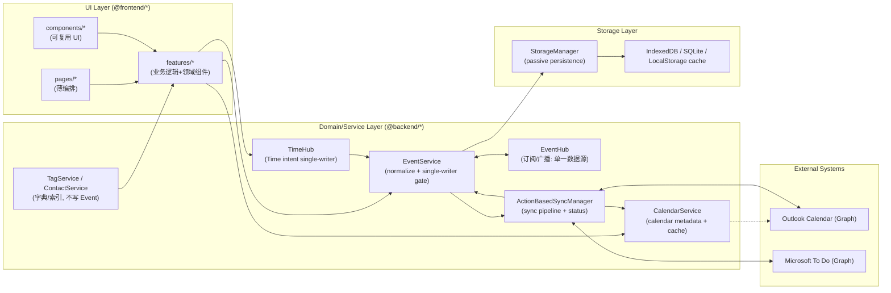

# Event Field Contract（SSOT）

> 目的：把字段契约写成“可执行规范（Executable Spec）”。任何工程师仅依赖本文即可回答：
> - 字段是什么意思（语义/适用范围/默认值）
> - 谁能写、谁在读（Single Writer + Readers）
> - 页面用哪个 resolver/哪个 time anchor（避免语义漂移）
> - 与外部同步（Outlook Calendar / Microsoft To Do）的映射与冲突策略
>
> 本文是新的 Single Source of Truth（SSOT）。历史文档：
> - 旧版契约（历史事实 + 过程）：docs/refactor/EVENT_FIELD_CONTRACT.md
> - 重构计划（how-to）：docs/refactor/FIELD_CONTRACT_REFACTOR_PLAN_v2.22.md

---

## 0. Scope（范围）

### 0.1 In Scope
- `Event`（唯一主实体）的字段语义、写入所有权、默认值策略、跨模块读写规则。
- Resolver 口径（Title / Time anchor）强制化。
- 外部同步映射（Outlook Calendar、Microsoft To Do）的字段表与方向规则（outbound/inbound）。

### 0.2 Out of Scope
- Signal 的 UI/交互细节与实现落地细节（另案）；本文只定义 Signal 的**最小字段契约**与**跨模块边界**（见 §0.3/§0.4）。
  - Signal 作为独立实体/独立存储，由专门的 Owner（`SignalService`）负责写入与一致性；`Event` 只允许通过引用或 derived index 使用。
- 大规模 UI 改造；本文只定义“写入边界/读口径/映射表”。

---

## 0.3 Signal 与 Event 的衔接约定

> **背景**：Signal 是独立的语义层实体（用户意图标记 + 行为信号），与 Event 通过 `eventId` 松耦合。本节明确两者的架构边界与协作规则。

**完整 Signal 架构设计**：[docs/architecture/SIGNAL_ARCHITECTURE_PROPOSAL.md](../architecture/SIGNAL_ARCHITECTURE_PROPOSAL.md)

### 核心概念区分

**Format（格式）vs Signal（信号）**：

| 层次 | Format（格式） | Signal（信号） |
|------|---------------|---------------|
| **定位** | Presentation Layer（表现层） | Semantic/Domain Layer（语义层） |
| **存储** | `EventLog.slateJson`（Slate JSON） | `signals` 表（独立存储） |
| **示例** | `{ text: "重点", bold: true, backgroundColor: "#FFFF00" }` | `{ type: 'highlight', content: "重点", eventId: 'xxx' }` |
| **查询** | 需解析完整 JSON | 直接 SQL/索引查询 |
| **同步** | 可同步（`EventLog.html` 包含样式） | 本地专属，不同步 |
| **Owner** | UI 层 + EventService（序列化） | SignalService（CRUD + 一致性） |

### Signal Schema（最小契约）

```typescript
interface Signal {
  id: string;                    // 唯一标识
  eventId: string;               // 关联的 Event（外键，强制）
  type: SignalType;              // 信号类型
  content: string;               // 标记的文本内容
  createdAt: string;             // 创建时间（本地格式 YYYY-MM-DD HH:mm:ss）
  updatedAt: string;             // 更新时间（本地格式 YYYY-MM-DD HH:mm:ss）
  deletedAt?: string;            // 软删除（可选）

  createdBy: 'user' | 'ai' | 'system'; // 信号来源（sender/issuer）
  status: 'active' | 'confirmed' | 'rejected' | 'expired';

  // AI 推断审核（仅当 createdBy='ai' 时可能出现）
  reviewedAt?: string;
  reviewedBy?: 'user' | 'system';
  
  // 定位信息（富文本中的位置）
  slateNodePath?: number[];      // Slate 节点路径 [0, 1, 2]
  textRange?: { start: number; end: number };
  
  // 元数据
  confidence?: number;           // AI推断置信度 (0-1)
  behaviorMeta?: {               // 行为统计
    actionCount?: number;        // 操作次数（复制/编辑）
    totalDwellTime?: number;     // 累计停留时长（毫秒）
    relatedConversationId?: string; // 关联AI对话ID
    // ... 完整字段见 SIGNAL_ARCHITECTURE_PROPOSAL
  };
  
}

type SignalType = 
  // 语义标记（用户显式标注）
  | 'highlight'      // ⭐ 重点
  | 'question'       // ❓ 疑问
  | 'action_item'    // ✅ 行动项
  | 'advantage' | 'disadvantage' | 'brilliant' | 'confirm'
  
  // 用户操作行为
  | 'user_question' | 'user_copy' | 'ai_insert' | 'user_edit' | 'user_star'
  
  // 时间停留行为
  | 'dwell_time_event' | 'dwell_time_paragraph' | 'focus_time'
  
  // 键盘/鼠标行为
  | 'typing_rhythm' | 'delete_rewrite' | 'mouse_hover' | 'scroll_behavior'
  
  // AI推断（待确认）
  | 'ai_highlight_suggested' | 'ai_question_detected';
```

### 存储架构

| 项目 | 规范 |
|------|------|
| **表名** | `signals`（IndexedDB/SQLite） |
| **Owner** | `SignalService`（CRUD + 去重 + 一致性） |
| **索引** | `[eventId + type]`, `[timestamp]`, `[status]`, `[createdBy]` |
| **外键** | `eventId` → `events.id`（逻辑外键，需级联删除） |

### 与 Event 的协作规则（本契约强制）

#### 1. Event 不存储 Signal 细节

❌ **禁止**：
```typescript
// 禁止在 Event 中添加 Signal 相关字段
interface Event {
  isHighlight?: boolean;        // ❌ 禁止
  hasQuestions?: boolean;       // ❌ 禁止
  signalCount?: number;         // ❌ 禁止
  importanceLevel?: number;     // ❌ 禁止
}
```

✅ **允许（可选 derived index）**：
```typescript
// ✅ 推荐：独立 derived store（避免 SignalService 越权写入 events）
interface EventSignalIndex {
  eventId: string;               // PK
  highlightCount: number;
  questionCount: number;
  actionItemCount: number;
  lastSignalTime?: string;

  hasHighlight?: boolean;
  hasQuestion?: boolean;
  hasActionItem?: boolean;

  updatedAt: string;             // 该索引的更新时间（本地格式）
}
```
- 由 `SignalService` 更新（触发器/批量任务）
- **只读、可重建、不参与同步**
- 用于快速过滤（如"显示有重点标记的事件"），无需 JOIN `signals`

#### 2. Signal 通过 eventId 关联 Event

**查询 Signal**：
```typescript
// 获取某个 Event 的所有 Signal
const signals = await SignalService.getSignalsByEvent(eventId);

// 按类型查询
const highlights = await SignalService.getSignalsByEvent(eventId, { type: 'highlight' });

// 时间范围查询（Focus Window）
const focusSignals = await SignalService.getSignalsInTimeRange(
  startTime,
  endTime,
  { types: ['highlight', 'question', 'action_item'] }
);
```

**级联删除**：
```typescript
// EventService.deleteEvent() 实现
async deleteEvent(id: string): Promise<void> {
  // 1. 软删除 Event
  await this.updateEvent(id, { deletedAt: formatTimeForStorage(new Date()) });
  
  // 2. 级联删除关联 Signal
  await SignalService.deleteSignalsByEvent(id);
  
  // 3. 记录同步动作（如需要）
  // ...
}
```

#### 3. Format → Signal 的提升路径（可选）

**两种标记方式共存**：

1. **Format 标记**（表现层）：
   - 用户在富文本中应用"黄色高亮" → 存储到 `EventLog.slateJson`
   - Outlook 同步时保留（通过 `EventLog.html`）

2. **Signal 标记**（语义层）：
   - 用户右键"标记为重点" → 调用 `SignalService.createSignal({ type: 'highlight', ... })`
   - AI 可查询聚合

**AI 辅助提升**（未来）：
```typescript
// AI 扫描 Format → 建议创建 Signal
const suggestedSignals = await AIService.analyzeFormats(eventId);
// → 返回：[{ type: 'highlight', content: '...', confidence: 0.85, status: 'ai_highlight_suggested' }]

// 用户确认后转为正式 Signal
await SignalService.confirmSignal(signalId);
```

#### 4. 禁止用布尔字段模拟 Signal

❌ **禁止行为**：
```typescript
// 禁止用 isXxx 布尔字段表达信号语义
event.isImportant = true;      // ❌ 应该用 Signal { type: 'highlight' }
event.hasDoubt = true;         // ❌ 应该用 Signal { type: 'question' }
event.needsAction = true;      // ❌ 应该用 Signal { type: 'action_item' }
```

✅ **正确做法**：
```typescript
// 所有信号语义通过 signals 表表达
await SignalService.createSignal({
  eventId: event.id,
  type: 'highlight',
  content: '这是重点内容',
  createdBy: 'user',
});
```

**特别说明**：
- **Activity（timeblock）不是 Signal**：Activity 属于用户可见的数据实体（独立表），用于承载“实际进展/计时”等 timeblocks。
- subordinate/trajectory/系统轨迹 是 **历史术语（待清理删除）**：过去用“子事件(Event)”承载 timeblock；SSOT 不承诺任何运行期兼容路径。
  - 若存量 DB 仍存在这类 Event 形态记录：只能由 migration/cleanup 工具一次性迁移为 `activities`（或直接清理删除），产品主路径不得依赖 `EventService.isSubordinateEvent` 做业务分支。
- `isTimeLog/isOutsideApp/isTimer` 仅作为 **历史脏输入**（migration/read-upgrade 阶段可读并应当写回为 canonical），最终必须移除。

#### 5. Sync 边界

| 数据类型 | 同步策略 |
|---------|---------|
| **Format**（格式） | ✅ 同步到 Outlook/To Do（通过 `EventLog.html`） |
| **Signal**（信号） | ❌ 本地专属，不同步 |
| **Event** | ✅ 同步（遵循现有 Sync 规则） |

**原因**：
- Signal 是 AI-native 特性，外部系统（Outlook/To Do）无对应概念
- Signal 包含行为数据（复制次数、停留时长）、AI 推断等敏感信息
- 格式（Format）足以满足外部系统的显示需求

### 实施约束（与 Eventlog Enhanced PRD 对齐）

**Phase 优先级**（严格按序实施）：
1. **Phase 1（MVP-1/2）**: `signals` 表 + SignalService CRUD + 手动标记 UI
2. **Phase 2（MVP-3）**: `event_signal_index` derived store（用于过滤）
3. **Phase 3（MVP-4/5）**: 行为数据聚合（behaviorMeta）
4. **Phase 4（Phase 2）**: AI 推断与 RAG embedding

**数据量约束**：
- behaviorMeta **只存聚合统计 + 少量（可选）摘要文本**，**不存原始高频事件流**（也不存可无限增长的明细列表）
- **证据文本（如选中的文字/悬停文字/被标记片段）以 `Signal.content` 为准**；`nodeSummary/articleSummary` 允许作为小文本缓存写入 `behaviorMeta`（用于 Daily Review），但不得演化为原始事件流

**Summary 生成策略**（参考 roots/sprout 关系）：
- **系统主动生成**：daily/weekly/monthly/quarterly/yearly summary（定时触发）
- **用户手动触发**：AI chat summary（按需生成，不自动）

---

## 0.4 Signal 字段契约（完整 Schema）

> **定位**：Signal 是独立的语义层实体，与 Event 通过 `eventId` 松耦合。本节是 Signal 的唯一 SSOT。

### 0.4.1 Schema 定义（强制契约）

```typescript
/**
 * Signal 实体（独立存储，本地专属）
 * Owner: SignalService（唯一写入者）
 * 存储: signals 表（IndexedDB/SQLite）
 * 同步: ❌ 不同步到外部系统（Outlook/To Do）
 */
interface Signal {
  // ===== 核心字段（必填） =====
  id: string;                    // signal_${nanoid(21)}
  eventId: string;               // 外键 → events.id（强制，级联删除）
  type: SignalType;              // 信号类型（见下文）
  content: string;               // 标记/证据文本（建议 ≤500；可截断；以此为准）
  timestamp: string;             // 创建时间（本地格式 YYYY-MM-DD HH:mm:ss）
  createdBy: 'user' | 'ai' | 'system';
  status: SignalStatus;          // 状态（见下文）
  
  // ===== 定位信息（可选） =====
  slateNodePath?: number[];      // Slate 节点路径 [0, 1, 2]
  textRange?: {                  // 文本范围
    start: number;
    end: number;
  };
  
  // ===== 行为元数据（聚合数据，不存原始流） =====
  behaviorMeta?: {
    // 统计聚合（只存总量，不存明细）
    actionCount?: number;        // 操作次数（复制/编辑）
    totalDwellTime?: number;     // 累计停留时长（毫秒）
    
    // （可选）AI/Daily Review 所需的轻量摘要（小文本缓存；非原始事件流）
    nodeSummary?: string;        // Node summary as chunk
    articleSummary?: string;     // Article summary

    // （兼容字段，不建议写入）：过去曾将 selectedText 写入 behaviorMeta；现在以 Signal.content 为准
    selectedText?: string;
    
    // 上下文关联
    relatedConversationId?: string; // 关联 AI 对话 ID
    relatedSessionId?: string;      // 关联会话 ID（Focus Window）
    
    // AI 推断（可选）
    extractedFrom?: 'format' | 'behavior' | 'ai_suggestion';
  };
  
  // ===== AI 推断专用字段（createdBy='ai' 时有效） =====
  confidence?: number;           // 置信度 (0-1)
}

/**
 * Signal 类型枚举
 */
type SignalType = 
  // ===== 语义标记（用户显式标注） =====
  | 'highlight'      // ⭐ 重点
  | 'question'       // ❓ 疑问/Open Loop
  | 'action_item'    // ✅ 行动项
  | 'objection'      // 🧊 反对/风险
  | 'advantage'      // 👍 优势
  | 'disadvantage'   // 👎 劣势
  | 'brilliant'      // 💡 精彩洞察
  | 'confirm'        // ✓ 确认/同意
  
  // ===== 用户操作行为（自动捕获） =====
  | 'user_question'  // 用户提问 AI
  | 'user_copy'      // 用户复制内容
  | 'ai_insert'      // AI 插入内容
  | 'user_edit'      // 用户编辑内容
  | 'user_star'      // 用户星标段落
  
  // ===== 时间停留行为 =====
  | 'dwell_time_event'     // Event 级别停留
  | 'dwell_time_paragraph' // Paragraph 级别停留
  | 'focus_time'           // Focus Window 内的重点时段
  
  // ===== 键盘/鼠标行为 =====
  | 'typing_rhythm'   // 连续输入节奏
  | 'delete_rewrite'  // 删除重写行为
  | 'mouse_hover'     // 鼠标悬停
  | 'scroll_behavior' // 滚动行为
  
  // ===== AI 推断（待用户确认） =====
  | 'ai_highlight_suggested' // AI 建议的重点
  | 'ai_question_detected';  // AI 检测的疑问

/**
 * Signal 状态
 */
type SignalStatus = 
  | 'active'        // 活跃（默认）
  | 'confirmed'     // 已确认（用户确认 AI 推断）
  | 'rejected'      // 已拒绝（用户拒绝 AI 推断）
  | 'expired';      // 已过期（时效性失效）
```

**状态转换规则**：

| 触发条件 | 旧状态 | 新状态 | Owner | 说明 |
|---------|--------|--------|-------|------|
| Signal 创建 | - | `active` | SignalService | 默认初始状态 |
| 用户确认 AI 推断 | `active` | `confirmed` | SignalService | 用户认可 AI 建议的 Signal |
| 用户拒绝 AI 推断 | `active` | `rejected` | SignalService | 用户否决 AI 建议 |
| **文本修改 >50%** | `active`/`confirmed` | **`expired`** | SlateChangeListener | 标记的文本内容大幅变化，Signal 失效 |
| **节点删除** | `*` | **物理删除** | SlateChangeListener | Slate 节点被删除，级联删除 Signal |
| **90 天后清理** | `expired` | **物理删除** | CronJob | 定期清理过期 Signal |
| **AI 推断未确认** | `active` (AI 创建) | `expired` | CronJob | 90 天内未确认的 AI 推断 Signal |

**文本变更检测策略**：
- **轻微修改**（<10% 字符差异）：更新 `Signal.content`，保持 `status=active`
- **中度修改**（10%-50%）：保持 `status=active`，记录 `updatedAt`
- **大幅修改**（>50%）：标记 `status=expired`（保留历史记录）
- **节点删除**：物理删除所有关联 Signal（级联删除）

**Expire 后的处理**：
- `expired` Signal 不参与 AI 查询/聚合
- UI 可选择是否显示（默认隐藏）
- 90 天后由定期任务物理删除（节省存储）

### 0.4.2 存储架构

| 项目 | 规范 |
|------|------|
| **表名** | `signals`（IndexedDB/SQLite） |
| **Owner** | `SignalService`（CRUD + 去重 + 一致性） |
| **索引** | `[eventId + type]`, `[timestamp]`, `[status]`, `[createdBy]` |
| **外键** | `eventId` → `events.id`（逻辑外键，需级联删除） |
| **同步** | ❌ 本地专属，不同步到 Outlook/To Do |
| **备份** | ✅ 随 Event 数据一起导出（GDPR 合规） |
| **体积** | ~1KB/条（不含 embedding） |

### 0.4.2.1 SignalEmbedding（RAG 向量索引，Phase 4）

> **设计原则**：embedding 属于典型 Derived/Cache（可重建、可丢弃），独立存储避免污染核心 signals 表。

> **总则**：`RAGIndexService` 是 **所有 embeddings Derived Store** 的唯一 Owner（Single Writer）。不同实体类型（Signal/Event/MediaArtifact/Artifact/...）可以各自有独立的 embeddings 表，但写入/重建/迁移一律归口到 `RAGIndexService`（实现上可拆内部子模块/worker）。

```typescript
/**
 * Signal RAG 向量索引（独立表）
 * Owner: RAGIndexService（Phase 4 实施）
 * 存储: signal_embeddings 表（IndexedDB/SQLite）
 * 关系: 1 Signal → 0..N SignalEmbedding（支持多模型并存）
 */
interface SignalEmbedding {
  // ===== 核心字段 =====
  signalId: string;              // 主键，外键 → signals.id
  modelVersion: EmbeddingModelVersion; // 模型版本（抽象标识，见下文）
  
  // ===== 向量数据 =====
  embedding: Float32Array;       // 向量数据（1536/3072 维）
  dimension: number;             // 向量维度（用于验证）
  
  // ===== 元数据 =====
  generatedAt: string;           // 生成时间（YYYY-MM-DD HH:mm:ss）
  status: 'valid' | 'stale' | 'pending';
  computeTimeMs?: number;        // 计算耗时（性能监控）
}

/**
 * Embedding 模型版本（抽象枚举，隐藏供应商细节）
 */
type EmbeddingModelVersion = 
  | 'v1'        // 默认模型（内部映射到具体实现）
  | 'v2'        // 升级模型
  | 'v3'        // 未来扩展
  | 'legacy';   // 兼容旧数据

// 实际模型映射（实现层，不进入 SSOT 契约）
// const MODEL_IMPL = {
//   'v1': { provider: 'openai', model: 'text-embedding-3-small', dim: 1536 },
//   'v2': { provider: 'openai', model: 'text-embedding-3-large', dim: 3072 },
// };
```

**存储架构**：

| 项目 | 规范 |
|------|------|
| **表名** | `signal_embeddings` |
| **Owner** | `RAGIndexService`（Phase 4 实施） |
| **索引** | `[signalId + modelVersion]` (PRIMARY), `[status]`, `[generatedAt]` |
| **外键** | `signalId` → `signals.id`（级联删除） |
| **同步** | ❌ 本地专属，完全可重建 |
| **备份** | ⚠️ 可选备份（体积大，可丢弃重建） |
| **体积** | ~6KB/条 (1536 维) 或 ~12KB/条 (3072 维) |

**查询示例**：
```typescript
// 获取 Signal 的最新 embedding
const embedding = await db.signal_embeddings
  .where('[signalId+modelVersion]')
  .equals([signalId, 'v1'])
  .filter(e => e.status === 'valid')
  .first();

// 向量相似度搜索（需要遍历，Phase 4 可优化为 ANN 索引）
const similar = await RAGIndexService.searchSimilar(queryEmbedding, {
  modelVersion: 'v1',
  topK: 10,
  minSimilarity: 0.7
});
```

**状态转换规则**：

| 触发条件 | 旧状态 | 新状态 | Owner |
|---------|--------|--------|-------|
| embedding 生成任务创建 | - | `pending` | RAGIndexService |
| embedding 计算完成 | `pending` | `valid` | RAGIndexService |
| Signal.content 更新 | `valid` | `stale` | SlateChangeListener |
| 模型版本升级 | `valid` (旧版本) | `stale` | Migration |
| Signal 删除 | `*` | 物理删除 | SignalService (级联) |

**与 Signal 的协作**：
- Signal 创建后，异步触发 embedding 生成（不阻塞 UI）
- Signal 文本更新时，标记对应 embedding 为 `stale`，异步重新生成
- Signal 删除时，级联删除所有关联 embedding
- RAG 查询时，仅使用 `status='valid'` 的 embedding

**模型升级策略**：
```typescript
// 新旧模型并存（A/B 测试）
await RAGIndexService.generateEmbeddings({
  signalIds: ['signal_1', 'signal_2'],
  modelVersion: 'v2',  // 生成新版本 embedding
  keepOldVersion: true // 保留 v1 embedding
});

// 全量迁移
await RAGIndexService.migrateAllEmbeddings({
  fromVersion: 'v1',
  toVersion: 'v2',
  deleteOld: true // 完成后删除旧版本
});
```

### 0.4.2.2 Embeddings（跨实体统一命名与 AIChat 口径）

**命名约定（推荐）**：统一使用 `<entity>_embeddings` 表名（复数）。

- `signal_embeddings`：`signalId + modelVersion`（已定义）
- `event_embeddings`：`eventId + modelVersion`
- `media_artifact_embeddings`：`mediaArtifactId + modelVersion`
- `artifact_embeddings`：`artifactId + modelVersion`

**AIChat embeddings（推荐默认）**：AIChat 本质仍是 `Event` 的一种（通过 facets / conversationType / role 区分），因此默认落在 `event_embeddings`；在检索/排序时通过 Event 元数据对 user/assistant、sprout/root 等做差异化加权。

**差异化加权（不增加 canonical 字段）**：
- embedding 生成：用户写的 Event 与 AI 生成的 AIChat Event 都生成 embedding（同表 `event_embeddings`）。
- 检索/排序：在 `RAGIndexService` 的 search/rerank 阶段基于 Event 的 facets 元数据做权重调节，而不是通过“拆 embedding 表”来区分。
  - `role=user`：boost（更偏用户真实意图/日记主线）
  - `role=assistant`：降权或在某些检索入口默认 exclude（避免 AI 复读污染召回）
  - `conversationType=sprout`：可适度 boost（更偏问题/触发点）
  - `conversationType=root`：可适度降权或按场景使用（更偏总结/结论）
  - `source=local:ai_chat_card/local:ai_inline`：可作为次级特征（仅用于排序策略，不作为 canonical 分类）

示例（伪代码，仅表达策略，不进入契约）：
```ts
// baseSim 来自向量相似度；其余是排序阶段的可调权重。
score = baseSim
  * (role === 'user' ? 1.25 : 0.85)
  * (conversationType === 'sprout' ? 1.10 : 0.95);
```

仅当确实需要“对话级别”的稳定语义向量（按 `conversationId` 聚合整段对话、或 rolling-summary embedding）时，才引入额外的派生表（例如 `conversation_embeddings`），同样由 `RAGIndexService` 统一写入与维护。

### 0.4.3 与 Event 的协作规则（强制约束）

#### 规则 1：Event 不存储 Signal 细节

❌ **禁止**：
```typescript
// 禁止在 Event 中添加 Signal 相关字段
interface Event {
  isHighlight?: boolean;        // ❌ 禁止
  hasQuestions?: boolean;       // ❌ 禁止
  signalCount?: number;         // ❌ 禁止
  importanceLevel?: number;     // ❌ 禁止
  
  // 以下字段也禁止（避免用布尔字段模拟 Signal）
  isImportant?: boolean;        // ❌ 用 Signal { type: 'highlight' }
  hasDoubt?: boolean;           // ❌ 用 Signal { type: 'question' }
  needsAction?: boolean;        // ❌ 用 Signal { type: 'action_item' }
}
```

✅ **允许（Derived Index，可选实施）**：
```typescript
// ✅ 推荐：独立 Derived/Index store（event_signal_index）
interface EventSignalIndex {
  eventId: string;               // PK
  highlightCount: number;
  questionCount: number;
  actionItemCount: number;
  lastSignalTime?: string;       // 最后一个 Signal 的时间戳

  // 可选：用于快速过滤
  hasHighlight?: boolean;
  hasQuestion?: boolean;
  hasActionItem?: boolean;

  updatedAt: string;             // 该索引的更新时间（本地格式）
}
```

**维护策略**：
- 由 `SignalService` 更新（触发器/批量任务）
- **只读、可重建、不参与同步**
- 用途：快速过滤"显示有重点标记的事件"（无需 JOIN signals 表）
- 实施优先级：**Phase 2（MVP-3）**

#### 规则 2：Signal 通过 eventId 关联 Event

**查询 API**（SignalService 提供）：
```typescript
// 获取某个 Event 的所有 Signal
const signals = await SignalService.getSignalsByEvent(eventId);

// 按类型查询
const highlights = await SignalService.getSignalsByEvent(eventId, { 
  type: 'highlight' 
});

// 时间范围查询（Focus Window / Daily Review）
const focusSignals = await SignalService.getSignalsInTimeRange(
  startTime,   // "2025-01-23 14:00:00"
  endTime,     // "2025-01-23 15:00:00"
  { 
    types: ['highlight', 'question', 'action_item'],
    status: 'active'
  }
);

// RAG 检索（Phase 4）
const similarSignals = await SignalService.searchByEmbedding(
  queryEmbedding,
  { topK: 10, threshold: 0.75 }
);
```

**级联删除**（强制）：
```typescript
// EventService.deleteEvent() 必须实现
async deleteEvent(id: string): Promise<void> {
  // 1. 软删除 Event
  await this.updateEvent(id, { 
    deletedAt: formatTimeForStorage(new Date()) 
  });
  
  // 2. 级联删除关联 Signal（唯一耦合点）
  await SignalService.deleteSignalsByEvent(id);
  
  // 3. 记录同步动作（如需要）
  await this.recordSyncAction(id, 'delete');
}
```

#### 规则 3：Format（格式）与 Signal（语义）分离

**两套独立存储**：

1. **Format 标记**（表现层，走 EventService）：
   - 存储：`EventLog.slateJson`（Slate JSON）
   - 同步：✅ 同步到 Outlook（通过 `EventLog.html`）
   - 示例：`{"text": "重点", "bold": true, "backgroundColor": "#FFFF00"}`

2. **Signal 标记**（语义层，走 SignalService）：
   - 存储：`signals` 表（独立实体）
   - 同步：❌ 本地专属
   - 示例：`{ type: 'highlight', content: "重点", eventId: 'xxx' }`

**创建时机**：

```typescript
// 方式 A：用户显式标记（主动创建）
async function handleMarkAsHighlight(selectedText: string, slateNodePath: number[]) {
  // 1. 可选：添加黄色背景（Format 层）
  await EventService.updateEventLog(eventId, {
    // ... 更新 slateJson
  });
  
  // 2. 创建 Signal（语义层）
  await SignalService.createSignal({
    eventId,
    type: 'highlight',
    content: selectedText,
    slateNodePath,
    createdBy: 'user',
    status: 'active',
    behaviorMeta: {
      extractedFrom: 'user'
    }
  });
}

// 方式 B：AI 批量识别（后台任务，Phase 4）
async function scanAndSuggestSignals(eventId: string) {
  const eventlog = await EventService.getEventLog(eventId);
  
  // 分析 slateJson 中的格式模式
  const candidates = await AIService.analyzeFormats(eventlog.slateJson);
  
  // 创建为 ai_highlight_suggested 状态（待确认）
  for (const candidate of candidates) {
    await SignalService.createSignal({
      ...candidate,
      createdBy: 'ai',
      status: 'active',  // 或 'ai_highlight_suggested'（等待确认）
      confidence: candidate.confidence
    });
  }
}
```

#### 规则 4：SignalService 是唯一写入者

**允许的写入路径**：
```typescript
// ✅ 正确：所有 Signal 写入必须通过 SignalService
await SignalService.createSignal({ ... });
await SignalService.updateSignal(signalId, { status: 'confirmed' });
await SignalService.deleteSignal(signalId);

// ❌ 错误：其他服务不得直接写入 signals 表
await storageManager.db.signals.add({ ... });  // 禁止
```

**读取路径**：
- 任何模块都可以读取（通过 SignalService API）
- EventService **只读** EventLog.slateJson（提取格式信息）
- SignalService **不修改** EventLog.slateJson

### 0.4.4 behaviorMeta 存储策略（决策确认）

**存储内容**：

✅ **必须存储**（用于 AI 生成 Daily Review）：
```typescript
// 证据文本：以 Signal.content 为准（例如选中的文字/悬停文字/被标记片段）

behaviorMeta: {
  // 聚合统计（不存原始事件流）
  actionCount: number;        // 总操作次数
  totalDwellTime: number;     // 总停留时长（毫秒）

  // （可选）小文本摘要缓存（用于 Daily Review；不得演化为原始事件流/明细列表）
  nodeSummary?: string;       // Node summary as chunk
  articleSummary?: string;    // Article summary

  // 关联 ID
  relatedConversationId?: string;
  relatedSessionId?: string;

  // （兼容字段，不建议写入）：selectedText 以 Signal.content 为准
  selectedText?: string;
}
```

❌ **禁止存储**（避免数据膨胀）：
```typescript
// 不存储原始事件流
mouseMovements: MouseEvent[];  // ❌ 禁止
scrollEvents: ScrollEvent[];   // ❌ 禁止
keystrokes: KeyEvent[];        // ❌ 禁止
```

**例外**（Focus Window 时段，可选）：
- 在 Focus Window 内（Signal ± 时间增量）
- 可以选择性存储详细事件流到 `session_details` 表（独立于 signals）
- 用于会议回顾的逐字记录

### 0.4.5 Summary 生成策略（roots/sprout 关系）

**系统主动生成**（定时触发）：
```typescript
// 分层 Summary（复利式回顾）
type SummaryScope = 
  | 'daily'      // 每日叙事（晚 9 点或手动）
  | 'weekly'     // 每周综合（周日晚）
  | 'monthly'    // 每月回顾（月末）
  | 'quarterly'  // 季度总结（季末）
  | 'yearly';    // 年度回顾（年末）

// 自动触发规则
const summarySchedule = {
  daily: { cron: '0 21 * * *', autoGenerate: true },
  weekly: { cron: '0 21 * * 0', autoGenerate: true },
  monthly: { cron: '0 21 28-31 * *', autoGenerate: true },
  quarterly: { cron: '0 21 28-31 3,6,9,12 *', autoGenerate: true },
  yearly: { cron: '0 21 31 12 *', autoGenerate: true }
};
```

**用户手动触发**（按需生成）：
```typescript
// AI chat summary（不自动生成）
interface AIChatSummaryRequest {
  eventId: string;
  conversationId: string;
  scope: 'conversation' | 'session';  // 单次对话 or 整个会话
  includeContext: boolean;            // 是否包含上下文
}

// 用户点击 "生成 AI 对话总结" 按钮触发
await SummaryService.generateAIChatSummary({
  eventId: currentEvent.id,
  conversationId: currentConversation.id,
  scope: 'conversation',
  includeContext: true
});
```

**roots/sprout 关系示意**：
```
roots (自动生成的定期 Summary)
  ├─ daily_2025-01-23
  ├─ daily_2025-01-24
  └─ weekly_2025-W04 (聚合上述 daily)
      └─ monthly_2025-01 (聚合 weekly)
          └─ quarterly_2025-Q1 (聚合 monthly)
              └─ yearly_2025 (聚合 quarterly)

sprout (用户手动触发的 AI chat summary)
  ├─ ai_chat_conv_abc123
  ├─ ai_chat_conv_def456
  └─ (不参与自动聚合，独立存在)
```

### 0.4.6 SignalService 最小接口契约

```typescript
/**
 * SignalService（唯一写入者）
 * 职责：Signal CRUD + 去重 + 级联删除
 * 约束：不得写入/维护 Event 派生字段；跨域派生必须落在独立 Derived Store（可重建）
 */
class SignalService {
  // ===== CRUD =====
  
  static async createSignal(input: {
    eventId: string;
    type: SignalType;
    content: string;
    createdBy: 'user' | 'ai' | 'system';
    slateNodePath?: number[];
    textRange?: { start: number; end: number };
    behaviorMeta?: Partial<Signal['behaviorMeta']>;
    confidence?: number;
    status?: SignalStatus;
  }): Promise<Signal>;
  
  static async updateSignal(
    signalId: string, 
    updates: Partial<Signal>
  ): Promise<void>;
  
  static async deleteSignal(signalId: string): Promise<void>;
  
  // ===== 查询 =====
  
  static async getSignalsByEvent(
    eventId: string,
    filters?: { 
      type?: SignalType; 
      status?: SignalStatus;
      createdBy?: Signal['createdBy'];
    }
  ): Promise<Signal[]>;
  
  static async getSignalsInTimeRange(
    startTime: string,  // "YYYY-MM-DD HH:mm:ss"
    endTime: string,
    filters?: { 
      types?: SignalType[]; 
      status?: SignalStatus;
    }
  ): Promise<Signal[]>;
  
  // ===== 级联删除（EventService 调用） =====
  
  static async deleteSignalsByEvent(eventId: string): Promise<void>;
}

/**
 * EventSignalIndexService（Derived Store 唯一写入者）
 * 职责：维护 event_signal_index（只读聚合视图/摘要，用于 UI 快速展示与排序）
 * 注意：可重建；不得反向写回 Event/Signal
 */
class EventSignalIndexService {
  static async rebuildForEvent(eventId: string): Promise<void>;
  static async getIndexByEvent(eventId: string): Promise<EventSignalIndex | null>;
}

/**
 * SignalEmbeddingService（RAGIndexService 内部模块）
 * 职责：维护 signal_embeddings + 提供向量检索
 * Owner/Single Writer：RAGIndexService（该类可视为其内部实现）
 * 注意：Embedding/RAG 属于派生索引能力，不属于 Signal 的权威字段
 */
class SignalEmbeddingService {
  static async ensureEmbedding(signalId: string): Promise<void>;
  static async searchByEmbedding(
    queryEmbedding: number[],
    options: { topK: number; threshold: number }
  ): Promise<Array<{ signalId: string; similarity: number }>>;
}
```

---

## 0.5 UserManner 与 AI Agents 的衔接约定

> **背景**：UserManner 是自进化用户意图学习系统，从 Signal 自动挖掘用户行为模式，为各 AI Agent 提供个性化权重，并通过反馈闭环持续优化。本节明确 UserManner 的 SSOT 定位、Single Writer 边界与数据流向。

**完整 UserManner 设计**：[docs/PRD/AI_UserManner_PRD.md](../PRD/AI_UserManner_PRD.md)

### 核心架构约束（SSOT 定位）

| 模块 | SSOT 定位 | 与 UserManner 关系 | Owner/Writer | Readers | 重建能力 |
|------|-----------|-------------------|--------------|---------|---------|
| **Signal** | **SSOT（真相源）** | UserManner 的数据来源 | `SignalService` | `UserMannerAgent`（read only） | - |
| **UserManner** | **Derived（派生数据）** | 可从 Signal 完全重建 | `UserMannerService` | 各 AI Agent（read only） | ✅ 完全可重建 |
| **UserMannerAgent** | **Derived Builder** | 唯一创建 UserManner 的 AI | - | - | - |
| **ChatFlowAgent** | **Reader** | 读取 UserManner 权重，应用于 RAG 检索 | - | - | - |
| **TaskManagerAgent** | **Reader** | 读取权重，决定自动提取 vs 预览确认 | - | - | - |
| **NotesManagerAgent** | **Reader** | 读取权重，智能选择插入目标 | - | - | - |
| **MediaManagerAgent** | **Reader** | 读取权重，个性化图片质量评分 | - | - | - |

### Single Writer 原则验证

**严格约束**（违反即 Bug）：

1. **Signal 写入唯一性**：
   - ✅ 允许：`SignalService.createSignal()` / `updateSignal()` / `deleteSignal()`
   - ❌ 禁止：UserManner/AI Agent 直接写入 `signals` 表

2. **UserManner 写入唯一性**：
   - ✅ 允许：`UserMannerService.createManner()` / `updateWeight()` / `deleteManner()`
   - ✅ 调用路径：`UserMannerAgent` → `UserMannerService.createManner()`（AI 不直接写库）
   - ❌ 禁止：ChatFlow/Task/Notes/Media Agent 直接写入 `user_manners` 表

3. **权重更新唯一性**：
   - ✅ 允许：`UserMannerEvaluator.updateWeight(mannerId, newScore)`（唯一写入 `decisionWeight`）
   - ✅ 触发路径：隐式反馈事件 → `UserMannerEvaluator.handleFeedback()` → `UserMannerService.updateWeight()`
   - ❌ 禁止：AI Agent 自行调整权重（只读取，不修改）

4. **AI Agent 只读约束**：
   - ✅ 允许：`ChatFlowAgent.getMannersByCategory('search_pattern')` → 读取权重
   - ✅ 允许：`TaskManagerAgent.applyManner(mannerId, context)` → 记录应用日志（写入 `manner_applications`，非修改 UserManner）
   - ❌ 禁止：任何 Agent 调用 `UserMannerService.updateWeight()` / `updateManner()`

### 数据流向（Signal → UserManner → AI Decision）

```
┌─────────────────────────────────────────────────────────────┐
│  Phase 1: Signal 采集（真相源）                              │
│  ┌──────────────┐                                           │
│  │ 用户操作/AI推断│ → SignalService.createSignal()           │
│  └──────────────┘     ↓ 存储到 signals 表（SSOT）           │
│                       ↓ eventId, type, content, timestamp   │
└─────────────────────────────────────────────────────────────┘
                        ↓
┌─────────────────────────────────────────────────────────────┐
│  Phase 2: UserManner 挖掘（派生数据）                        │
│  ┌──────────────────┐                                       │
│  │ UserMannerAgent  │ → SignalService.getSignals(30d, 100+) │
│  │ (LLM Pattern     │ → LLM 分析 → 识别 3-5 个模式           │
│  │  Recognition)    │ → UserMannerService.createManner()    │
│  └──────────────────┘   ↓ 存储到 user_manners 表（Derived） │
│                         ↓ category, triggerPattern, weight  │
└─────────────────────────────────────────────────────────────┘
                        ↓
┌─────────────────────────────────────────────────────────────┐
│  Phase 3: AI Agent 应用（只读权重）                          │
│  ┌────────────────┐                                         │
│  │ ChatFlowAgent  │ → UserMannerService.getManners()        │
│  │ TaskManager    │ → 读取 decisionWeight (0-1)             │
│  │ NotesManager   │ → 应用到决策逻辑（如 RAG 分数调整）     │
│  │ MediaManager   │ → 不修改 UserManner                     │
│  └────────────────┘   ↓ 记录 manner_applications（应用日志）│
└─────────────────────────────────────────────────────────────┘
                        ↓
┌─────────────────────────────────────────────────────────────┐
│  Phase 4: 反馈闭环（权重自动调整）                           │
│  ┌──────────────────┐                                       │
│  │ 用户隐式反馈      │ → event:deleted / ai:suggestion:accept│
│  │ (EventEmitter)   │ → UserMannerEvaluator.handleFeedback()│
│  └──────────────────┘   ↓ 计算 Score (accept=1.0, reject=0.0)│
│                         ↓ EMA 公式：W_new = W × 0.8 + S × 0.2│
│                         ↓ UserMannerService.updateWeight()  │
│                         ↓ 更新 user_manners.decisionWeight  │
└─────────────────────────────────────────────────────────────┘
                        ↓ 循环迭代（持续学习）
```

### 重建策略（Derived 证明）

**UserManner 完全可重建**（满足 Derived 定义）：

```typescript
/**
 * 从 Signal 完全重建 UserManner
 * 证明：UserManner 是 Derived，Signal 是 SSOT
 */
class UserMannerRebuilder {
  static async rebuildAllManners(userId: string): Promise<void> {
    // 1. 清空现有 UserManner（保留应用日志）
    await UserMannerService.deleteAllManners(userId);
    
    // 2. 从 Signal 聚合数据（30天，最少100条）
    const signals = await SignalService.getSignals({
      userId,
      startDate: subtractDays(new Date(), 30),
      minCount: 100,
    });
    
    // 3. 重新运行 AI 模式挖掘
    const patterns = await UserMannerAgent.analyzePatterns(signals);
    
    // 4. 创建新的 UserManner
    for (const pattern of patterns) {
      await UserMannerService.createManner({
        userId,
        category: pattern.category,
        triggerPattern: pattern.trigger,
        decisionWeight: 0.5, // 初始权重
        confidence: pattern.confidence,
        createdBy: 'ai',
      });
    }
    
    // 5. 从应用日志恢复权重（可选）
    const applications = await UserMannerService.getApplicationHistory(userId);
    for (const app of applications) {
      await UserMannerEvaluator.replayFeedback(app.mannerId, app.score);
    }
  }
}
```

**重建触发场景**：
- 用户删除所有 UserManner 后重新学习
- 数据迁移/升级（Schema 变更）
- 隐私清理后重建（保留 Signal，重建 UserManner）

### Sync 边界

| 数据类型 | 同步策略 | 原因 |
|---------|---------|------|
| **Signal** | ❌ 本地专属，不同步 | 用户行为敏感数据 |
| **UserManner** | ❌ 本地专属，不同步 | AI 推断的个性化模式 |
| **manner_applications** | ❌ 本地专属，不同步 | 应用日志（用于权重调整） |
| **Event** | ✅ 同步（遵循现有规则） | 用户核心数据 |

**原因**：
- UserManner 包含 AI 推断的用户偏好模式，属于隐私敏感数据
- 不同设备的使用习惯可能不同（桌面 vs 移动），需要独立学习
- Signal 已经是本地专属，UserManner 作为其派生数据同样不同步

### 实施约束（与 AI_UserManner_PRD 对齐）

**Phase 优先级**（严格按序实施）：
1. **Phase 0.5（2周）**: `user_manners` 表 + UserMannerService CRUD + 隐式反馈采集
2. **Phase 2（3周）**: ChatFlow 集成（RAG 权重调整）
3. **Phase 3（2周）**: UserMannerEvaluator 自动评估
4. **Phase 3D（4周）**: UserMannerAgent AI 模式挖掘（LLM-driven）
5. **Phase 3D（4周）**: 扩展到其他服务（Task/Notes/Media）
6. **Phase 6（2周）**: 用户管理界面（查看/编辑/删除 UserManner）

**数据量约束**：
- `user_manners` 表：每用户 ≤50 条（LLM 每次挖掘 3-5 条，定期清理低置信度/低权重模式）
- `manner_applications` 日志：保留最近 90 天（用于权重调整，可定期清理）
- AI 推断触发条件：Signal 数量 ≥100 且时间跨度 ≥30 天（避免冷启动）

**LLM Cost 控制**：
- 模式挖掘频率：每 30 天最多 1 次（用户可手动触发）
- 输入 Token：500 Signal × 50 tokens/signal ≈ 25,000 tokens
- 输出 Token：5 patterns × 200 tokens/pattern ≈ 1,000 tokens
- 单次成本：~$0.10（GPT-4）
- 年成本：~$1.20/用户（可接受）

---

## 1. Canonical Types（权威类型）

- `Event` 与 `EventTitle`：src/types.ts
- Outlook/To Do 支持字段清单与映射：src/utils/outlookFieldMapping.ts
- 同步路由：src/utils/syncRouter.ts
- App 目录分层与模块边界（v2.22 口径）：docs/architecture/APP_ARCHITECTURE_PRD.md
- 执行口径（唯一实施入口）：docs/refactor/REFACTOR_MASTER_PLAN_v2.22.md
- 最新目标目录树（稳定结构参考）：docs/refactor/CODE_STRUCTURE_TARGET_TREE_v2.0_2026-01-03.md

---

## 2. Hard Rules（违反即 Bug）

1) **Canonical vs Derived 分离**：派生值只用于显示/排序/同步 payload，不得回写污染 `Event` 存储（除 repair/migration 工具路径）。
2) **Single Writer**：每个字段域只有一个 Owner；其他模块要改必须通过 Owner API，或携带明确 `intent` 并通过校验。
3) **时间字段允许为空（不要用页面规则兜底）**：任何 Event 都允许没有 calendar block（`startTime/endTime/isAllDay` 均可为 `undefined`），包括 Task/Plan/Note。
  - **路由规则仍然严格**：只有 `startTime && endTime` 才允许路由到 Calendar（见 syncRouter）。
  - **禁止“为了展示/排序而落库注入虚拟时间”**：例如把 Note 的 `startTime = createdAt`、或把 Task 的时间补成当天 00:00–23:59 都视为污染 canonical。
  - **展示/排序必须走 resolver**：时间轴位置用派生的 Timeline Anchor（见 5.2 #4），不改写 Core 时间字段。
4) **数组默认保留 `undefined`**：除非用户显式清空（`intent=user_clear`），否则禁止把 `tags/calendarIds/todoListIds/attendees/...` 默认写成 `[]`。
5) **Storage 被动持久化**：Storage 层不得覆盖 `updatedAt/startTime/endTime/syncStatus` 等业务字段。
6) **时间字符串格式全局禁止 ISO**：
  - **所有持久化时间字段**（Core/Sync/Meta/Derived/Snapshot）必须使用本地格式 `YYYY-MM-DD HH:mm:ss`，**严禁使用 ISO 8601**（禁止 `T` 分隔符、`Z` 后缀）。
  - **业务字段**：`startTime/endTime/createdAt/updatedAt/dueDateTime/deletedAt/checked/unchecked` 必须使用 `formatTimeForStorage()`。
  - **诊断/快照字段**：`lastNonBlankAt/bestSnapshot.capturedAt/EventSnapshot.capturedAt` 同样必须使用 `formatTimeForStorage()`，不得例外。
  - **DO** ：`formatTimeForStorage(new Date())`  `"2024-03-21 14:30:00"`
  - **DON'T** ：`new Date().toISOString()`  `"2024-03-21T14:30:00.123Z"`（禁止）
  - **Lintable 检查**：全局搜索 `toISOString()`/`toJSON()`，确保仅出现在前端日志/调试代码，不得用于 Event 字段赋值。
  - Storage 层仍然禁止擅自改写任何业务时间字段的格式。

---

## 3. Field Layers（字段分层）

- **Core（业务真相）**：用户意图与业务事实；可过滤、可同步、不可随意改写。
- **Sync（外部镜像/状态）**：外部系统映射与同步状态；只允许 Sync Owner 写。
- **Derived（可丢弃）**：可从 Core 计算重建；禁止主路径回写。
- **UI-only（临时态）**：只存在于 React state；严禁落库。

---

## 4. Owners（字段域所有权）

本节分两层：
1) **App 数据/服务/存储架构图**（结构口径：RefactorMaster + App Architecture）；
2) **Field Domains（A–I）**（可执行分治边界，新增字段/新增写入口必须对齐到某个域）。

### 4.1 App 数据/服务/存储架构图（唯一口径）

> 目的：替代“Owner 概览表”的重复信息，用一张图回答：
> - 数据从哪里来（UI/外部 Sync）
> - 谁能写入 Core（Single Writer）
> - 通过哪条管线落库（Storage）
> - Sync 如何与外部系统交互（Outlook Calendar / Microsoft To Do）



- **Single Writer（核心）**：UI/Sync 不直接写 Core 字段；必须通过 `EventService`（以及 Time 相关的 `TimeHub`）的 normalize/merge/校验链路。
- **Domain 单一数据源**：UI 读取以 `EventHub` 订阅视图为准（避免 UI 自建 `allEvents` 真相缓存；详见 `REFACTOR_MASTER_PLAN_v2.22`）。
- **Storage 被动**：`StorageManager` 只做持久化/查询，不擅自改写业务字段（详见 Hard Rules #5）。
- **字典/元数据服务**：`CalendarService` / `TagService` / `ContactService` 提供查询与缓存；不直接改写 Core 字段（Core 写入仍走 `EventService` / `TimeHub` / Sync merge）。

---

### 4.2 View Membership（视图纳入）

> **架构原则**：Event 不应该用字段表达"是否属于某个页面"，而应该用 **facet（派生谓词）** + **view_membership（引用表）**。

#### 4.2.1 View Membership 全量清单

| View/Module | 引用表/索引 | 纳入规则（facet） | source 典型值 | 说明 |
|------------|-----------|----------------|--------------|------|
| **Plan** | `view_membership(viewId='plan')` | `checkType !== 'none'` | `'local:plan'` | Plan 页面创建的事件都是 Task |
| **TimeCalendar** | `view_membership(viewId='timecalendar')` | `startTime && endTime` | `'local:timecalendar'` | 日历视图显示有时间锚点的事件 |
| **TimeLog** | `view_membership(viewId='timelog')` | 所有事件（按时间轴显示） | `'local:timelog'` | 时间轴视图，所有事件（包括Note）都可显示 |
| **Library** | `lib_store` (独立引用表) | 用户显式添加 | `'local:library'` | Library 页面可以创建文档/笔记型事件 |
| **Workspace** | `workspace_store` (独立引用表) | 用户显式固定 | `'local:workspace'` | Workspace 侧边栏快捷方式，可创建事件（自动归入 lib_store） |
| **Sky Pin** | `sky_store` (独立引用表) | 用户显式 pin | `'local:sky'` | 全局顶部快捷入口，可创建任意类型事件 |
| **EventTree** | 无（结构视图） | 所有 Event | N/A | EventTree 不创建事件，只维护结构 |

#### 4.2.2 监控字段与增量更新机制

**设计原则**：shouldShow 作为纯函数，仅在影响 membership 的字段变化时调用，避免无效计算。

**两类更新机制**：
1. **Event字段驱动**（plan/timecalendar/timelog）：Event字段变化 → 触发facet重新计算 → 更新view_membership
2. **Store操作驱动**（library/workspace/sky）：独立store表的add/remove操作 → 直接更新view_membership

##### 4.2.2.1 VIEW_TRIGGER_FIELDS（Event字段变化监控）

每个 view 的 shouldShow 依赖字段。只有这些字段变化时，才需要重新计算 membership。

```typescript
export const VIEW_TRIGGER_FIELDS: Record<string, Set<keyof Event>> = {
  plan: new Set([
    'checkType',        // 任务类型变化
    'deletedAt',        // 删除状态
    'parentEventId',    // child/sub-event 结构变化
  ]),
  
  timecalendar: new Set([
    'startTime',        // 时间锚点变化
    'endTime',          // 时间锚点变化
    'deletedAt',        // 删除状态
  ]),
  
  timelog: new Set([
    'deletedAt',        // 删除状态
    // TimeLog = 按时间轴聚合的视图，不是类型过滤器
    // 所有事件（包括 Note）都可纳入，排序使用 resolveTimelineAnchor()
    // 注意：startTime/createdAt 变化不影响 membership（是否纳入），只影响排序
    // 排序锚点通过 resolveTimelineAnchor() 动态计算
  ]),
  
  // library/workspace/sky 的 membership 不由 Event 字段决定，而是由独立 store 表决定
  // 它们的 deletedAt 变化仍需监控（删除事件时需清理 store 引用）
  library: new Set(['deletedAt']),
  workspace: new Set(['deletedAt']),
  sky: new Set(['deletedAt']),
};
```

##### 4.2.2.2 STORE_OPERATIONS（独立store表操作触发）

Library/Workspace/Sky 的 membership 由独立 store 表的操作决定，需要在 add/remove 时直接更新 view_membership。

```typescript
/**
 * 独立 store 表操作的监控点
 * 这些操作需要同步更新 view_membership
 */
export const STORE_OPERATIONS = {
  lib_store: {
    // 监控操作：add(eventId) / delete(eventId)
    add: async (eventId: string) => {
      await db.lib_store.add({ eventId, createdAt: Date.now(), order: ... });
      await db.view_membership.add({ eventId, viewId: 'library' });
    },
    remove: async (eventId: string) => {
      await db.lib_store.where('eventId').equals(eventId).delete();
      await db.view_membership.where(['eventId', 'viewId']).equals([eventId, 'library']).delete();
    },
  },
  
  workspace_store: {
    // 监控操作：add(eventId, group?) / delete(eventId)
    add: async (eventId: string, group?: string) => {
      await db.workspace_store.add({ eventId, order: ..., group });
      await db.view_membership.add({ eventId, viewId: 'workspace' });
    },
    remove: async (eventId: string) => {
      await db.workspace_store.where('eventId').equals(eventId).delete();
      await db.view_membership.where(['eventId', 'viewId']).equals([eventId, 'workspace']).delete();
    },
  },
  
  sky_store: {
    // 监控操作：add(eventId) / delete(eventId)
    add: async (eventId: string) => {
      await db.sky_store.add({ eventId, pinnedAt: Date.now(), position: ... });
      await db.view_membership.add({ eventId, viewId: 'sky' });
    },
    remove: async (eventId: string) => {
      await db.sky_store.where('eventId').equals(eventId).delete();
      await db.view_membership.where(['eventId', 'viewId']).equals([eventId, 'sky']).delete();
    },
  },
};
```

##### 4.2.2.3 与 EventUpdate 搭配调用

```typescript
// 1. EventService 更新事件后，触发 ViewMembershipService 增量更新
async function updateEvent(eventId: string, updates: Partial<Event>): Promise<Event> {
  // ... EventService 正常更新逻辑
  const updatedEvent = await EventService.updateEvent(eventId, updates);
  
  // 2. 触发 view_membership 增量更新
  await ViewMembershipService.updateEventMembership(eventId, updates);
  
  // 3. EventHub 通知订阅者
  EventHub.emit('eventUpdated', updatedEvent);
  
  return updatedEvent;
}

// ViewMembershipService.updateEventMembership 实现
static async updateEventMembership(
  eventId: string,
  updates: Partial<Event>
): Promise<void> {
  // 1. 检测哪些 view 需要重新计算
  const affectedViews = this.detectAffectedViews(updates);
  
  if (affectedViews.length === 0) {
    // 无触发字段变化，跳过（例如：eventlog 变化）
    return;
  }
  
  // 2. 获取完整的 Event（需要完整数据来判断 shouldShow）
  const event = await EventService.getEventById(eventId);
  if (!event) return;
  
  // 3. 为每个受影响的 view 重新计算 membership
  for (const viewId of affectedViews) {
    const shouldInclude = shouldShow(event, viewId, context);
    const currentMembership = await this.getMembership(eventId, viewId);
    
    if (shouldInclude && !currentMembership) {
      // 加入 view_membership
      await db.view_membership.add({ eventId, viewId });
    } else if (!shouldInclude && currentMembership) {
      // 移除 view_membership
      await db.view_membership
        .where(['eventId', 'viewId'])
        .equals([eventId, viewId])
        .delete();
    }
  }
}

// 检测受影响的 views
private static detectAffectedViews(updates: Partial<Event>): string[] {
  const views: string[] = [];
  
  for (const [viewId, triggerFields] of Object.entries(VIEW_TRIGGER_FIELDS)) {
    // 检查是否有任何触发字段被更新
    if (Object.keys(updates).some(key => triggerFields.has(key as keyof Event))) {
      views.push(viewId);
    }
  }
  
  return views;
}
```

##### 4.2.2.4 独立引用表的完整操作示例

对于 Library/Workspace/Sky（使用独立 store），更新机制不同：

```typescript
// Library 添加事件
async function addToLibrary(eventId: string): Promise<void> {
  // 1. 添加到 lib_store
  await db.lib_store.add({
    eventId,
    createdAt: Date.now(),
    order: await getNextLibraryOrder(),
  });
  
  // 2. 增量更新 view_membership
  await db.view_membership.add({ eventId, viewId: 'library' });
}

// Library 移除事件（事件本身还存在，只是从Library中移除）
async function removeFromLibrary(eventId: string): Promise<void> {
  // 1. 从 lib_store 删除引用
  await db.lib_store.where('eventId').equals(eventId).delete();
  
  // 2. 从 view_membership 删除
  await db.view_membership
    .where(['eventId', 'viewId'])
    .equals([eventId, 'library'])
    .delete();
}

// Workspace 固定/取消固定
async function addToWorkspace(eventId: string, group?: string): Promise<void> {
  await db.workspace_store.add({
    eventId,
    order: await getNextWorkspaceOrder(),
    group,
  });
  
  await db.view_membership.add({ eventId, viewId: 'workspace' });
}

async function removeFromWorkspace(eventId: string): Promise<void> {
  await db.workspace_store.where('eventId').equals(eventId).delete();
  await db.view_membership
    .where(['eventId', 'viewId'])
    .equals([eventId, 'workspace'])
    .delete();
}

// Sky Pin/Unpin
async function pinToSky(eventId: string): Promise<void> {
  await db.sky_store.add({
    eventId,
    pinnedAt: Date.now(),
    position: await getNextSkyPosition(),
  });
  
  await db.view_membership.add({ eventId, viewId: 'sky' });
}

async function unpinFromSky(eventId: string): Promise<void> {
  await db.sky_store.where('eventId').equals(eventId).delete();
  await db.view_membership
    .where(['eventId', 'viewId'])
    .equals([eventId, 'sky'])
    .delete();
}

// 重要：Event 删除时，需要清理所有 store 引用
async function deleteEvent(eventId: string): Promise<void> {
  // 1. 标记 Event 为删除
  await EventService.updateEvent(eventId, { deletedAt: Date.now() });
  
  // 2. 清理所有独立 store 引用
  await db.lib_store.where('eventId').equals(eventId).delete();
  await db.workspace_store.where('eventId').equals(eventId).delete();
  await db.sky_store.where('eventId').equals(eventId).delete();
  
  // 3. 清理所有 view_membership（通过 updateEventMembership 触发）
  // 或者直接：await db.view_membership.where('eventId').equals(eventId).delete();
}
```

---

### 4.3 Field Domain Classification（字段域分类：按职责聚类）

#### 4.3.1 Field Domains（建议：A–I）

> 这是你提供的“原版分治表”的正式落地版本：它比上面的概览更强，因为包含 **Identity/Structure/System Trajectory/Derived** 这些最容易发生越权写与语义混载的域。

> 注：这里的 “System Trajectory/系统轨迹” 属于历史设计残留（待清理删除），不再作为长期域存在；本表后续会以 Activity（timeblock）为主口径收敛。

| Domain | 内容 | Owner（唯一写入方） | 其他模块权限 |
|---|---|---|---|
| A Identity & Classification | `id`, `deletedAt`, `source`（外部系统来源） | `EventService`（create/update 入口） | 只读；禁止用字段表达“视图纳入/多重角色”（见下：facet + view_membership） |
| B Content | `title.*`, `eventlog`, `description`（同步承载） | `EventService.normalizeEvent` + `EventEditModal`（输入） | 只读；禁止各页面自行回写派生内容 |
| C Time Intent & Fields | `startTime/endTime/isAllDay/timeSpec` + fuzzy 字段 | `TimeHub`（意图单一真相） | 只读；`TimeCalendar` 作为创建入口可写初值；Sync external merge 可写 |
| D Task/Plan Semantics | `checkType/checked/unchecked/isCompleted/dueDateTime/recurringConfig` | `PlanManager/Task` 入口 + `EventService`（checkin 等） | 只读；禁止用 `isTask/isPlan/isDeadline` 这类布尔标记表达角色/纳入（见 7：facet） |
| I Context（Tags/People/Place） | `tags/location/organizer/attendees/reminder` | `EventService.normalizeEvent` + external merge 例外 | 只读；Tag/Contact 的字典维护不等于 Event 字段写入 |
| E Sync | `syncMode/syncStatus/externalId/calendarIds/todoListIds/synced*` | `ActionBasedSyncManager` +（部分用户意图字段由 UI 写） | UI 仅可写“用户意图”（如选择 `calendarIds/todoListIds`）；状态/外部映射仅 Sync 写 |
| F Structure | `parentEventId`（真相）/ `position`（展示） | `Plan/EventTree` | 结构真相仅来自 `parentEventId + position`；`childEventIds` 已从代码侧移除（历史数据若存在也会被忽略） |
| G Activity（timeblock / 活动时间段） & Deprecated Trajectory（待清理删除） | **Activity 记录用户可见的“实际进展/计时/签到”等时间段（timeblocks）**；历史上用 subordinate/trajectory（系统轨迹）描述的“子事件”必须通过迁移/清理收敛为 Activity（或删除），SSOT 不提供长期运行期兼容语义 | `ActivityService`（拟）写 activities 表；宿主 Event 的 `title/eventlog` 仍由 `EventService` 写 | UI 可读写 Activity 的 timeblock 与同步意图；不得把 Activity 语义回写进 Event（禁止新增 isXxx flags） |
| H Derived/Index（不可回写） | `_isDeleted/_deletedAt/_isVirtualTime/bulletLevel?` 等 | Derived/Repair 工具路径 | **禁止**主路径回写 |

> 说明（本次口径定稿）：**不引入 `kind/recordClass/origin` 到 Event 模型**。
> - Event 可以同时拥有多个“角色”（calendar item + 可打钩 task + 被收录到 lib_store 等），不适合用单一枚举字段收敛。
> - “角色/纳入/可见性”统一用 **facet（派生谓词）** 表达，并把结果物化到 **view_membership / 各引用表（lib_store/workspace_store/sky_store）**。
> - `shouldShow(viewId)` 只负责计算/更新索引（derived），**不得回写 Event**。

> 术语澄清（本次口径定稿）：
> - **Activity（timeblock）**：用户可见、可编辑/可删除的“实际进展时间段”（例如 3 次计时 = 3 个 timeblock）。
> - **Trajectory / subordinate / 系统轨迹**：历史术语（待清理删除）（曾用“子事件”承载 timeblock）。今后以 Activity 为主表达；若仍存在 Event 形态的轨迹子事件，只允许 migration/cleanup 工具处理并迁移/删除，产品主路径不得依赖。

### 4.4 Storage Stores（IndexedDB/SQLite：最小存储契约）

> 原则（只写“会影响契约”的 schema）：
> - `Event` 是内容真相；**Activity（timeblock）是另一类持久化真相**（独立表）。
> - 其余表都是 Derived/Index/Cache（可重建）。
> - Storage schema 只有在影响 **跨模块语义 / 写入边界 / 查询能力** 时才进入 SSOT。

#### 4.4.1 Stores 总览（先看表，后看细节）

| Store | 定位 | Truth Level | Owner（唯一写入方） | 关键列（只列影响契约的） | 关键索引（只列必须理解的） | 重建/迁移 |
|---|---|---|---|---|---|---|
| `events` | 主表：Event 真相 | Canonical | `EventService`→`StorageManager` | `Event` 全量字段 | `id`（PK），（按实现可能有 `startTime` 等索引） | N/A |
| `activities`（新增） | 活动时间段表：timeblock 真相 | Canonical | `ActivityService`（拟）→`StorageManager` | `id`、`hostEventId`、`type`、`startTime/endTime`、`syncMode/calendarIds`、`externalMappings`、`createdAt/updatedAt/deletedAt` | `hostEventId`、`startTime`（范围查询/排序） | N/A（可迁移，但不可“从 events 重建”） |
| `event_tree` | 轻量索引/统计（性能优化） | Derived/Index | `EventService`（写入/更新） + Repair/Migration | `id`、`parentEventId`、`rootEventId`、`tags[]`、`calendarIds[]`、`startTime/endTime`、`updatedAt` | `parentEventId`、`rootEventId`（已存在）；（范围查询常需要 `startTime`） | `StorageManager.migrateToEventTreeIndex`（可重建） |
| `view_membership` | 视图纳入索引（可重建） | Derived/Index | `ViewMembershipService`（或等价服务） | `viewId`、`eventId`（必要时附带 `anchor`/`orderKey`） | `[viewId+eventId]` | 可全量重建（不影响 events 真相） |
| `sync_queue` | 同步动作队列 | Derived/System | `ActionBasedSyncManager` | `id`、`status`、`updatedAt` 等队列字段 | `status`/时间索引（按实现） | 可清理/可重放 |
| `tags` | 标签字典（含软删除） | Dictionary | `TagService` | `id`、`name`、`deletedAt`… | `id`/`deletedAt`（按实现） | 可从外部/本地恢复（另案） |
| `lib_store`（建议新增） | Library 精选事件引用表 | UI Local | Library 模块（独立 store，不写 Event） | `eventId`、`createdAt`、`order` | `eventId` | 本地为主；多端一致另案 |
| `workspace_store`（建议新增） | Workspace 侧边栏快捷入口引用表 | UI Local | Workspace 模块（独立 store，不写 Event） | `eventId`、`order`、`group` | `eventId` | 本地为主；多端一致另案 |
| `sky_store`（建议新增） | Sky Pin 全局顶部快捷入口引用表 | UI Local | Sky 模块（独立 store，不写 Event） | `eventId`、`pinnedAt`、`position` | `eventId`、`pinnedAt` | 本地为主；多端一致另案 |
| **`user_manners`（AI Phase 3-4）** | **用户行为模式学习表** | **Derived/AI** | **`UserMannerService`（唯一写入方）**<br>← `UserMannerAgent`（唯一 Builder） | `id`、`userId`、`name`、`category`、`triggerPattern`、`decisionWeight`、`confidence`、`status`、`createdBy` | `[userId+status]`、`category`、`decisionWeight` | **完全可重建**（从 `signals` 聚合） |
| **`manner_applications`（AI Phase 3-4）** | **UserManner 应用日志表** | **Derived/AI** | **`UserMannerService`（日志写入）** | `id`、`mannerId`、`appliedTo`、`service`、`action`、`userFeedback`、`score`、`timestamp` | `[mannerId]`、`timestamp` | 可清理（仅用于权重调整） |

#### 4.4.2 Store Spec：`events`

- **定位**：存储完整 `Event`（Core/Sync 字段）。
- **写入链路**：UI/Sync → `EventService.normalize/merge` → `StorageManager`。
- **不变量**：Storage 必须被动；不得改写 `updatedAt/startTime/endTime/syncStatus/...`（Hard Rules #5）。

##### 入库字段 Normalize 全量表格（`EventService.normalizeEvent()`）

> 目的：把“同步/旧数据/UI 输入 → 入库前归一化”的规则**集中且可审计**地写进 SSOT。
> 
> 说明：此表只列出**存在归一化规则的字段**；未列出的字段默认策略是 **pass-through（透传）**（但仍必须遵守 Hard Rules：例如不得注入默认值造成 diff 噪音）。

| 字段（Event.*） | 触发时机 | 入库 normalize 规则（canonical form） | 典型风险（为何需要） |
|---|---|---|---|
| `title` | 总是 | 统一为三层 `EventTitle`（支持字符串/部分对象输入；补齐缺失层级；必要时与 `tags` 同步） | 同步/旧数据可能是 string 或缺层级；UI/Sync 不应散落兜底逻辑 |
| `eventlog` | 总是 | 统一为 `EventLog`（支持 `EventLog`/Slate JSON/HTML/纯文本/undefined；必要时识别并保留签名策略） | 输入形态多；若不集中会导致解析不一致/签名漂移 |
| `location` | 当存在 | `string`/`LocationObject` → 规范化为 `LocationObject` 或 `undefined` | Outlook inbound 常给 string；内部期望对象 |
| `checkType` | 总是 | 仅允许 `'none' | 'once' | 'recurring'`；缺失/非法值 → `'none'` | `undefined` 若被当作 task，会导致 Plan 混入同步事件 |
| `externalId` | 当存在 | `trim()`；空串 → `undefined`；**只允许 canonical 命名空间格式**：`<provider>:<resource>:<remoteId>`（如 `outlook:calendar:<id>` / `outlook:todo:<id>` / `google:calendar:<id>`）；若读到历史 `outlook-.../todo-.../裸 id` 只能在 migration/normalize 中一次性升级并写回 canonical | 前缀/空格/格式不一致导致匹配失败与迁移误判 |
| `syncMode` | 当存在 | `trim()`；空串 → `undefined` | UI/同步可能产生空串；不应写入无意义值 |
| `tags` | 仅当字段存在（不为 `undefined`） | 过滤非 string；`trim()`；去空；（若传入 string，转为单元素数组） | 避免 `undefined → []` 注入导致 EventHistory 噪音；避免脏数据 |
| `calendarIds` | 仅当字段存在（不为 `undefined`） | 同 `tags` 的 String[] 归一化规则 | 同上；并避免空值导致错误路由 |
| `todoListIds` | 仅当字段存在（不为 `undefined`） | 同 `tags` 的 String[] 归一化规则 | 同上；并避免空值导致错误路由 |
| `checked` | 仅当字段存在（不为 `undefined`） | 同 `tags` 的 String[] 归一化规则 | 避免混入空时间戳/空字符串 |
| `unchecked` | 仅当字段存在（不为 `undefined`） | 同 `tags` 的 String[] 归一化规则 | 避免混入空时间戳/空字符串 |
| `subEventConfig.calendarIds` | 当 `subEventConfig` 存在且该字段存在 | 同 `tags` 的 String[] 归一化规则 | 子事件默认配置可能来自 UI/旧数据；需清洗 |
| `subEventConfig.syncMode` | 当 `subEventConfig` 存在且该字段存在 | `trim()`；空串 → `undefined` | 同上 |

#### 4.4.2b Store Spec：`activities`（新增：Activity timeblock 真相）

- **定位**：存储“用户可见的实际进展/计时等活动时间段（timeblock）”。每条 Activity 对应用户在日历上看到的一个独立 timeblock（可同步为一个独立远端日历事件）。
- **与宿主 Event 的关系**：
  - 宿主 Event（`events`）提供 **内容真相**：`title/eventlog/description/tags/...`
  - Activity（`activities`）提供 **timeblock 真相**：`startTime/endTime/type` 及其同步映射
- **不变量**：
  - Activity **不是 Event**：不拥有 `eventlog/title` 真相；EditModal 可复用宿主 UI，但写入必须分流到 activities 表。
  - Activity 的删除/合并不应级联删除宿主 Event。
  - Activity 时间与同步映射必须使用 namespaced externalId 口径（见 `externalMappings` 规范）。

**建议字段（契约级，最小集）**
```ts
type ActivityType = 'timer' | 'checkin' | 'manual' | 'outside_app';

interface Activity {
  id: string;              // UUID
  hostEventId: string;     // 绑定宿主 Event（必填）
  type: ActivityType;

  // timeblock（本地时间格式 YYYY-MM-DD HH:mm:ss）
  startTime: string;
  endTime?: string;        // 允许进行中

  // 同步意图（与 Event 同形，便于复用 UI；写入边界仍归 Activity）
  syncMode?: string;
  calendarIds?: string[];

  // 外部映射：一条 Activity timeblock 可能同步到多个日历 → 多条 mapping
  externalMappings?: Array<{
    provider: 'outlook' | 'google' | 'icloud';
    resource: 'calendar';
    calendarId: string;
    externalId: string;    // <provider>:<resource>:<remoteId>
  }>;

  createdAt: string;
  updatedAt: string;
  deletedAt?: string;
}
```

**写入链路**
- UI（Activity timeblock 编辑/删除/同步选择）→ `ActivityService` → `StorageManager`
- 宿主内容编辑（title/eventlog）仍走 `EventService`（不写入 activities）。

**同步边界（与宿主内容的关系）**
- Activity 的远端 payload 内容来自宿主 Event（title/eventlog/description）。
- 当用户编辑宿主内容：只更新“未来/未结束”的已同步 Activity 远端事件正文；已结束的历史不改（见 9.6）。

#### 4.4.3 Store Spec：`event_tree`

- **定位**：轻量索引/统计表，目标是“快”：让 Tree 统计与某些范围/过滤不必加载全量 `Event`。
- **Schema（以代码为准）**：`src/services/storage/types.ts` 的 `EventTreeIndex`：
  - `id: string`（= eventId，PK）
  - `parentEventId?: string | null`（Tree 直接父指针引用）
  - `rootEventId?: string`（派生 root 索引，可重建）
  - `tags: string[]`、`calendarIds: string[]`
  - `startTime: string`、`endTime: string`（用于范围查询/性能；**不是语义真相**）
  - `source?: EventSource`（事件来源）、`updatedAt: string`
- **索引（必须理解）**：
  - `parentEventId`、`rootEventId`（已存在：用于 count/query）。
  - 范围查询通常依赖 `startTime`（按 IndexedDB schema 实现）。
-- **契约口径（避免误用）**：
  - `event_tree` 允许滞后/缺失；不得作为业务判断真相来源。
  - 不允许为了 TimeLog 查询而污染 `Event.startTime`（Hard Rules #3）。
  - 若需要“TimeLog 可查询 + 稳定排序”，应把 **派生锚点** 物化为 `event_tree.timelineAnchor`（Derived/Index，可重建），而不是用 `startTime=createdAt` 这种 Core 污染。

#### 4.4.4 Store Spec：`sync_queue`

- **定位**：同步动作队列（重放/失败重试/状态机）。
- **Owner**：`ActionBasedSyncManager`。
- **不变量**：不得承载业务真相；队列项可清理、可重放。

#### 4.4.5 Store Spec：`tags`

- **定位**：标签字典（可软删除），用于 UI 展示与过滤。
- **Owner**：`TagService`。
- **不变量**：字典维护 ≠ 写 `Event.tags`；Event 的 tags 仍由 Event Owner 写入与 merge。

#### 4.4.6 Store Spec：`lib_store`（建议新增）

- **定位**：Workspace/SkyPin 等“快捷入口”，仅保存 `eventId` 引用 + 排序/分组元信息。
- **Owner**：对应 UI 模块（独立 store，不写 Event）。
- **同步边界**：默认本地；若未来多端一致，走应用自有同步（另案）。

---

## 5. Resolver Contracts（页面必须显式声明）

### 5.1 Title Resolver

**Title字段架构（三层）**：
```typescript
interface EventTitle {
  fullTitle?: string;      // 完整标题（Slate JSON，包含Tag/DateMention）
  colorTitle?: string;     // 富文本标题（Slate JSON，移除Tag/DateMention）
  simpleTitle?: string;    // 纯文本标题
}
```

**字段用途与使用场景**：

| 字段 | 格式 | 用途 | 使用场景 |
|------|------|------|----------|
| `fullTitle` | Slate JSON | 完整富文本（含标签） | PlanSlate编辑、EventLine显示 |
| `colorTitle` | Slate JSON | 编辑富文本（无标签） | EventEditModal、UpcomingEventsPanel、TimeLog、TimeCalendar、Library、EventTree、Sky等所有显示 |
| `simpleTitle` | 纯文本 | 搜索和同步 | Outlook同步、搜索索引 |

**模块使用规范**：

| 模块 | 使用字段 | 说明 |
|------|----------|------|
| **PlanSlate** | `fullTitle` | 需要显示Tag元素，编辑完整富文本 |
| **EventEditModalV2** | `colorTitle` | 编辑富文本但不显示Tag（Tag通过独立标签选择器管理） |
| **TimeCalendar** | `colorTitle` | 日历视图显示富文本但不需要Tag元素 |
| **TimeLog** | `colorTitle` | 显示富文本但不需要Tag元素 |
| **Library** | `colorTitle` | 文档列表显示富文本，Tag通过标签筛选器展示 |
| **EventTree** | `colorTitle` | 树节点显示富文本但不需要Tag元素 |
| **Sky** | `colorTitle` | 顶部快捷入口简洁显示，不需要Tag元素 |
| **Outlook同步** | `simpleTitle` | 外部同步只传输纯文本 |
| **搜索索引** | `simpleTitle` | 纯文本索引，提升搜索性能 |

**规则**：
- 所有显示模块使用对应字段时，都应降级处理：`title.colorTitle || title.simpleTitle || ''`
- EventEditModal等编辑器通过 `EventService.normalizeTitle` 更新title对象，自动维护三层一致性
- 外部同步使用 `simpleTitle`，由 `ActionBasedSyncManager` 负责转换

### 5.2 Time Anchor（允许四种口径；排序/展示必须声明）
1) **Calendar block（发生区间）**：`startTime/endTime/isAllDay`
2) **Deadline（截止）**：`dueDateTime`
3) **Anchor（派生、只读）**：
   - strict-time：`timeSpec.resolved`
   - derived anchor：`resolveCalendarDateRange(event)`
4) **Timeline Anchor（时间轴锚点：派生、只读、不可落库）**：`resolveTimelineAnchor(event, scope)`
  - 目的：TimeLog/Timeline 等视图需要一个“可排序的位置”，但不能用“落库注入虚拟 startTime”来达成。
  - 推荐优先级：
    - `startTime`（优先级 1）：Calendar block，实际发生时间
    - `timeSpec.resolved`（优先级 2）：时间意图
    - `dueDateTime`（优先级 3）：截止时间（大多数 scope 使用，library 跳过）
    - `createdAt`（fallback）：所有事件必须有，作为稳定 fallback
  - **类型定义**：
    ```typescript
    type TimelineScope = 'timelog' | 'library' | 'plan' | 'search' | 'timecalendar';
    
    function resolveTimelineAnchor(event: Event, scope: TimelineScope): string {
      if (event.startTime) return event.startTime;                      // 优先级 1
      if (event.timeSpec?.resolved) return event.timeSpec.resolved;     // 优先级 2
      if (event.dueDateTime && scope !== 'library') return event.dueDateTime;  // 优先级 3
      return event.createdAt;  // fallback
    }
    ```
  - **Scope 差异说明**：
    - `'timelog'`：使用 dueDateTime（截止时间在时间轴上是重要的时间点，用户需要看到任务什么时候到期）
    - `'plan'`：使用 dueDateTime（任务管理中，截止时间是核心排序依据）
    - `'search'`：使用 dueDateTime（按时间排序时，截止时间也是有效的时间锚点）
    - `'library'`：跳过 dueDateTime（文档库通常用 updatedAt 排序，截止时间不是主要关注点）
  - 不变量：Timeline Anchor **只用于展示/排序/分组**，不得回写到 `startTime/endTime`。

> 说明：这四种 anchor 是“语义口径”，不是“页面特例”。页面不应定义“哪些页面时间可以为空”；任何事件都可以为空，页面只需选择合适的 anchor 与过滤规则。

---

## 6. Field Registry（字段总表：语义 + 默认值 + 外部映射）

> 说明：此表只列 Core/Sync 的“稳定字段”。UI-only 与 derived 不允许落库，不在此表中作为 contract 字段。

| Field | Layer | 默认值策略 | Owner | 用途（简述） | External Sync |
|---|---|---|---|---|---|
| `id` | Core | 必填 | create 入口 | 主键 | 不同步（本地） |
| `title.*` | Core | 允许缺省 | Content | 三层标题架构 | Calendar.subject / Todo.title（通过 resolver） |
| `eventlog` | Core | `undefined` | Content | 富文本正文真相 | 不直接同步（会派生到 `description`） |
| `description` | Core | `undefined` | Content | 同步承载（纯文本 + 签名） | Calendar.body / Todo.body |
| `timeSpec` | Core | `undefined` | Time | 时间意图真相 | 不直接同步（映射为 start/end） |
| `startTime` | Core | Task/Plan 允许 `undefined` | Time | 日历开始（本地格式） | Calendar.start |
| `endTime` | Core | Task/Plan 允许 `undefined` | Time | 日历结束（本地格式） | Calendar.end |
| `isAllDay` | Core | 允许 `undefined` | Time | 全天标志 | Calendar.isAllDay |
| `tags` | Core | 默认 `undefined` | Context | 标签 ID 列表（本地分类） | 不同步（本地字段，merge 保护） |
| `location` | Core | 默认 `undefined` | Context | 地点（string 或对象） | Calendar.location |
| `organizer` | Core | 默认 `undefined` | Context | 组织者（只读/外部回灌为主） | Calendar.organizer（inbound 为主） |
| `attendees` | Core | 默认 `undefined` | Context | 参会人（Contact[]） | Calendar.attendees |
| `reminder` | Core | 默认 `undefined` | Context | 提醒（分钟） | Calendar.reminderMinutesBeforeStart 等 |
| `dueDateTime` | Core | `undefined` | Task/Plan | 截止（deadline） | Todo.dueDateTime（推荐唯一来源） |
| `syncMode` | Sync | `undefined` | Sync | receive-only 等策略 | 路由阻断（receive-only 不推送） |
| `calendarIds` | Sync(intent) | 默认 `undefined` | UI(intent) | 用户选择同步到哪些 Outlook Calendar（数组） | 表单显示规则：`(startTime && endTime) \|\| source==='local:library'` |
| `todoListIds` | Sync(intent) | 默认 `undefined` | UI(intent) | 用户选择同步到哪些 Microsoft To Do List（数组） | 表单显示规则：`source !== 'local:timelog'`；用户选择后自动补 `checkType='once'` |
| `externalId` | Sync | `undefined` | Sync | 外部映射（`<provider>:<resource>:<remoteId>`） | 双向映射 key |
| `syncStatus` | Sync | `undefined` | Sync | pending/synced/error 等 | Sync 状态 |
| `createdAt` | Meta | create 时写入 | Meta | 创建时间（本地格式） | inbound 可来自远端 |
| `updatedAt` | Meta | 实质变更才更新 | Meta | 仲裁依据 | inbound 可来自远端；Storage 禁止覆盖 |
| `deletedAt` | Meta | `undefined/null/本地格式` | Meta | 软删除 tombstone | outbound delete / inbound delete 合并 |

### 6.1 Exhaustive Field Inventory（MECE：按 Domain A–I 全量列出）

> 这是“MECE 全量覆盖”的关键：**以 `src/types.ts` 的 `Event` interface 为准**，逐字段归入 A–I 之一。
> 若代码新增了字段但未在此清单登记：视为 contract 违规（需要补 Field Card/Owner/默认值策略）。

#### A. Identity & Classification（身份/分类）
- `id`
- `deletedAt`
- **`source`**：事件来源（枚举），完整表达"从哪里创建/同步"
  ```typescript
  type EventSource = 
    // 本地创建（细分页面）
    | 'local:plan'           // Plan 页面创建（都是 Task）
    | 'local:timecalendar'   // TimeCalendar 页面创建（通常有 calendar block）
    | 'local:timelog'        // TimeLog 页面创建（Activity/时间段记录的统一入口；历史上可能产生 legacy trajectory/subordinate Event）
    | 'local:library'        // Library 页面创建（文档/笔记型，通常无时间）
    | 'local:workspace'      // Workspace 侧边栏创建（文档型，自动归入 lib_store + workspace_store）
    | 'local:sky'            // Sky Pin 入口创建（任意类型，自动归入 sky_store）
    | 'local:event_edit'     // EventEditModal 直接创建（通用编辑器，无明确页面上下文）
    | 'local:ai_chat_card'   // AI 对话卡片形式创建（Sprout/Root）
    | 'local:ai_inline'      // 文档内 @AI 创建（Sprout/Root，自动插入 mention）
    
    // 外部同步（区分子类型）
    | 'outlook:calendar'     // Outlook Calendar 同步
    | 'outlook:todo'         // Outlook To Do 同步
    | 'google:calendar'      // Google Calendar 同步（预留）
    | 'icloud:calendar';     // iCloud Calendar 同步（预留）
  ```
  
  **不变性规则（Immutable）**：
  - `source` 只在**创建时设置**，永远不变（immutable）
  - **Inbound 创建**：`source='outlook:calendar'` 或 `'outlook:todo'`（外部同步进来）
  - **本地创建后同步**：`source='local:plan'` 等（即使后来同步到 Outlook 也不变）
  - **语义**：`source` 表示"初始来源"，而不是"当前同步状态"（同步状态由 `externalId/syncStatus/calendarIds/todoListIds` 表达）
  - **禁止**：不得在后续更新中修改 `source` 字段（包括 Sync merge/UI 编辑）

  **Phase 2（namespaced `Event.source`）完成定义 / 验收项**：
  - ✅ **允许历史数据存在**：存量 DB 可能仍有 legacy `source='local'|'outlook'` 或缺失（由 migration/normalize 在读写路径升级）。
  - ✅ **禁止新写入污染**：所有新建事件在入库时必须为 namespaced（`local:*` / `outlook:*` / `google:*` / `icloud:*`）。
  - ✅ **Normalize 不得降级**：若 `event.source` 已 namespaced，任何 normalize/签名提取都不得把它写回 legacy 值。
  - ✅ **UI/序列化层不再兜底 legacy**：不得出现 `source: ... || 'local'` 这种写法（缺失应交给 normalize 推断或显式默认到某个 `local:*`）。
  - ✅ **验证方式**：全仓 grep 确认仅 SyncAction 使用 `'local'|'outlook'`（同步队列字段），`Event.source` 不再写 legacy。
  
  **使用示例**：
  ```typescript
  // 判断是否 Plan 创建
  if (event.source === 'local:plan') { ... }
  
  // 判断是否本地创建
  if (event.source?.startsWith('local:')) { ... }
  
  // 判断是否外部同步
  if (event.source?.startsWith('outlook:') || event.source?.startsWith('google:')) { ... }
  
  // 判断是否 Outlook Calendar
  if (event.source === 'outlook:calendar') { ... }
  
  // 判断是否 AI 卡片创建
  if (event.source === 'local:ai_chat_card' || event.source === 'local:ai_inline') { ... }
  ```

- Legacy 字段（必须删除，禁止任何引用）：
  - `creator`（已废弃，合并到 `source`）
  - `pageOrigin`（已废弃，合并到 `source`）
  - `fourDNoteSource`（已废弃，合并到 `source`）
- 已废弃分类字段：`type`（legacy）、`category`（legacy/展示）

> 约束（本 SSOT 的架构真相）：**分类/角色/视图纳入**不允许依赖 `isXxx` / `type/category` 等“缓存/标记字段”。
> - 这些字段必须从 schema 和所有代码中删除。历史数据迁移后，不得保留任何引用。

**Legacy（已废弃，必须删除所有引用）**
- 分类 flags（历史残留/并存）：`isPlan/isTask/isTimeCalendar/isTimer/isTimeLog/isOutsideApp/isDeadline/isNote`
- 以及任何把“模块入口/页面角色”写进 Event 的布尔标记

> **本方案口径：facet + view_membership**
> 
> **Facet 推导规则全量清单：**
> 
> 1. **Task 能力（可打钩）**：`checkType !== 'none'`
>    - 显示位置：Plan 页面、TimeCalendar Task Bar、Library（如有 checkbox）
>    - 同步目标：Microsoft To Do（当 `todoListIds` 非空时）
>    - 触发方式：用户选择 `todoListIds` → 自动设置 `checkType='once'`（若为 `'none'`）
> 
> 2. **Calendar 能力（时间锚点）**：`startTime && endTime`
>    - 显示位置：TimeCalendar 日历视图、Timeline
>    - 同步目标：Outlook Calendar（当 `calendarIds` 非空时）
>    - 特例：`source='local:library'` 且无时间 → Sync 时允许虚拟时间（仅 payload，不落库）
>
> 3. **Note 虚拟时间**：`source='local:library' && !startTime && !endTime`
>    - Sync outbound：临时派生 `startTime=createdAt, endTime=createdAt+1h`（仅 payload）
>    - 禁止落库：虚拟时间不得写回本地 Event（见 Hard Rule #3）
> 
> 4. **Plan 页面纳入规则**：`checkType !== 'none'`
>    - Plan 页面只显示 Task 能力的事件（不管 `source` 是什么）
>    - 即：Calendar 创建的事件，如果后来添加了 `checkType`，会自动出现在 Plan
> 
> 5. **TimeLog 时间轴视图**：所有事件都可纳入（不过滤类型）
>    - TimeLog 是时间轴聚合视图，不是类型过滤器
>    - 排序锚点：使用 `resolveTimelineAnchor(event, 'timelog')`（派生，不落库）
>    - 说明：`source='local:timelog'` 常用于 Activity/时间段记录；历史数据中也可能对应 legacy subordinate Event，但 TimeLog 视图本身不过滤任何类型
> 
> 6. **Activity（timeblock）& Deprecated Trajectory（subordinate / 系统轨迹，待清理删除）**
>    - **Activity（主口径）**：timeblock 存在于 `activities` 表，属于用户可见实体（不是 Event 字段，也不是 Signal）。
>    - **Deprecated Trajectory（待清理删除）**：若历史数据仍以 Event 形态承载 timeblock，只允许 migration/cleanup 工具识别并迁移/删除，产品主路径不得依赖。
>      - 清理判定信号（清理工具口径必须一致）：`event.timerSessionId` 存在 或 `getCreationSource(event)==='local:timelog'`
>      - 重要说明：任何“subordinate/trajectory 判定结果”不得回写进 Event。
>    - 同步体验口径（重要，避免误解）：
>      - **轨迹/活动 timeblock 在用户心智中是“独立的日历事件”**（例如一件事产生 3/4/5 个计时段，对用户来说就是日历里 3/4/5 个独立事件）。
>      - 宿主 Event 提供**统一内容真相**（title/eventlog），但“是否回写远端历史正文”属于同步策略（见 9.6）。
>      - 删除某个活动 timeblock 只影响该 timeblock 对应的远端事件；**不得级联删除宿主 Event**。
> 
> **禁止**新增 `isTask/isPlan/isNote` 或任何"task-like"枚举/布尔字段
> 
> **Event 的"角色"允许并存**：
>   - Calendar item：由 `startTime/endTime/isAllDay/timeSpec.resolved` 推导（布局/面板只读推导，不回写 `category`）。
>   - Task（可打钩能力）：由 `checkType`（以及相关完成/签到字段）推导；不与 Calendar 角色互斥。
>   - Library/Workspace/Sky：由 `lib_store/workspace_store/sky_store` 引用决定。
> 
> **"是否纳入某个 view"由 `shouldShow(viewId)` 计算**，并物化到 `view_membership`（derived），**不得写回 Event 字段**。
> 
> 注：`workspace sidebar` 与 `pin to sky` 更推荐做成“独立的本地 workspace_store/sky_store（按 eventId 引用）”，而不是写进 Event，避免无谓 diff 与 merge 冲突；见 9.12/9.13。

#### B. Content（内容真相与承载）
- `title`（`EventTitle`：`fullTitle/colorTitle/simpleTitle/formatMap`）
- `eventlog`（`string | EventLog`）
- `description`（纯文本，同步承载）
- Plan 已废弃字段：`content`（deprecated）、`emoji`、`color`、`notes`

#### C. Time Intent & Fields（时间意图与日历区间）
- Calendar block：`startTime/endTime/isAllDay`
- 意图对象：`timeSpec`
- 模糊时间/状态：`displayHint/isFuzzyDate/timeFieldState/isFuzzyTime/fuzzyTimeName`

#### D. Task/Plan Semantics（任务/计划语义）
- 任务语义（可打钩/签到/周期）：`checkType/checked/unchecked/recurringConfig`
  - **`checkType`**：签到类型枚举 `'none' | 'once' | 'recurring'`
    - `'once'`：单次签到任务，显示 checkbox（Plan 页面默认）
    - `'recurring'`：循环签到任务，显示 checkbox
    - `'none'` 或 `undefined`：不显示 checkbox
  - **`checked`**：签到时间戳数组 `string[]`（本地格式 `YYYY-MM-DD HH:mm:ss`）
  - **`unchecked`**：取消签到时间戳数组 `string[]`（本地格式 `YYYY-MM-DD HH:mm:ss`）
  - **`recurringConfig`**：循环配置对象（当 `checkType='recurring'` 时有效）
- 截止语义：`dueDateTime`
- 完成：`isCompleted`
- 已废弃：`mode`（legacy）、`reminder`（若被当作任务提醒则需要明确域归属；当前实现更贴近 Calendar/Sync）

#### I. Context（Tags / People / Place）
- 标签：`tags`
- 地点：`location`
- 组织者/参与者：`organizer/attendees`
- 提醒：`reminder`

#### E. Sync（同步意图/状态/外部映射）
- 统一模式：`syncMode`
- 用户意图：`calendarIds/todoListIds/subEventConfig/hasCustomSyncConfig`
- 同步状态：`syncStatus/lastSyncTime`
- 外部映射（单个主日历）：`externalId`
- 外部映射（多日历同步）：`externalMappings` ✅ **新增 v2.19.1**
- 旧字段（deprecated）：`syncedPlanEventId/syncedActualEventId/syncedOutlookEventId`
- 配置对象（历史/并存，待统一）：`planSyncConfig/actualSyncConfig`

#### F. Structure（结构真相）
- 树结构真相：`parentEventId`
- 同级排序：`position`
- 双向链接：`linkedEventIds/backlinks`
- Historical residual：`childEventIds`（已移除；若历史数据仍存在，读写路径会忽略）

#### G. Activity（timeblock） & Deprecated Trajectory（subordinate / 系统轨迹，待清理删除）

- **主口径：Activity（timeblock）**
  - timeblock 真相存在于 `activities` 表（见 4.4.2b），用于承载计时/实际进展等用户可见记录。
  - 与 Event 的边界：宿主 Event 负责 `title/eventlog`；Activity 负责 `startTime/endTime/type` 及其同步映射。

- **Deprecated Trajectory（Event 形态的 timeblock，待清理删除）**
  - 这类记录一旦在存量 DB 中被发现，只允许 migration/cleanup 工具识别并迁移/删除；产品主路径不得据此做业务分支。
  - subordinate 识别（仅清理工具可用）：
    - `EventService.isSubordinateEvent(event)`（短期可用，但必须最终移除该依赖）
    - **SSOT 判定口径（清理工具必须一致）**：
      1) `event.timerSessionId` 存在
      2) `getCreationSource(event) === 'local:timelog'`
  - **禁止**：用 `parentEventId` 推断 subordinate（结构关系≠创建者/系统链路）
  - **历史脏输入（仅 migration/read-upgrade 可读）**：`isTimer/isTimeLog/isOutsideApp`（最终必须移除）

- 计时相关（legacy Event 字段）：`timerSessionId`

#### H. Derived / Internal / Repair-only（不可回写的内部/派生）
- 临时 ID 追踪：`_isTempId/_originalTempId`
- 内容生命周期诊断：`lastNonBlankAt`（同样必须使用本地格式 `YYYY-MM-DD HH:mm:ss`；见 Section 2 #6）
- 最佳快照：`bestSnapshot`（内部时间戳如 `capturedAt` 同样必须使用本地格式；见 Section 2 #6）

---

## 7. Field Cards（固定格式：新增/争议字段必须先写）

### Field Card：`title`（三层标题架构 v2.14）
- 层级：Core
- 语义（一句话）：标题的多表示形式（完整富文本 / 去元素富文本 / 纯文本），用于编辑、展示、搜索与外部同步。
- 结构：`EventTitle`（`fullTitle/colorTitle/simpleTitle/formatMap`）
- Writers：UI（用户编辑输入）→ `EventService.normalizeTitle/normalizeEvent`（canonical 化）
- Readers：
  - UI：只读派生 `resolveDisplayTitle(event)`
  - Sync：只读派生 `resolveSyncTitle(event)`（通常落到 `simpleTitle`）
- 默认值：允许缺省；缺省时由 resolver 兜底展示/同步（但不得回写）
- 不变量：
  - 禁止把 resolver 的派生结果写回 `event.title.*`（避免默认值注入与 diff 噪音）。
  - 禁止把 `eventlog/description/tags` 的派生摘要回写进 `title`。

### Field Card：`dueDateTime`（Task 截止时间 / deadline）
- 层级：Core
- 语义（一句话）：任务必须完成的截止时间点，用于过期/提醒/同步到 To Do。
- 适用对象：task-like 事件（具备任务语义：例如存在 `checkType` 或相关签到/完成字段）
- Writers：Plan/Task 入口（用户显式设置）；external merge（如果未来实现 inbound task sync）
- Readers：Plan（过期过滤/排序）、Dashboard（倒计时/范围过滤）、Sync（To Do 映射）
- 默认值：`undefined`（无截止就不写）
- 不变量：
  - 不得把 `endTime` 当作 `dueDateTime` 的别名（除非明确双写策略 + 迁移门禁）。
- External Sync（To Do）：
  - Outbound：`dueDateTime` → Graph `dueDateTime`（注意 Graph 字段包含 `{ dateTime, timeZone }`）。
  - Inbound：若未来实现 To Do inbound，仅允许 external_sync intent 写入此字段。

### Field Card：`updatedAt`（仲裁时间戳）
- 层级：Meta
- 语义（一句话）：用于“最后写入胜出（LWW）”仲裁、同步去重、EventHistory 判定的核心时间戳。
- Writers：`EventService`（实质变更才更新）/ `TimeHub`（时间变更）/ external merge（远端 lastModified）
- Readers：Sync（去重/冲突）、EventHistory（是否记录）、UI（排序/最近更新）
- 默认值：create 时必填；update 时仅在实质变更才更新
- 不变量：
  - Storage 层不得覆盖传入的 `updatedAt`。
  - 禁止“无实质变更但强制更新时间”（会放大噪音）。

### Field Card：`startTime/endTime/isAllDay`（Calendar block 发生区间）
- 层级：Core
- 语义（一句话）：事件在日历上的发生区间（calendar block）。
- 适用对象：需要路由到 Calendar 的事件必须具备（`startTime && endTime`）；其他事件允许缺失（包括 Task/Plan/Note）。
- Writers：TimeHub（用户意图真相）；TimeCalendar 创建入口可写初值；external merge 例外
- Readers：TimeCalendar（按天/范围）、Sync（Calendar 映射）、TimeLog（时间轴锚点只读推导；不要求显式 calendar block）
- 默认值：Task/Plan 保持 `undefined`；禁止虚拟时间注入
- 默认值：Task/Plan/Note 保持 `undefined`；禁止虚拟时间注入（例如为 TimeLog 展示把 `startTime=createdAt`）
- 不变量：
  - `startTime && endTime` 才允许路由到 Calendar（见 syncRouter）。

### Contract Card（Derived）：`facet` + `view_membership`（多重角色与视图纳入）
- 层级：Derived/Index（**不是 Event 字段**）
- 语义（一句话）：Event 的“多重角色”与“是否纳入某个 view”统一由派生谓词表达，并把纳入结果物化到 `view_membership`（可重建索引）。
- Writers：
  - `shouldShow(viewId)` / `ViewMembershipService`：只写 `view_membership`（以及 lib_store/workspace_store/sky_store 等引用表），**不得回写 Event**。
  - UI：只允许通过显式动作更新“引用表/用户意图字段”（例如加入 Library → 写 `lib_store`）。
- Readers：所有模块（Plan/TimeLog/TimeCalendar/SyncRouter/Search）。
- 不变量：
  - 禁止引入/依赖 `kind` 来表达互斥类型；禁止将 facet 结果写回 Event（避免循环依赖与 merge 冲突）。
  - `category/type/isDeadline` 等"结果缓存"字段必须完全移除；新逻辑必须从 facet 推导。

### Executable Spec：`view_membership`（索引如何维护）

> 目标：把 “view_membership 架构真相” 直接写进 SSOT，避免再维护第二份架构文档。

**核心事实（必须遵守）**
- `view_membership` 是 Derived/Index：可重建、可清空重算、不得回写 Event。
- membership（纳入）与排序锚点（anchor/orderKey）分离：
  - membership 只回答：`eventId` 是否属于 `viewId`
  - anchor/orderKey 只回答：在该 view 内怎么排序/分组（派生，可更新）

**数据输入（唯一来源）**
- Event 变更：来自 `EventService`（create/update/delete/merge）
- 引用表变更：来自 `lib_store/workspace_store/sky_store`（新增/移除/排序）

**最小触发字段（只列 contract 级依赖）**
- TimeLog（membership）：`deletedAt`（所有未删除的事件都纳入）
- TimeLog（排序锚点）：`startTime/endTime/timeSpec/createdAt`（用于 `resolveTimelineAnchor`）
- Library/Workspace/Sky：不走 `view_membership`，直接由对应引用表决定纳入（`lib_store/workspace_store/sky_store`）
- TimeCalendar：不走 `view_membership`（AllDay/Task/Deadline 是 UI panels；显示/隐藏由 CalendarSettings 控制，分类由 ToastUI category 派生）

**应当写入到 `view_membership` 的列（建议最小集）**
- `viewId: string`
- `eventId: string`
- `anchor?: string`（可选：排序锚点，使用本地时间字符串或可比较的 orderKey）
- `updatedAt: string`（Meta，用于诊断与增量维护；不作为业务真相）

**增量维护算法（伪代码，契约级）**

```ts
type ViewId = 'timelog' | string;

function onEventUpsert(event: Event) {
  // 1) membership
  const inTimeLog = shouldShow_TimeLog(event);
  upsertOrDeleteMembership('timelog', event.id, inTimeLog);

  // 2) ordering (independent from membership)
  if (inTimeLog) {
    const anchor = resolveTimelineAnchor(event, 'timelog');
    updateMembershipAnchor('timelog', event.id, anchor);
  }
}

function onEventDelete(eventId: string) {
  deleteAllMembershipRowsForEvent(eventId);
}

function shouldShow_TimeLog(event: Event): boolean {
  if (event.deletedAt != null) return false;
  return true; // TimeLog 是时间轴聚合视图，所有事件（包括 Note/Task/subordinate）都纳入
}
```

> 说明：`shouldShow_*` 的实现必须保持“最小依赖字段”，避免历史爆炸；更复杂的 UI 过滤属于 UI 策略（另案），不得写入 Event。

### Field Card：`tags/calendarIds/todoListIds`（数组字段：默认值策略）
- 层级：Core（tags）/ Sync(intent)（calendarIds、todoListIds）
- 语义（一句话）：用户的分类与外部同步目标选择。
- Writers：UI（用户显式操作）+ `EventService.normalizeEvent`（按 intent 归一化）
- 默认值：保持 `undefined`（未设置）；只有用户显式“清空”才写 `[]`
- 不变量：
  - 非 `intent=user_clear` 时：任何写入口写入 `[]` 都必须被归一化为 `undefined`。
  - 禁止由“序列化/反序列化/创建模板”注入空数组作为默认值。

### Field Card：`location/organizer/attendees/reminder`（地点/参与者/提醒）
- 层级：Core
- 语义（一句话）：事件的“地点与参与者”上下文，以及 Calendar 提醒策略。
- Writers：
  - UI（EventEditModal/Calendar 编辑）→ `EventService.normalizeEvent`（canonical 化）
  - external merge 例外（Outlook inbound）→ 仍需通过 `EventService` merge 链路写入
- Readers：TimeCalendar（展示）、Sync（Outlook 映射）、EventDetail/Modal（编辑回填）
- 默认值：保持 `undefined`（未设置）；仅当用户显式设置时写入
- 不变量：
  - `organizer` 以外部回灌为主；本地编辑若不支持则不得伪造。
  - `attendees` 仅同步有 email 的联系人（详见 outlookFieldMapping）。
  - `reminder` 为分钟；`undefined` 表示未设置。
- External Sync（Outlook Calendar）：
  - Outbound：`location/attendees/reminder` → Graph 对应字段（见 8.2）
  - Inbound：仅允许 Sync merge 写入上述字段；不得覆盖本地专属字段（如 `tags`）。

### Field Card：`externalId`（外部映射键 - 主日历）
- 层级：Sync
- 语义（一句话）：本地 Event 与外部系统对象的一对一映射键；**不得脱离 provider/type 单独解释**。
- Writers：Sync（external create / merge / migration）
- Readers：Sync（update/delete 路由）、TimeCalendar（筛选 not-synced）、诊断工具
- 约定：
  - **Canonical（SSOT 统一口径）**：`externalId` 必须使用命名空间格式：`<provider>:<resource>:<remoteId>`
    - Outlook Calendar：`outlook:calendar:<graphEventId>`
    - Microsoft To Do：`outlook:todo:<graphTaskId>`
    - Google Calendar（预留）：`google:calendar:<googleEventId>`
  - **禁止兼容存储**：SSOT 不允许“兼容字段/兼容格式”长期存在于库中。
    - 允许的仅是**输入层的一次性升级**（migration/normalize）：
      - 读到 `outlook-<graphEventId>` → 立即升级并以 `outlook:calendar:<graphEventId>` 形态写回
      - 读到 `todo-<graphTaskId>` → 立即升级并以 `outlook:todo:<graphTaskId>` 形态写回
      - 读到裸 `<remoteId>`：只有在能明确判定 provider/resource 时才允许升级（例如 `source==='outlook:calendar'` 或同步目标明确是 Outlook Calendar），否则判为不合法输入（避免与 `google:*` 产生歧义）
    - **禁止**：任何新写入路径/Sync merge 将 `outlook-...`/`todo-...`/裸 id 直接落库。
- 重要说明（防歧义）：
  - `externalId` **不是全局唯一**，必须与 provider 一起构成唯一键。
  - provider 的来源：
    - 外部 Inbound 创建：由 `source`（例如 `outlook:calendar` / `outlook:todo` / `google:calendar`）决定。
    - 本地创建后同步：由 Sync 目标容器决定（例如 `calendarIds/todoListIds`、以及多日历的 `externalMappings.calendarId`）。
  - 因而：未来引入 Google Calendar 时，必须使用命名空间（或通过 `externalMappings` 携带 `calendarId` → provider），避免“同字段混存不同系统裸 ID”导致不可判定。
- 不变量：UI 不得直接写入；只能通过 Sync 生成/变更。
- 多日历场景：`externalId` 记录主日历的远程事件 ID，其他日历通过 `externalMappings` 记录

### Field Card：`externalMappings`（外部映射数组 - 多日历同步）✅ **新增 v2.19.1**
- 层级：Sync
- 语义（一句话）：本地 1 个 Event 对应远程 N 个事件（不同日历）的完整映射关系。
- 结构：
  ```typescript
  externalMappings?: Array<{
    calendarId: string;      // 目标日历 ID
    remoteEventId: string;   // 该日历中的远程事件 ID
    scope?: 'plan' | 'actual'; // 可选：区分计划安排/实际进展（历史兼容）
  }>;
  ```
- Writers：Sync（ActionBasedSyncManager）
  - CREATE：同步成功后添加映射 `{ calendarId, remoteEventId }`
  - UPDATE：根据 `calendarId` 查找对应的 `remoteEventId` 进行更新
  - DELETE：删除所有映射关系，并删除远程事件
- Readers：Sync（判断事件是否已同步到某日历）、诊断工具
- 默认值：`undefined`（未同步到任何日历）
- 不变量：
  - **唯一性约束**：同一 `calendarId` 在数组中只能出现一次
  - **完整性约束（分场景）**：
    - **本地创建事件**（`source='local:*'`）：移除 `calendarId` 时，必须删除对应的远程事件并移除映射
    - **外部同步事件**（`source='outlook:*'`/`'google:*'`/`'icloud:*'`）：移除 `calendarId` 时，仅移除映射，**不删除远程事件**（避免误删外部数据）
  - **同步方向判断**：根据 `syncMode` 决定是否删除远程事件（`receive-only` 模式永远不删除远程）
  - **迁移路径**：
    ```typescript
    // 从旧字段迁移
    if (event.syncedPlanCalendars) {
      event.externalMappings = event.syncedPlanCalendars.map(cal => ({
        calendarId: cal.calendarId,
        remoteEventId: cal.remoteEventId,
        scope: 'plan'
      }));
    }
    if (event.syncedActualCalendars) {
      event.externalMappings = [
        ...(event.externalMappings || []),
        ...event.syncedActualCalendars.map(cal => ({
          calendarId: cal.calendarId,
          remoteEventId: cal.remoteEventId,
          scope: 'actual'
        }))
      ];
    }
    ```
- **使用场景**：
  - 用户将同一事件同步到"工作日历"和"个人日历"
  - 修改事件时，通过 `externalMappings` 找到所有远程事件 ID 并批量更新
  - 删除事件时，通过 `externalMappings` 清理所有远程残留
- **向后兼容**：Phase 4.3 执行重命名前，代码同时支持读取旧字段 `syncedPlanCalendars/syncedActualCalendars`

### Field Card：`syncStatus`（同步状态：系统态）
- 层级：Sync
- 语义（一句话）：系统同步状态（例如 pending/synced/error），用于 UI 展示与队列管理。
- Writers：Sync（ActionBasedSyncManager / 同步服务）
- Readers：UI（状态徽标/诊断）、SyncQueue
- 默认值：允许 `undefined`（未配置/未参与同步）；禁止 UI/序列化层默认注入
- 不变量：
  - UI 仅写 intent（如 calendarIds/todoListIds/syncMode），不得“推断写”syncStatus。

### Field Card：`calendarIds/todoListIds`（用户同步意图）
- 层级：Sync(intent)
- 语义（一句话）：用户选择把事件同步到哪些外部容器（calendar 或 todo list），两者独立、可并存。
- Writers：UI（显式选择/清空）
- Readers：Sync（选择目标容器）
- 默认值：保持 `undefined`；只有用户显式清空才写 `[]`（`intent=user_clear`）
- **表单显示规则**（EventEditModal）：
  - **`calendarIds` 显示条件**：`(startTime && endTime) || source === 'local:library'`
    - 理由：Calendar 同步需要时间锚点（或 Note 可虚拟时间）
  - **`todoListIds` 显示条件**：`!isSubordinateEvent(event)`
    - 理由：所有用户创建的事件都可同步到 To Do（仅排除待清理删除的历史脏记录：Deprecated Trajectory/subordinate）
    - TimeLog 页面创建的普通事件也应显示（用户可能记录想法/任务）
- **用户意图驱动 checkType**：
  - 当用户选择 `todoListIds` 且 `checkType === 'none'` 时，UI 自动补充 `checkType = 'once'`
  - 原因：To Do 同步需要任务能力（checkbox）

### Field Card：`deletedAt`（软删除）
- 层级：Meta
- 语义（一句话）：软删除时间戳；读路径默认不可见，但可用于避免“复活”。
- Writers：EventService delete 链路；external merge（远端删除映射）
- Readers：所有模块过滤器（默认排除）、Sync（tombstone/删除同步）、EventHistory（记录删除）
- 默认值：`undefined` 或 `null` 表示未删除；非空值必须为本地格式 `YYYY-MM-DD HH:mm:ss`（与 `src/types.ts` 对齐，且必须走 `formatTimeForStorage()`）
- 不变量：
  - 已删除事件默认不进入任何主视图；如需展示痕迹只能用 derived（不回写）。

### Field Card：`parentEventId/position`（结构真相）
- 层级：Core
- 语义（一句话）：EventTree/Plan 的父子结构与同级排序真相。
- Writers：Plan/EventTree 结构操作（移动、缩进、排序）
- Readers：Plan、EventTree、批量子树操作
- 不变量：
  - `childEventIds` 已移除；若历史数据仍存在，不得作为结构真相回写/依赖。

---

## 8. External Sync Mapping（外部字段表）

### 8.1 Routing（决定同步目标）
- 规则（契约口径）：
  - `syncMode==='receive-only'` → 不推送（target=none）
  - **目标允许多选（calendar + todo 可并存）**：Event 的“角色”不互斥（见 Section 4.2 + Section 7 facet）。
  - todo 目标（To Do）：
    - task-like（由 facet 推导：`checkType !== 'none'` 或存在 `dueDateTime`）
    - 且用户意图选择了目标容器：`todoListIds` 非空（`undefined` 表示未选择，不应默认推送）
  - calendar 目标（Outlook Calendar）：
    - `startTime && endTime`
    - 或 Library 虚拟时间：`source === 'local:library' && !startTime && !endTime && calendarIds 非空`（临时注入 payload，不持久化）
    - 且用户意图选择了目标容器：`calendarIds` 非空
  - 若上述都不满足 → target=none（local-only）
  - **降级策略**：若用户选择 calendar 目标但 `!(startTime && endTime)`，仅在 EditModal 关闭时弹窗提示用户"需要设置时间才能同步到日历"，不强制设置时间

### 8.2 Outlook Calendar（Outbound：Event → Graph event）

| 4DNote | Graph field | 说明 |
|---|---|---|
| `resolveSyncTitle(event)`（通常来自 `title.simpleTitle`） | `subject` | 纯文本标题 |
| `description` | `body.content` | `contentType='text'` |
| `startTime` | `start.dateTime` | `timeZone='Asia/Shanghai'`（当前映射实现） |
| `endTime` | `end.dateTime` | 同上 |
| `isAllDay` | `isAllDay` | 仅当 boolean 时写 |
| `location` | `location.displayName` | 递归提取 displayName |
| `attendees[]` | `attendees[]` | 仅同步有 email 的联系人 |
| `reminder` | `isReminderOn/reminderMinutesBeforeStart` | 仅当设置 |

Inbound（Graph → Event）：以 Sync merge 规则为准；禁止把 payload 的“虚拟 endTime”回写本地。

### 8.3 Microsoft To Do（Outbound：Task → Graph todoTask）

| 4DNote | Graph field | 说明 |
|---|---|---|
| `resolveSyncTitle(event)` | `title` | 纯文本标题 |
| `description` | `body.content` | `contentType='text'` |
| `dueDateTime`（推荐唯一来源） | `dueDateTime.dateTime` | 当前 Graph 写入使用 `timeZone='UTC'` |

注意：当前仓库存在历史实现把 `endTime || startTime` 当作 To Do due（deadline）写入；这是“语义复用风险”，若采用本 contract，应在实现中收敛为 `dueDateTime`。

---

### 8.4 AI 对话卡片架构（Roots / Sprout / Stem）

> **背景**：用户可在 EventLog 中触发 AI 对话，对话以卡片形式挂载到 Event 下。产品概念：
> - **Roots**：AI 对话卡片（每个 Root = 一轮对话：用户问题 + AI 回答）
> - **Sprout**：Summary 卡片（对话链的封面，包含 AI 生成的摘要）
> - **Stem**：展开状态（Sprout hover 时展开所有 Roots，形成思维导图）

#### 8.4.1 触发场景与数据结构

**两种触发方式**：

1. **@AI 提问**（inline conversation）：
   - 用户在 EventLog 中 `@AI` → 生成 Toggle 节点
   - AI 回答直接落在 Toggle 节点下
   - **无需卡片**：对话天然在 EventLog.slateJson 中，不创建 Root/Sprout

2. **选中文本提问**（card-based conversation）：
   - 用户选中 EventLog 部分文字 → 右键/快捷键提问
   - 创建 **Sprout**（Summary 卡片，非直接创建，用户生成后才创建）+ **Roots**（对话卡片）
   - EventLog 中插入 **AIChat Mention 元素**（关联到 Sprout）
   - 左侧显示 **AI Icon**（hover 触发打开 Sprout 卡片）

#### 8.4.2 字段结构设计（基于 Event + EventTree）

##### Sprout（Summary 卡片）

**定位**：对话链的顶层 Event，作为封面展示 AI 生成的摘要（**可选**，用户手动触发生成）。

```typescript
// Sprout 是一个标准 Event，通过特定字段标识
interface SproutEvent extends Event {
  // ===== Identity =====
  id: string;                      // 唯一ID（同时也是对话链ID）
  
  // ===== Structure (EventTree) =====
  parentEventId: string;           // 指向宿主Event（Level 1，与Roots同级）
  position: number;                // 在宿主Event下的排序位置
  
  // ===== Content =====
  title: EventTitle;               // Sprout标题（AI生成的一句话摘要）
  eventlog: EventLog;              // Sprout正文（完整摘要内容，可包含要点列表）
  
  // ===== Type Markers =====
  conversationType: 'sprout';      // 标识这是Sprout卡片
  source: 'local:ai_chat_card' | 'local:ai_inline';  // 创建方式标识
                                   // 'local:ai_chat_card': 卡片形式创建
                                   // 'local:ai_inline': 文本中通过@AI创建
  
  // ===== AI Metadata =====
  aiModel?: string;                // AI模型（如 'gpt-4'）
  
  // ===== Time =====
  createdAt: string;               // Summary首次生成时间
  updatedAt: string;               // Summary重新生成时更新
  // startTime/endTime: undefined  // Sprout不需要calendar block
  
  // ===== Sync =====
  syncMode: 'local-only';          // 卡片不同步到Outlook/To Do
}
```

**说明**：
- **Sprout 的 `id` 就是对话链ID**
- **Sprout 是 Level 1**（挂宿主 Event，与初始 Roots 同级）
- **生成 Sprout 时，会把关联的 Roots 重新挂载到 Sprout 下**（变成 Level 2）
- **`source` 标识创建方式**：
  - `'local:ai_chat_card'`：卡片形式创建（独立对话操作）
  - `'local:ai_inline'`：文档内 @AI 创建（自动插入 mention element）
- **显示规则**：两种方式相同，都需要加入 Library 才在 EventTree 中显示

#### Root（对话卡片）

**定位**：单轮对话记录（用户问题 + AI 回答）。

```typescript
// Root 是标准 Event，初始挂宿主Event，生成Sprout后挂Sprout
interface RootEvent extends Event {
  // ===== Identity =====
  id: string;
  
  // ===== Structure (EventTree) =====
  parentEventId: string;           // 初始：宿主Event（Level 1）
                                   // 生成Sprout后：Sprout ID（Level 2）
  position: number;                // 对话顺序（第1轮、第2轮...）
  
  // ===== Content =====
  title: EventTitle;               // Root标题（用户问题的一句话摘要）
  eventlog: EventLog;              // Root正文（完整对话：用户问题 + AI回答，Toggle结构）
  
  // ===== Type Markers =====
  conversationType: 'root';        // 标识这是Root卡片
  source: 'local:ai_chat_card' | 'local:ai_inline';  // 创建方式标识（继承自Sprout）
  
  // ===== Conversation Data =====
  userQuestion: string;            // 用户问题（纯文本）
  aiResponse: string;              // AI回答（纯文本或Markdown）
  
  // ===== AI Metadata =====
  aiModel?: string;                // AI模型
  tokens?: {                       // Token统计
    prompt: number;
    completion: number;
    total: number;
  };
  
  // ===== Time =====
  createdAt: string;               // 对话时间
  updatedAt: string;               // 最后编辑时间
  // startTime/endTime: undefined  // Root不需要calendar block
  
  // ===== Sync =====
  syncMode: 'local-only';          // 卡片不同步
}
```

**说明**：
- **初始状态**：Root 直接挂宿主 Event（Level 1）
- **生成 Sprout 后**：Root 的 `parentEventId` 更新为 Sprout ID（变成 Level 2）

#### EventLog 中的 AI 对话引用

**位置**：宿主 Event 的 `eventlog.slateJson` 中（`source: 'local:ai_inline'` 时自动插入）。

```typescript
{
  type: 'paragraph',
  children: [
    { text: '用户选中的文本' },
    {
      type: 'aiChatMention',
      eventId: 'event_yyy',  // 引用的 Sprout Event ID
      children: [{ text: '' }],
    },
    { text: '后续文本' },
  ]
}
```

**说明**：
- `source: 'local:ai_inline'` 创建时，自动在正文插入此 mention 元素
- `source: 'local:ai_chat_card'` 创建时，不插入 mention（卡片独立存在）
- 两种方式的 Sprout/Roots 在 EventTree 中显示规则相同（都需要加入 Library）

#### 8.4.3 EventTree 结构示例

#### **场景1：初始对话（未生成 Sprout）**

```
宿主Event (主页面)
  ├─ Root #1 (parentEventId: hostEventId, Level 1)
  ├─ Root #2 (parentEventId: hostEventId, Level 1)
  └─ Root #3 (parentEventId: hostEventId, Level 1)
```

**查询方式**：
```typescript
// 获取宿主Event的所有Root对话
const roots = await EventService.queryEvents({
  parentEventId: hostEventId,
  conversationType: 'root',
  orderBy: 'position',
});
```

---

#### **场景2：生成 Sprout 后（Roots 重新挂载）**

```
宿主Event (主页面)
  ├─ Sprout #1 (id: sprout-001, parentEventId: hostEventId, Level 1)
  │   ├─ Root #1 (parentEventId: sprout-001, Level 2) ← 更新了 parentEventId
  │   ├─ Root #2 (parentEventId: sprout-001, Level 2)
  │   └─ Root #3 (parentEventId: sprout-001, Level 2)
  │
  └─ Root #4 (parentEventId: hostEventId, Level 1) ← 新对话，未归入Sprout
```

**查询方式**：
```typescript
// 1. 获取宿主Event的所有Sprout
const sprouts = await EventService.queryEvents({
  parentEventId: hostEventId,
  conversationType: 'sprout',
});

// 2. 获取某个Sprout的所有Root（对话链的所有对话）
const roots = await EventService.queryEvents({
  parentEventId: EventId, //sprout的EventID
  conversationType: 'root',
  orderBy: 'position',
});

// 3. 获取宿主Event下未归入Sprout的独立Roots（Level 1）
const standaloneRoots = await EventService.queryEvents({
  parentEventId: hostEventId,
  conversationType: 'root',
  orderBy: 'position',
});
```

#### 8.4.4 view_membership 策略

**核心原则**：Sprout/Root 卡片**默认不加入任何视图**（Library/Workspace/Sky/TimeLog），只存在于宿主 Event 的子树中。

**EventTree 视图过滤**：
- **数据层**：Sprout/Roots 都存在于 EventTree 中（通过 `parentEventId` 关联）
- **UI 层**：AI 卡片默认不显示，只有加入 Library 才显示
  ```typescript
  // EventTree.tsx 渲染逻辑
  const visibleChildren = children.filter(child => {
    // AI 对话卡片：需要在 Library 中才显示
    if (child.conversationType === 'sprout' || child.conversationType === 'root') {
      return ViewMembershipService.isInLibrary(child.id);
    }
    return true; // 普通子Event正常显示
  });
  ```

**实现逻辑**：
```typescript
// 1. 创建初始Root（挂宿主Event）
async createRoot(params: {
  hostEventId: string;
  userQuestion: string;
  aiResponse: string;
}): Promise<Event> {
  const root = await EventService.createEvent({
    parentEventId: params.hostEventId,  // 初始挂宿主Event（Level 1）
    conversationType: 'root',
    source: 'local:ai_chat_card',
    userQuestion: params.userQuestion,
    aiResponse: params.aiResponse,
    syncMode: 'local-only',
    title: generateTitleFromQuestion(params.userQuestion),
    eventlog: formatConversation(params.userQuestion, params.aiResponse),
  });
  
  // ❌ 不调用 ViewMembershipService（不自动加入任何视图）
  
  return root;
}

// 2. 生成Sprout（用户手动触发）
async createSprout(params: {
  hostEventId: string;
  rootEventIds: string[];  // 要归入Sprout的Root IDs
}): Promise<Event> {
  // 创建Sprout（Level 1，挂宿主Event）
  const sprout = await EventService.createEvent({
    parentEventId: params.hostEventId,
    conversationType: 'sprout',
    source: 'local:ai_chat_card',
    syncMode: 'local-only',
    // title/eventlog 由AI生成
  });
  
  // 更新所有关联Roots的parentEventId（Level 1 → Level 2）
  await Promise.all(
    params.rootEventIds.map(rootId => 
      EventService.updateEvent(rootId, {
        parentEventId: sprout.id,  // 重新挂载到Sprout下
      })
    )
  );
  
  // ❌ 不调用 ViewMembershipService
  
  return sprout;
}
```

#### 8.4.5 Stem（展开状态）- UI-only

**定位**：Stem 是 **UI 状态**，不需要存储字段。

| 项目 | 说明 |
|------|------|
| **触发** | 用户 hover Sprout 卡片 或 点击 AIChat Mention 元素 |
| **展开逻辑** | 查询 `parentEventId === sproutId` 的所有 Roots，按 `position` 排序 |
| **显示形式** | 思维导图：Sprout（中心节点）→ Roots（分支节点，Toggle状态） |
| **交互** | 点击 Root 展开查看完整对话，点击外部区域收起 Stem |

**UI组件伪代码**：
```typescript
function StemView({ sproutId }: { sproutId: string }) {
  const sprout = useEventHubSubscription(sproutId);
  const roots = useQuery({
    parentEventId: sproutId,
    conversationType: 'root',
    orderBy: 'position',
  });
  
  return (
    <MindMapLayout>
      <CenterNode>{sprout.title.colorTitle}</CenterNode>
      {roots.map(root => (
        <BranchNode key={root.id} position={root.position}>
          <ToggleTitle>{root.title.colorTitle}</ToggleTitle>
          <ToggleContent>{root.eventlog.html}</ToggleContent>
        </BranchNode>
      ))}
    </MindMapLayout>
  );
}
```

#### 8.4.6 与现有架构的衔接

| 架构模块 | Sprout/Root 如何使用 |
|---------|---------------------|
| **EventService** | 标准 Event CRUD（通过 `conversationType` 字段区分） |
| **EventTree** | Sprout/Root 通过 `parentEventId` 形成树形结构 |
| **EventHub** | 订阅 Sprout/Root 变更（AI生成Summary时触发更新） |
| **Signal** | Root 中的对话可关联 Signal（如用户复制了AI回答 → `user_copy` Signal） |
| **Sync** | `syncMode: 'local-only'`（不同步到 Outlook/To Do） |
| **view_membership** | 默认不加入任何视图，除非用户显式操作 |

#### 8.4.7 Sprout Summary 生成流程

```typescript
// 用户完成对话链后，生成Summary
async generateSproutSummary(sproutId: string): Promise<void> {
  // 1. 查询所有Root对话
  const roots = await EventService.queryEvents({
    parentEventId: sproutId,
    conversationType: 'root',
    orderBy: 'position',
  });
  
  // 2. 构建对话历史
  const conversationHistory = roots.map(root => ({
    question: root.userQuestion,
    answer: root.aiResponse,
  }));
  
  // 3. 调用AI生成Summary
  const summary = await AIService.generateConversationSummary(conversationHistory);
  
  // 4. 更新Sprout
  await EventService.updateEvent(sproutId, {
    title: EventService.normalizeTitle(summary.title),  // 一句话摘要
    eventlog: EventService.normalizeEventLog(summary.content),  // 完整摘要（要点列表）
    aiModel: summary.model,
    // updatedAt 会自动更新
  });
  
  // 5. EventHub 广播更新（UI自动刷新）
  EventHub.emit('eventUpdated', sproutId);
}
```

### 8单独生成 `conversationId` → 直接使用 Sprout 的 `eventId` 作为对话链ID
3. 禁止把 Roots 的对话历史冗余存储到 Sprout → 通过 `parentEventId` 查询
4. 禁止自动同步卡片到 Outlook/To Do → 强制 `syncMode: 'local-only'`
5. 禁止自动加入 TimeLog/Library → 遵循 view_membership 策略

✅ **最佳实践**：
1. Sprout 创建时立即设置 `conversationType: 'sprout'`，其 `id` 即为对话链ID
2. Root 创建时设置 `parentEventId = sproutId`，通过 EventTree 自动关联
3. 使用 EventTree 的 `position` 字段维护对话顺序
4. Sprout Summary 异步生成（避免阻塞用户操作）
5. 支持用户手动编辑 Sprout Summary（AI 生成后可修改）
6. Sprout/Root 创建时立即设置 `conversationType` 和 `conversationId`
2. 使用 EventTree 的 `position` 字段维护对话顺序
3. Sprout Summary 异步生成（避免阻塞用户操作）
4. 支持用户手动编辑 Sprout Summary（AI 生成后可修改）
5. 宿主Event删除时级联删除 Sprout/Roots（通过 EventTree 触发器）

---

## 9. Module Contracts（按模块：读/写/过滤/禁止回写）

> 目标：本节让工程师能直接回答：
> - 这个模块**读哪些字段**（从哪层读：EventHub / EventService / TimeHub）
> - 这个模块**能写哪些字段**（写入必须走哪个 Owner API）
> - 这个模块**怎么过滤/怎么分组**（避免“不同页面不同真相”）
> - 这个模块**时间锚点**用哪个 resolver（避免 time anchor 漂移）
> - 与 Sync 的边界是什么（哪些字段禁止被远端覆盖/哪些字段只允许 Sync 写）

### 9.0 通用规则（所有模块必须遵守）

**读路径（Single Source of Truth）**
- 列表/范围查询：优先走 `EventService.getEventsByRange/getTimelineEvents/queryEvents`（避免 UI 自建 `allEvents` 真相）。
- 单事件强一致读：`EventHub.getSnapshotAsync(eventId)` 或直接 `await EventService.getEventById(eventId)`。
- 时间派生与写入：统一走 `TimeHub`（或 `EventHub.setEventTime` 代理）。

**写路径（Single Writer）**
- 除 Tag/Contact 字典等“非 Event 实体”外，任何 Event 字段写入必须通过 `EventService`（时间类字段通过 `TimeHub` 代理到 `EventService`）。
- UI 只能写 **用户意图**（例如编辑标题/正文、选择 tags、选择 calendarIds/todoListIds）；系统态（`externalId/syncStatus/lastSyncTime` 等）只允许 Sync/Service 写。

**过滤（默认不可见）**
- `deletedAt != null`：默认排除（除非是回收站/诊断工具页面）。
- subordinate（由 `EventService.isSubordinateEvent(event)` 判定）：默认排除，只有该模块显式声明纳入才可展示/统计。
- **AI 卡片**（`conversationType === 'sprout' || conversationType === 'root'`）：
  - **Library/Workspace/Sky/TimeLog**：完全排除（不独立显示）
  - **EventTree 组件**：默认不显示，只有加入 Library 才显示（`ViewMembershipService.isInLibrary()`）
  - **判定**：通过 `conversationType` 字段识别
  - **`source` 不影响显示逻辑**，只标识创建方式（`local:ai_chat_card` vs `local:ai_inline`）

**默认值（避免 diff 噪音）**
- 数组字段（`tags/calendarIds/todoListIds/attendees/...`）：默认必须保持 `undefined`；只有用户显式清空时才允许写 `[]`（`intent=user_clear`）。
- 字符串“空值”（例如 `location:''`、`description:''`）：默认不写（保持 `undefined`）；需要展示空态由 UI 处理，不得通过“默认写入空串”制造噪音。

**时间格式**
- 业务时间字符串必须使用 `src/utils/timeUtils.ts`：`formatTimeForStorage/parseLocalTimeString`；禁止 `toISOString()`。
- Sync 允许在 outbound payload 中临时添加“虚拟时间”（例如 Note 事件为了通过 Graph 的 Calendar 校验），但**禁止**把虚拟字段持久化回本地（见 `docs/architecture/SYNC_MECHANISM_PRD.md`）。

---

### 9.T 统一模板（所有模块按此顺序书写）

> 目的：让评审/实现/测试都能机械化对齐。模块若不支持某项，显式写 `N/A`。

**定位（What/Why）**
- 该模块在业务链路中的职责与边界。

**读（Read）**
- 从哪一层读取（`EventService` 列表/范围、`EventHub` 单事件快照、`TimeHub` 时间意图）。
- 读哪些字段（只需列出“它真正依赖的字段域/关键字段”，避免泛泛列全量）。

**写（Write）**
- 能写哪些字段域/字段（必须走哪个 Owner API：`EventService` / `TimeHub` / Sync merge）。
- 写入时的 normalize/校验要点（禁止默认值注入）。

**过滤（Filter/Scope）**
- 默认排除规则（`deletedAt`、subordinate），以及该模块例外纳入的条件。

**时间锚点（Time Anchor）**
- 使用哪一种 anchor（Calendar block / Deadline / Derived anchor），以及对应 resolver。

**同步边界（Sync Boundary）**
- 哪些字段是本地专属（必须 merge 保护）
- 哪些字段只允许 Sync 写（系统态）

**禁止项（Forbidden）**
- 不允许的读/写/回写/推断行为（避免“模块自建真相/派生回写/写系统态”）。

**动作（Actions：Create / Save / Delete）**
- 本地发起（UI / 本地脚本）：分别说明 Create/Save/Delete 的入口、最小写集与归一化要求。
- 远端发起（External Sync inbound）：分别说明 Create/Save/Delete 的入口、允许写入集合与保护集合。
- 远端执行（External Sync outbound）：分别说明 outbound 触发条件与禁止持久化的临时字段（如虚拟时间）。

---

### 9.1 EventEditModalV2（统一编辑入口：Create/Edit）

**定位（What/Why）**：用户显式编辑 Event 的主入口；它可以触发 Content/Context/Task/Time/Sync-intent 的变更，但不拥有系统态。

**读（Read）**
- 标题编辑：读取 `title.colorTitle`（编辑富文本，无标签），操作完整的 `title` 对象（EventTitle三层架构），通过 `EventService.normalizeTitle` 规范化。
- 时间显示/编辑：TimeHub 快照（`TimeHub.getSnapshot(eventId)`）+ `startTime/endTime/isAllDay`（作为展示派生，真相是 `timeSpec`）。
- 结构展示（EventTree/关联）：通过 `EventService.getEventTreeContext(eventId)` 决定 gate（不依赖全量 events 预加载）。

**写（Write：必须通过 Owner API）**
- Content：`title`、`eventlog`、`description`（如需同步承载，必须由 `EventService.normalizeEventLog/normalizeEvent` 统一生成/归一化）。
- Context：`tags/location/organizer/attendees/reminder`（写入仍需走 `EventService` merge/normalize；Outlook 映射只会同步“可用 email 的联系人”，见 8.2）。
- Time：任何 `startTime/endTime/isAllDay/timeSpec` 变更必须走 `TimeHub`（或 `EventHub.setEventTime`）。
- Task/Plan：`checkType/checked/unchecked/isCompleted/dueDateTime/recurringConfig`（由 Plan/Task 语义 Owner 校验，EditModal 只作为 UI 输入面）。
- Sync intent：`calendarIds/todoListIds/syncMode`（仅用户意图字段）。

**过滤（Filter/Scope）**
- N/A（编辑入口不做列表过滤；仅在打开时遵循上层传入 eventId 的可见性 gate）。
- **AI 卡片**：可以编辑（Sprout/Root 也是标准 Event，支持所有编辑功能）

**时间锚点（Time Anchor）**
- 编辑 UI 展示：Calendar block（`startTime/endTime/isAllDay`）+ TimeHub intent（`timeSpec`）。
- 排序/分组：N/A（由宿主列表视图决定）。

**同步边界（Sync Boundary）**
- 可写的仅为用户意图字段（如 `calendarIds/todoListIds/syncMode`）；系统态（`externalId/syncStatus/lastSyncTime`）只允许 Sync 写。
- 外部回灌字段（`location/organizer/attendees/reminder/startTime/endTime/isAllDay/title/description`）只能通过 Sync merge → `EventService` 写入，不得绕过。

**禁止项（Forbidden）**
- 禁止默认值注入：不得在 UI 保存时把缺失数组写为 `[]`、把缺失字符串写为 `''`。
- 禁止写系统态：不得直接写 `externalId/syncStatus/lastSyncTime`。
- 禁止回写派生字段：不得把 `resolveDisplayTitle/resolveSyncTitle/resolveTimelineAnchor` 等派生结果写回 Event。

**时间字段说明**
- `startTime/endTime/isAllDay` 完全允许任意组合（包括只写一个、都不写、只写 isAllDay 等）。
- Event 数据模型本身没有硬性时间规则，只有 view_membership 会根据字段组合把 event 放到不同的视图分区。
- 路由规则：只有 `startTime && endTime` 才允许同步到 Outlook Calendar（见 Section 8.1），但这是同步层的约束，不是编辑器的约束。

**动作（Actions）**
- 本地发起 Create：通过 `EventService.createEvent`（或等价入口）；最小写集为用户输入（Content/Context/Time/Task/Sync-intent），其余保持 `undefined` 并交由 normalize。
- 本地发起 Save：通过 `EventService.updateEvent`/`TimeHub`；必须携带明确 intent（特别是数组清空 `intent=user_clear`）。
- 本地发起 Delete：通过 `EventService.deleteEvent`（写 `deletedAt` tombstone）；UI 不得物理删除。
- 远端发起（inbound）Create/Save/Delete：不在本模块直接发生；由 Sync → `EventService` merge 链路完成。
- 远端执行（outbound）：不在本模块直接发生；由 Sync 决策触发与队列。

**参考**
- docs/architecture/APP_ARCHITECTURE_PRD.md（1.3.5 规则）
- docs/architecture/EVENTHUB_TIMEHUB_ARCHITECTURE.md
- docs/PRD/EVENTEDITMODAL_MODULE_PRD.md（联系人/同步语义说明；以 `src/types.ts` 为准）

---

### 9.2 TimeCalendar（Calendar 视图：创建/拖拽/范围加载）

**定位（What/Why）**：以“日历发生区间（calendar block）”为主的视图与交互；创建与拖拽调整只产生**时间意图**，其他字段由编辑入口补充。

**读（Read）**
- 列表来源：按范围加载（优先 `EventService.getEventsByRange`；避免全表 getAllEvents 作为真相）。
- 标题显示：使用 `title.colorTitle`（编辑富文本，无标签），降级 simpleTitle。日历视图显示富文本但不需要Tag元素。
- 显示时间：`startTime/endTime/isAllDay`（展示用），写入以 TimeHub 为准。

**写（Write）**
- 创建（用户拖拽选择时间段）：至少提供 `title`（空）、`startTime/endTime/isAllDay`、`createdAt/updatedAt`；其余字段保持 `undefined`，并交由 `EventService.normalizeEvent` 做缺省归一化。
- 拖拽/拉伸更新时间：只允许修改时间字段（走 `TimeHub`/`EventHub.setEventTime`）。
  - 本地创建标记（`source?.startsWith('local:')`）且命中本地可见组；或

**过滤（Filter/Scope：TimeCalendar 显示过滤，架构口径）**
- 默认排除：`deletedAt != null`、subordinate、**AI 卡片**（`conversationType === 'sprout' || 'root'`）
- 事件需要满足以下任一条件才可见：
  - `calendarIds` 命中可见日历；或
  - 本地创建标记（`source?.startsWith('local:')`）且命中本地可见组；或
  - `tags` 命中可见标签。

**时间锚点（Time Anchor）**
- Calendar block：`startTime/endTime/isAllDay`（展示与布局）；变更写入走 TimeHub。
- 排序/分组：无需派生锚点（直接使用 calendar block 时间段）。
- **禁止**：禁止使用 `resolveTimelineAnchor` 或其他派生锚点（Calendar 以发生区间为主，不是时间轴聚合视图）。

**视图分区（Zones：facet 推导，不回写 Event）**

TimeCalendar 将事件显示在 4 个视觉分区中，分区判定**完全基于字段推导（facet）**，不依赖 `isTask/isPlan` 等标记字段：

1. **Calendar Block（日历时间块）**
   - **判定**：`startTime && endTime && !isAllDay`
   - **位置**：时间轴区域（垂直布局，按时间段渲染）
   - **示例**：会议（10:00-11:30）、课程安排

2. **All-Day Event（全天事件）**
   - **判定**：`isAllDay === true`（只信任 isAllDay 标志）
   - **位置**：日历顶部全天事件栏（横条显示）
   - **示例**：节假日、生日、全天会议
   - **说明**：
     - Outlook 同步事件的 `isAllDay` 来自 Graph API 的 `Calendar.isAllDay`（见 Section 8.2）
     - 本地创建的全天事件由 EventEditModal 设置 `isAllDay: true`
     - **禁止通过时间点判断**（例如"同日00:00"）来推导全天属性

3. **Task Bar（任务栏）**
   - **判定**：`checkType && checkType !== 'none' && (!startTime || !endTime)`
   - **位置**：日期下方的任务列表区域（checkbox 列表）
   - **示例**：待办事项、每日打卡任务
   - **解释**：
     - 有 `checkType` 说明这是"可打钩/签到"的任务
     - **但没有完整时间段**（`!startTime || !endTime`），无法在时间轴上渲染 Calendar Block
     - 典型场景：
       - Plan 页面创建的待办（有 `checkType='once'`，但用户未设置时间）
       - 外部 To Do 同步进来的任务（有 `checkType`，只有 `dueDateTime`，无 startTime/endTime）
       - 只有截止时间的项目任务（`dueDateTime` 有值，但 startTime/endTime 为空）
   - **显示行为**：
     - 按 `createdAt` 或 `dueDateTime` 锚定到某一天
     - 显示为紧凑列表：checkbox + title
     - 可原地勾选完成（更新 `checked` 数组）
   - **说明**：
     - EventEditModal 有 UI 约束"禁止只写一个时间"（见 Section 9.1），但 Task 的实际需求是"只需要 dueDateTime"
     - 此处的 `!startTime || !endTime` 是**数据层面的判定**，不是编辑器约束

4. **Deadline Marker（截止时间标记）**
   - **判定**：`dueDateTime`（只要有截止时间就显示）
   - **位置**：时间轴上的截止时间标记线（红色虚线/图标）
   - **示例**：项目截止日期（DDL 23:59）、作业提交时间、考试报名截止
   - **解释**：
     - 只要有 `dueDateTime`（截止时间点），就在时间轴上显示标记线
     - 典型场景：项目 DDL、考试报名截止、快递签收期限
     - 不是"占用时间"的事件，只是一个"时间点提醒"
   - **显示行为**：
     - 在 `dueDateTime` 对应的时刻画一条横线或图标
     - **与其他分区共存**：若同时有 `startTime/endTime`，既显示 Calendar Block，也显示 Deadline Marker
     - Hover 显示完整 title + DDL 时间

**优先级决策树**（同一事件可能符合多个条件，**允许共存显示**）：
```
1. if (isAllDay === true) → All-Day Event  // 只信任 isAllDay 标志
2. else if (startTime && endTime) → Calendar Block
   - 若同时有 checkType：Calendar Block 内部显示 checkbox UI
   - 若同时有 dueDateTime：Calendar Block + 同时显示 Deadline Marker
3. else if (checkType !== 'none' && (!startTime || !endTime)) → Task Bar
   - 若同时有 dueDateTime：Task Bar + 同时显示 Deadline Marker
4. else if (dueDateTime) → 仅显示 Deadline Marker
5. else → 不显示（无时间语义）

关键说明：
- isAllDay 判定：只信任 isAllDay 标志（Outlook 同步事件有此标志），不通过时间点推导
- Task Bar 判定：(!startTime || !endTime) 表示"没有完整时间段可渲染 Calendar Block"
  - 允许只有 dueDateTime 的 task（最常见场景）
  - EventEditModal 的"禁止只写一个"是 UI 编辑约束，不是数据模型约束
- dueDateTime 与其他分区**不互斥**，可以共存显示
```

**关键约束**：
- ❌ **必须清理**现有的 `isTask/isPlan/isTimeCalendar` 等字段依赖（见下方清理计划）
- ✅ 分区结果属于 **derived 数据**，可物化到 `view_membership`（可选索引优化）
- ✅ **不得回写** Event 字段（如 `category/type`）

**Legacy 字段清理计划**（`isTask/isPlan/isTimeCalendar` 等）：

当前代码中大量使用了 `isTask`/`isPlan` 等标记字段，需要系统性清理。清理策略：

1. **`isTask` → `checkType` 推导**（50+ 处使用）
   - **替代方案**：`checkType !== 'none'` 即表示"可打钩任务"
   - **清理位置**：
     - `src/utils/eventValidation.ts`：验证逻辑改用 `checkType`
    - `src/utils/syncRouter.ts`：同步路由改用 facet + intent 门禁（单一 target；受 `todoListIds/calendarIds` 约束；见 Section 8.1）
     - `src/utils/TimeResolver.ts`：时间解析逻辑改用 `checkType`
     - `src/services/EventService.ts`：规范化逻辑移除 `isTask` 判断（L456-L500）
     - `src/utils/calendarUtils.ts`：日历工具函数改用 `checkType`（L359, L636）
     - `src/services/sync/ActionBasedSyncManager.ts`：Sync 合并逻辑（L3519, L5483）
   - **迁移策略**：直接删除所有 `isTask` 读取和写入逻辑，改为 `checkType !== 'none'`

2. **`isPlan` → `source='local:plan' || checkType` 推导**（50+ 处使用）
   - **替代方案**：
     - Plan 页面显示：`checkType !== 'none'`（无需 `isPlan`）
     - 创建来源追踪：`source='local:plan'`（用于统计/分析）
   - **清理位置**：
     - `src/features/Plan/helpers/planManagerFilters.ts`：过滤逻辑改用 `checkType`（L31）
     - `src/features/Plan/components/PlanManager.tsx`：创建/更新逻辑（L469, L625, L669, L1476, L2318）
     - `src/services/EventService.ts`：规范化逻辑（L457, L3305, L5601, L5708）
     - `src/features/TimeLog/pages/TimeLogPage.tsx`：TimeLog 过滤（L1061）
     - `src/App.tsx`：Plan 页面创建逻辑（L902, L913, L1404）
   - **数据迁移**：PlanManager 已有迁移逻辑（L468-479），为旧的 `isPlan` 事件补充 `checkType`

3. **`isTimeCalendar` → `source='local:timecalendar'`**
   - 仅用于创建来源追踪，不影响显示逻辑
   - 清理后统一用 `source` 字段

4. **清理优先级**：
   - **Phase 1**（高优先级）：核心逻辑层（EventService, TimeResolver, syncRouter）
   - **Phase 2**（中优先级）：UI 层过滤逻辑（PlanManager, TimeLog, calendarUtils）
   - **Phase 3**（低优先级）：测试用例、文档注释、类型定义
   - **Phase 4**（最后）：从 types 定义中完全删除 `isTask/isPlan` 字段

5. **迁移脚本**（可选）：
   ```sql
   -- 为所有 isPlan=true 的事件补充 checkType（如果没有）
   UPDATE events 
   SET checkType = 'once', source = 'local:plan' 
   WHERE isPlan = 1 AND (checkType IS NULL OR checkType = 'none');
   
   -- 为所有 isTask=true 的事件补充 checkType
   UPDATE events 
   SET checkType = 'once' 
   WHERE isTask = 1 AND (checkType IS NULL OR checkType = 'none');
   
   -- 为所有 isTimeCalendar=true 的事件设置 source
   UPDATE events
   SET source = 'local:timecalendar' 
   WHERE isTimeCalendar = 1 AND source IS NULL;
   ```

**Implementation Checklist（Phase 2.3：namespaced `Event.source` 收口）**

- [x] Timer Start 的“未保存先落库”路径不再强制写入 legacy `source='local'`（commit: `e179b8c`）
- [x] 测试/fixture 中手写的 `Event` 统一补齐 namespaced `source`（commit: `f99bb71`）
- [x] PlanSlate 反序列化不再用 `source: metadata.source || 'local'`（避免回写 legacy），缺失/legacy 统一落到 namespaced（commit: `c49167b`）
- [x] 全仓扫描：除 SyncAction 外已无 `source: ... || 'local'` 的 `Event.source` 写入点（PlanSlate 已修复，commit: `c49167b`）

**同步边界（Sync Boundary：契约口径）**
- “新建默认不强制同步”的行为由 Service/Sync 决策：
  - 若没有用户显式选择 `calendarIds/todoListIds` 且无外部映射：应保持 local-only（通过 `syncStatus`/`syncMode` 或等价策略表达）；
  - 一旦用户显式选择了目标容器：应进入 pending 流程，由 Sync 推送。
  - UI 不得自行推断并写 `syncStatus`。

**禁止项（Forbidden）**
- 禁止 UI 建立全量 events 真相缓存作为来源（必须按范围加载或走 service 查询）。
- 禁止写系统态（`externalId/syncStatus/lastSyncTime`）。

**动作（Actions）**
- 本地发起 Create：拖拽创建 → `EventService.createEvent`（时间字段写入走 `TimeHub` 或由 `EventService.normalizeEvent` 统一入库）；除时间与 minimal meta 外其余字段保持 `undefined`。
- 本地发起 Save：拖拽/拉伸 → 只允许时间变更（`TimeHub`）；其他字段变更必须回到 EditModal/Plan 等入口。
- 本地发起 Delete：N/A（TimeCalendar 不提供删除入口则不做；若提供，必须走 `EventService.deleteEvent` 写 `deletedAt`）。
- 远端发起（inbound）Create/Save/Delete：由 Sync merge 决策后更新本地；TimeCalendar 仅表现结果。
- 远端执行（outbound）：由 Sync 队列触发；TimeCalendar 不得直接发起 Graph 调用。

**参考**
- docs/architecture/APP_ARCHITECTURE_PRD.md（1.3.1 创建、1.3.6 过滤、1.3.7 字段保护）
- docs/PRD/TIMECALENDAR_MODULE_PRD.md

---

### 9.3 Plan（PlanManager / PlanSlate：文本解析 + 结构编辑）

**定位（What/Why）**：Plan 是“结构化文本 → Event”的批量编辑器；它既写 Content，也写 Structure（树关系），并可通过解析写入 Task/Time 语义。

**读（Read）**
- 列表/快照：由 EventHub/EventService 提供领域数据；Plan 的 focus/filter/snapshot 属于会话态，不得回写到 Event。
- 标题显示：使用 `title.fullTitle`（完整富文本，含标签 - PlanSlate编辑需要显示Tag），降级 colorTitle → simpleTitle。
- 结构读取：`parentEventId + position` 为真相。

**写（Write：必须通过 `EventService` / `TimeHub`）**
- Content：
  - `title.fullTitle/title.simpleTitle`（PlanSlate 富文本 → 标题三层架构）；
  - `eventlog`（富文本正文）与同步承载 `description`（由 normalize 生成）。
- Context：`tags`（从 `#tag` mention 提取；默认 `undefined`，显式清空才写 `[]`）。
- Task/Plan：`checkType/checked/unchecked/isCompleted/dueDateTime/recurringConfig`（由模块语义决定）。
- Time：
  - 从 `@date`/date mention 解析出的**显式时间**才允许写入 `timeSpec/startTime/endTime/isAllDay`；
  - 未解析到显式时间时必须保持时间字段 `undefined`（禁止注入虚拟时间）。
- Structure：Tab/Shift+Tab 形成的层级必须写 `parentEventId`；同级顺序写 `position`（如有）。

**过滤（Filter/Scope）**
- 顶层列表：`!parentEventId` 作为 top-level（示例口径见 APP_ARCHITECTURE_PRD）。
- 子列表：按 `parentEventId === parentId` 派生查询，不维护 child 数组字段。
- **AI 卡片**：默认排除（`conversationType === 'sprout' || 'root'`），除非用户在 Plan 中显式创建

**时间锚点（Time Anchor）**
- Plan 的时间展示：优先显示 Derived anchor（如 `resolveCalendarDateRange(event)`）或 timeSpec.resolved；写入只在解析到显式时间时发生。

**同步边界（Sync Boundary）**
- Plan 只写用户意图（内容/结构/显式时间/任务语义）；系统态与外部映射字段由 Sync 维护。
- `tags/parentEventId/linkedEventIds/...` 等本地专属字段必须受 Sync merge 保护。

**外部 To Do/Calendar 同步策略**（Microsoft Graph → 4DNote）

**Inbound 实现状态**：✅ **已实现**（`ActionBasedSyncManager.fetchRemoteChanges`）

1. **字段映射**（Sync 层负责 - `convertRemoteEventToLocal`）：
   - Graph Calendar Event:
     - `subject` → `title.simpleTitle`（通过 Sync merge 写入，展示时使用 `resolveDisplayTitle`）
     - `body.content` → `description`（HTML 清理后）
     - `start.dateTime` → `startTime`（转换为本地时间格式 `YYYY-MM-DD HH:mm:ss`）
     - `end.dateTime` → `endTime`（转换为本地时间格式）
     - `isAllDay` → `isAllDay`
     - `location.displayName` → `location`
     - `attendees` → `attendees`（转换为本地 Contact 格式）
     - `id` → `externalId: 'outlook-{id}'`
     - `createdDateTime` → `createdAt`（使用 `formatTimeForStorage()` 转换）
     - `lastModifiedDateTime` → `updatedAt`（使用 `formatTimeForStorage()` 转换，用于 LWW 仲裁）
   
   - Graph To Do Task（预期映射，待验证代码实现）:
     - `title` → `title.simpleTitle`（通过 Sync merge 写入，展示时使用 `resolveDisplayTitle`）
     - `body.content` → `description`
     - `dueDateTime.dateTime` → `dueDateTime`
     - `status` → `isCompleted`（`completed` → `true`）
     - `id` → `externalId: 'todo-{id}'`
     - _自动赋予_：`checkType='once'`（标记为可打钩任务）
     - _自动赋予_：`source='outlook:calendar'`（标记外部来源）
     - _保留_：`todoListIds: [listId]`（来源列表 ID）

2. **同步流程**（`fetchRemoteChanges` → `recordRemoteAction` → `applyRemoteActionToLocal`）：
   - **Pull 阶段**：
     - `getAllCalendarsEvents(startDate, endDate)` 拉取远程事件
     - 通过 `externalId` 匹配本地事件（O(1) IndexMap 查找）
     - 未匹配到：`recordRemoteAction('create', ...)` 创建新事件
     - 匹配到且有变化：`recordRemoteAction('update', ...)` 更新事件
     - 本地有但远程没有（两轮确认）：`recordRemoteAction('delete', ...)` 软删除
   
   - **Apply 阶段**：
     - `EventService.createEventFromRemoteSync(event)` 创建（自动记录 EventHistory）
     - `EventService.updateEvent(id, updates, skipHistory=true, { source: 'external-sync' })` 更新
       - **本地字段保护**：`source='external-sync'` 触发 merge 保护（`tags/parentEventId/linkedEventIds` 等不被覆盖）
     - 软删除：`EventService.updateEvent(id, { deletedAt })`

3. **各页面显示逻辑**（基于 facet 推导 - 以 Calendar Event 为例）：

| 页面 | 显示条件 | 显示行为 | 说明 |
|------|---------|---------|------|
| **TimeCalendar - Calendar Block** | `startTime && endTime && !isAllDay` | 显示为时间块 | 主要显示区域 |
| **TimeCalendar - All-Day** | `isAllDay` | 显示在全天事件区域 | 全天事件 |
| **TimeCalendar - Task Bar** | `checkType && checkType !== 'none' && (!startTime \|\| !endTime)` | 显示在任务栏 | 有 checkType 但无完整时间段 |
| **TimeCalendar - Deadline Marker** | `dueDateTime` | 显示截止时间标记线 | 若 To Do 任务有截止时间 |
| **Plan** | `checkType !== 'none'` | 显示 checkbox | facet 推导：可打钩任务 |
| **EventTree** | 无默认显示 | 除非手动挂载 | 需要用户显式关联父事件 |
| **Search** | 全局搜索 | 正常显示 | 可通过 `source?.startsWith('outlook:')` 筛选 |
| **Detail View** | 点击任意位置 | 显示完整字段 | 右上角显示 "来自 Outlook" 标签 |

4. **双向同步行为**（实际代码逻辑）：

```typescript
// Inbound: Outlook Calendar → 4DNote
fetchRemoteChanges() {
  // 拉取远程事件
  const remoteEvents = await getAllCalendarsEvents(startDate, endDate);
  
  remoteEvents.forEach(remoteEvent => {
    // 通过 externalId 查找本地事件
    const localEvent = eventIndexMap.get(remoteEvent.externalId);
    
    if (!localEvent) {
      // 新事件：创建本地副本
      await EventService.createEventFromRemoteSync({
        externalId: `outlook-${remoteEvent.id}`,
        title: { simpleTitle: remoteEvent.subject },
        description: cleanHtmlContent(remoteEvent.body.content),
        startTime: formatTimeForStorage(remoteEvent.start.dateTime),
        endTime: formatTimeForStorage(remoteEvent.end.dateTime),
        isAllDay: remoteEvent.isAllDay,
        location: remoteEvent.location?.displayName,
        attendees: convertOutlookAttendees(remoteEvent.attendees),
        createdAt: formatTimeForStorage(remoteEvent.createdDateTime),
        updatedAt: formatTimeForStorage(remoteEvent.lastModifiedDateTime),
        syncStatus: 'synced',
        // source: 'outlook:calendar' // 未来添加，用于标记外部来源
      });
    } else {
      // 现有事件：检查 syncMode 和变化
      if (canReceiveFromRemote(localEvent.syncMode)) {
        // 比较字段（title/description/time）
        if (hasChanges(localEvent, remoteEvent)) {
          await EventService.updateEvent(localEvent.id, {
            title: { simpleTitle: remoteEvent.subject },
            description: cleanHtmlContent(remoteEvent.body.content),
            startTime: formatTimeForStorage(remoteEvent.start.dateTime),
            endTime: formatTimeForStorage(remoteEvent.end.dateTime),
            updatedAt: formatTimeForStorage(remoteEvent.lastModifiedDateTime),
          }, true, { source: 'external-sync' }); // ← 触发本地字段保护
        }
      }
    }
  });
}

// Outbound: 本地修改 → Outlook Calendar/To Do
// ⚠️ 关键：所有 outbound 标题必须使用 resolveSyncTitle(event) resolver（见 Section 5.1）
applyLocalActionToRemote(action) {
  if (action.type === 'update') {
    // 本地字段修改后推送
    const route = determineSyncTarget(event); // 单一 target；并受 calendarIds/todoListIds 意图门禁约束（见 Section 8.1）
    if (route === 'calendar') {
      await microsoftService.updateEventInCalendar(calendarId, {
        subject: resolveSyncTitle(event),  // ← 必须：Title Resolver (Section 5.1)
        body: { content: event.description, contentType: 'text' },
        start: { dateTime: event.startTime, timeZone: 'Asia/Shanghai' },
        end: { dateTime: event.endTime, timeZone: 'Asia/Shanghai' },
      });
    }
    if (route === 'todo') {
      await microsoftService.updateTaskInTodoList(todoListId, {
        title: resolveSyncTitle(event),  // ← 必须：Title Resolver (Section 5.1)
        body: { content: event.description, contentType: 'text' },
        dueDateTime: { dateTime: event.dueDateTime, timeZone: 'UTC' },
        status: event.isCompleted ? 'completed' : 'notStarted',
      });
    }
  }
}
```

5. **关键约束**：
   -  **禁止**通过写 `isTask/isPlan/isXxx` 等布尔标记来控制显示（违反 Section 4.2 + Section 7 facet 原则）
   -  显示逻辑**完全基于 facet 推导**（`checkType/startTime/endTime/dueDateTime/isAllDay` 等字段组合）
   - ✅ Sync 层只负责字段映射，不关心视图显示逻辑
   - ✅ `source='external-sync'` 触发本地字段保护（`tags/parentEventId/linkedEventIds` 等不被覆盖）

6. **字段修改对同步的影响**（修改 → outbound）：

| 修改字段 | 同步目标 | Graph API | 说明 |
|---------|---------|-----------|------|
| `title` | Calendar/To Do | PATCH subject/title | 立即推送（必须使用 `resolveSyncTitle(event)` resolver，见 Section 5.1） |
| `description` | Calendar/To Do | PATCH body.content | 立即推送（移除 4DNote 签名） |
| `startTime/endTime` | Calendar | PATCH start/end | 时间变更推送 |
| `dueDateTime` | To Do | PATCH dueDateTime | 截止时间推送 |
| `isCompleted` | To Do | PATCH status | 完成状态推送 |
| `tags` | **不同步** | N/A | 本地专属字段，受 merge 保护 |
| `parentEventId` | **不同步** | N/A | 本地专属字段，受 merge 保护 |
| `eventlog` | **不同步** | N/A | 本地富文本，不推送（派生到 `description`） |
| `deletedAt` | Calendar/To Do | DELETE | 软删除触发远程删除 |

**示例场景**：

```typescript
// 场景 1：Outlook Calendar 事件同步进来
// Inbound: Graph Event
{
  id: 'AAMkAD...',
  subject: 'Team Meeting',
  body: { content: '<html>Discuss Q1 goals</html>' },
  start: { dateTime: '2026-01-10T14:00:00Z' },
  end: { dateTime: '2026-01-10T15:00:00Z' },
  isAllDay: false,
  createdDateTime: '2026-01-05T10:00:00Z',
  lastModifiedDateTime: '2026-01-05T10:00:00Z',
}

// → 转换为本地 Event
{
  id: 'event_xxx',  // 自动生成本地 ID
  externalId: 'outlook-AAMkAD...',  // 外部 ID 映射
  title: { simpleTitle: 'Team Meeting' },
  description: 'Discuss Q1 goals',  // HTML 清理后
  startTime: '2026-01-10 22:00:00',  // 转换为本地时间（北京时间）
  endTime: '2026-01-10 23:00:00',
  isAllDay: false,
  createdAt: '2026-01-05 18:00:00',
  updatedAt: '2026-01-05 18:00:00',
  syncStatus: 'synced',
  // source: 'outlook:calendar',  // 未来添加
}

// → TimeCalendar: 显示在 Calendar Block (14:00-15:00 北京时间 = 22:00-23:00)
// → Search: 可搜索
// → 本地修改 title → Outbound: PATCH Outlook Calendar subject
```

```typescript
// 场景 2：Microsoft To Do 任务同步进来（待完整实现）
// Inbound: Graph To Do Task
{
  id: 'AAMkAD...',
  title: 'Submit report',
  body: { content: 'Q4 financial report' },
  dueDateTime: { dateTime: '2026-01-15T17:00:00Z' },
  status: 'notStarted',
  createdDateTime: '2026-01-05T10:00:00Z',
}

// → 转换为本地 Event
{
  id: 'event_yyy',
  externalId: 'todo-AAMkAD...',
  title: { simpleTitle: 'Submit report' },
  description: 'Q4 financial report',
  dueDateTime: '2026-01-16 01:00:00',  // 北京时间
  checkType: 'once',  // 标记为可打钩任务（遵循 Section 4.2）
  isCompleted: false,
  todoListIds: ['list-work'],  // 保留原始列表 ID
  syncStatus: 'synced',
  source: 'outlook:todo',  // 标记外部来源
  // startTime/endTime: undefined（To Do 任务通常无时间段）
}

//  Plan: 自动显示 checkbox（因为 checkType='once'，facet 推导）
//  TimeCalendar: Task Bar（checkType 存在但无时间段）+ Deadline Marker（dueDateTime 存在）
// → 本地打钩 → isCompleted=true → Outbound: PATCH To Do status='completed'
```

**禁止项（Forbidden）**
- 禁止把“解析失败/缺省”的结果写为默认值（例如把时间字段补成当天 00:00–23:59）。
- 禁止维护任何“父侧反向列表”作为结构真相；只写子节点自身的 `parentEventId`（必要时更新 `position`）。

**动作（Actions）**
- 本地发起 Create：输入行创建 → `EventService.createEvent`；最小写集为 `title`（允许空）+（可选）解析得到的 tags/task/time/structure。
- 本地发起 Save：文本变更批量更新 → `EventService.updateEventBatch`（或等价）；时间变更走 `TimeHub`。
- 本地发起 Delete：删除行/节点 → `EventService.deleteEvent` 写 `deletedAt`；不得物理删除。
- 远端发起（inbound）Create/Save/Delete：Plan 不直接执行；同步结果只读呈现。
- 远端执行（outbound）：Plan 不直接执行；由 Sync 读取本地变更后推送。

**参考**
- docs/architecture/APP_ARCHITECTURE_PRD.md（1.3.4 创建、1.3.6 过滤）
- docs/PRD/PLANMANAGER_MODULE_PRD.md（Tab/Shift+Tab 行为与状态分类）
- docs/PRD/EVENTTREE_MODULE_PRD.md（ADR-001）

---

### 9.4 EventTree（结构/关联：ADR-001）

**定位（What/Why）**：EventTree 负责树关系与关联关系的展示/编辑；结构真相只允许来自 `parentEventId`。

**读（Read）**
- gate/root/count：优先使用 stats-backed 的树上下文 API（目标口径：`EventService.getEventTreeContext(eventId)`），避免依赖全量 events 是否加载。
- 子节点查询：`parentEventId` 派生（可通过 stats 索引优化，不扫全表）。
- 标题显示：使用 `title.colorTitle`（编辑富文本，无标签），降级 simpleTitle。树节点不需要显示Tag元素。

**写（Write）**
- reparent：只写子节点自身的 `parentEventId`（必要时更新 `position`）。
- 关联：`linkedEventIds/backlinks` 的双向维护必须由 Owner API 统一处理（避免单边脏链）。

**过滤（Filter/Scope）**
- 默认排除 `deletedAt != null` 与 subordinate；若展示“系统事件/计时记录”，必须显式声明纳入集合。
- **AI 卡片**：默认不显示，只有加入 Library 才显示（`ViewMembershipService.isInLibrary()`）

**时间锚点（Time Anchor）**
- N/A（结构模块不以时间为主锚；如需在树中展示时间，只能读 `resolveCalendarDateRange(event)`，禁止回写）。

**同步边界（Sync Boundary）**
- 结构字段（`parentEventId/position/linkedEventIds/backlinks`）属于本地结构真相，必须受 Sync inbound merge 保护（除非未来明确支持远端结构同步，另案）。

**禁止项（Forbidden）**
- `parentEventId` 是唯一结构真相；`event_tree` 为派生索引，可重建，不能反向成为真相。

> 迁移说明：当前仓库已移除 `childEventIds` 的读写/遍历路径；历史数据若仍存在该字段，会被忽略。本 contract 以 ADR-001 为准：结构真相仅来自 `parentEventId + position`。

**动作（Actions）**
- 本地发起 Create：N/A（EventTree 不是创建入口；创建由 Plan/Calendar/EditModal 负责）。
- 本地发起 Save：reparent/排序/关联 → 通过结构 Owner API（最终落到 `EventService` 更新 `parentEventId/position/linkedEventIds/backlinks`）。
- 本地发起 Delete：N/A（若提供删除，必须走 `EventService.deleteEvent` 写 `deletedAt`）。
- 远端发起（inbound）Create/Save/Delete：默认不涉及结构字段；若远端事件变化导致本地更新，只能落在允许 merge 的字段集合。
- 远端执行（outbound）：结构字段不参与 outbound（除非另案定义映射）。

**参考**
- docs/PRD/EVENTTREE_MODULE_PRD.md

---

### 9.5 TimeLog（Timeline：时间轴视图）

**定位（What/Why）**：TimeLog 是“按时间锚点聚合”的视图；它不是写入口，主要负责纳入规则与锚点口径。

**读（Read）**
- 列表来源：优先 `EventService.getTimelineEvents` 或范围查询（而不是 UI 全量快照）。
- 标题显示：使用 `title.colorTitle`（编辑富文本，无标签），降级 simpleTitle。如果title不存在，不显示标题（只显示eventlog内容）。

**写（Write）**
- TimeLog 允许用户快速记录“碎碎念 Note”（典型只写 `eventlog`，可无 `title`、无 calendar block、无 tags）。
- 写入必须通过 `EventService.createEvent/updateEvent`；不得为了锚点展示写入 `startTime/endTime`。

**过滤（Filter/Scope：架构示例口径）**
- 默认排除：`deletedAt != null`、**AI 卡片**（`conversationType === 'sprout' || 'root'`）
- timelineEvents（最终口径）：
  - **所有非 AI 卡片事件默认全部纳入**（包括 subordinate、子事件、Note、Task 等）
  - 不因 `parentEventId` 排除：用户子事件也应纳入 TimeLog（树结构用于组织/展开，不是纳入开关）。
  - 其余事件默认全部纳入（包括"无 calendar block 的笔记/碎碎念"与无时间的 task）。

> 说明：TimeLog 是"时间锚点聚合视图"，显示"用户做了什么事"。
> - "笔记/碎碎念"不靠 `kind/isNote` 标记，而是自然落在"无 calendar block、仅有 eventlog"的数据形态上。
> - Library/Workspace/Sky 收录不影响是否纳入 TimeLog；如需单独过滤属于 UI 策略（另案）。
> - **AI 卡片（Sprout/Root）完全排除**：
>   - AI 卡片是"对话记录"，应该在宿主 Event 的 EventTree 中查看
>   - 如果 hostEvent 已经在 TimeLog 显示，再显示 AI 卡片会造成信息重复和混乱
>   - 用户想快速访问 AI 对话：通过 Sky Pin/Workspace 快捷方式，而不是在时间轴中查看
>   - 判定依据：`conversationType`（标识事件类型），不是 `source`（标识创建方式）
  - 不因 `parentEventId` 排除：用户子事件也应纳入 TimeLog（树结构用于组织/展开，不是纳入开关）。
  - 其余事件默认全部纳入（包括“无 calendar block 的笔记/碎碎念”与无时间的 task）。

> 说明：TimeLog 是“时间锚点聚合视图”，不是“类型过滤器”。
> - “笔记/碎碎念”不靠 `kind/isNote` 标记，而是自然落在“无 calendar block、仅有 eventlog”的数据形态上。
> - Library/Workspace/Sky 收录不影响是否纳入 TimeLog；如需单独过滤属于 UI 策略（另案）。

**时间锚点（Time Anchor）**
- 分组/排序使用 **Timeline Anchor**（见 Section 5.2 #4）：必须通过 `resolveTimelineAnchor(event, 'timelog')` 获取（派生，只读，不可落库）。
- 说明：
  - 当 Note 没有 calendar block 时，`resolveTimelineAnchor` 内部会回退到 `createdAt`，用于时间轴位置显示。
  - **禁止**：禁止为了时间轴排序而写入 `startTime=createdAt`（违反 Hard Rules #3，见 Section 2 Line 48-49）。
  - Timeline Anchor **只用于展示/排序/分组**，不得回写到 `startTime/endTime`（见 Section 5.2 不变量）。

**同步边界（Sync Boundary）**
- TimeLog 页面有 SyncPicker，用户可以设置同步配置（calendarIds/todoListIds/syncMode）
- 写入通过 `EventService.updateEvent` 更新 Sync 字段
- 同步决策由 ActionBasedSyncManager 根据 facet 和用户配置路由（见 Section 8.1）

**禁止项（Forbidden）**
- 禁止在 TimeLog 内生成或写回任何派生锚点字段。
- 禁止把“可见性/纳入规则”写回到 Event 字段（这些属于 UI 过滤策略）。

**动作（Actions）**
- 本地发起 Create：快速记录 Note → `EventService.createEvent`，最小写集：`eventlog` + `createdAt/updatedAt`；`title/tags/startTime/endTime/isAllDay` 允许全部缺省。
  - 支持“创建过去的事件/笔记”：用户若显式选择日期/时间，则写入 `timeSpec`（或 calendar block，取决于用户选择的是锚点还是发生区间）；否则保持时间字段为空。
- 本地发起 Save：编辑 `eventlog`（与可选的 `title/tags/同步配置`）→ `EventService.updateEvent`；不得注入虚拟时间。
- 本地发起 Delete：允许删除 → `EventService.deleteEvent` 写 `deletedAt`。
- 远端发起（inbound）Create/Save/Delete：由 Sync 处理并呈现结果；注意 external inbound 不得覆盖本地 Note/Library 分类字段。
- 远端执行（outbound）：由 ActionBasedSyncManager 根据用户同步配置决策。

**参考**
- docs/architecture/APP_ARCHITECTURE_PRD.md（1.3.2 创建、1.3.6 过滤）
- docs/architecture/EVENTHUB_TIMEHUB_ARCHITECTURE.md（范围列表建议走 EventService）

---

### 9.6 Timer（计时器：Start/Running/Stop 生命周期）

**定位（What/Why）**：Timer 是“用户专注时间”的主动记录器；运行中强调本地持久化与 UI 即时反馈，停止后才进入同步队列。

**读（Read）**
- 运行中状态：UI 使用全局 timer 会话态（不落库），事件对象作为持久化容器。

**写（Write）**
- Start（主口径）：创建一个 Timer **Activity timeblock**：写入 `activities.startTime/endTime?/type='timer'`，并允许写入该 timeblock 的同步意图（`calendarIds/syncMode`）。
- Start（禁止）：不得再以 Event 形态落库任何“轨迹/子事件/系统轨迹”记录；存量若存在，必须通过 migration/cleanup 清理为 Activity 或删除。
- Running：允许周期性保存进展（例如更新 `endTime/updatedAt`），但不得触发同步推送。
- Stop：写入最终 `endTime` 并触发进入 pending 流程（由 Sync/Service 决策状态字段）。
- 二次计时升级：当对已完成的独立 Timer 再次启动时，可通过 `parentEventId` 将其升级到父子结构；结构真相仍遵循 ADR-001。

**过滤（Filter/Scope）**
- Timer 事件会在 TimeLog 时间轴中显示（TimeLog 是时间聚合视图，显示所有事件）
- TimeCalendar/Plan 是否显示 Timer 取决于 UI 策略（另案）
- **AI 卡片**：与 Timer 无关（Timer 模块不处理 AI 卡片）

**Activity timeblock（取代“系统轨迹/trajectory”的主口径）**
- 适用场景：timer 计时 / task 打钩等行为，在“实际进展”里产生一个用户可见 timeblock。
- SSOT 约束：
  - **Activity 记录 timeblock，宿主 Event 记录内容**：Activity 不拥有独立 `eventlog/title` 真相。
  - EditModal 可复用宿主 UI（用户看到“所有设置都在”），但持久化必须分流：内容写宿主 Event；timeblock 与其同步映射写 activities 表。
  - **不得**默认在 EventTree 中展示/参与结构编辑（避免把行为时间段污染到用户树组织）。
  - Activity 的同步对象是 Activity 自己（每个 timeblock 对应独立远端日历事件）；宿主 Event 的同步仍按其自己的 calendar block/意图决定。

**Deprecated Trajectory（待清理删除）**
- 若历史数据仍以 Event 子事件承载 timeblock：
  - 只允许 migration/cleanup 工具读取并迁移到 `activities` 表（或删除）；产品主路径不应继续“容忍存在”。
  - 若历史 UI/逻辑仍需要展示：必须先迁移成 Activity，再展示。

**“虚拟事件/虚拟字段”的边界**
- 允许：为 Sync outbound 或 UI 展示临时生成“虚拟 calendar block / 虚拟 TimeLog note”（仅 payload/UI view-model），例如 Note 为通过 Graph 校验临时补齐时间。
- 禁止：把上述“虚拟对象/虚拟字段”持久化为新的 Event，或写回 `events/event_tree`（见 Hard Rules：禁止为了展示/排序而落库注入虚拟时间）。

**时间锚点（Time Anchor）**
- Calendar block：`startTime/endTime`（Timer 的发生区间）；写入必须使用本地时间格式。

**同步边界（Sync Boundary）**
- 运行中禁止同步；停止后再进入同步（具体状态字段由 Sync/Service 写入）。

**同步语义（Activity timeblock 视角：你需要拍板的体验细节）**
- 约束前提：用户在日历里看到的每个 Activity timeblock 都是“独立事件”；EditModal 虽然加载的是宿主的内容与设置，但用户并不会理解“Activity 依附宿主”这种内部结构。
- 宿主内容变更（编辑宿主 Event 的 `title/eventlog`）→ 远端已同步 timeblock 的正文更新策略：
  - **采用选项 B：只更新未来/未结束（ongoing or future）的 timeblock 远端事件**。
  - 已结束的历史 timeblock：保持远端正文不变，作为历史记录（避免“改动历史”引发困惑/审计争议）。
- 行为 timeblock 变更（删除/合并时间段）→ 远端对应事件处理：
  - **删除 timeblock = 删除该 timeblock 对应的远端事件**（对用户来说就是从 Calendar 上消失）。
  - 合并 timeblocks：以“删除旧的远端事件 + 创建/更新新的合并后远端事件”为准（实现可选，但用户可见效果必须等价）。
- 宿主 timeblock 与 Activity timeblocks 的生命周期独立：
  - 用户清空/删除宿主自己的 calendar block（计划安排）不应影响已有 Activity timeblocks（它们仍应保留并可继续同步/显示）。

**禁止项（Forbidden）**
- 禁止运行中写入/触发 outbound 同步。
- 禁止 Timer 模块写系统态字段（`externalId/syncStatus/lastSyncTime`）。

**动作（Actions）**
- 本地发起 Create：Start → 创建一个 Timer Activity timeblock（写 `activities.startTime/type='timer'`）；必要时确保宿主 Event 存在，但不得创建 Event 形态的“轨迹/子事件”。
- 本地发起 Save：Running 周期保存 → 仅允许更新该 Activity timeblock（例如 `endTime/updatedAt`）；Stop 结束保存 → 写最终 `endTime`。
- 本地发起 Delete：删除一个 Timer timeblock → 删除对应 Activity（软删除或硬删除按 activities 表契约），并按同步语义删除对应远端事件。
- 远端发起（inbound）Create/Save/Delete：默认不应创建 Timer（本地专属轨迹）；若未来支持另案。
- 远端执行（outbound）：仅 Stop 后可入队；运行中禁止。

**参考**
- docs/PRD/TIMER_MODULE_PRD.md
- docs/architecture/APP_ARCHITECTURE_PRD.md（1.3.3 Timer 创建）
- docs/architecture/EVENTHUB_TIMEHUB_ARCHITECTURE.md（事件更新通知与读路径）

---

### 9.7 TagManager / TagService（标签字典，不是 Event 字段 Owner）

**定位（What/Why）**：管理 Tag 实体（层级/颜色/emoji/日历映射）；它不是 `Event.tags` 的 Writer。

**读（Read：与 Event 的关系）**
- 读取 Event（通过 `EventService`）用于统计分析与“标签关联事件”查询。

**写（Write：与 Event 的关系）**
- 不得直接写任何 Event 字段。
- 标签的 `calendarMapping` 只能影响“创建/编辑事件时的默认容器选择”（由 EventEditModal/TimeCalendar/Plan 通过 intent 写入 `calendarIds`）。

**过滤（Filter/Scope）**
- N/A（标签实体本身的过滤不在本文；与 Event 的关系仅通过查询呈现）。
- **AI 卡片**：可以有 tags，标签统计时应排除 AI 卡片（除非显式声明纳入）

**时间锚点（Time Anchor）**
- N/A。

**同步边界（Sync Boundary）**
- Tag 实体如何与外部系统映射属于 TagManager 领域；但不得反向越权写 `Event.tags`。

**禁止项（Forbidden）**
- 禁止把“标签字典更新”当作 Event 的变更写入（避免噪音）。

**动作（Actions）**
- 本地发起 Create/Save/Delete：针对 Tag 实体（非 Event），不在本文展开；与 Event 的 Create/Save/Delete 无直接写入关系。
- 远端发起（inbound）Create/Save/Delete：N/A（除非标签也参与外部同步，另案）。
- 远端执行（outbound）：N/A。

**参考**
- docs/PRD/TAGMANAGER_MODULE_PRD.md

---

### 9.8 EventService / EventHub / TimeHub（领域写门禁 + 缓存/时间代理）

**定位**：
- `EventService`：唯一持久化真相源 + normalize/merge/校验门禁。
- `EventHub`：单事件缓存 + 订阅/预加载（不维护全量数组快照）。
- `TimeHub`：时间意图真相（`timeSpec`）+ `start/end/allDay` 派生写入代理。

**写门禁（必须满足）**
- 本地专属字段保护：Sync merge 必须过滤本地专属字段集合（例如 `tags/parentEventId/linkedEventIds/.../subordinate markers/...`，示例集合见 APP_ARCHITECTURE_PRD 1.3.7）。
- `updatedAt` 只在实质变更时更新；Storage 不得覆盖。

**过滤（Filter/Scope）**
- N/A（服务层提供查询能力；过滤策略由各模块通过 query 参数表达，但默认规则必须一致：排除 `deletedAt/subordinate`，除非显式声明）。
- **AI 卡片**：EventService 支持创建/查询/更新 AI 卡片（与普通 Event 相同），过滤由调用方决定

**时间锚点（Time Anchor）**
- `TimeHub` 负责 time intent（`timeSpec`）与 calendar block 写入代理；派生锚点（如 `resolveCalendarDateRange`）只能读。

**同步边界（Sync Boundary）**
- `EventService` 是所有 inbound/outbound merge 的唯一门禁；Sync 不得绕开。
- 系统态字段只允许 Sync 写；UI 写入的仅为 intent。

**禁止项（Forbidden）**
- 禁止 Storage 层覆盖业务字段（Hard Rules #5）。
- 禁止服务层把 resolver 派生回写到 Core。

**动作（Actions）**
- 本地发起 Create：`EventService.createEvent` 负责 Meta 初始化与 normalize；Time 由 `TimeHub` 代理。
- 本地发起 Save：`EventService.updateEvent`（内容/结构/上下文）+ `TimeHub`（时间）+ 统一更新 `updatedAt`（仅实质变更）。
- 本地发起 Delete：`EventService.deleteEvent` 写 `deletedAt` tombstone。
- 远端发起（inbound）Create/Save/Delete：Sync → `EventService.mergeExternal`（或等价）→ 过滤本地专属字段 → 写入允许集合。
- 远端执行（outbound）：Sync 从本地变更与路由规则决定 payload；禁止把虚拟时间等临时字段落库。

**参考**
- docs/architecture/EVENTHUB_TIMEHUB_ARCHITECTURE.md
- docs/architecture/APP_ARCHITECTURE_PRD.md（1.3.7）

---

### 9.9 Sync（ActionBasedSyncManager + syncRouter：路由/映射/合并）

**定位（What/Why）**：外部系统（Outlook Calendar / Microsoft To Do）与本地 Event 之间的增量同步管线；它拥有 Sync 域字段（状态/外部映射）。

**读（Read）**
- 同步范围：按 TimeCalendar 可视范围与预加载策略执行（典型为 ±3 个月或按实现配置）。
- IndexMap：允许从 `EventService.getAllEvents()` 重建内存索引（启动时一次）。

**写（Write）**
- 只允许写 Sync 域字段：`externalId/syncStatus/lastSyncTime` 以及外部 merge 的允许字段集合（Outlook: `title/description/startTime/endTime/location/isAllDay/attendees/organizer` 等）。
- 任何 inbound/outbound 写入必须走 `EventService` merge 链路，并携带 `source:'external-sync'` 或等价标记，确保本地专属字段保护生效。

**过滤（Filter/Scope）**
- 同步目标由 `syncRouter` 决定（receive-only 不推送；**单一 target**；并受 `calendarIds/todoListIds` 用户意图门禁约束；见 Section 8.1）。
- **AI 卡片**：强制 `syncMode: 'local-only'`，不同步到 Outlook/To Do

**时间锚点（Time Anchor）**
- Calendar outbound 使用 calendar block（`startTime/endTime/isAllDay`）；Todo outbound 使用 deadline（优先 `dueDateTime`）。

**同步边界（Sync Boundary）**
- 系统态（`externalId/syncStatus/lastSyncTime` 等）只允许 Sync 写。
- 本地专属字段（示例：`tags/parentEventId/linkedEventIds/.../subordinate markers/...`）必须在 inbound merge 时保护，不被远端覆盖。

**禁止项（Forbidden）**
- 禁止回写 resolver 派生字段（违反 Section 5 Resolver Contracts）：
  - ❌ 禁止把 `resolveDisplayTitle(event)` 的结果写回 `title.simpleTitle`
  - ❌ 禁止把 `resolveSyncTitle(event)` 的结果写回 `title.simpleTitle`
  - ❌ 禁止把 `resolveTimelineAnchor(event, scope)` 的结果写回 `startTime/endTime`
- 禁止把 outbound 所需的“虚拟时间”持久化回本地（Note 事件仅允许在 payload 临时补齐）。

**动作（Actions）**
- 本地发起 Create/Save/Delete：本地变更只产生 intent 与 Core/Meta 的更新；是否触发 outbound 由 Sync 根据路由/队列决策。
- 远端发起（inbound）Create：Graph 新对象 → 生成/匹配 `externalId` → `EventService` 创建本地 Event（仅允许字段集合）→ 写 `syncStatus`。
- 远端发起（inbound）Save：Graph 更新 → `EventService` merge（保护本地专属字段）→ 更新 `lastSyncTime/syncStatus`。
- 远端发起（inbound）Delete：Graph 删除 → 写 `deletedAt` tombstone（或等价删除策略）并更新同步状态。
- 远端执行（outbound）Create/Save/Delete：从本地变更与路由计算 payload；允许临时“虚拟时间”仅存在于 payload，禁止落库。

**参考**
- docs/PRD/ACTIONBASEDSYNCMANAGER_PRD.md
- docs/architecture/SYNC_MECHANISM_PRD.md

---

### 9.10 EventHistoryService（审计：记录有意义的变更）

**定位（What/Why）**：记录 Event 的 create/update/delete/checkin 等变更，用于审计与调试；它不能成为业务写入的驱动力。

**读（Read）**
- 读取 Event 变更流（或变更前后快照）用于生成审计记录。

**写（Write）**
- 只写 EventHistory 实体/日志（非 Event）；不得写回 Event 字段。

**过滤（Filter/Scope）**
- 仅记录“有意义”的业务变更；忽略噪音字段（见下）。
- **AI 卡片**：正常记录 Sprout/Root 的创建/编辑/删除历史

**时间锚点（Time Anchor）**
- 使用 `updatedAt` 作为变更时间主锚（必要时可记录来源时间，如 external lastModified），但不得改变 Event 的时间真相。

**同步边界（Sync Boundary）**
- Sync 引发的变更也会被审计，但必须能区分来源（例如 `source:'external-sync'`），避免误判为用户操作。

**禁止项（Forbidden）**
- 禁止 EventHistory “为了去噪”而修改 Event（只能在记录层面处理）。

**动作（Actions）**
- 本地发起 Create/Save/Delete：监听 `EventService` 写入口产生的变更并记录（不反向影响写链路）。
- 远端发起（inbound）Create/Save/Delete：同样记录，但必须标注 external 来源，且遵守噪音抑制规则。
- 远端执行（outbound）：N/A。

**变更检测口径（避免历史爆炸）**

**完整忽略字段清单**（代码实现应使用此列表）：
```typescript
const HISTORY_IGNORED_FIELDS = new Set<keyof Event>([
  // Meta 自动字段
  'updatedAt',           // 自动更新时间戳
  'localVersion',        // 本地版本号
  'lastSyncTime',        // 同步时间戳
  'lastNonBlankAt',      // 诊断字段
  
  // Sync 系统态字段
  'syncStatus',          // 同步状态（pending/synced/error 等）
  'externalId',          // 外部映射键（系统生成）
  
  // Structure 派生字段
  'position',            // 结构位置（自动计算）
  
  // Snapshot 诊断字段
  'bestSnapshot',        // 快照缓存（不应记录业务变更）
  
  // Legacy/Internal 字段
  'fourDNoteSource',     // 已废弃
  '_isTempId',           // 内部临时标记
  '_originalTempId',     // 内部临时 ID
  // 任何以 _ 开头的内部字段
]);
```

**特殊比较规则**：
- `tags`：排序+去重后比较（避免顺序差异制造噪音）。
- `description`：可按实现忽略或剥离签名后比较（避免签名重写制造噪音）。
- `eventlog`：只比较核心文本/忽略 block timestamp 元数据（按实现策略）。
- 以 `_` 开头的字段：全部忽略（内部字段约定）。

**参考**
- docs/PRD/EVENTHISTORY_MODULE_PRD.md

---

### 9.11 Library（Explorer：文档库 / 长期维护的 Doc）

**定位（What/Why）**：Library 是“长期维护内容”的入口（类似 explorer）；用户通过 tag 或 EventTree 管理 doc。它的核心不是时间轴，而是“可维护性与组织”。

**读（Read）**
- 列表来源：`EventService.queryEvents`（或等价）按条件查询；避免 UI 自建全量缓存。
- 纳入条件：由 `lib_store` 引用表决定（`eventId` 属于 lib_store 即纳入）；并可结合 `tags/parentEventId` 做组织。
- 标题显示：使用 `title.colorTitle`（编辑富文本，无标签），降级 simpleTitle。文档列表显示富文本但不需要Tag元素（Tag通过标签筛选器展示）。
- 内容预览：来自 `eventlog/description`（只读）。

**写（Write）**
- Library 不直接写内容字段（编辑仍走 EventEditModal/Plan 等入口）；Library 只负责：
  - “添加到 Library/移出 Library”：写 `lib_store`（新增/删除引用）。
- 其他字段变更仍必须走 Owner API（`EventService`/`TimeHub`）。

**过滤（Filter/Scope）**
- 默认排除：`deletedAt != null`、subordinate、**AI 卡片**（`conversationType === 'sprout' || 'root'`）
- 默认不纳入：待清理删除的历史脏记录（Deprecated Trajectory/subordinate；例如历史 Timer/TimeLog 的 Event 形态轨迹）。

**时间锚点（Time Anchor）**
- Library 的排序/最近修改：以 `updatedAt` 为主（Meta）。
- 若需要按"发生时间/锚点"展示：必须使用 `resolveTimelineAnchor(event, 'library')`（见 Section 5.2 #4，派生、只读、不可落库）；禁止写 `startTime=createdAt`（违反 Hard Rules #3）。

**同步边界（Sync Boundary）**
- `lib_store` 属于应用内的“内容策展引用表”（UI Local）：
  - 外部 Graph 系统无此概念；external inbound merge 不涉及该表。
  - 若未来引入 4DNote 自有多端同步，可将其纳入“应用自有同步域”（与 Graph 解耦）。

**禁止项（Forbidden）**
- 禁止为了让 doc 在 Library“看起来有时间”而写 `startTime=createdAt`。

**动作（Actions）**
- 本地发起 Create：
  - “新建文档”推荐实现为：创建一个 Note（最小写集：`eventlog` 可为空）→ 将其 `eventId` 写入 `lib_store`（升级）。
- 本地发起 Save：只涉及 `lib_store` 引用的 add/remove；其余保存走编辑入口。
- 本地发起 Delete：走 `EventService.deleteEvent`（写 `deletedAt`）。
- 远端发起（inbound）Create/Save/Delete：N/A（除非未来引入应用自有同步；Graph inbound 不应触碰 `lib_store`）。
- 远端执行（outbound）：N/A。

---

### 9.12 Sidebar Workspace（内容面板事件选择器：快捷方式工作区）

**定位（What/Why）**：内容面板的“事件选择器”将演进为 Workspace：用户把常用 Event 以快捷方式固定在侧边栏，便于快速打开/切换。

**读（Read）**
- Workspace 只维护“引用列表”：`eventId[]` + UI 元数据（排序/分组）。
- 事件数据读取：对每个 `eventId` 通过 `EventHub.getSnapshotAsync`（或订阅）获取；列表查询不需要全表。

**写（Write）**
- **推荐最佳实践**：Workspace 数据不写入 Event；而是写入“本地 workspace_store（独立于 Event）”。
  - 这样可以避免：无意义的 Event diff、与 external sync merge 冲突、以及“快捷方式”跨设备语义不清。
- 若短期必须写入 Event：也只能写本地专属字段，并明确在 Sync inbound merge 中保护（不推荐）。

**过滤（Filter/Scope）**
- Workspace 不参与 `deletedAt/subordinate` 的业务过滤；但 UI 需对已删除/不可见的引用给出降级处理（例如隐藏或提示）。
- **AI 卡片**：理论上可以添加到 Workspace，但需要显式用户操作（与普通 Event 相同）。

**时间锚点（Time Anchor）**
- N/A（Workspace 是快捷方式列表，不以时间为主锚）。

**同步边界（Sync Boundary）**
- Workspace/workspace_store 默认为本地数据：
  - 不通过 Graph 同步；
  - 如未来需要多端一致，应该走应用自有同步/账号空间（另案）。

**禁止项（Forbidden）**
- 禁止为了 Workspace 排序而写入 Event 的 `position/startTime/...` 等业务字段。

**动作（Actions）**
- 本地发起 Create：无（Workspace 本身是集合）。
- 本地发起 Save：
  - “添加到侧边栏工作区”：向 workspace_store 添加 `eventId`；
  - “移除”：从 workspace_store 删除 `eventId`；
  - “排序”：只改 workspace_store 的顺序/分组元数据。
- 本地发起 Delete：无（删除事件仍走 `EventService.deleteEvent`）。
- 远端发起（inbound）Create/Save/Delete：N/A。
- 远端执行（outbound）：N/A。

---

### 9.13 Sky Pin（Pin to Sky：全局顶部快捷胶囊）

**定位（What/Why）**：用户可把正在编辑/常用的 Event pin 到全局顶部（无论在哪个菜单都能快速呼出查阅/编辑）。这是“全局快捷入口”，不是 Event 的业务字段。

**读（Read）**
- Pin 列表：来自本地 sky_store（`pinnedEventIds[]` + 排序/最近使用信息）。
- 标题显示：使用 `title.colorTitle`（编辑富文本，无标签），降级 simpleTitle。顶部快捷入口需要简洁显示，不需要Tag元素。

**写（Write）**
- Pin/unpin 不写 Event；只写 sky_store。
- 若需要“固定时刻/固定视图状态”，也应写入 sky_store（UI-only），不进 Event。

**过滤（Filter/Scope）**
- 若 pin 的 event 已删除（`deletedAt != null`），应自动移除或降级提示（不回写 Event）。
- **AI 卡片**：理论上可以 pin 到 Sky，但需要显式用户操作（与普通 Event 相同）。

**时间锚点（Time Anchor）**
- N/A。

**同步边界（Sync Boundary）**
- 默认本地；未来多端一致另案。

**禁止项（Forbidden）**
- 禁止为了 pin 状态写入 Event 字段（避免扩散为业务真相与 merge 冲突）。

**动作（Actions）**
- 本地发起 Save：pin/unpin/reorder → 更新对应的引用表（lib_store / sky_store / workspace_store）。
- 本地发起 Delete：删除事件仍走 `EventService.deleteEvent`；pin 状态随 UI 自动清理。
- 远端发起（inbound）Create/Save/Delete：N/A。
- 远端执行（outbound）：N/A。

---

## 10. Deprecations（遗留字段口径）

- `type`：已废弃，必须从代码中删除所有引用。
- `content`：已废弃，使用 `title.fullTitle` 替代，必须删除所有引用。
- `childEventIds`：已移除，历史数据若存在会被忽略，结构真相来自 `parentEventId + position`。
- `fourDNoteSource`：已废弃，必须删除。新逻辑使用 `source?.startsWith('local:')` 表示本地创建。
- `creator`：已废弃，已合并到 `source` 字段。
- `pageOrigin`：已废弃，已合并到 `source` 字段。
- `isPlan/isTimeCalendar/isTask/...`：已废弃，必须删除所有引用。新逻辑使用 `source` + facet 推导（`checkType !== 'none'`）。

---

## 11. Verification Gates（验收门禁）

- Storage 更新不得覆盖传入 `updatedAt`。
- 非 `intent=user_clear` 时，数组字段 `[]` 必须被归一化为 `undefined`。
- Task/Plan/Note 允许 `startTime/endTime/isAllDay` 全 `undefined`，且保存/重开不会被注入默认值。
- TimeLog/Timeline 的锚点展示必须使用 `resolveTimelineAnchor`（派生），不得通过“写入 startTime=createdAt”实现。
- UI 展示标题全部走 `resolveDisplayTitle`；Sync 标题全部走 `resolveSyncTitle`。
- `syncRouter` 的路由规则与本文一致（receive-only 不推送；**单一 target**；且必须受 `calendarIds/todoListIds` 用户意图门禁约束）。
- `deletedAt` 必须为 `undefined/null` 或本地格式 `YYYY-MM-DD HH:mm:ss` 字符串；不得写入 ISO 8601。
