# Media 系统设计文档

**版本**: 1.0  
**日期**: 2026-01-08  
**状态**: 可执行开发  
**目标**: GitHub Copilot / AI 辅助开发

---

## 📋 目录

1. [架构总览](#1-架构总览)
2. [核心概念](#2-核心概念)
3. [数据模型](#3-数据模型)
4. [SSOT 约束规则](#4-ssot-约束规则)
5. [服务层设计](#5-服务层设计)
6. [MediaArtifactService 集成](#6-mediaartifactservice-集成)
7. [SearchService 集成](#7-searchservice-集成)
8. [API 规范](#8-api-规范)
9. [实施清单](#9-实施清单)

---

## 1. 架构总览

### 1.1 系统架构图

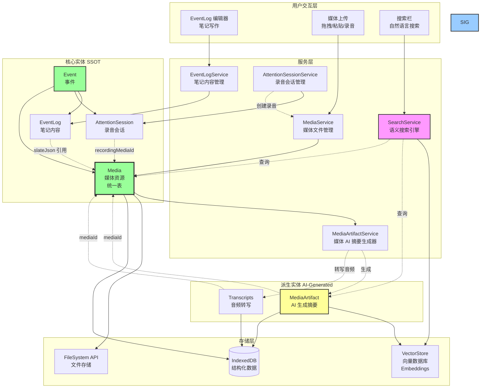

### 1.2 实体关系图

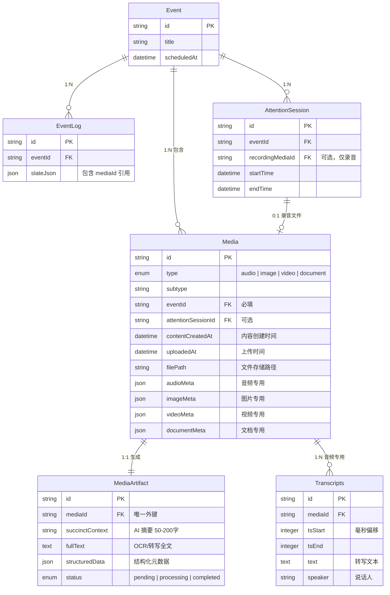

---

## 2. 核心概念

### 2.1 Media 统一资源表

**设计原则**：所有媒体类型（音频、图片、视频、文档）存储在**同一张表**中。

**为什么不分表？**

| 维度 | 统一表 (✅ 推荐) | 分散表 (❌ 不推荐) |
|------|---------------|-----------------|
| **查询效率** | 一次查询获取所有媒体 | 需要多次查询拼接 |
| **扩展性** | 新增类型只加枚举值 | 每种类型新建表 |
| **存储管理** | 统一配额管理 | 分散难以优化 |
| **代码复杂度** | 单一 Service | 多个 Service 协调 |

### 2.2 时间维度建模

Media 有**两个时间维度**：

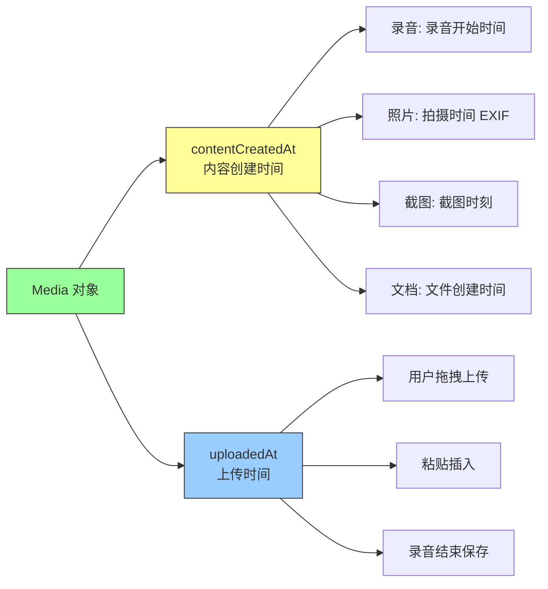

**用途区分**：

- `contentCreatedAt`：用于时间线展示、搜索过滤（"昨天的会议录音"）
- `uploadedAt`：用于同步逻辑、数据库索引（"最近上传的文件"）

### 2.3 MediaArtifact 的作用

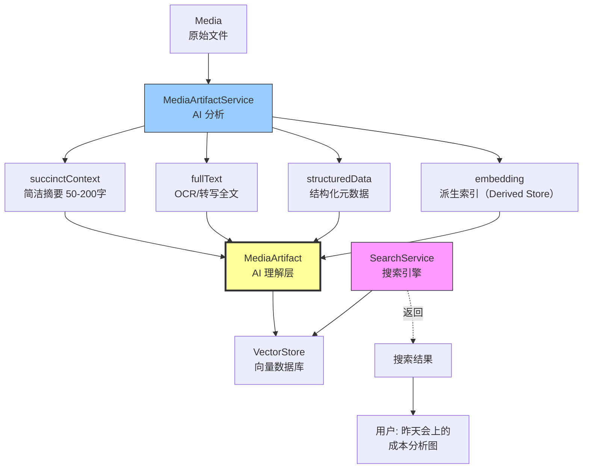

**为什么需要 MediaArtifact？**

- ❌ **如果没有**：无法搜索"图中的内容"、"录音讨论的话题"
- ✅ **有了之后**：可以通过自然语言搜索媒体内容

---

## 2.4 常见问题（FAQ）

### Q1: 为什么录音要通过 AttentionSession？

**核心原因：语义完整性**

录音不是"孤立的文件"，而是"一次工作会话的产物"：
- AttentionSession 记录：开始时间、结束时间、参会人员、说话人映射
- Media 只负责存储"文件本身"（音频数据、编码格式、时长）

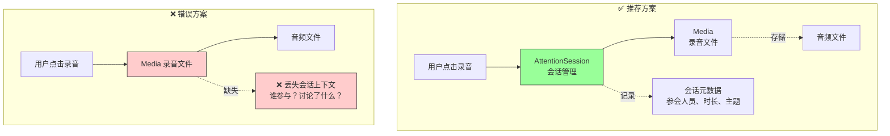

**现实类比**：
```
AttentionSession = 会议室预定记录
- 会议时间：10:00-11:00
- 参会人员：Alex, Sophia, Jordan
- 会议主题：代码签名流程优化

Media = 会议录音文件.mp3
- 只是文件，没有上下文
```

**数据查询场景**：
```typescript
// ✅ 有 AttentionSession
"查询上周 Alex 参与的所有会议"
→ 查 AttentionSession.meta.attendees
→ 找到关联的 Media 录音

// ❌ 只有 Media
"查询上周 Alex 参与的所有会议"
→ 无法查询（Media 不知道谁参会）
```

### Q2: Media 模块能不能自己做录音？

**答案：可以，但不应该！**

违反单一职责原则（Single Responsibility Principle）：

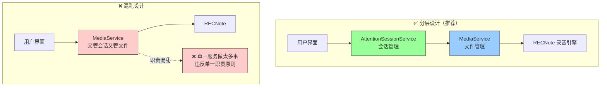

**职责划分**：

| 服务 | 职责 | 不负责 |
|------|------|--------|
| **AttentionSessionService** | 启动/停止会话<br/>记录时间范围<br/>管理参会人员<br/>说话人识别 | ❌ 不管文件存储<br/>❌ 不管录音编码 |
| **MediaService** | 文件上传/下载<br/>存储管理<br/>配额检查<br/>格式转换 | ❌ 不管会话元数据<br/>❌ 不管参会人员 |
| **RECNote 引擎** | 调用麦克风<br/>实时编码<br/>生成音频文件 | ❌ 不管业务逻辑 |

**代码示例对比**：
```typescript
// ❌ 错误做法：一个类做所有事
class MediaService {
  async startRecording() { /* 录音 */ }
  async uploadFile() { /* 上传 */ }
  async compressImage() { /* 压缩 */ }
  async extractPDF() { /* 提取 */ }
  async trackAttendees() { /* 管参会人员？？？ */ }
  // 💥 这个类有 1000 行代码，无法维护
}

// ✅ 正确做法：职责分离
class AttentionSessionService {
  async startSession() { /* 启动会话 */ }
  async trackAttendees() { /* 记录参会人员 */ }
}

class MediaService {
  async storeFile() { /* 存储文件 */ }
  async compressImage() { /* 压缩 */ }
}
```

### Q3: 媒体 AI 模块的职责是什么？

**MediaArtifactService 专注于"AI 理解"**：

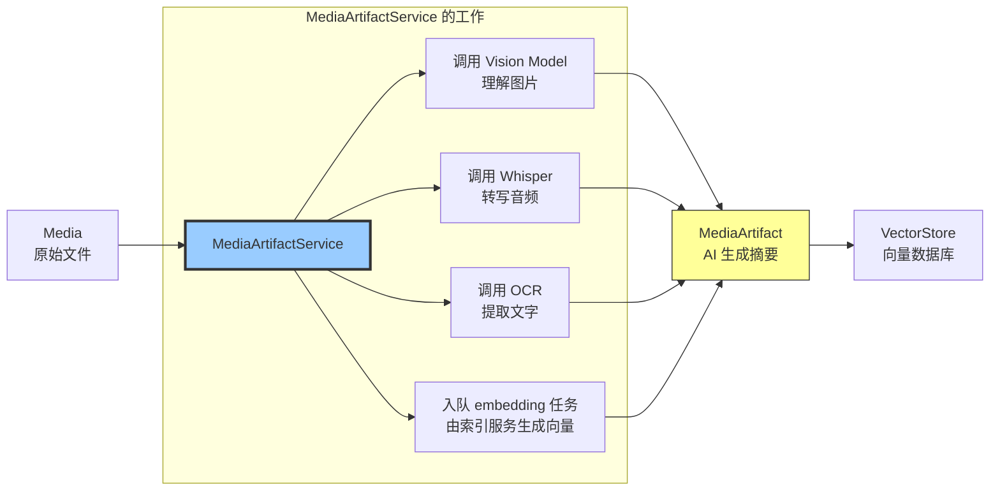

**MediaArtifactService 不负责**：
- ❌ 文件上传（MediaService 负责）
- ❌ 会话管理（AttentionSessionService 负责）
- ❌ 用户交互（UI 层负责）

**MediaArtifactService 只负责**：
- ✅ 生成 MediaArtifact.succinctContext（50-200字摘要）
- ✅ 生成 MediaArtifact.fullText（OCR/转写全文）
- ✅ 生成/更新 MediaArtifact 的可检索文本与结构化信息
- ✅ 入队 embedding 索引任务（embedding 存入派生表，可选上传到 VectorStore）

### Q4: MediaArtifact 存在哪里？

**答案：独立的 `media_artifacts` 表**

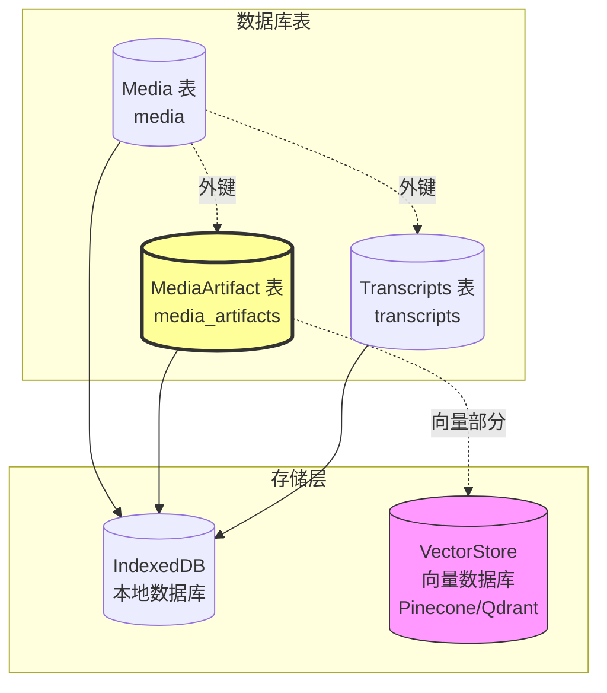

**为什么不存在 Media 表里？**

| 方案 | 优点 | 缺点 | 结论 |
|------|------|------|------|
| **A: 独立 MediaArtifact 表** | ✅ 符合 SSOT（派生数据独立）<br/>✅ Media 保持干净<br/>✅ 可以重新生成 Artifact | ⚠️ 需要 JOIN 查询 | ✅ 推荐 |
| **B: 存在 Media 表** | ⚠️ 查询方便 | ❌ 违反 SSOT<br/>❌ Media 表臃肿<br/>❌ 难以重新生成 | ❌ 不推荐 |
| **C: 存在 AttentionSession** | - | ❌ 只适用录音<br/>❌ 图片/文档怎么办？ | ❌ 不合理 |

**查询示例**：
```typescript
// 查询 Media + Artifact（需要 JOIN）
const media = await db.media.get(mediaId);
const artifact = await db.media_artifacts.where('mediaId').equals(mediaId).first();

// 搜索时直接查 Artifact
const results = await VectorStore.search(queryEmbedding);
// results[0].id = "mediaArtifact_abc123"

// 水合（Hydrate）完整对象
const artifact = await db.media_artifacts.get(results[0].id);
const media = await db.media.get(artifact.mediaId);
```

---

## 3. 数据模型

### 3.1 Media 表结构

```typescript
/**
 * Media（媒体资源）
 * 
 * Owner: MediaService
 * Storage: media 表（IndexedDB）
 * Sync: 元数据同步到云端，文件按策略同步（图片同步，大文件不同步）
 * 
 * 职责: 统一管理所有类型的媒体资源
 */
interface Media {
  // ===== 核心标识 =====
  id: string;                          // media_${nanoid(21)}
  
  // ===== 类型分类 =====
  /**
   * 一级分类
   * @enum audio | image | video | document
   */
  type: MediaType;
  
  /**
   * 二级分类
   * @example
   * - audio: 'recording' | 'voice_memo' | 'imported'
   * - image: 'screenshot' | 'photo' | 'drawing' | 'paste'
   * - video: 'screen_recording' | 'camera' | 'imported'
   * - document: 'pdf' | 'docx' | 'xlsx' | 'pptx' | 'zip'
   */
  subtype: string;
  
  // ===== 文件信息 =====
  filename: string;                    // 用户可见文件名
  mimeType: string;                    // MIME 类型（如 audio/opus）
  fileSize: number;                    // 字节数
  filePath: string;                    // 本地存储路径
  cloudUrl?: string;                   // 云端 URL（已上传时）
  uploadStatus: UploadStatus;          // 上传状态
  
  // ===== 关联关系 =====
  /**
   * 所属 Event ID（必填）
   * @constraint 外键约束，级联删除
   */
  eventId: string;
  
  /**
   * 关联的 AttentionSession ID（可选）
   * @constraint 仅 type='audio' 且 subtype='recording' 时有值
   * @nullable
   */
  attentionSessionId?: string;
  
  /**
   * 创建来源
   * @enum eventlog | attention_session | drag_drop | paste | import
   */
  source: MediaSource;
  
  // ===== 类型特定元数据 =====
  audioMeta?: AudioMetadata;
  imageMeta?: ImageMetadata;
  videoMeta?: VideoMetadata;
  documentMeta?: DocumentMetadata;
  
  // ===== 时间维度 =====
  /**
   * 内容创建时间（录音开始、照片拍摄、文档创建）
   * @usage 时间线展示、搜索过滤
   */
  contentCreatedAt: string;            // YYYY-MM-DD HH:mm:ss
  
  /**
   * 上传到 4DNote 的时间
   * @usage 同步逻辑、数据库索引
   */
  uploadedAt: string;                  // YYYY-MM-DD HH:mm:ss
  
  /**
   * 数据库记录创建时间
   */
  createdAt: string;
  
  /**
   * 最后修改时间（元数据变更）
   */
  updatedAt: string;
  
  /**
   * 软删除时间
   * @nullable
   */
  deletedAt?: string;
}

// ===== 类型定义 =====
type MediaType = 'audio' | 'image' | 'video' | 'document';

type UploadStatus = 'local_only' | 'uploading' | 'uploaded' | 'failed';

type MediaSource = 'eventlog' | 'attention_session' | 'drag_drop' | 'paste' | 'import';

interface AudioMetadata {
  duration: number;                    // 毫秒
  sampleRate: number;                  // 采样率（Hz）
  channels: number;                    // 声道数
  codec: string;                       // 编码格式（opus/mp3）
  transcriptionStatus?: 'pending' | 'processing' | 'completed' | 'failed';
}

interface ImageMetadata {
  width: number;                       // 像素
  height: number;
  format: string;                      // png/jpg/webp
  thumbnailPath?: string;              // 缩略图路径
  ocrText?: string;                    // OCR 提取的文字
}

interface VideoMetadata {
  duration: number;
  width: number;
  height: number;
  codec: string;
  thumbnailPath?: string;
}

interface DocumentMetadata {
  pageCount?: number;                  // 页数（PDF）
  author?: string;
  title?: string;
}
```

### 3.2 MediaArtifact 表结构

```typescript
/**
 * MediaArtifact（媒体 AI 摘要）
 * 
 * Owner: MediaArtifactService
 * Storage: media_artifacts 表（IndexedDB）
 * Sync: 同步到云端（用于多设备搜索）
 * 
 * 职责: 为 Media 生成 AI 可理解的摘要，用于搜索和检索
 */
interface MediaArtifact {
  // ===== 核心标识 =====
  id: string;                          // mediaArtifact_${nanoid(21)}
  mediaId: string;                     // 外键 → media.id（唯一）
  
  // ===== 关联关系（冗余字段，优化查询） =====
  eventId: string;
  attentionSessionId?: string;
  
  // ===== AI 生成内容 =====
  /**
   * 简洁上下文（50-200 字）
   * @usage AI 搜索、向量化、快速理解
   * @example
   * - 图片: "一张折线图，显示 2025 年 Q1-Q4 的成本分析，包含研发、市场、运营三条曲线"
   * - 音频: "会议录音，讨论代码签名流程优化，主要参与者 Alex 和 Sophia，时长 45 分钟"
   * - 视频: "屏幕录制，演示如何在 Xcode 中配置证书和 Provisioning Profile"
   * - 文档: "PDF 文件《产品需求文档 v2.3》，共 25 页，描述新功能的技术方案"
   */
  succinctContext: string;
  
  /**
   * 全文内容（用于全文搜索）
   * @example
   * - 图片: OCR 提取的文字
   * - 音频: 完整的转写文本
   * - 视频: OCR + 音频转写
   * - 文档: 提取的文本内容
   */
  fullText?: string;
  
  /**
   * 结构化元数据（JSON）
   * @description 根据媒体类型存储不同的结构化信息
   */
  structuredData?: StructuredData;
  
  // ===== 生成元数据 =====
  status: ArtifactStatus;
  generationMethod: string;            // ocr | vision_model | whisper | pdf_extractor
  generatedAt?: string;                // 生成完成时间
  
  // ===== 时间戳 =====
  createdAt: string;                   // 继承 Media.createdAt
  updatedAt: string;
}

/**
 * MediaArtifactEmbedding（派生向量索引，Derived Store）
 *
 * 说明：embedding 属于典型 Derived/Cache（可重建、可丢弃），不进入 media_artifacts 核心表，避免污染核心实体。
 * Owner: RAGIndexService（单一写入者；实现上可拆 MediaArtifactEmbeddingService 作为内部模块）
 * Storage: media_artifact_embeddings 表（IndexedDB/SQLite）
 */
interface MediaArtifactEmbedding {
  mediaArtifactId: string;             // 外键 → media_artifacts.id
  modelVersion: EmbeddingModelVersion; // 抽象版本（与 SSOT 一致）
  embedding: Float32Array;
  dimension: number;
  generatedAt: string;
  status: 'valid' | 'stale' | 'pending';
}

/**
 * Embedding 模型版本（抽象枚举，隐藏供应商细节；与 SSOT 保持一致）
 */
type EmbeddingModelVersion = 'v1' | 'v2' | 'v3' | 'legacy';

// ===== 类型定义 =====
type ArtifactStatus = 'pending' | 'processing' | 'completed' | 'failed';

interface StructuredData {
  imageAnalysis?: {
    objects: string[];                 // 识别的物体 ["chart", "people"]
    scene: string;                     // 场景 "meeting", "presentation"
    colors: string[];                  // 主要颜色 ["#FF5733"]
    text: string[];                    // OCR 文字片段
  };
  
  audioAnalysis?: {
    speakers: string[];                // 说话人 ["Alex", "Sophia"]
    topics: string[];                  // 主题 ["代码签名", "流程优化"]
    keyMoments: Array<{
      timestamp: number;
      description: string;
    }>;
    sentiment?: 'positive' | 'neutral' | 'negative';
  };
  
  videoAnalysis?: {
    keyFrames: Array<{
      timestamp: number;
      description: string;
      thumbnailPath: string;
    }>;
    actions: string[];                 // ["clicking", "typing"]
  };
  
  documentAnalysis?: {
    outline: Array<{
      level: number;
      title: string;
      page: number;
    }>;
    keyEntities: Array<{
      text: string;
      type: 'person' | 'location' | 'product' | 'date';
    }>;
  };
}
```

### 3.3 EventLog 中的引用格式

```typescript
/**
 * EventLog.slateJson 中的媒体块
 * @description 通过 mediaId 引用 Media 表，不存储媒体元数据
 */

// 音频块
interface AudioBlock {
  type: 'audio';
  mediaId: string;                     // 指向 Media.id
  children: [{ text: '' }];
  meta?: {
    offsetMs?: number;                 // 播放起始偏移量（毫秒）
    createdAtOffset?: number;          // 段落写作时的录音时间点
  };
}

// 图片块
interface ImageBlock {
  type: 'image';
  mediaId: string;
  children: [{ text: '' }];
  meta?: {
    width?: number;                    // 显示宽度（用户可调整）
    alignment?: 'left' | 'center' | 'right';
    caption?: string;                  // 图片说明
  };
}

// 视频块
interface VideoBlock {
  type: 'video';
  mediaId: string;
  children: [{ text: '' }];
  meta?: {
    width?: number;
    autoplay?: boolean;
    loop?: boolean;
  };
}

// 文档附件块
interface AttachmentBlock {
  type: 'attachment';
  mediaId: string;
  children: [{ text: string }];        // 显示文件名
  meta?: {
    displayName?: string;              // 可与 filename 不同
    icon?: string;                     // 图标类型
  };
}
```

### 3.4 AttentionSession 中的引用

```typescript
/**
 * AttentionSession 关联录音
 * @constraint recordingMediaId 必须指向 type='audio' 的 Media
 */
interface AttentionSession {
  id: string;
  eventId: string;
  source: 'focus_window' | 'background_dwell' | 'manual';
  startTime: string;
  endTime?: string;
  
  /**
   * 关联的录音文件
   * @foreign_key media.id
   * @constraint media.type = 'audio' AND media.subtype = 'recording'
   */
  recordingMediaId?: string;
  
  meta?: {
    attendees?: Array<{
      id?: string;
      name: string;
      aliases?: string[];
      role?: string;
    }>;
    speakerMap?: Record<string, {
      attendeeName?: string;
      confidence: number;
    }>;
  };
}
```

---

## 4. SSOT 约束规则

### 4.1 约束总览

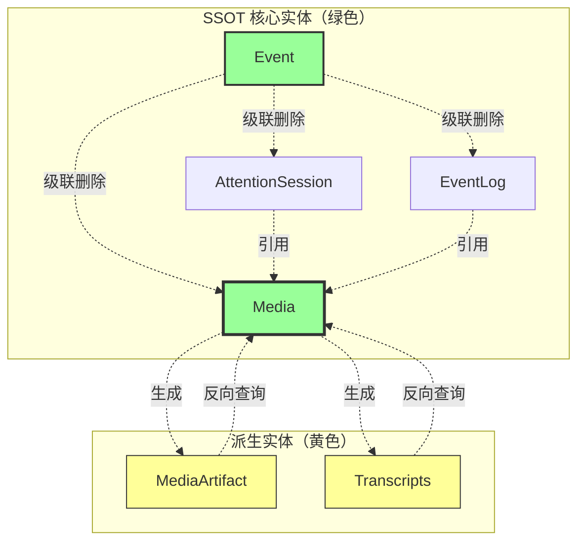

### 4.2 约束规则表

| 规则 ID | 约束类型 | 描述 | 违规示例 |
|---------|---------|------|---------|
| **C1** | 外键约束 | Media 必须关联 Event | ❌ `media.eventId = null` |
| **C2** | 级联删除 | 删除 Event → 删除所有关联 Media | ✅ `DELETE FROM events WHERE id='evt_123'` |
| **C3** | 引用完整性 | EventLog.slateJson 引用的 mediaId 必须存在 | ❌ `mediaId: 'media_xyz'` 但不存在 |
| **C4** | 类型约束 | AttentionSession.recordingMediaId 必须指向 audio 类型 | ❌ `recordingMediaId` 指向 image |
| **C5** | 唯一性约束 | 一个 Media 只能有一个 MediaArtifact | ❌ 同一个 `mediaId` 有多个 Artifact |
| **C6** | 派生数据 | Media 不存储 OCR/转写结果（存在 MediaArtifact） | ❌ `media.ocrText = "..."` |
| **C7** | 时间一致性 | `contentCreatedAt <= uploadedAt` | ❌ 上传时间早于创建时间 |
| **C8** | 软删除 | 删除 Media 时设置 `deletedAt`，保留 30 天 | ✅ `UPDATE media SET deletedAt=NOW()` |

### 4.3 数据流约束图

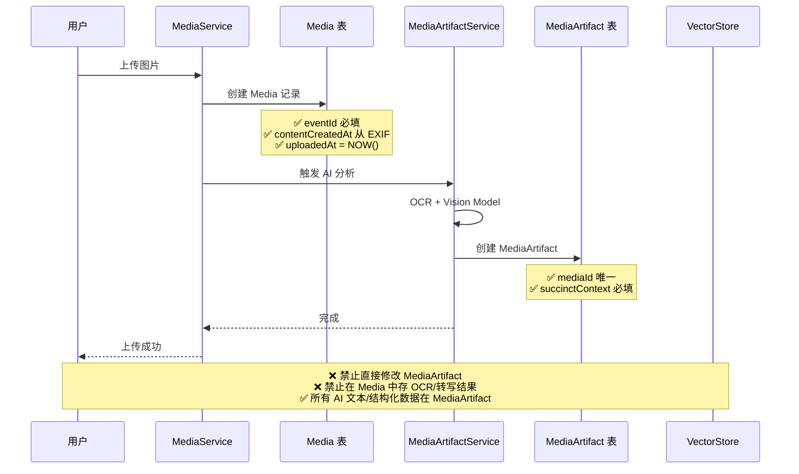

---

## 5. 服务层设计

### 5.1 服务职责划分

```mermaid
graph TB
    subgraph "MediaService 职责"
        MS1[文件上传/下载]
        MS2[文件存储管理]
        MS3[配额检查]
        MS4[文件压缩]
        MS5[缩略图生成]
        MS6[CRUD 操作]
    end
    
    subgraph "MediaArtifactService 职责"
      MAS1[生成 MediaArtifact]
      MAS2[调用 Vision Model]
      MAS3[调用 Whisper]
      MAS4[OCR 提取]
    end
    
    subgraph "SearchService 职责"
        SS1[自然语言搜索]
        SS2[时间表达式解析]
        SS3[类型检测]
        SS4[向量检索]
        SS5[重排序 Rerank]
        SS6[结果水合 Hydrate]
    end
    
    MS[MediaService] --> MS1 & MS2 & MS3 & MS4 & MS5 & MS6
    MAS[MediaArtifactService] --> MAS1 & MAS2 & MAS3 & MAS4
    SS[SearchService] --> SS1 & SS2 & SS3 & SS4 & SS5 & SS6
    
    style MS fill:#9cf,stroke:#333
    style MAS fill:#9cf,stroke:#333
    style SS fill:#f9f,stroke:#333
```

### 5.2 MediaService API

```typescript
/**
 * MediaService（媒体文件管理服务）
 * 
 * 职责: 处理媒体文件的上传、存储、检索、删除
 * 不负责: AI 分析（由 MediaArtifactService 负责）
 */
class MediaService {
  // ===== 创建 =====
  
  /**
   * 上传文件
   * @param eventId 所属 Event ID
   * @param file 文件对象
   * @param options 可选参数
   * @returns Media 对象
   */
  async uploadFile(
    eventId: string,
    file: File,
    options?: {
      source?: MediaSource;
      attentionSessionId?: string;
      contentCreatedAt?: Date;         // 可选，从 EXIF 提取
    }
  ): Promise<Media>;
  
  /**
   * 粘贴图片
   * @param eventId 所属 Event ID
   * @param blob 图片 Blob
   * @returns Media 对象
   */
  async pasteImage(eventId: string, blob: Blob): Promise<Media>;
  
  /**
   * 创建录音 Media（由 AttentionSessionService 调用）
   * @param eventId 所属 Event ID
   * @param sessionId 录音会话 ID
   * @returns Media 对象（状态为 pending）
   */
  async createRecordingMedia(
    eventId: string,
    sessionId: string
  ): Promise<Media>;
  
  /**
   * 完成录音（回填文件路径、时长）
   * @param mediaId Media ID
   * @param filePath 文件路径
   * @param duration 时长（毫秒）
   */
  async completeRecording(
    mediaId: string,
    filePath: string,
    duration: number
  ): Promise<void>;
  
  // ===== 读取 =====
  
  /**
   * 获取 Media 对象
   * @param mediaId Media ID
   * @returns Media 对象或 null
   */
  async getMedia(mediaId: string): Promise<Media | null>;
  
  /**
   * 获取 Event 的所有媒体
   * @param eventId Event ID
   * @param options 过滤选项
   * @returns Media 数组
   */
  async getEventMedia(
    eventId: string,
    options?: {
      type?: MediaType;                // 过滤类型
      sortBy?: 'contentCreatedAt' | 'uploadedAt';
      order?: 'asc' | 'desc';
    }
  ): Promise<Media[]>;
  
  /**
   * 加载文件 Blob
   * @param mediaId Media ID
   * @returns Blob URL（用于显示）
   */
  async loadMediaBlob(mediaId: string): Promise<string>;
  
  /**
   * 获取缩略图
   * @param mediaId Media ID
   * @returns 缩略图 URL 或 null
   */
  async getThumbnail(mediaId: string): Promise<string | null>;

  // ===== 更新 =====
  
  /**
   * 更新 Media 元数据
   * @param mediaId Media ID
   * @param updates 更新字段
   */
  async updateMedia(
    mediaId: string,
    updates: Partial<{
      filename: string;
      cloudUrl: string;
      uploadStatus: UploadStatus;
    }>
  ): Promise<void>;
  
  // ===== 删除 =====
  
  /**
   * 软删除 Media
   * @param mediaId Media ID
   * @description 设置 deletedAt，保留 30 天后物理删除
   */
  async deleteMedia(mediaId: string): Promise<void>;
  
  /**
   * 物理删除 Media（内部方法）
   * @param mediaId Media ID
   * @description 删除数据库记录 + 文件 + MediaArtifact + Transcripts
   */
  private async permanentlyDeleteMedia(mediaId: string): Promise<void>;
  
  // ===== 存储管理 =====
  
  /**
   * 检查存储配额
   * @returns 可用空间（字节）
   */
  async getAvailableStorage(): Promise<number>;
  
  /**
   * 压缩图片
   * @param blob 原始图片
   * @param maxWidth 最大宽度
   * @returns 压缩后的 Blob
   */
  async compressImage(blob: Blob, maxWidth?: number): Promise<Blob>;
  
  /**
   * 生成缩略图
   * @param blob 原始图片/视频
   * @param size 缩略图尺寸
   * @returns 缩略图路径
   */
  async generateThumbnail(blob: Blob, size: number): Promise<string>;
  
  /**
   * 清理旧文件
   * @param daysOld 超过多少天的文件
   * @description 删除 deletedAt 超过 30 天的文件
   */
  async cleanupOldMedia(daysOld: number): Promise<void>;
}
```

### 5.3 MediaArtifactService API

```typescript
/**
 * MediaArtifactService（媒体 AI 摘要生成器）
 * 
 * 注意：这里的 MediaArtifactService 仅负责“媒体→摘要/结构化数据”的生成，
 * 不等同于 Signal 领域里的 SignalService（signals 的 Owner）。
 * 
 * 职责: 为 Media 生成 AI 可理解的 Artifact
 * 触发时机: Media 创建后自动触发
 */
class MediaArtifactService {
  // ===== 核心方法 =====
  
  /**
   * 为 Media 生成 Artifact
   * @param mediaId Media ID
   * @returns MediaArtifact 对象
   * @description 
   * 1. 根据 Media 类型调用不同分析器
  * 2. 生成 succinctContext、fullText、structuredData
   * 3. 保存到 media_artifacts 表
  * 4. 入队 embedding 任务（由 RAGIndexService 写入派生表 + 可选向量库；实现上可拆内部模块）
   */
  async generateMediaArtifact(mediaId: string): Promise<MediaArtifact>;
  
  /**
   * 批量重新生成 Artifact
   * @param mediaIds Media ID 数组
   * @description 模型升级后批量重新生成
   */
  async regenerateArtifacts(mediaIds: string[]): Promise<void>;
  
  // ===== 分析器（内部方法） =====
  
  /**
   * 分析图片
   * @param media Media 对象
   * @returns Artifact 部分数据
   * @description
   * 1. OCR 提取文字
   * 2. GPT-4V 分析图片内容
   * 3. 提取主要颜色、识别物体
   */
  private async analyzeImage(media: Media): Promise<Partial<MediaArtifact>>;
  
  /**
   * 分析音频
   * @param media Media 对象
   * @returns Artifact 部分数据
   * @description
   * 1. Whisper 转写
   * 2. 保存 Transcripts
   * 3. 提取说话人、主题、关键时刻
   */
  private async analyzeAudio(media: Media): Promise<Partial<MediaArtifact>>;
  
  /**
   * 分析视频
   * @param media Media 对象
   * @returns Artifact 部分数据
   * @description
   * 1. 提取关键帧
   * 2. OCR 提取屏幕文字
   * 3. 分离音轨并转写
   */
  private async analyzeVideo(media: Media): Promise<Partial<MediaArtifact>>;
  
  /**
   * 分析文档
   * @param media Media 对象
   * @returns Artifact 部分数据
   * @description
   * 1. 提取文本（PDF/Word/Excel）
   * 2. 生成文档大纲
   * 3. 提取关键实体（人名、地名、产品名）
   */
  private async analyzeDocument(media: Media): Promise<Partial<MediaArtifact>>;
  
  // ===== 工具方法 =====

  // embedding 生成与向量库写入由 RAGIndexService 负责（Derived Store；实现上可拆内部模块）
  
  /**
   * OCR 提取文字
   * @param imageBlob 图片 Blob
   * @returns 提取的文字
   */
  private async extractOCRText(imageBlob: Blob): Promise<string>;
  
  /**
   * 识别说话人
   * @param transcription Whisper 转写结果
   * @returns 说话人列表
   */
  private async identifySpeakers(transcription: any): Promise<string[]>;
}
```

### 5.4 AttentionSessionService API

```typescript
/**
 * AttentionSessionService（会话管理服务）
 * 
 * 职责: 管理录音会话的生命周期
 * 协作: 调用 MediaService 创建录音文件
 */
class AttentionSessionService {
  /**
   * 启动录音会话
   * @param eventId 所属 Event ID
   * @returns Session ID 和 Media ID
   */
  async startRecordingSession(eventId: string): Promise<{
    sessionId: string;
    mediaId: string;
  }>;
  
  /**
   * 停止录音会话
   * @param sessionId Session ID
   * @description
   * 1. 停止 RECNote 录音
   * 2. 回填 Media 文件路径和时长
   * 3. 更新 AttentionSession.endTime
  * 4. 触发 MediaArtifactService 生成 Artifact
   */
  async stopRecordingSession(sessionId: string): Promise<void>;
  
  /**
   * 添加参会人员
   * @param sessionId Session ID
   * @param attendees 参会人员数组
   */
  async addAttendees(
    sessionId: string,
    attendees: Array<{ name: string; role?: string }>
  ): Promise<void>;
  
  /**
   * 获取当前录音偏移量
   * @param sessionId Session ID
   * @returns 当前偏移量（毫秒）
   */
  async getCurrentOffset(sessionId: string): Promise<number>;
}
```

---

## 6. MediaArtifactService 集成

> 说明：本章的服务指 MediaArtifactService（媒体 AI 摘要生成器），并非 Signal 领域的 SignalService。

### 6.1 触发时机

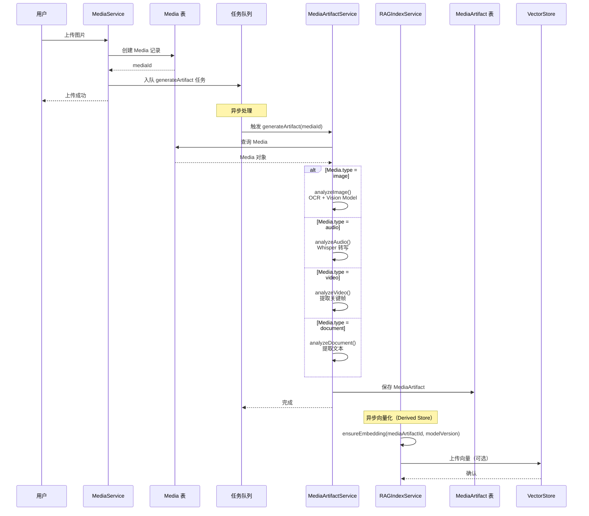

### 6.2 数据流

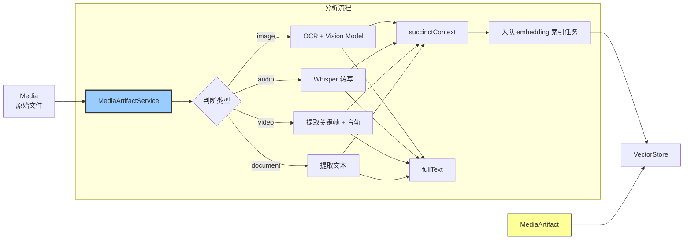

### 6.3 错误处理

```mermaid
stateDiagram-v2
    [*] --> Pending: Media 创建
  Pending --> Processing: MediaArtifactService 开始分析
    
    Processing --> Completed: 成功
    Processing --> Failed: 失败
    
    Failed --> Retry: 重试（最多 3 次）
    Retry --> Processing
    Retry --> Failed: 超过重试次数
    
    Failed --> Manual: 用户手动重试
    Manual --> Processing
    
    Completed --> [*]
    Failed --> [*]: 记录错误日志

  ### 6.4 实时录音 Chunk → 增量纪要（Session Brief）

  > 目标：支持“每 1 分钟一个 audio chunk，每 3-5 个 chunk 生成一段增量纪要”。
  >
  > 核心边界：
  > - **录音采集/分片**：RECNote 引擎
  > - **会话生命周期/时间窗**：AttentionSessionService
  > - **媒体理解（转写/摘要/结构化）**：MediaArtifactService
  > - **信号权重输入（只读）**：SignalService 提供 signals/weights（不参与媒体管线写入）
  > - **纪要产物**：SessionBriefService / ArtifactService（写入 artifacts）
  > - **embedding 派生索引**：RAGIndexService（可选）

  ```mermaid
  sequenceDiagram
    participant U as 用户
    participant ATS as AttentionSessionService
    participant REC as RECNoteEngine
    participant MS as MediaService
    participant MAS as MediaArtifactService
    participant SIG as SignalService（只读）
    participant SBS as SessionBriefService/ArtifactService
    participant RAG as RAGIndexService

    U->>ATS: startRecordingSession(eventId)
    ATS->>REC: start(sessionId)

    loop 每 60s
      REC-->>ATS: onChunk(chunkStartMs, chunkEndMs, filePath)
      ATS->>MS: upsertAudioChunk(mediaId, chunkMeta)
    end

    Note over MAS: 异步/节流：增量转写（可选）
    MAS->>MS: readNewChunks(mediaId)
    MAS->>MAS: transcribe(chunks) → transcripts

    Note over SBS: 每累计 3-5 个 chunk 或每 N 分钟生成一次增量纪要
    SBS->>SIG: getSignalsInTimeRange(sessionWindow)
    SIG-->>SBS: signals + weights（基于 status/type/behaviorMeta）
    SBS->>MAS: getMediaArtifactInputs(mediaId)
    MAS-->>SBS: transcripts + structured hints
    SBS->>SBS: generateIncrementalBrief()
    SBS-->>SBS: upsert Artifact(scope='session', targetId=attentionSessionId)

    opt 需要向量检索
      SBS->>RAG: ensureEmbedding(artifactId)
    end

    U->>ATS: stopRecordingSession(sessionId)
    ATS->>REC: stop()
    ATS->>MAS: generateMediaArtifact(mediaId)
    ATS->>SBS: finalizeSessionBrief(attentionSessionId)
  ```
```

---

## 7. SearchService 集成

### 7.1 搜索流程

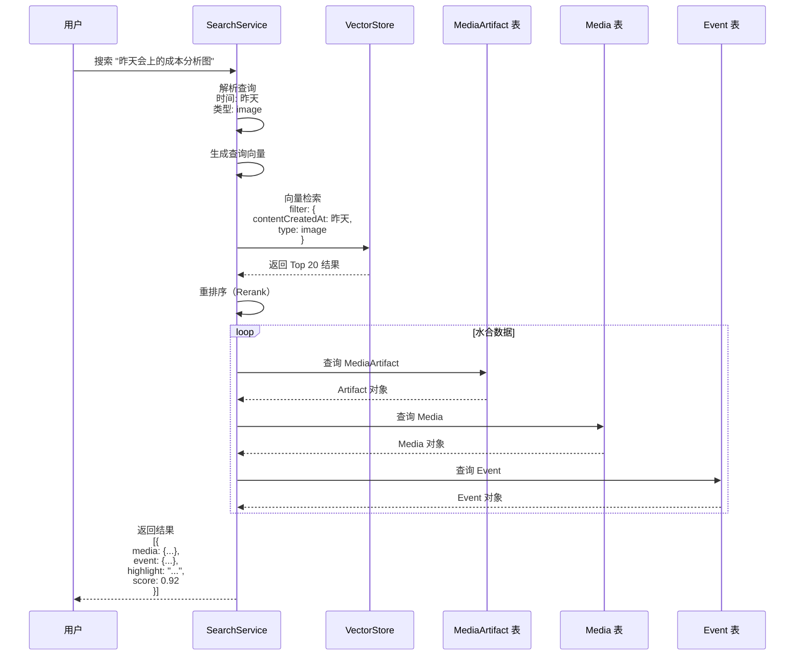

### 7.2 时间表达式解析

```mermaid
graph TB
    Q[查询: "昨天会上的成本分析图"] --> P1[时间解析器]
    
    P1 --> T1[识别: "昨天"]
    T1 --> T2[计算时间范围<br/>start: 2026-01-07 00:00<br/>end: 2026-01-07 23:59]
    
    Q --> P2[类型检测器]
    P2 --> TY1[识别: "图"]
    TY1 --> TY2[映射: type=image]
    
    Q --> P3[语义分析器]
    P3 --> S1[识别: "成本分析"]
    S1 --> S2[生成查询向量]
    
    T2 & TY2 & S2 --> F[VectorStore Filter]
    
    style P1 fill:#9cf,stroke:#333
    style P2 fill:#9cf,stroke:#333
    style P3 fill:#9cf,stroke:#333
```

### 7.3 SearchService API

```typescript
/**
 * SearchService（语义搜索服务）
 * 
 * 职责: 跨 Media、Event、SessionBrief 的自然语言搜索
 */
class SearchService {
  /**
   * 自然语言搜索
   * @param query 搜索查询
   * @param options 可选参数
   * @returns 搜索结果数组
   * @example
   * search("昨天会上的成本分析图")
   * search("上周 Alex 参与的会议录音")
   */
  async search(
    query: string,
    options?: {
      limit?: number;                  // 返回结果数量（默认 10）
      mediaTypes?: MediaType[];        // 限制媒体类型
      eventIds?: string[];             // 限制 Event 范围
    }
  ): Promise<SearchResult[]>;
  
  /**
   * 搜索特定 Event 的媒体
   * @param eventId Event ID
   * @param query 搜索查询
   */
  async searchInEvent(
    eventId: string,
    query: string
  ): Promise<SearchResult[]>;
  
  // ===== 内部方法 =====
  
  /**
   * 解析时间表达式
   * @param query 查询字符串
   * @returns 时间范围或 null
   * @example
   * "昨天" → { start: "2026-01-07", end: "2026-01-08" }
   * "上周" → { start: "2026-01-01", end: "2026-01-07" }
   */
  private parseTimeExpression(query: string): TimeRange | null;
  
  /**
   * 检测媒体类型
   * @param query 查询字符串
   * @returns 媒体类型或 null
   * @example
   * "图" → "image"
   * "录音" → "audio"
   */
  private detectMediaType(query: string): MediaType | null;
  
  /**
   * 重排序（Rerank）
   * @param query 查询字符串
   * @param results 初始结果
   * @returns 重排序后的结果
   */
  private async rerank(
    query: string,
    results: VectorResult[]
  ): Promise<RankedResult[]>;
  
  /**
   * 水合数据（从 ID 查询完整对象）
   * @param results 排序后的结果
   * @returns 完整的搜索结果
   */
  private async hydrateResults(
    results: RankedResult[]
  ): Promise<SearchResult[]>;
}

// ===== 类型定义 =====
interface SearchResult {
  type: 'media';
  media: Media;
  artifact: MediaArtifact;
  event: Event;
  score: number;                       // 相关性分数（0-1）
  highlight: string;                   // 高亮匹配片段
}

interface TimeRange {
  start: string;                       // YYYY-MM-DD
  end: string;
}
```

---

## 8. API 规范

### 8.1 RESTful API（如果需要服务端）

```typescript
// ===== Media APIs =====

/**
 * 上传文件
 * POST /api/media/upload
 */
interface UploadMediaRequest {
  eventId: string;
  file: File;
  source?: MediaSource;
  contentCreatedAt?: string;
}

interface UploadMediaResponse {
  media: Media;
  uploadUrl?: string;                  // 云端上传 URL（预签名）
}

/**
 * 获取 Media
 * GET /api/media/:mediaId
 */
interface GetMediaResponse {
  media: Media;
  artifact?: MediaArtifact;            // 如果已生成
  downloadUrl?: string;                // 文件下载 URL
}

/**
 * 获取 Event 的所有媒体
 * GET /api/events/:eventId/media
 */
interface GetEventMediaRequest {
  type?: MediaType;
  sortBy?: 'contentCreatedAt' | 'uploadedAt';
  order?: 'asc' | 'desc';
}

interface GetEventMediaResponse {
  media: Media[];
  total: number;
}

/**
 * 删除 Media
 * DELETE /api/media/:mediaId
 */
interface DeleteMediaResponse {
  success: boolean;
  deletedAt: string;
}

// ===== Artifact APIs =====

/**
 * 上传文件
 * POST /api/media/upload
 */
interface UploadMediaRequest {
  eventId: string;
  file: File;
  source?: MediaSource;
  contentCreatedAt?: string;
}

interface UploadMediaResponse {
  media: Media;
  uploadUrl?: string;                  // 云端上传 URL（预签名）
}

/**
 * 获取 Media
 * GET /api/media/:mediaId
 */
interface GetMediaResponse {
  media: Media;
  artifact?: MediaArtifact;            // 如果已生成
  downloadUrl?: string;                // 文件下载 URL
}

/**
 * 获取 Event 的所有媒体
 * GET /api/events/:eventId/media
 */
interface GetEventMediaRequest {
  type?: MediaType;
  sortBy?: 'contentCreatedAt' | 'uploadedAt';
  order?: 'asc' | 'desc';
}

interface GetEventMediaResponse {
  media: Media[];
  total: number;
}

/**
 * 删除 Media
 * DELETE /api/media/:mediaId
 */
interface DeleteMediaResponse {
  success: boolean;
  deletedAt: string;
}

// ===== Artifact APIs =====

/**
 * 触发 Artifact 生成（手动）
 * POST /api/media/:mediaId/generate-artifact
 */
interface GenerateArtifactResponse {
  artifactId: string;
  status: 'pending' | 'processing';
}

/**
 * 获取 Artifact 状态
 * GET /api/artifacts/:artifactId
 */
interface GetArtifactResponse {
  artifact: MediaArtifact;
  progress?: number;                   // 0-100（如果正在生成）
}

/**
 * 批量重新生成 Artifact
 * POST /api/artifacts/regenerate
 */
interface RegenerateArtifactsRequest {
  mediaIds: string[];
  reason?: string;                     // "model_upgrade" | "manual"
}

interface RegenerateArtifactsResponse {
  jobId: string;
  total: number;
}

// ===== Search APIs =====

/**
 * 搜索媒体
 * POST /api/search
 */
interface SearchRequest {
  query: string;
  limit?: number;
  mediaTypes?: MediaType[];
  eventIds?: string[];
  dateRange?: {
    start: string;
    end: string;
  };
}

interface SearchResponse {
  results: SearchResult[];
  total: number;
  took: number;                        // 搜索耗时（毫秒）
}

/**
 * 搜索建议（自动完成）
 * GET /api/search/suggestions?q=成本
 */
interface SearchSuggestionsResponse {
  suggestions: Array<{
    text: string;
    type: 'media' | 'event' | 'keyword';
    highlight: string;
  }>;
}
```

### 8.2 本地 Service API（前端调用）

```typescript
// ===== MediaService 使用示例 =====

// 1. 上传图片
const media = await MediaService.uploadFile(eventId, file, {
  source: 'drag_drop',
  contentCreatedAt: new Date(file.lastModified),
});

// 2. 粘贴图片
const media = await MediaService.pasteImage(eventId, blob);

// 3. 获取 Event 的所有图片
const images = await MediaService.getEventMedia(eventId, {
  type: 'image',
  sortBy: 'contentCreatedAt',
  order: 'desc',
});

// 4. 加载图片文件
const blobUrl = await MediaService.loadMediaBlob(mediaId);
// 在 UI 中显示：

// 5. 删除媒体
await MediaService.deleteMedia(mediaId);

// ===== MediaArtifactService 使用示例 =====

// 1. 生成 Media Artifact（手动触发）
const artifact = await MediaArtifactService.generateMediaArtifact(mediaId);

// 2. 批量重新生成（模型升级后）
const mediaIds = await db.media.where('type').equals('image').keys();
await MediaArtifactService.regenerateArtifacts(mediaIds);

// ===== SearchService 使用示例 =====

// 1. 自然语言搜索
const results = await SearchService.search("昨天会上的成本分析图", {
  limit: 10,
  mediaTypes: ['image'],
});

// 2. 在特定 Event 中搜索
const eventResults = await SearchService.searchInEvent(
  eventId,
  "代码签名流程"
);

// 3. 搜索建议（自动完成）
const suggestions = await SearchService.getSuggestions("成本");
// 返回：[{ text: "成本分析", type: "keyword" }, ...]

// 5. 删除 Media
await MediaService.deleteMedia(mediaId);

// ===== MediaArtifactService 使用示例 =====

// 1. 手动触发 Artifact 生成
const artifact = await MediaArtifactService.generateMediaArtifact(mediaId);

// 2. 批量重新生成（模型升级后）
await MediaArtifactService.regenerateArtifacts([
  'media_abc123',
  'media_xyz789',
]);

// ===== AttentionSessionService 使用示例 =====

// 1. 启动录音
const { sessionId, mediaId } = await AttentionSessionService.startRecordingSession(eventId);

// 2. 获取当前录音偏移量（用于 audioAnchor）
const offsetMs = await AttentionSessionService.getCurrentOffset(sessionId);

// 3. 停止录音
await AttentionSessionService.stopRecordingSession(sessionId);

// ===== SearchService 使用示例 =====

// 1. 自然语言搜索
const results = await SearchService.search("昨天会上的成本分析图");

// 2. 限制媒体类型
const audioResults = await SearchService.search("上周的会议", {
  mediaTypes: ['audio'],
});

// 3. 在特定 Event 中搜索
const inEventResults = await SearchService.searchInEvent(
  eventId,
  "代码签名"
);
```

---

## 9. 实施清单

### 9.1 Phase 1: 核心基础设施（Week 1-2）

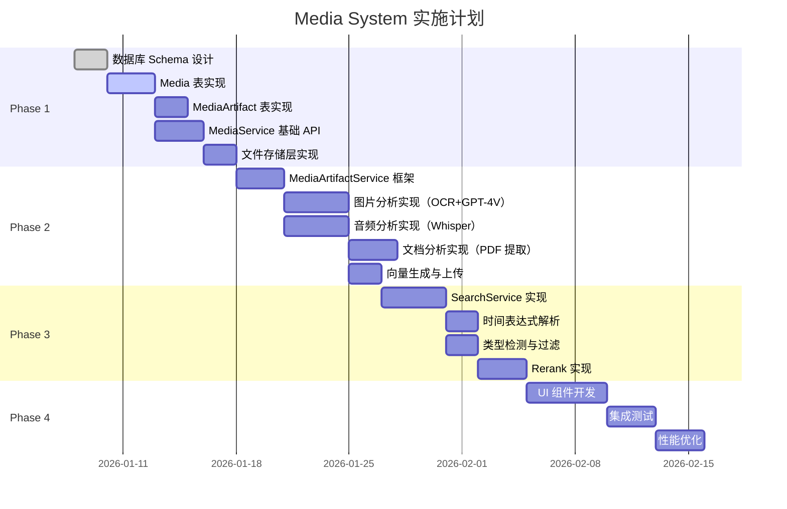

### 9.2 开发任务清单

#### ✅ Phase 1: 数据层（2 周）

- [ ] **任务 1.1**: 创建 `media` 表 Schema
  ```sql
  CREATE TABLE media (
    id TEXT PRIMARY KEY,
    type TEXT NOT NULL,
    subtype TEXT NOT NULL,
    eventId TEXT NOT NULL,
    contentCreatedAt TEXT NOT NULL,
    uploadedAt TEXT NOT NULL,
    -- ... 其他字段
    FOREIGN KEY (eventId) REFERENCES events(id) ON DELETE CASCADE
  );
  ```

- [ ] **任务 1.2**: 创建 `media_artifacts` 表 Schema
  ```sql
  CREATE TABLE media_artifacts (
    id TEXT PRIMARY KEY,
    mediaId TEXT NOT NULL UNIQUE,
    succinctContext TEXT NOT NULL,
    fullText TEXT,
    -- ... 其他字段
    FOREIGN KEY (mediaId) REFERENCES media(id) ON DELETE CASCADE
  );
  ```

- [ ] **任务 1.2.1**: 创建 `media_artifact_embeddings` 表 Schema（Derived Store，可重建）
  ```sql
  CREATE TABLE media_artifact_embeddings (
    media_artifact_id TEXT NOT NULL,
    model_version TEXT NOT NULL,
    embedding_vector BLOB NOT NULL,
    dimension INTEGER NOT NULL,
    generated_at TEXT NOT NULL,
    status TEXT NOT NULL,
    PRIMARY KEY (media_artifact_id, model_version),
    FOREIGN KEY (media_artifact_id) REFERENCES media_artifacts(id) ON DELETE CASCADE
  );
  ```

- [ ] **任务 1.3**: 创建 `transcripts` 表 Schema
  ```sql
  CREATE TABLE transcripts (
    id TEXT PRIMARY KEY,
    mediaId TEXT NOT NULL,
    tsStart INTEGER NOT NULL,
    tsEnd INTEGER NOT NULL,
    text TEXT NOT NULL,
    speaker TEXT,
    FOREIGN KEY (mediaId) REFERENCES media(id) ON DELETE CASCADE
  );
  ```

- [ ] **任务 1.4**: 实现 `MediaService.uploadFile()`
- [ ] **任务 1.5**: 实现 `MediaService.pasteImage()`
- [ ] **任务 1.6**: 实现 `MediaService.loadMediaBlob()`
- [ ] **任务 1.7**: 实现文件存储层（IndexedDB BlobStore 或 FileSystem API）

#### ✅ Phase 2: MediaArtifactService（3 周）

- [ ] **任务 2.1**: 实现 `MediaArtifactService.generateMediaArtifact()`
- [ ] **任务 2.2**: 实现图片分析器
  - [ ] OCR 集成（Tesseract.js 或云端 API）
  - [ ] GPT-4V 集成
  - [ ] 提取主要颜色
  - [ ] 物体识别

- [ ] **任务 2.3**: 实现音频分析器
  - [ ] Whisper 集成
  - [ ] 保存 Transcripts
  - [ ] 说话人识别
  - [ ] 主题提取

- [ ] **任务 2.4**: 实现文档分析器
  - [ ] PDF 文本提取（pdf.js）
  - [ ] Word/Excel 提取
  - [ ] 文档大纲生成

- [ ] **任务 2.5**: 实现向量索引（Derived Store）
  - [ ] RAGIndexService 生成 embedding（抽象 modelVersion；可拆内部模块）
  - [ ] 可选上传到 VectorStore（Pinecone/Qdrant）

#### ✅ Phase 3: SearchService（2 周）

- [ ] **任务 3.1**: 实现 `SearchService.search()`
- [ ] **任务 3.2**: 实现时间表达式解析
  ```typescript
  parseTimeExpression("昨天") // → { start: "2026-01-07", end: "2026-01-08" }
  parseTimeExpression("上周") // → { start: "2026-01-01", end: "2026-01-07" }
  parseTimeExpression("本月") // → { start: "2026-01-01", end: "2026-01-31" }
  ```

- [ ] **任务 3.3**: 实现类型检测
  ```typescript
  detectMediaType("图") // → "image"
  detectMediaType("录音") // → "audio"
  detectMediaType("PDF") // → "document"
  ```

- [ ] **任务 3.4**: 实现 Rerank（使用 Cohere Rerank API 或 BM25）
- [ ] **任务 3.5**: 实现结果水合（Hydrate）

#### ✅ Phase 4: UI 组件（2 周）

- [ ] **任务 4.1**: 实现媒体上传组件
  - [ ] 拖拽上传
  - [ ] 粘贴上传
  - [ ] 进度条显示

- [ ] **任务 4.2**: 实现媒体块渲染
  - [ ] 图片块（支持缩放、对齐）
  - [ ] 音频块（播放器 + audioAnchor）
  - [ ] 视频块（播放器）
  - [ ] 附件块（下载按钮）

- [ ] **任务 4.3**: 实现搜索 UI
  - [ ] 搜索框（自动完成）
  - [ ] 结果列表（高亮显示）
  - [ ] 过滤器（类型、时间范围）

- [ ] **任务 4.4**: 实现 Artifact 生成进度显示
  ```tsx
  <MediaCard>
    
    {artifact?.status === 'processing' && (
      <ProgressBar text="AI 分析中..." progress={60} />
    )}
  </MediaCard>
  ```

---

## 10. 测试策略

### 10.1 单元测试

```typescript
describe('MediaService', () => {
  it('should upload file and create Media record', async () => {
    const file = new File(['test'], 'test.png', { type: 'image/png' });
    const media = await MediaService.uploadFile('evt_123', file);
    
    expect(media.id).toMatch(/^media_/);
    expect(media.type).toBe('image');
    expect(media.eventId).toBe('evt_123');
    expect(media.uploadedAt).toBeDefined();
  });
  
  it('should extract EXIF date from photo', async () => {
    const photoBlob = await loadTestPhoto();
    const media = await MediaService.pasteImage('evt_123', photoBlob);
    
    // EXIF 日期应该是 2025-12-15
    expect(media.contentCreatedAt).toMatch(/^2025-12-15/);
  });
  
  it('should enforce eventId constraint', async () => {
    const file = new File(['test'], 'test.png', { type: 'image/png' });
    
    await expect(
      MediaService.uploadFile(null as any, file)
    ).rejects.toThrow('eventId is required');
  });
});

describe('MediaArtifactService', () => {
  it('should generate artifact for image', async () => {
    const media = await createTestMedia('image');
    const artifact = await MediaArtifactService.generateMediaArtifact(media.id);
    
    expect(artifact.succinctContext).toBeDefined();
    // embedding 不进入 MediaArtifact 核心表；由派生表/索引服务负责
    expect(artifact.status).toBe('completed');
  });
  
  it('should extract OCR text from image', async () => {
    const media = await createTestMedia('image', { hasText: true });
    const artifact = await MediaArtifactService.generateMediaArtifact(media.id);
    
    expect(artifact.fullText).toContain('Expected Text');
  });
  
  it('should handle Whisper transcription', async () => {
    const media = await createTestMedia('audio');
    const artifact = await MediaArtifactService.generateMediaArtifact(media.id);
    
    expect(artifact.fullText).toBeDefined();
    expect(artifact.structuredData?.audioAnalysis?.speakers).toBeDefined();
  });
});

describe('SearchService', () => {
  it('should parse time expressions', () => {
    const range = SearchService['parseTimeExpression']('昨天');
    
    expect(range.start).toMatch(/^\d{4}-\d{2}-\d{2}$/);
    expect(range.end).toMatch(/^\d{4}-\d{2}-\d{2}$/);
  });
  
  it('should detect media types', () => {
    expect(SearchService['detectMediaType']('图')).toBe('image');
    expect(SearchService['detectMediaType']('录音')).toBe('audio');
    expect(SearchService['detectMediaType']('PDF')).toBe('document');
  });
  
  it('should search with time range', async () => {
    await seedTestMedia();
    const results = await SearchService.search('昨天的图片');
    
    expect(results.length).toBeGreaterThan(0);
    expect(results[0].media.type).toBe('image');
  });
});
```

### 10.2 集成测试

```typescript
describe('Media System Integration', () => {
  it('should complete full workflow: upload → analyze → search', async () => {
    // 1. 上传图片
    const file = await loadTestImage('cost-analysis-chart.png');
    const media = await MediaService.uploadFile('evt_123', file, {
      source: 'drag_drop',
    });
    
    // 2. 等待 Artifact 生成
    await waitFor(() => {
      const artifact = await db.media_artifacts
        .where('mediaId')
        .equals(media.id)
        .first();
      return artifact?.status === 'completed';
    }, { timeout: 30000 });
    
    // 3. 搜索
    const results = await SearchService.search('成本分析图');
    
    expect(results.length).toBeGreaterThan(0);
    expect(results[0].media.id).toBe(media.id);
    expect(results[0].score).toBeGreaterThan(0.8);
  });
  
  it('should handle recording session', async () => {
    // 1. 启动录音
    const { sessionId, mediaId } = await AttentionSessionService.startRecordingSession('evt_123');
    
    // 2. 等待 3 秒
    await sleep(3000);
    
    // 3. 获取当前偏移量
    const offset = await AttentionSessionService.getCurrentOffset(sessionId);
    expect(offset).toBeGreaterThan(2000);
    
    // 4. 停止录音
    await AttentionSessionService.stopRecordingSession(sessionId);
    
    // 5. 验证 Media 记录
    const media = await db.media.get(mediaId);
    expect(media.audioMeta?.duration).toBeGreaterThan(3000);
    
    // 6. 验证 Artifact 生成
    const artifact = await db.media_artifacts
      .where('mediaId')
      .equals(mediaId)
      .first();
    expect(artifact?.fullText).toBeDefined();
  });
});
```

### 10.3 性能测试

```typescript
describe('Performance Tests', () => {
  it('should load 100 media items in under 500ms', async () => {
    await seedTestMedia(100);
    
    const start = performance.now();
    const media = await MediaService.getEventMedia('evt_123');
    const duration = performance.now() - start;
    
    expect(duration).toBeLessThan(500);
    expect(media.length).toBe(100);
  });
  
  it('should search 10,000 media items in under 2s', async () => {
    await seedTestMedia(10000);
    
    const start = performance.now();
    const results = await SearchService.search('测试查询');
    const duration = performance.now() - start;
    
    expect(duration).toBeLessThan(2000);
  });
  
  it('should generate thumbnail in under 1s', async () => {
    const largeImage = await loadTestImage('large-4k.png'); // 10MB
    
    const start = performance.now();
    const thumbnailPath = await MediaService.generateThumbnail(largeImage, 400);
    const duration = performance.now() - start;
    
    expect(duration).toBeLessThan(1000);
    expect(thumbnailPath).toBeDefined();
  });
});
```

---

## 11. 监控与日志

### 11.1 关键指标

```typescript
/**
 * 监控指标
 */
interface MediaMetrics {
  // 存储指标
  totalMediaCount: number;
  totalFileSize: number;                // 字节
  storageQuotaUsed: number;             // 百分比
  
  // 性能指标
  avgUploadTime: number;                // 毫秒
  avgArtifactGenerationTime: number;    // 毫秒
  avgSearchTime: number;                // 毫秒
  
  // 质量指标
  artifactSuccessRate: number;          // 百分比
  searchRelevanceScore: number;         // 0-1
  
  // 业务指标
  dailyUploads: number;
  dailySearches: number;
  topSearchedMediaTypes: Record<MediaType, number>;
}
```

### 11.2 日志记录

```typescript
/**
 * 日志示例
 */

// 上传日志
logger.info('media.upload', {
  mediaId: 'media_abc123',
  eventId: 'evt_123',
  type: 'image',
  fileSize: 2048576,
  duration: 1234, // 毫秒
});

// Artifact 生成日志
logger.info('artifact.generated', {
  mediaId: 'media_abc123',
  artifactId: 'mediaArtifact_xyz789',
  method: 'vision_model',
  duration: 5678,
  succinctContextLength: 156,
});

// 搜索日志
logger.info('search.query', {
  query: '昨天的成本分析图',
  resultsCount: 5,
  took: 234,
  topScore: 0.92,
});

// 错误日志
logger.error('artifact.generation.failed', {
  mediaId: 'media_abc123',
  error: 'API rate limit exceeded',
  retryCount: 2,
});
```

---

## 12. 常见问题（FAQ）

### Q1: Media 删除后，EventLog 中的引用怎么办？

**A: 渲染时显示占位符**

```typescript
// EventLog 渲染逻辑
function renderMediaBlock(block: MediaBlock) {
  const media = await MediaService.getMedia(block.mediaId);
  
  if (!media || media.deletedAt) {
    return <DeletedMediaPlaceholder type={block.type} />;
  }
  
  return <MediaRenderer media={media} />;
}
```

### Q2: 如何避免重复上传同一文件？

**A: 计算文件哈希值去重**

```typescript
async function uploadFile(eventId: string, file: File) {
  // 1. 计算文件 SHA-256 哈希
  const hash = await calculateFileHash(file);
  
  // 2. 查询是否已存在
  const existing = await db.media
    .where('[eventId+fileHash]')
    .equals([eventId, hash])
    .first();
  
  if (existing) {
    console.log('File already exists, reusing:', existing.id);
    return existing;
  }
  
  // 3. 不存在则上传
  return await this.doUpload(eventId, file, hash);
}
```

### Q3: VectorStore 用本地还是云端？

**A: 混合方案**

| 方案 | 优点 | 缺点 | 适用场景 |
|------|------|------|---------|
| **本地 FAISS** | ✅ 隐私保护<br/>✅ 离线可用<br/>✅ 无成本 | ⚠️ 向量加载慢<br/>⚠️ 不支持多设备 | 单机使用 |
| **云端 Pinecone** | ✅ 多设备同步<br/>✅ 高性能<br/>✅ 易扩展 | ⚠️ 有成本<br/>⚠️ 依赖网络 | 多设备同步 |
| **混合方案** | ✅ 本地优先<br/>✅ 云端备份 | ⚠️ 实现复杂 | **推荐** |

```typescript
class VectorStore {
  async search(query: string) {
    // 1. 优先查本地
    const localResults = await this.localFAISS.search(query);
    
    // 2. 如果结果不足，查云端
    if (localResults.length < 5 && navigator.onLine) {
      const cloudResults = await this.pinecone.search(query);
      return [...localResults, ...cloudResults];
    }
    
    return localResults;
  }
}
```

### Q4: 如何处理大文件（如 4K 视频）？

**A: 分块上传 + 云端存储**

```typescript
async function uploadLargeFile(file: File) {
  // 1. 判断文件大小
  if (file.size < 100 * 1024 * 1024) { // < 100MB
    return await this.normalUpload(file);
  }
  
  // 2. 分块上传
  const chunkSize = 5 * 1024 * 1024; // 5MB
  const chunks = Math.ceil(file.size / chunkSize);
  
  for (let i = 0; i < chunks; i++) {
    const start = i * chunkSize;
    const end = Math.min(start + chunkSize, file.size);
    const chunk = file.slice(start, end);
    
    await this.uploadChunk(chunk, i);
    
    // 更新进度
    this.onProgress((i + 1) / chunks * 100);
  }
  
  // 3. 本地只存缩略图
  const thumbnail = await this.generateVideoThumbnail(file);
  return await this.saveThumbnail(thumbnail);
}
```

---

## 13. 迁移指南

### 13.1 从旧架构迁移

如果你现有系统中媒体分散存储，按以下步骤迁移：

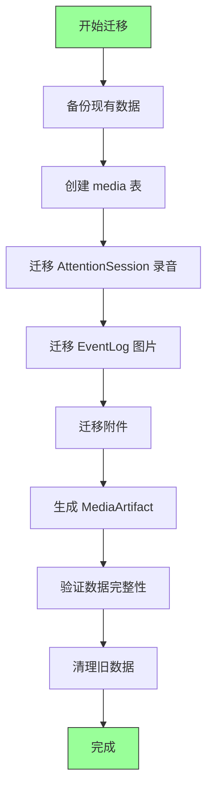

**迁移脚本**：

```typescript
async function migrateToMediaSystem() {
  console.log('开始迁移到 Media 系统...');
  
  // 1. 创建表
  await db.exec(`
    CREATE TABLE IF NOT EXISTS media (...);
    CREATE TABLE IF NOT EXISTS media_artifacts (...);
  `);
  
  // 2. 迁移录音
  const sessions = await db.attention_sessions.toArray();
  for (const session of sessions) {
    if (session.audioFilePath) {
      const media = await createMediaFromSession(session);
      await db.media.add(media);
      
      // 更新 AttentionSession
      await db.attention_sessions.update(session.id, {
        recordingMediaId: media.id,
        audioFilePath: undefined, // 删除旧字段
      });
    }
  }
  
  // 3. 迁移图片（从 EventLog.slateJson）
  const eventLogs = await db.event_logs.toArray();
  for (const log of eventLogs) {
    const slateJson = JSON.parse(log.slateJson);
    const imageBlocks = extractImageBlocks(slateJson);
    
    for (const block of imageBlocks) {
      if (block.imageUrl) { // 旧格式
        const media = await createMediaFromImageUrl(block.imageUrl, log.eventId);
        await db.media.add(media);
        
        // 更新 slateJson
        block.mediaId = media.id;
        delete block.imageUrl; // 删除旧字段
      }
    }
    
    await db.event_logs.update(log.id, {
      slateJson: JSON.stringify(slateJson),
    });
  }
  
  // 4. 生成 MediaArtifact
  const allMedia = await db.media.toArray();
  for (const media of allMedia) {
    await MediaArtifactService.generateMediaArtifact(media.id);
  }
  
  console.log('迁移完成！');
}
```

---

## 14. 最佳实践

### 14.1 性能优化

```typescript
// ✅ 好的做法：批量查询
const mediaIds = extractMediaIds(slateJson);
const mediaMap = await db.media.bulkGet(mediaIds);

// ❌ 坏的做法：循环查询
for (const block of slateJson) {
  const media = await db.media.get(block.mediaId); // N 次查询
}

// ✅ 好的做法：懒加载文件
function MediaGallery({ mediaIds }) {
  return (
    <VirtualList>
      {mediaIds.map(id => (
        <LazyMedia key={id} mediaId={id} />
      ))}
    </VirtualList>
  );
}

// ✅ 好的做法：使用缩略图


// ❌ 坏的做法：直接加载原图
 // 10MB 图片会卡死浏览器
```

### 14.2 错误处理

```typescript
// ✅ 好的做法：优雅降级
async function loadMedia(mediaId: string) {
  try {
    const media = await db.media.get(mediaId);
    if (!media) {
      return <MediaNotFoundPlaceholder />;
    }
    
    const blobUrl = await MediaService.loadMediaBlob(mediaId);
    return ;
    
  } catch (error) {
    logger.error('Failed to load media', { mediaId, error });
    return <MediaErrorPlaceholder error={error} />;
  }
}

// ✅ 好的做法：重试机制
async function generateArtifact(mediaId: string, retries = 3) {
  try {
    return await MediaArtifactService.generateMediaArtifact(mediaId);
  } catch (error) {
    if (retries > 0 && isRetryableError(error)) {
      await sleep(1000);
      return generateArtifact(mediaId, retries - 1);
    }
    throw error;
  }
}
```

### 14.3 安全性

```typescript
// ✅ 好的做法：验证文件类型
async function uploadFile(file: File) {
  const allowedTypes = ['image/png', 'image/jpeg', 'audio/opus', 'application/pdf'];
  
  if (!allowedTypes.includes(file.type)) {
    throw new Error('不支持的文件类型');
  }
  
  // 验证文件头（Magic Number）
  const header = await readFileHeader(file);
  if (!isValidFileHeader(header, file.type)) {
    throw new Error('文件类型与扩展名不匹配');
  }
  
  return await this.doUpload(file);
}

// ✅ 好的做法：清理临时文件
async function cleanup() {
  // 删除超过 30 天的软删除文件
  const cutoff = subDays(new Date(), 30);
  const oldMedia = await db.media
    .where('deletedAt')
    .below(formatTimeForStorage(cutoff))
    .toArray();
  
  for (const media of oldMedia) {
    await MediaService['permanentlyDeleteMedia'](media.id);
  }
}
```

---

## 15. 总结

### 15.1 架构决策记录（ADR）

| 决策 | 选择 | 原因 |
|------|------|------|
| **媒体存储方式** | 统一 Media 表 | ✅ 查询效率高<br/>✅ 扩展性强<br/>✅ 代码简洁 |
| **AI 摘要存储** | 独立 MediaArtifact 表 | ✅ 符合 SSOT<br/>✅ 可重新生成<br/>✅ 支持版本管理 |
| **录音管理** | 通过 AttentionSession | ✅ 语义完整性<br/>✅ 支持会话上下文<br/>✅ 职责分离 |
| **向量存储** | 混合方案（本地+云端） | ✅ 离线可用<br/>✅ 多设备同步<br/>✅ 成本可控 |
| **时间维度** | contentCreatedAt + uploadedAt | ✅ 支持多种查询场景<br/>✅ 符合用户预期 |

### 15.2 关键约束

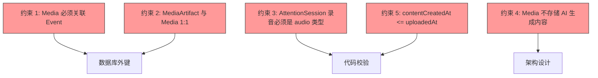

### 15.3 下一步行动

1. **立即开始**: 实施 Phase 1（数据层）
2. **Week 2**: 实施 Phase 2（MediaArtifactService）
3. **Week 4**: 实施 Phase 3（SearchService）
4. **Week 6**: 实施 Phase 4（UI 组件）
5. **Week 8**: 集成测试与上线

---

## 附录

### A. 完整类型定义

```typescript
// 见 Section 3: 数据模型
```

### B. 数据库迁移脚本

```sql
-- 见 Section 13: 迁移指南
```

### C. 性能基准测试

```typescript
// 见 Section 10.3: 性能测试
```

---

## 16. SSOT 一致性验证

### 16.1 与 EVENT_FIELD_CONTRACT 的对齐

根据 [EVENT_FIELD_CONTRACT_SSOT_ARCHITECTURE.md](../architecture/EVENT_FIELD_CONTRACT_SSOT_ARCHITECTURE.md)，Media 系统必须遵守以下约束：

#### 与 Event 的关系

✅ **符合约束**：
- Media 通过 `eventId` 外键关联 Event（强制，非空）
- Event 删除时级联删除所有关联 Media
- Media 不污染 Event 字段（Media 独立存储）
- EventLog.slateJson 只存储 `mediaId` 引用，不存储媒体元数据

❌ **禁止**：
```typescript
// 禁止在 Event 中添加 Media 相关字段
interface Event {
  mediaCount?: number;          // ❌ 禁止
  hasRecording?: boolean;       // ❌ 禁止
  attachments?: Media[];        // ❌ 禁止
}
```

✅ **允许（可选 derived index）**：
```typescript
// ✅ 独立的派生索引（由 MediaService 维护）
interface EventMediaIndex {
  eventId: string;               // PK
  imageCount: number;
  audioCount: number;
  videoCount: number;
  documentCount: number;
  totalFileSize: number;
  updatedAt: string;
}
```

#### 与 Signal 的关系

**Media 与 Signal 的协作**：
- Media 创建后，触发 MediaArtifactService 生成 MediaArtifact
- MediaArtifact = AI 理解层（succinctContext + fullText + structuredData）
- embedding 属于派生索引（Derived Store），由索引服务生成并用于向量检索

**关键约束**：
```typescript
// ✅ 正确：Media 触发 Signal 生成 Artifact
await MediaService.uploadFile(eventId, file);
// → MediaService 触发 MediaArtifactService.generateMediaArtifact(mediaId)
// → MediaArtifactService 创建 MediaArtifact（独立表）

// ❌ 禁止：Media 不存储 AI 分析结果
interface Media {
  ocrText?: string;              // ❌ 应在 MediaArtifact.fullText
  summary?: string;              // ❌ 应在 MediaArtifact.succinctContext
  embedding?: number[];          // ❌ 应在派生索引表（Derived Store）
}
```

### 16.2 与 AttentionSession 的关系

根据 [SIGNAL_ARCHITECTURE_PROPOSAL.md § 2.3](../architecture/SIGNAL_ARCHITECTURE_PROPOSAL.md#23-attentionsession注意力会话)：

✅ **正确集成**：
```typescript
// AttentionSession 关联录音
interface AttentionSession {
  id: string;
  eventId: string;
  recordingMediaId?: string;     // ✅ 外键 → media.id（type='audio'）
  startTime: string;
  endTime?: string;
  meta?: {
    attendees?: Array<{ name: string; role?: string }>;
    speakerMap?: Record<string, { attendeeName?: string }>;
  };
}

// Media 存储录音文件
interface Media {
  id: string;
  type: 'audio';                 // ✅ 必须是 audio
  subtype: 'recording';          // ✅ 必须是 recording
  eventId: string;
  attentionSessionId?: string;   // ✅ 反向引用（可选）
  filePath: string;
  audioMeta: {
    duration: number;
    codec: 'opus';
  };
}
```

❌ **禁止**：
```typescript
// 禁止：AttentionSession 不存储音频数据
interface AttentionSession {
  audioBlob?: Blob;              // ❌ 应在 Media（文件存储）
  transcript?: string;           // ❌ 应在 Transcripts 表
}

// 禁止：Media 不存储会话元数据
interface Media {
  attendees?: string[];          // ❌ 应在 AttentionSession.meta.attendees
  speakerMap?: object;           // ❌ 应在 AttentionSession.meta.speakerMap
}
```

### 16.3 充要性验证

| 关系 | 正向约束 | 反向约束 | 验证 |
|------|---------|---------|------|
| **Event → Media** | Event 删除 → 级联删除 Media | ❌ Media 删除不影响 Event | ✅ 单向依赖 |
| **Media → MediaArtifact** | Media 删除 → 级联删除 Artifact | Artifact 必须有 Media | ✅ 1:1 关系 |
| **AttentionSession → Media** | Session 删除 → Media 保留（只清除引用） | Media 删除 → Session 保留（清除 recordingMediaId） | ✅ 松耦合 |
| **EventLog → Media** | EventLog 引用 mediaId（软引用） | Media 删除 → EventLog 保留（显示占位符） | ✅ 松耦合 |

**完整性检查函数**：
```typescript
async function validateMediaIntegrity(mediaId: string): Promise<boolean> {
  const media = await db.media.get(mediaId);
  
  // 1. 检查 Event 存在
  const event = await db.events.get(media.eventId);
  if (!event) throw new Error(`Event ${media.eventId} not found`);
  
  // 2. 检查 AttentionSession 约束（如果有）
  if (media.attentionSessionId) {
    const session = await db.attention_sessions.get(media.attentionSessionId);
    if (!session) throw new Error(`Session ${media.attentionSessionId} not found`);
    if (media.type !== 'audio') throw new Error(`AttentionSession media must be audio`);
    if (session.recordingMediaId !== mediaId) {
      throw new Error(`Session.recordingMediaId mismatch`);
    }
  }
  
  // 3. 检查 MediaArtifact 唯一性
  const artifacts = await db.media_artifacts.where('mediaId').equals(mediaId).toArray();
  if (artifacts.length > 1) throw new Error(`Multiple artifacts for media ${mediaId}`);
  
  // 4. 检查时间一致性
  const contentCreated = new Date(media.contentCreatedAt);
  const uploaded = new Date(media.uploadedAt);
  if (contentCreated > uploaded) {
    throw new Error(`contentCreatedAt > uploadedAt`);
  }
  
  return true;
}
```

---

**文档结束**

---

## 使用建议

将此文档提供给 GitHub Copilot 时：

1. **分段输入**：按 Phase 分段提供上下文
2. **明确需求**：例如"请实现 MediaService.uploadFile() 方法"
3. **引用约束**：提醒 Copilot 遵守 SSOT 约束规则（§4 + §16）
4. **提供示例**：从测试用例中提取示例输入输出

**提示词示例**：

```
请根据 Media 系统设计文档 Section 5.2，实现 MediaService.uploadFile() 方法。

要求：
1. 从文件 EXIF 提取 contentCreatedAt
2. 生成唯一的 mediaId

---

希望这份文档对你有帮助！🚀


