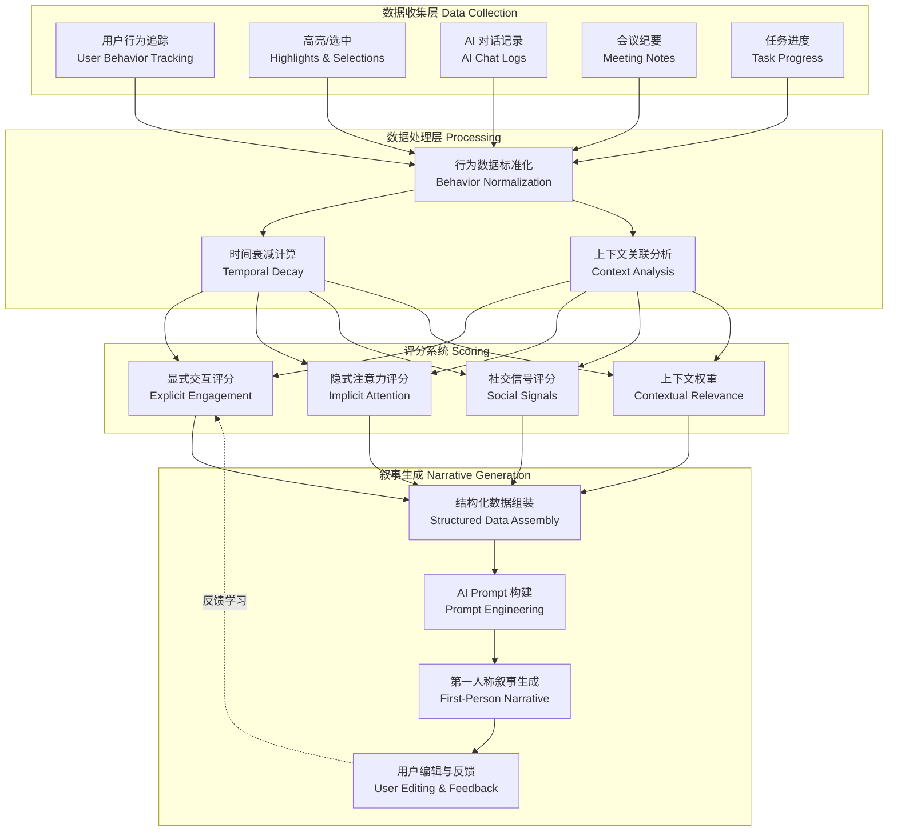
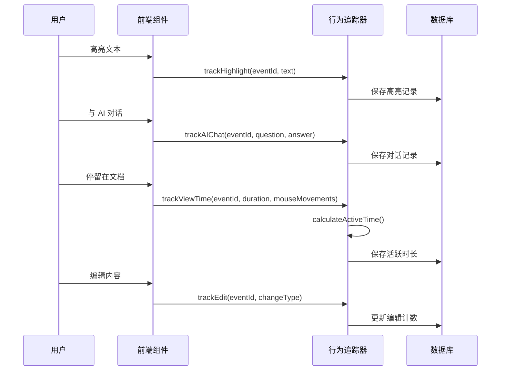
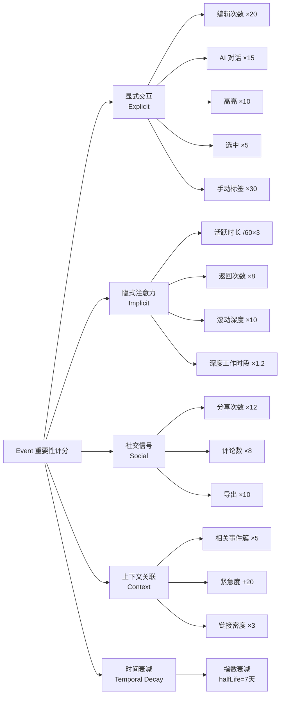
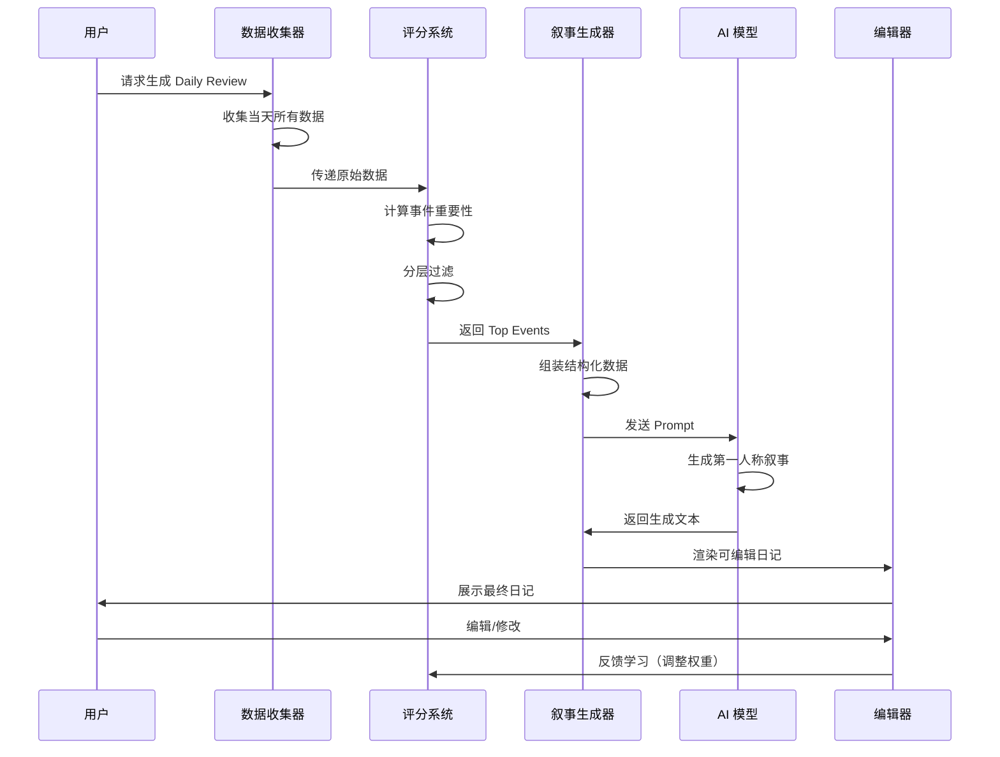
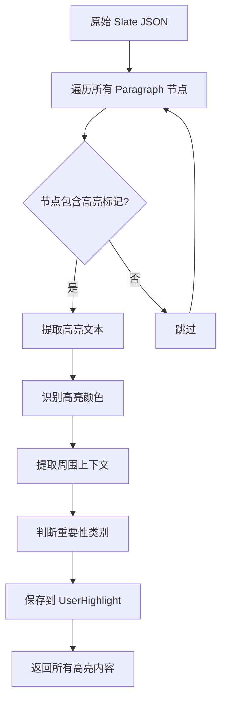

# 4DNote Daily Review 叙事性日记系统 - 完整技术文档

> **设计目标**：从"AI 监视用户"转变为"AI 帮用户回忆和思考"  
> **核心理念**：生成像用户自己写的日记，而非冰冷的数据报告

---

## 📋 文档目录

1. [系统概述](#系统概述)
2. [数据收集层](#数据收集层)
3. [重要性评分算法](#重要性评分算法)
4. [叙事生成管道](#叙事生成管道)
5. [Prompt 模板](#prompt-模板)
6. [用户高亮提取算法](#用户高亮提取算法)
7. [UI 组件设计](#ui-组件设计)
8. [实施路线图](#实施路线图)

---

## 系统概述

### 系统架构流程图



### 核心设计原则

| 原则 | 说明 | 实现方式 |
|------|------|---------|
| **第一人称视角** | 使用"我"而非"你" | Prompt 模板强制第一人称 |
| **情感表达** | 适当加入主观感受 | 识别情绪标注、任务状态 |
| **知识沉淀** | 不只记录行为，还记录收获 | 提取用户高亮内容、AI 对话结论 |
| **自然流畅** | 像人写的日记，不像报告 | 避免机械列举数据、加入连接词 |
| **可编辑性** | 用户可修改 AI 生成内容 | 提供编辑器、保存修改历史 |

---

## 数据收集层

### 数据模型定义

```typescript
// 用户行为数据接口
interface UserBehaviorData {
  eventId: string;
  
  // 1. 显式交互数据
  highlightCount: number;          // 高亮次数
  selectionCount: number;          // 选中次数
  editCount: number;               // 编辑次数
  aiChatRounds: number;            // AI 对话轮次
  manualTags: string[];            // 用户主动添加的标签
  
  // 2. 隐式注意力数据
  totalViewTime: number;           // 总停留时长（ms）
  activeViewTime: number;          // 活跃停留时长（排除挂机）
  revisitCount: number;            // 返回次数
  scrollDepth: number;             // 滚动深度（0-1）
  mouseMovements: MouseEvent[];    // 鼠标移动记录
  scrollEvents: ScrollEvent[];     // 滚动事件记录
  
  // 3. 时间上下文
  accessTime: string;              // 访问时间
  lastAccessTime: string;          // 最后访问时间
  isDeepWorkHour: boolean;         // 是否在深度工作时段
  
  // 4. 社交信号（可选）
  sharedCount: number;             // 分享次数
  commentCount: number;            // 评论数
  exportedToOtherTools: boolean;   // 是否导出到其他工具
}

// 用户高亮内容
interface UserHighlight {
  eventId: string;
  text: string;                    // 高亮文本
  timestamp: string;
  context: string;                 // 所在文档/章节
  highlightColor?: string;         // 高亮颜色（可选）
}

// AI 对话洞察
interface AIConversationInsight {
  eventId: string;
  userQuestion: string;
  aiAnswer: string;
  userReaction: 'copied' | 'highlighted' | 'ignored';  // 用户反应
  timestamp: string;
}

// 会议纪要
interface MeetingNote {
  eventId: string;
  title: string;
  participants: string[];
  summary: string;                 // 自动生成的摘要
  keyTakeaways: string[];          // 关键收获
  actionableInsights?: string;     // 可行动的启发
  timestamp: string;
}

// 任务进度
interface TaskProgress {
  eventId: string;
  title: string;
  status: 'todo' | 'in_progress' | 'ready' | 'completed';
  blockedBy?: string;              // 阻塞任务 ID
  timestamp: string;
}

// 每日回顾数据
interface DailyReviewData {
  date: string;
  events: Event[];
  userHighlights: UserHighlight[];
  aiConversationInsights: AIConversationInsight[];
  meetingNotes: MeetingNote[];
  taskProgress: TaskProgress[];
  userBehavior: Map<string, UserBehaviorData>;
}
```

### 数据收集流程图



### 活跃时间计算算法

```typescript
/**
 * 计算活跃停留时间（排除挂机时间）
 * 规则：如果 5 分钟内没有鼠标移动或滚动，停止计时
 */
function calculateActiveTime(
  totalViewTime: number,
  mouseMovements: MouseEvent[],
  scrollEvents: ScrollEvent[]
): number {
  const INACTIVE_THRESHOLD = 5 * 60 * 1000; // 5 分钟
  
  let activeTime = 0;
  let lastActivityTime = 0;
  
  // 合并鼠标移动和滚动事件，按时间排序
  const allEvents = [
    ...mouseMovements.map(e => ({ time: e.timestamp, type: 'mouse' })),
    ...scrollEvents.map(e => ({ time: e.timestamp, type: 'scroll' }))
  ].sort((a, b) => a.time - b.time);
  
  for (const event of allEvents) {
    if (lastActivityTime === 0) {
      // 第一个事件
      lastActivityTime = event.time;
      continue;
    }
    
    const timeSinceLastActivity = event.time - lastActivityTime;
    
    if (timeSinceLastActivity < INACTIVE_THRESHOLD) {
      // 活跃时间段
      activeTime += timeSinceLastActivity;
    } else {
      // 超过阈值，视为挂机，不累加时间
    }
    
    lastActivityTime = event.time;
  }
  
  return activeTime;
}
```

---

## 重要性评分算法

### 多维度评分模型



### 完整评分算法实现

```typescript
/**
 * 计算事件重要性评分
 */
function calculateEventImportance(
  event: Event,
  userBehavior: UserBehaviorData
): number {
  // 1. 显式交互评分
  const explicitScore = (
    userBehavior.editCount * 20 +
    userBehavior.aiChatRounds * 15 +
    userBehavior.highlightCount * 10 +
    userBehavior.selectionCount * 5 +
    (userBehavior.manualTags.length > 0 ? 30 : 0)
  );
  
  // 2. 隐式注意力评分
  const implicit Score = (
    (userBehavior.activeViewTime / 60000) * 3 +  // 每分钟 3 分
    userBehavior.revisitCount * 8 +
    userBehavior.scrollDepth * 10
  ) * (userBehavior.isDeepWorkHour ? 1.2 : 1.0);
  
  // 3. 社交信号评分
  const socialScore = (
    userBehavior.sharedCount * 12 +
    userBehavior.commentCount * 8 +
    (userBehavior.exportedToOtherTools ? 10 : 0)
  );
  
  // 4. 上下文关联评分
  const contextScore = (
    getRelatedEventCluster(event).length * 5 +
    (event.daysUntilDeadline < 3 ? 20 : 0) +
    event.linkDensity * 3
  );
  
  // 5. 综合得分
  let totalScore = explicitScore + implicitScore + socialScore + contextScore;
  
  // 6. 时间衰减
  const daysSinceLastInteraction = getDaysSince(userBehavior.lastAccessTime);
  totalScore = temporalDecay(totalScore, daysSinceLastInteraction);
  
  return totalScore;
}

/**
 * 时间衰减函数（指数衰减）
 * @param score 原始分数
 * @param daysSinceInteraction 距离最后交互的天数
 * @param halfLife 半衰期（默认 7 天）
 */
function temporalDecay(
  score: number,
  daysSinceInteraction: number,
  halfLife: number = 7
): number {
  return score * Math.pow(0.5, daysSinceInteraction / halfLife);
}

/**
 * 获取相关事件簇（同一时段查看的相关事件）
 */
function getRelatedEventCluster(event: Event): Event[] {
  const TIME_WINDOW = 3600000; // 1 小时
  
  return allEvents.filter(e => 
    isSameProject(e, event) && 
    Math.abs(e.accessTime - event.accessTime) < TIME_WINDOW
  );
}
```

### 分层过滤策略

```typescript
/**
 * 多阶段过滤，平衡"全面"与"无噪声"
 */
function filterImportantEvents(
  allEvents: Event[],
  userBehavior: Map<string, UserBehaviorData>
): Event[] {
  // 第 1 层：基础过滤（去除明显的噪声）
  const stage1 = allEvents.filter(e => {
    const behavior = userBehavior.get(e.id);
    return behavior && (
      behavior.activeViewTime > 30000 ||  // 至少 30 秒活跃时间
      behavior.editCount > 0 ||
      behavior.highlightCount > 0 ||
      behavior.aiChatRounds > 0
    );
  });
  
  // 第 2 层：重要性评分
  const stage2 = stage1.map(e => ({
    event: e,
    score: calculateEventImportance(e, userBehavior.get(e.id)!)
  }));
  
  // 第 3 层：动态阈值（根据分布自动调整）
  const scores = stage2.map(item => item.score);
  const mean = average(scores);
  const stdDev = standardDeviation(scores);
  const threshold = mean + 0.5 * stdDev;  // 高于平均 + 0.5 倍标准差
  
  const stage3 = stage2.filter(item => item.score > threshold);
  
  // 第 4 层：多样性保障（避免只推荐同一类型）
  const finalSelection = ensureDiversity(stage3, {
    maxPerCategory: 3,    // 每个类别最多 3 个
    maxPerProject: 5      // 每个项目最多 5 个
  });
  
  return finalSelection.map(item => item.event);
}

/**
 * 确保多样性（避免同一类型事件过多）
 */
function ensureDiversity(
  scoredEvents: Array<{ event: Event; score: number }>,
  options: { maxPerCategory: number; maxPerProject: number }
): Array<{ event: Event; score: number }> {
  const result: Array<{ event: Event; score: number }> = [];
  const categoryCount = new Map<string, number>();
  const projectCount = new Map<string, number>();
  
  // 按分数降序排列
  const sorted = scoredEvents.sort((a, b) => b.score - a.score);
  
  for (const item of sorted) {
    const catCount = categoryCount.get(item.event.category) || 0;
    const projCount = projectCount.get(item.event.projectTag) || 0;
    
    if (catCount < options.maxPerCategory && projCount < options.maxPerProject) {
      result.push(item);
      categoryCount.set(item.event.category, catCount + 1);
      projectCount.set(item.event.projectTag, projCount + 1);
    }
  }
  
  return result;
}
```

---

## 叙事生成管道

### 生成流程图



### 核心生成函数

```typescript
/**
 * 生成叙事性 Daily Review
 */
function generateNarrativeDailyReview(date: string): string {
  const data = collectDailyData(date);
  
  // 1. 识别"主线任务"（今天花时间最多的项目）
  const mainProject = data.events
    .sort((a, b) => b.activeTime - a.activeTime)[0];
  
  // 2. 提取用户在该项目中的"学习收获"
  const learnings = [
    ...data.userHighlights.filter(h => h.eventId === mainProject.id),
    ...extractKeyInsights(data.aiConversationInsights, mainProject.id)
  ];
  
  // 3. 生成第一段（主线任务 + 学习收获）
  const mainSection = generateMainSection(mainProject, learnings);
  
  // 4. 生成后续段落（会议/协作事项）
  const meetingSections = data.meetingNotes.map(meeting => 
    generateMeetingSection(meeting)
  );
  
  // 5. 生成待办事项（未完成但准备就绪的任务）
  const pendingTasks = data.taskProgress
    .filter(t => t.status === 'ready' || t.status === 'in_progress')
    .map(t => `- ${t.title}${t.status === 'ready' ? '（已准备好，明天执行）' : ''}`);
  
  // 6. 生成明天的建议（基于依赖关系和优先级）
  const tomorrowSuggestions = generateTomorrowSuggestions(data);
  
  // 7. 组装最终日记
  return `
📅 ${formatDate(date)}

${mainSection}

${meetingSections.join('\n\n---\n\n')}

${pendingTasks.length > 0 ? `⚠️ 待办事项：\n${pendingTasks.join('\n')}` : ''}

💡 明天重点：
${tomorrowSuggestions.map((s, i) => `${i + 1}. ${s}`).join('\n')}
  `.trim();
}
```

### 主线任务段落生成

```typescript
/**
 * 生成主线任务段落（第一人称 + 情感表达）
 */
function generateMainSection(project: Event, learnings: string[]): string {
  // 提取用户的"情感表达"（如果有）
  const emotionalContext = project.emotionalMarker 
    ? getEmotionalPhrase(project.emotionalMarker.emotion)
    : '';
  
  // 构建开头（第一人称 + 情感）
  const opening = `今天${project.activeTime > 7200000 ? '一直在' : '主要在'}推进「${project.title}」${emotionalContext}`;
  
  // 提取核心行动
  const actions = extractActions(project);
  const actionPhrase = actions.length > 0 
    ? `，${actions.join('、')}`
    : '';
  
  // 如果有学习收获，展开列举
  let learningSection = '';
  if (learnings.length > 0) {
    learningSection = `。主要${learnings.length > 2 ? '的前置条件包括' : '了解到'}：\n\n${
      learnings.map(l => `- ${l}`).join('\n')
    }\n\n`;
  }
  
  // 如果有反思/后续计划
  const reflection = project.nextSteps 
    ? `\n${generateReflection(project, learnings)}`
    : '';
  
  return `${opening}${actionPhrase}${learningSection}${reflection}`.trim();
}

/**
 * 情感短语映射
 */
function getEmotionalPhrase(emotion: string): string {
  const phrases: Record<string, string> = {
    'frustrated': '，感觉流程比想象中复杂',
    'excited': '，进展很顺利',
    'confused': '，遇到了一些疑问',
    'satisfied': '，基本理清了思路',
    'overwhelmed': '，信息量有点大'
  };
  return phrases[emotion] || '';
}

/**
 * 提取用户的行动动词
 */
function extractActions(project: Event): string[] {
  const actions: string[] = [];
  
  if (project.aiChatRounds > 5) {
    actions.push('深入研究了相关流程');
  } else if (project.aiChatRounds > 0) {
    actions.push('了解了基本情况');
  }
  
  if (project.editCount > 10) {
    actions.push('整理了详细笔记');
  } else if (project.editCount > 0) {
    actions.push('记录了关键要点');
  }
  
  if (project.highlightCount > 5) {
    actions.push('标注了重点内容');
  }
  
  return actions;
}

/**
 * 生成反思/后续计划
 */
function generateReflection(project: Event, learnings: string[]): string {
  if (learnings.length > 2) {
    return '看来需要重新规划一下时间线，有些前置任务得优先处理。';
  }
  
  if (project.blockedTasks && project.blockedTasks.length > 0) {
    return `目前被「${project.blockedTasks[0].title}」阻塞，需要先解决这个问题。`;
  }
  
  if (project.nextSteps) {
    return `下一步计划${project.nextSteps}。`;
  }
  
  return '';
}
```

---

## Prompt 模板

### 完整 Prompt 模板

```typescript
/**
 * 生成 Daily Review 的 AI Prompt
 */
function generateDailyReviewPrompt(structuredData: StructuredDailyData): string {
  return `
你是用户的个人日记助手。请根据以下结构化数据，生成一篇**第一人称、自然流畅**的日记。

## 要求：
1. **使用第一人称**（"我"而非"你"）
2. **自然的语言**（不要像数据报告，要像人在写日记）
3. **融入学习收获**（用户高亮的内容、从 AI 对话中学到的知识）
4. **适当的情感表达**（"感觉有点复杂"、"进展顺利"等）
5. **有反思**（"看来需要调整计划"、"可以借鉴这个思路"）

## 数据：
### 主线任务：
- 项目：${structuredData.mainProject.title}
- 投入时间：${formatTime(structuredData.mainProject.activeTime)}
- 主要行动：${structuredData.mainProject.actions.join('、')}

### 学习收获（用户高亮的内容）：
${structuredData.learnings.map(l => `- ${l.text}`).join('\n')}

### 会议记录：
${structuredData.meetings.map(m => `
- ${m.title}（${formatTime(m.timestamp)}）
- 摘要：${m.summary}
- 关键收获：${m.keyTakeaways.join('；')}
`).join('\n')}

### 待办事项：
${structuredData.pendingTasks.map(t => `- ${t.title}（状态：${t.status}）`).join('\n')}

### 明天的建议任务：
${structuredData.tomorrowSuggestions.join('\n')}

---

请生成一篇 200-300 字的日记，包含：
1. 开头段落：今天主要做了什么 + 学到了什么
2. 后续段落：会议/协作事项（如果有）
3. 结尾部分：待办事项 + 明天重点

注意：
- 不要说"今天你..."，要说"今天我..."
- 不要机械列举数据（如"与 AI 进行了 12 轮对话"），而是说"深入研究了..."
- 适当加入主观感受（如"感觉流程比想象中复杂"）
- 如果用户高亮了某些内容，要自然地融入正文（而非单独列举）
  `.trim();
}
```

---

## 用户高亮提取算法

### 提取流程图



### 实现代码

```typescript
/**
 * 从 Slate JSON 中提取用户高亮内容
 */
function extractUserHighlights(
  eventId: string,
  slateJson: any[]
): UserHighlight[] {
  const highlights: UserHighlight[] = [];
  
  function traverse(nodes: any[], context: string = '') {
    for (const node of nodes) {
      if (node.type === 'paragraph') {
        const paragraphText = extractTextFromNode(node);
        
        // 遍历段落中的所有文本节点
        if (node.children) {
          for (const child of node.children) {
            if (child.highlight || child.backgroundColor) {
              highlights.push({
                eventId,
                text: child.text,
                timestamp: node.createdAt || new Date().toISOString(),
                context: context || paragraphText.slice(0, 50),
                highlightColor: child.backgroundColor
              });
            }
          }
        }
      }
      
      // 递归处理子节点
      if (node.children) {
        traverse(node.children, extractTextFromNode(node).slice(0, 50));
      }
    }
  }
  
  traverse(slateJson);
  return highlights;
}

/**
 * 从 Slate 节点中提取纯文本
 */
function extractTextFromNode(node: any): string {
  if (node.text) {
    return node.text;
  }
  
  if (node.children) {
    return node.children.map(extractTextFromNode).join('');
  }
  
  return '';
}

/**
 * 从 AI 对话中提取关键洞察
 */
function extractKeyInsights(
  conversations: AIConversationInsight[],
  eventId: string
): string[] {
  return conversations
    .filter(c => c.eventId === eventId && c.userReaction === 'copied')
    .map(c => {
      // 提取 AI 回答中的关键句子（通常是列表项或重点段落）
      const lines = c.aiAnswer.split('\n');
      return lines
        .filter(line => line.startsWith('- ') || line.startsWith('* '))
        .map(line => line.replace(/^[-*]\s*/, ''));
    })
    .flat();
}
```

---

## UI 组件设计

### 可编辑日记编辑器

```typescript
import React, { useState } from 'react';

interface DailyReviewEditorProps {
  initialContent: string;
  onSave: (content: string) => void;
  onRegenerate: () => void;
}

function DailyReviewEditor({ initialContent, onSave, onRegenerate }: DailyReviewEditorProps) {
  const [content, setContent] = useState(initialContent);
  const [isEditing, setIsEditing] = useState(false);
  
  const handleSave = () => {
    onSave(content);
    setIsEditing(false);
  };
  
  return (
    <div className="daily-review-editor">
      <div className="toolbar">
        <button onClick={() => setIsEditing(!isEditing)}>
          {isEditing ? '✓ 完成编辑' : '✏️ 编辑'}
        </button>
        <button onClick={onRegenerate}>
          ↻ 重新生成
        </button>
      </div>
      
      {isEditing ? (
        <textarea
          value={content}
          onChange={(e) => setContent(e.target.value)}
          className="editable-text"
          rows={15}
        />
      ) : (
        <div className="readonly-text">
          {content.split('\n').map((line, i) => (
            <p key={i}>{line}</p>
          ))}
        </div>
      )}
      
      {isEditing && (
        <button onClick={handleSave} className="save-button">
          保存修改
        </button>
      )}
    </div>
  );
}
```

### 渐进式披露组件

```typescript
function DailyReviewCard({ date, summary, detailedContent }: DailyReviewCardProps) {
  const [expanded, setExpanded] = useState(false);
  
  return (
    <div className="daily-review-card">
      <div className="summary">
        📅 {date}
        <p>{summary}</p>
      </div>
      
      <button onClick={() => setExpanded(!expanded)}>
        {expanded ? '收起 ↑' : '查看详情 ↓'}
      </button>
      
      {expanded && (
        <div className="detailed-content">
          <Section title="主要工作">
            {detailedContent.mainWork}
            <DataSource>
              📊 基于 3 个文档、12 轮 AI 对话、8 次高亮
            </DataSource>
          </Section>
          
          <Section title="会议记录">
            {detailedContent.meetings}
          </Section>
          
          <Section title="学习收获">
            {detailedContent.learnings}
            <LinkToSource>
              💡 查看完整笔记 →
            </LinkToSource>
          </Section>
        </div>
      )}
    </div>
  );
}
```

---

## 实施路线图

### Phase 1: MVP（最小可行方案）

**目标**：生成"像人写的"日记（而非数据报告）

**实现步骤**：
1. 收集用户高亮内容
2. 提取 AI 对话中的关键结论
3. 用 Prompt Engineering 生成第一人称叙事
4. 允许用户编辑 AI 生成的内容

**核心代码**：
```typescript
// 最简单的模型：加权平均 + 时间衰减
eventScore = (
  editCount * 20 +
  highlightCount * 10 +
  aiChatRounds * 15 +
  activeViewTime / 60 * 3
) * temporalDecay(daysSinceLastInteraction, 7);

// 只选 Top 10 生成 Daily Review
```

### Phase 2: 噪声过滤

**目标**：提升生成质量，减少无关内容

**实现步骤**：
1. 添加"活跃时间"计算（防止挂机刷时长）
2. 添加多样性约束（避免同一项目占满周报）
3. 添加用户反馈机制（"这个不重要"按钮）

### Phase 3: 上下文感知

**目标**：理解事件之间的关系

**实现步骤**：
1. 识别"相关事件簇"（同一时段查看的相关 Event）
2. 临近 Deadline 自动提权
3. 分析"预期 vs 实际"时间偏差

### Phase 4: 个性化学习

**目标**：根据用户习惯调整权重

**实现步骤**：
1. 根据用户反馈调整权重
2. A/B 测试不同模型
3. 自动学习用户的工作习惯（如"周三最高效"）

---

## 附录：数据库 Schema

### UserBehavior 表

```sql
CREATE TABLE user_behavior (
  id TEXT PRIMARY KEY,
  event_id TEXT NOT NULL,
  highlight_count INTEGER DEFAULT 0,
  selection_count INTEGER DEFAULT 0,
  edit_count INTEGER DEFAULT 0,
  ai_chat_rounds INTEGER DEFAULT 0,
  total_view_time INTEGER DEFAULT 0,
  active_view_time INTEGER DEFAULT 0,
  revisit_count INTEGER DEFAULT 0,
  scroll_depth REAL DEFAULT 0,
  access_time TEXT NOT NULL,
  last_access_time TEXT,
  is_deep_work_hour BOOLEAN DEFAULT FALSE,
  shared_count INTEGER DEFAULT 0,
  comment_count INTEGER DEFAULT 0,
  exported_to_other_tools BOOLEAN DEFAULT FALSE,
  created_at TEXT DEFAULT CURRENT_TIMESTAMP,
  updated_at TEXT DEFAULT CURRENT_TIMESTAMP,
  FOREIGN KEY (event_id) REFERENCES events(id)
);
```

### UserHighlights 表

```sql
CREATE TABLE user_highlights (
  id TEXT PRIMARY KEY,
  event_id TEXT NOT NULL,
  text TEXT NOT NULL,
  timestamp TEXT NOT NULL,
  context TEXT,
  highlight_color TEXT,
  created_at TEXT DEFAULT CURRENT_TIMESTAMP,
  FOREIGN KEY (event_id) REFERENCES events(id)
);
```

### AIConversations 表

```sql
CREATE TABLE ai_conversations (
  id TEXT PRIMARY KEY,
  event_id TEXT NOT NULL,
  user_question TEXT NOT NULL,
  ai_answer TEXT NOT NULL,
  user_reaction TEXT CHECK(user_reaction IN ('copied', 'highlighted', 'ignored')),
  timestamp TEXT NOT NULL,
  created_at TEXT DEFAULT CURRENT_TIMESTAMP,
  FOREIGN KEY (event_id) REFERENCES events(id)
);
```

### DailyReviews 表

```sql
CREATE TABLE daily_reviews (
  id TEXT PRIMARY KEY,
  date TEXT NOT NULL UNIQUE,
  generated_content TEXT NOT NULL,
  user_edited_content TEXT,
  generation_model TEXT,
  user_rating INTEGER CHECK(user_rating BETWEEN 1 AND 5),
  created_at TEXT DEFAULT CURRENT_TIMESTAMP,
  updated_at TEXT DEFAULT CURRENT_TIMESTAMP
);
```

---

## 总结

这套系统通过以下方式实现"从监控到陪伴"的转变：

1. **第一人称叙事**：让用户感觉是自己在写日记
2. **知识沉淀**：不只记录行为，还记录学到了什么
3. **情感表达**：适当加入主观感受，更有温度
4. **可编辑性**：用户可以修改 AI 生成的内容，增加参与感
5. **反馈学习**：根据用户反馈不断优化权重模型

最终目标：让 Daily Review 成为用户真正想要保存和回顾的"个人成长日记"，而非冰冷的数据报告。

---

**文档版本**：v1.0  
**最后更新**：2026-01-08  
**作者**：4DNote AI Team
