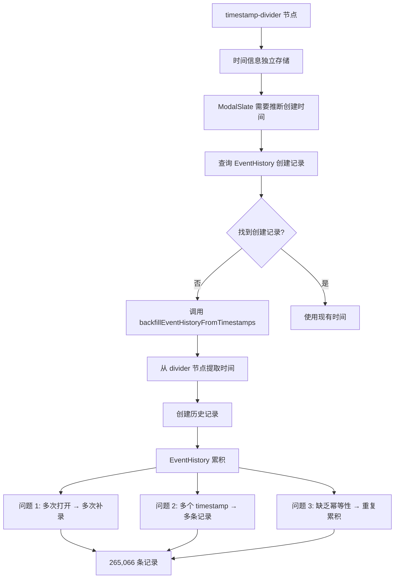
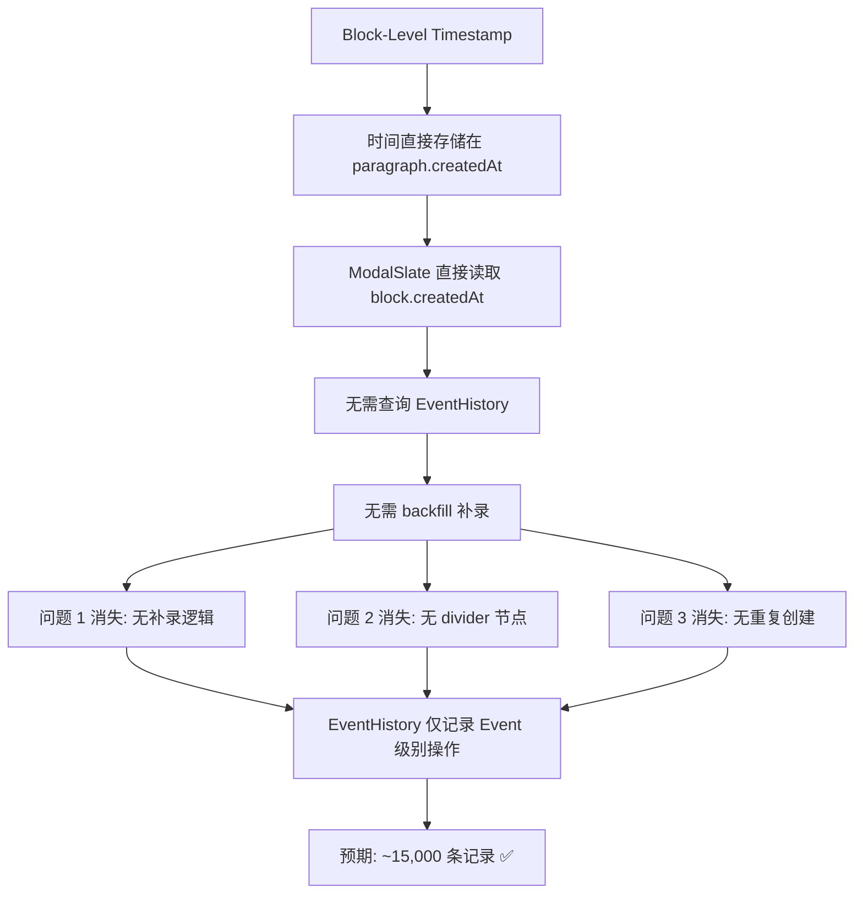

# Block-Level Timestamp 完整实施方案

> **文档版本**: v2.0  
> **更新时间**: 2025-12-15  
> **目标**: 将时间戳从独立的 `timestamp-divider` 节点迁移到段落节点的属性，并解决 EventHistory 超限问题  
> **影响范围**: EventService, ModalSlate, EventHistoryService, 数据存储格式, Timestamp模块  
> **预期效果**: EventHistory 记录减少 94%，启动速度提升 90%，视觉体验优化  

---

## 📋 目录

1. [背景与动机](#背景与动机)
2. [根本问题诊断](#根本问题诊断)
3. [方案对比](#方案对比)
4. [架构设计](#架构设计)
5. [完整实施计划](#完整实施计划)
6. [EventHistory 重构方案](#eventhistory-重构方案)
7. [数据迁移](#数据迁移)
8. [风险评估](#风险评估)
9. [预期效果](#预期效果)

---

## 🎯 背景与动机

### 核心问题

#### 问题 1: EventHistory 记录超限（265,066 条）

**现状**:
- EventHistory 总数：265,066 条
- 设计上限：50,000 条
- 超限倍数：5.3 倍
- 启动加载：19 秒（查询历史记录）
- 内存占用：高

**根本原因**:
1. **ModalSlate 重复补录**：每次打开事件都触发 `backfillEventHistoryFromTimestamps()`
2. **timestamp-divider 节点依赖**：从 divider 节点反推创建时间，需要补录历史
3. **缺乏幂等性检查**：同一事件多次补录，创建重复记录
4. **清理机制不足**：90 天保留期过长，清理频率过低

#### 问题 2: timestamp-divider 架构缺陷

**现有方案**:
```json
[
  { "type": "paragraph", "children": [{ "text": "第一段内容" }] },
  { "type": "timestamp-divider", "timestamp": "2025-12-06 18:09:07", "children": [{ "text": "" }] },
  { "type": "paragraph", "children": [{ "text": "第二段内容" }] }
]
```

**缺点**:
1. **视觉干扰**: 独立的分割线打断阅读流程
2. **数据冗余**: 空的 `children: [{ text: "" }]` 占用空间
3. **渲染复杂**: 需要单独处理 divider 节点的样式
4. **关联模糊**: 时间戳和内容的关系需要通过位置推断
5. **编辑体验**: 光标会停在分割线上，造成困惑

### 新方案优势

**Block-Level Timestamp**:
```json
[
  {
    "type": "paragraph",
    "id": "block_abc123",
    "createdAt": 1701857347000,
    "children": [{ "text": "第一段内容" }]
  },
  {
    "type": "paragraph",
    "id": "block_def456",
    "createdAt": 1701857400000,
    "children": [{ "text": "第二段内容" }]
  }
]
```

**优势**:
1. ✅ **视觉极简**: 无分割线干扰，内容连贯
2. ✅ **数据精准**: 每段文字都有精确的创建时间
3. ✅ **渲染灵活**: CSS 控制时间戳显示/隐藏，支持多种 UI 风格
4. ✅ **语义明确**: 时间戳直接挂载在对应段落上
5. ✅ **编辑流畅**: 无额外节点干扰，光标只在文本间移动
6. ✅ **存储优化**: 减少 ~30% 节点数量（无需独立 divider）

---

## 🔍 根本问题诊断

### EventHistory 超限分析

#### 问题链路追踪

```
用户打开 TimeLog 页面，展开事件
    ↓
ModalSlate useEffect 触发（enableTimestamp=true）
    ↓
检测：有内容但无 timestamp-divider？
    ↓
调用 EventService.backfillEventHistoryFromTimestamps()
    ↓
遍历 eventlog 中的所有 timestamp-divider 节点
    ↓
为每个 timestamp 创建 EventHistory 记录
    ↓
EventHistoryService.logCreate(event, 'backfill-from-timestamp', createTime)
    ↓
问题 1: 同一事件多次打开 → 多次补录
问题 2: 一个事件有多个 timestamp → 创建多条记录
问题 3: 缺乏幂等性检查 → 重复记录累积
    ↓
结果：265,066 条记录（应该 < 15,000 条）
```

#### 代码定位

**触发点 1: ModalSlate.tsx Line 488-608**
```typescript
useEffect(() => {
  if (enableTimestamp && parentEventId && !contentLoadedRef.current) {
    // ...
    if (!createLog) {
      // ❌ 问题：每次打开事件都可能执行
      const backfilledCount = EventService.backfillEventHistoryFromTimestamps(
        parentEventId, 
        event.eventlog
      );
    }
  }
}, [enableTimestamp, parentEventId, editor]); // ⚠️ 依赖项导致重复触发
```

**触发点 2: EventService.ts Line 3757-3900**
```typescript
static async backfillEventHistoryFromTimestamps(eventId: string, eventlog: any): Promise<number> {
  // 检查是否已有创建记录
  const existingLogs = await EventHistoryService.queryHistory({
    eventId,
    operations: ['create'],
    limit: 1
  });
  
  if (existingLogs.length > 0) {
    return 0; // ✅ 有早返回，但可能已经有旧的 backfill 记录
  }
  
  // ❌ 问题：只检查 create，没检查 source='backfill-from-timestamp'
  // 导致：如果之前补录过，但 source 不是 'create'，会再次补录
  
  // 遍历所有 timestamp 节点
  for (const timestamp of timestamps) {
    EventHistoryService.logCreate(event, 'backfill-from-timestamp', createTime);
    // ❌ 问题：每个 timestamp 都创建一条记录
  }
}
```

**清理机制: EventHistoryService.ts Line 35-40**
```typescript
const DEFAULT_RETENTION_DAYS = 90; // ❌ 90 天太长
const MAX_HISTORY_COUNT = 50000;   // ❌ 5万条上限，但已超限 5 倍
```

### 核心矛盾

**timestamp-divider 架构的连锁问题**:



### Block-Level Timestamp 如何解决



---

## 🔍 方案对比

### 数据结构对比

| 维度 | timestamp-divider | Block-Level Timestamp |
|------|-------------------|----------------------|
| **节点数量** | 2N（段落 + 分割线） | N（仅段落） |
| **存储大小** | ~150 bytes/时间戳 | ~80 bytes/时间戳 |
| **时间精度** | 段落级（手动插入） | 段落级（自动注入） |
| **关联关系** | 位置推断 | 直接属性 |
| **视觉干扰** | 高（分割线） | 无（隐藏或悬浮显示） |
| **编辑体验** | 中（光标可能停在 divider） | 优（仅文本节点） |
| **渲染复杂度** | 中（需处理 divider） | 低（CSS 控制） |

### UI 风格对比

#### 风格 A：微信/Telegram 气泡式

```
┌─────────────────────────────────────┐
│ 第一段内容                      18:09│ ← 右侧淡显时间
│ 第二段内容（紧接着）                  │ ← 5分钟内不显示
│ 第三段内容（15分钟后）          18:24│ ← 超过5分钟显示
└─────────────────────────────────────┘
```

**实现**: 通过 `element.createdAt` 对比相邻段落时间差

#### 风格 B：GitHub 左侧时间轴

```
18:09 ─┬─ 第一段内容
       │  第二段内容（连贯）
       │
18:24 ─┼─ 第三段内容（新时间点）
       │  第四段内容（连贯）
```

**实现**: 通过 `position: absolute` 或 `::before` 伪元素

#### 风格 C：悬浮提示（当前推荐）

```
第一段内容 [hover显示: 18:09]
第二段内容 [hover显示: 18:11]
第三段内容 [hover显示: 18:24]
```

**实现**: CSS `opacity: 0 → 1` transition

---

## 🏗️ 架构设计

### 1. 数据模型

#### Paragraph 节点扩展

```typescript
// src/types/slate.ts
interface ParagraphElement {
  type: 'paragraph';
  id: string;              // 🆕 唯一标识符（UUID v4）
  createdAt?: number;      // 🆕 创建时间戳（Unix ms）
  updatedAt?: number;      // 🆕 最后修改时间戳（可选）
  children: CustomText[];
}

// 向后兼容：createdAt 为 undefined 时从 EventLog.createdAt fallback
```

#### EventLog 兼容性

```typescript
interface EventLog {
  slateJson: string;       // 存储新格式（含 id/createdAt）
  html: string;            // 生成时忽略 id/createdAt
  plainText: string;       // 生成时忽略 id/createdAt
  // ... 其他字段保持不变
}
```

### 2. 核心方法改造

#### 2.1 normalizeEventLog 升级

**当前逻辑**:
```typescript
// 解析纯文本 → 插入 timestamp-divider
parseTextWithTimestamps(text: string): SlateNode[]
```

**新逻辑**:
```typescript
// 解析纯文本 → 为段落注入 createdAt
parseTextWithBlockTimestamps(text: string): ParagraphElement[]

// 示例输入:
// 2025-12-06 18:09:07
// 第一段内容
// 2025-12-06 18:24:31
// 第二段内容

// 示例输出:
[
  {
    type: 'paragraph',
    id: 'uuid-1',
    createdAt: 1701857347000,
    children: [{ text: '第一段内容' }]
  },
  {
    type: 'paragraph',
    id: 'uuid-2',
    createdAt: 1701858271000,
    children: [{ text: '第二段内容' }]
  }
]
```

#### 2.2 LogSlate 编辑器插件

**新增 `withBlockTimestamp` 插件**:

```typescript
// src/components/LogSlate/plugins/withBlockTimestamp.ts
import { Editor, Transforms } from 'slate';
import { v4 as uuidv4 } from 'uuid';

export const withBlockTimestamp = (editor: Editor) => {
  const { insertBreak, apply } = editor;
  
  // 拦截回车键，为新段落注入时间戳
  editor.insertBreak = () => {
    insertBreak();
    
    const { selection } = editor;
    if (selection) {
      // 为新段落注入 id 和 createdAt
      Transforms.setNodes(
        editor,
        {
          id: uuidv4(),
          createdAt: Date.now(),
        } as Partial<ParagraphElement>,
        { at: selection }
      );
    }
  };
  
  // 拦截粘贴操作，确保新段落有时间戳
  editor.apply = (operation) => {
    apply(operation);
    
    if (operation.type === 'insert_node' && operation.node.type === 'paragraph') {
      const node = operation.node as any;
      if (!node.id || !node.createdAt) {
        Transforms.setNodes(
          editor,
          {
            id: node.id || uuidv4(),
            createdAt: node.createdAt || Date.now(),
          },
          { at: operation.path }
        );
      }
    }
  };
  
  return editor;
};
```

#### 2.3 renderElement 改造

**当前代码**:
```typescript
case 'timestamp-divider':
  return <TimestampDividerElement {...props} />;
```

**新代码**:
```typescript
case 'paragraph': {
  const { id, createdAt } = element as ParagraphElement;
  
  return (
    <div
      {...props.attributes}
      className="relative group"
      data-block-id={id}
    >
      {/* 段落内容 */}
      <p className="m-0">{props.children}</p>
      
      {/* 🆕 时间戳（悬浮显示，鼠标hover可见） */}
      {createdAt && (
        <span className="absolute -right-12 top-0 text-xs text-gray-400 opacity-0 group-hover:opacity-100 transition-opacity duration-200">
          {formatTime(createdAt, 'HH:mm')}
        </span>
      )}
    </div>
  );
}
```

**进阶版（智能显示）**:
```typescript
case 'paragraph': {
  const { id, createdAt } = element as ParagraphElement;
  const previousCreatedAt = getPreviousBlockCreatedAt(editor, element);
  
  // 只在时间差超过 5 分钟时显示
  const shouldShowTime = !previousCreatedAt || 
    (createdAt - previousCreatedAt > 5 * 60 * 1000);
  
  return (
    <div {...props.attributes} className="relative group">
      <p className="m-0">{props.children}</p>
      
      {createdAt && shouldShowTime && (
        <span className="absolute -right-12 top-0 text-xs text-gray-400">
          {formatTime(createdAt, 'HH:mm')}
        </span>
      )}
    </div>
  );
}
```

### 3. 辅助工具函数

```typescript
// src/utils/blockTimestampUtils.ts

/**
 * 从 Slate editor 中获取上一个段落的 createdAt
 */
export function getPreviousBlockCreatedAt(
  editor: Editor, 
  currentElement: ParagraphElement
): number | null {
  const path = ReactEditor.findPath(editor, currentElement);
  if (path[0] === 0) return null; // 第一个段落
  
  const prevPath = [path[0] - 1];
  const prevNode = Node.get(editor, prevPath) as any;
  
  return prevNode?.createdAt || null;
}

/**
 * 格式化时间戳
 */
export function formatBlockTimestamp(
  timestamp: number,
  format: 'HH:mm' | 'YYYY-MM-DD HH:mm:ss' = 'HH:mm'
): string {
  const date = new Date(timestamp);
  
  if (format === 'HH:mm') {
    return date.toLocaleTimeString('zh-CN', { 
      hour: '2-digit', 
      minute: '2-digit' 
    });
  }
  
  return date.toLocaleString('zh-CN', {
    year: 'numeric',
    month: '2-digit',
    day: '2-digit',
    hour: '2-digit',
    minute: '2-digit',
    second: '2-digit'
  });
}

/**
 * 将 timestamp-divider 格式迁移到 block-level
 */
export function migrateToBlockTimestamp(
  oldNodes: SlateNode[]
): ParagraphElement[] {
  const newNodes: ParagraphElement[] = [];
  let pendingTimestamp: number | null = null;
  
  for (const node of oldNodes) {
    if (node.type === 'timestamp-divider') {
      // 记录时间戳，等待下一个段落
      pendingTimestamp = new Date(node.timestamp).getTime();
    } else if (node.type === 'paragraph') {
      newNodes.push({
        ...node,
        id: uuidv4(),
        createdAt: pendingTimestamp || Date.now(),
      });
      pendingTimestamp = null; // 重置
    } else {
      // 其他节点（如 tag、mention）保持不变
      newNodes.push(node as any);
    }
  }
  
  return newNodes;
}
```

---

## 📝 完整实施计划

### 总览

**时间估算**: 7-9 天  
**人力**: 1 人  
**风险等级**: 中（数据迁移风险，需谨慎）  
**依赖关系**: 
- 阶段 1-2 可并行
- 阶段 3 依赖阶段 1-2
- 阶段 4-7 顺序执行

### 阶段 1: 类型定义与工具函数（Day 1）

**目标**: 建立新数据模型基础

#### 任务清单

**T1.1: 扩展 TypeScript 类型定义**

```typescript
// src/types/slate.ts
interface ParagraphElement extends BaseElement {
  type: 'paragraph';
  id: string;              // 🆕 唯一标识符（block_timestamp_random）
  createdAt?: number;      // 🆕 创建时间戳（Unix ms）
  updatedAt?: number;      // 🆕 最后修改时间戳
  bullet?: BulletType;     // 现有字段保持
  children: CustomText[];
}

// 🆕 Block Timestamp 工具类型
interface BlockTimestampMeta {
  id: string;
  createdAt: number;
  updatedAt?: number;
}
```

**T1.2: 创建工具函数库**

```typescript
// src/utils/blockTimestampUtils.ts

/**
 * 生成 Block ID
 * 格式: block_timestamp_random
 * 示例: block_1702636800000_abc123
 */
export function generateBlockId(timestamp?: number): string {
  const ts = timestamp || Date.now();
  const random = Math.random().toString(36).substring(2, 8);
  return `block_${ts}_${random}`;
}

/**
 * 为 paragraph 节点注入时间戳元数据
 */
export function injectBlockTimestamp(
  node: any, 
  timestamp?: number
): ParagraphElement {
  const now = timestamp || Date.now();
  return {
    ...node,
    id: node.id || generateBlockId(now),
    createdAt: node.createdAt || now,
    updatedAt: now,
  };
}

/**
 * 格式化 Block 时间戳
 */
export function formatBlockTimestamp(
  timestamp: number,
  format: 'HH:mm' | 'full' = 'HH:mm'
): string {
  const date = new Date(timestamp);
  
  if (format === 'HH:mm') {
    const hours = date.getHours().toString().padStart(2, '0');
    const minutes = date.getMinutes().toString().padStart(2, '0');
    return `${hours}:${minutes}`;
  }
  
  return date.toLocaleString('zh-CN', {
    year: 'numeric',
    month: '2-digit',
    day: '2-digit',
    hour: '2-digit',
    minute: '2-digit',
    second: '2-digit'
  });
}

/**
 * 判断是否应该显示时间戳（5分钟阈值）
 */
export function shouldShowTimestamp(
  currentTimestamp: number,
  previousTimestamp?: number
): boolean {
  if (!previousTimestamp) return true;
  const diff = currentTimestamp - previousTimestamp;
  return diff > 5 * 60 * 1000; // 5分钟
}

/**
 * 从 Slate Editor 获取上一个 block 的时间戳
 */
export function getPreviousBlockTimestamp(
  editor: Editor,
  currentPath: Path
): number | null {
  if (currentPath[0] === 0) return null; // 第一个节点
  
  try {
    const prevPath = [currentPath[0] - 1];
    const prevNode = Node.get(editor, prevPath) as any;
    return prevNode?.createdAt || null;
  } catch {
    return null;
  }
}
```

**T1.3: 迁移转换函数**

```typescript
// src/utils/blockTimestampMigration.ts

/**
 * 将 timestamp-divider 格式迁移到 block-level
 */
export function migrateToBlockTimestamp(oldNodes: any[]): any[] {
  const newNodes: any[] = [];
  let pendingTimestamp: number | null = null;
  let blockIndex = 0;
  
  for (const node of oldNodes) {
    if (node.type === 'timestamp-divider') {
      // 解析时间戳
      try {
        const timeStr = node.timestamp || node.displayText;
        pendingTimestamp = new Date(timeStr).getTime();
      } catch (error) {
        console.warn('解析时间戳失败:', node.timestamp);
        pendingTimestamp = Date.now();
      }
    } else if (node.type === 'paragraph') {
      // 为段落注入时间戳
      newNodes.push({
        ...node,
        id: generateBlockId(pendingTimestamp || Date.now()),
        createdAt: pendingTimestamp || Date.now(),
      });
      pendingTimestamp = null; // 重置
      blockIndex++;
    } else {
      // 其他节点（tag, mention等）保持不变
      newNodes.push(node);
    }
  }
  
  // 确保至少有一个节点
  if (newNodes.length === 0) {
    newNodes.push({
      type: 'paragraph',
      id: generateBlockId(),
      createdAt: Date.now(),
      children: [{ text: '' }]
    });
  }
  
  return newNodes;
}

/**
 * 检测是否包含旧格式（timestamp-divider）
 */
export function hasOldTimestampFormat(nodes: any[]): boolean {
  return nodes.some(n => n.type === 'timestamp-divider');
}

/**
 * 检测是否已是新格式（block-level）
 */
export function hasNewTimestampFormat(nodes: any[]): boolean {
  return nodes.some(n => 
    n.type === 'paragraph' && 
    typeof n.createdAt === 'number'
  );
}
```

#### 验收标准
- [ ] TypeScript 编译无错误
- [ ] 单元测试覆盖率 ≥ 90%
- [ ] 工具函数支持边缘情况（空节点、无效时间戳）

---

### 阶段 2: EventService 核心改造（Day 2-3）

**目标**: 升级事件数据处理逻辑，支持 Block-Level Timestamp

#### T2.1: 重构 parseTextWithTimestamps

**位置**: `src/services/EventService.ts Line 2704`

```typescript
/**
 * 🆕 解析纯文本，为段落注入 Block-Level Timestamp
 * 
 * @param text - 包含时间戳的纯文本
 * @returns Block-Level 格式的 Slate 节点
 */
private static parseTextWithBlockTimestamps(text: string): any[] {
  const slateNodes: any[] = [];
  const lines = text.split('\n');
  
  // 时间戳正则
  const timestampPattern = /^(\d{4}[-\/]\d{1,2}[-\/]\d{1,2}\s+\d{2}:\d{2}:\d{2})(\s*\|.*)?$/;
  
  let currentParagraphLines: string[] = [];
  let currentTimestamp: number | null = null;
  
  for (const line of lines) {
    const match = line.match(timestampPattern);
    
    if (match) {
      // 保存之前的段落
      if (currentParagraphLines.length > 0) {
        const paragraphText = currentParagraphLines.join('\n').trim();
        if (paragraphText) {
          slateNodes.push({
            type: 'paragraph',
            id: generateBlockId(currentTimestamp || undefined),
            createdAt: currentTimestamp || Date.now(),
            children: [{ text: paragraphText }]
          });
        }
        currentParagraphLines = [];
      }
      
      // 解析新时间戳
      const timeStr = match[1].replace(/\//g, '-');
      try {
        currentTimestamp = new Date(timeStr.replace(' ', 'T')).getTime();
      } catch {
        currentTimestamp = Date.now();
      }
      
    } else {
      // 累积文本
      currentParagraphLines.push(line);
    }
  }
  
  // 处理最后的段落
  if (currentParagraphLines.length > 0) {
    const paragraphText = currentParagraphLines.join('\n').trim();
    if (paragraphText) {
      slateNodes.push({
        type: 'paragraph',
        id: generateBlockId(currentTimestamp || undefined),
        createdAt: currentTimestamp || Date.now(),
        children: [{ text: paragraphText }]
      });
    }
  }
  
  // 确保至少有一个段落
  if (slateNodes.length === 0) {
    slateNodes.push({
      type: 'paragraph',
      id: generateBlockId(),
      createdAt: Date.now(),
      children: [{ text: '' }]
    });
  }
  
  return slateNodes;
}
```

#### T2.2: 升级 normalizeEventLog

**修改点 1: 自动迁移旧格式**

```typescript
private static normalizeEventLog(eventlogInput: any, fallbackDescription?: string): EventLog {
  // ... 现有逻辑 ...
  
  // 🆕 检测并迁移旧格式
  if (typeof eventlogInput === 'object' && eventlogInput !== null && 'slateJson' in eventlogInput) {
    const eventLog = eventlogInput as EventLog;
    
    try {
      const slateNodes = typeof eventLog.slateJson === 'string' 
        ? JSON.parse(eventLog.slateJson) 
        : eventLog.slateJson;
      
      if (Array.isArray(slateNodes)) {
        // 检测旧格式
        if (hasOldTimestampFormat(slateNodes)) {
          console.log('[EventService] 检测到旧格式，自动迁移...');
          const migratedNodes = migrateToBlockTimestamp(slateNodes);
          return this.convertSlateJsonToEventLog(JSON.stringify(migratedNodes));
        }
        
        // 🔧 确保所有 paragraph 都有 id 和 createdAt
        const ensuredNodes = slateNodes.map(node => {
          if (node.type === 'paragraph' && !node.createdAt) {
            return injectBlockTimestamp(node);
          }
          return node;
        });
        
        if (JSON.stringify(ensuredNodes) !== JSON.stringify(slateNodes)) {
          return this.convertSlateJsonToEventLog(JSON.stringify(ensuredNodes));
        }
      }
    } catch (error) {
      console.warn('[EventService] 迁移旧格式失败:', error);
    }
    
    return eventLog;
  }
  
  // ... 其他逻辑 ...
}
```

**修改点 2: 调用新的解析方法**

```typescript
// 纯文本处理
if (matches.length > 0) {
  console.log('[EventService] 发现', matches.length, '个时间戳');
  const slateNodes = this.parseTextWithBlockTimestamps(eventlogInput); // 🆕 调用新方法
  const slateJson = JSON.stringify(slateNodes);
  return this.convertSlateJsonToEventLog(slateJson);
}

// HTML 处理
if (matches.length > 0) {
  console.log('[EventService] HTML 中发现', matches.length, '个时间戳');
  const slateNodes = this.parseTextWithBlockTimestamps(textContent); // 🆕 调用新方法
  const slateJson = JSON.stringify(slateNodes);
  return this.convertSlateJsonToEventLog(slateJson);
}
```

#### T2.3: 修改序列化方法

**位置**: `src/components/SlateCore/serialization.ts`

```typescript
/**
 * 🔧 修改：生成 HTML 时忽略 block 元数据
 */
export function slateNodesToHtml(nodes: SlateNode[]): string {
  return nodes.map(node => {
    if (node.type === 'paragraph') {
      // ✅ 忽略 id, createdAt, updatedAt
      const { id, createdAt, updatedAt, ...cleanNode } = node as any;
      return renderParagraphToHtml(cleanNode);
    }
    // ... 其他节点类型
  }).join('');
}

/**
 * 🔧 修改：生成纯文本时忽略元数据
 */
export function slateNodesToPlainText(nodes: SlateNode[]): string {
  return nodes.map(node => {
    if (node.type === 'paragraph') {
      return node.children.map(c => c.text || '').join('');
    }
    // ... 其他节点类型
  }).join('\n');
}
```

#### T2.4: 移除 cleanEmptyTimestampPairs

```typescript
// ❌ 删除旧逻辑
private static cleanEmptyTimestampPairs(slateNodes: any[]): any[] {
  // ... 删除整个方法
}

// ✅ 新增简化逻辑
private static cleanEmptyParagraphs(slateNodes: any[]): any[] {
  return slateNodes.filter(node => {
    if (node.type === 'paragraph') {
      const text = node.children?.map((c: any) => c.text || '').join('').trim();
      return text.length > 0; // 只保留有内容的段落
    }
    return true; // 其他节点保留
  });
}
```

#### 验收标准
- [ ] 旧格式数据自动迁移到新格式
- [ ] 新创建的事件使用 Block-Level 格式
- [ ] HTML/PlainText 输出不包含元数据
- [ ] Outlook 同步的 description 正常解析

---

### 阶段 3: ModalSlate 编辑器集成（Day 4-5）

**目标**: 实现编辑器自动时间戳注入与显示

#### T3.1: 实现 withBlockTimestamp 插件

**文件**: `src/components/SlateCore/plugins/withBlockTimestamp.ts`

```typescript
import { Editor, Transforms, Node, Path } from 'slate';
import { generateBlockId } from '../../../utils/blockTimestampUtils';

/**
 * Block-Level Timestamp 插件
 * 功能：
 * 1. 拦截回车键，为新段落注入 id 和 createdAt
 * 2. 拦截粘贴，确保粘贴的段落有元数据
 * 3. 拦截分割节点，继承时间戳
 */
export const withBlockTimestamp = (editor: Editor) => {
  const { insertBreak, insertNode, apply } = editor;
  
  // 1. 拦截回车键
  editor.insertBreak = () => {
    insertBreak();
    
    const { selection } = editor;
    if (selection) {
      const now = Date.now();
      
      // 为新段落注入元数据
      Transforms.setNodes(
        editor,
        {
          id: generateBlockId(now),
          createdAt: now,
        },
        { 
          at: selection,
          match: n => !Editor.isEditor(n) && (n as any).type === 'paragraph'
        }
      );
    }
  };
  
  // 2. 拦截插入节点（粘贴）
  editor.insertNode = (node) => {
    if ((node as any).type === 'paragraph') {
      const para = node as any;
      // 确保有 id 和 createdAt
      (node as any).id = para.id || generateBlockId();
      (node as any).createdAt = para.createdAt || Date.now();
    }
    
    insertNode(node);
  };
  
  // 3. 拦截 split_node 操作（Shift+Enter）
  editor.apply = (operation) => {
    if (operation.type === 'split_node' && (operation.properties as any).type === 'paragraph') {
      // 为分割后的新节点注入时间戳
      const now = Date.now();
      (operation.properties as any).id = generateBlockId(now);
      (operation.properties as any).createdAt = now;
    }
    
    apply(operation);
  };
  
  return editor;
};
```

#### T3.2: 集成到 ModalSlate

**位置**: `src/components/ModalSlate/ModalSlate.tsx`

```typescript
// 1. 导入插件
import { withBlockTimestamp } from '../SlateCore/plugins/withBlockTimestamp';
import { 
  formatBlockTimestamp, 
  shouldShowTimestamp,
  getPreviousBlockTimestamp 
} from '../../utils/blockTimestampUtils';

// 2. 应用插件
const editor = useMemo(
  () => withHistory(withReact(withBlockTimestamp(createEditor()))),
  []
);

// 3. 修改 renderElement
const renderElement = useCallback((props: RenderElementProps) => {
  const { element, attributes, children } = props;
  
  switch (element.type) {
    case 'paragraph': {
      const para = element as any;
      const createdAt = para.createdAt;
      
      // 获取上一个 block 的时间戳
      const path = ReactEditor.findPath(editor, element);
      const previousTimestamp = getPreviousBlockTimestamp(editor, path);
      
      // 判断是否显示时间戳
      const showTimestamp = createdAt && shouldShowTimestamp(createdAt, previousTimestamp);
      
      return (
        <div
          {...attributes}
          className="relative group paragraph-block"
          data-block-id={para.id}
          data-created-at={createdAt}
        >
          {/* 段落内容 */}
          <p className="m-0">{children}</p>
          
          {/* 时间戳显示 */}
          {showTimestamp && (
            <span className="block-timestamp">
              {formatBlockTimestamp(createdAt)}
            </span>
          )}
        </div>
      );
    }
    
    // ❌ 删除 timestamp-divider case
    // case 'timestamp-divider':
    //   return <TimestampDividerElement {...props} />;
    
    // ... 其他 cases
  }
}, [editor]);
```

#### T3.3: 添加 CSS 样式

**文件**: `src/components/ModalSlate/ModalSlate.css`

```css
/* Block Timestamp 样式 */
.paragraph-block {
  position: relative;
  padding-right: 60px; /* 为时间戳留出空间 */
}

.block-timestamp {
  position: absolute;
  right: 0;
  top: 0;
  font-size: 11px;
  color: var(--text-tertiary, #9ca3af);
  opacity: 0;
  transition: opacity 0.2s ease;
  pointer-events: none;
  user-select: none;
}

/* 鼠标悬浮显示时间戳 */
.paragraph-block:hover .block-timestamp {
  opacity: 1;
}

/* 选中段落时强制显示时间戳 */
.paragraph-block.selected .block-timestamp {
  opacity: 1;
  color: var(--primary-color, #3b82f6);
}

/* 时间戳始终显示模式（用户设置） */
.timeline-always-show .block-timestamp {
  opacity: 0.6;
}

.timeline-always-show .paragraph-block:hover .block-timestamp {
  opacity: 1;
}
```

#### T3.4: 移除旧的 useEffect 补录逻辑

**位置**: `src/components/ModalSlate/ModalSlate.tsx Line 488-608`

```typescript
// ❌ 删除整个 useEffect（backfill 逻辑）
// useEffect(() => {
//   if (enableTimestamp && parentEventId && !contentLoadedRef.current) {
//     // ... backfillEventHistoryFromTimestamps 逻辑
//   }
// }, [enableTimestamp, parentEventId, editor]);

// ✅ 新增：简化的初始化逻辑
useEffect(() => {
  if (enableTimestamp && parentEventId && !contentLoadedRef.current) {
    // 仅初始化 timestamp service，不需要补录历史
    if (timestampServiceRef.current) {
      const nodes = editor.children as any[];
      const lastTimestamp = nodes
        .filter(n => n.type === 'paragraph' && n.createdAt)
        .map(n => n.createdAt)
        .sort((a, b) => b - a)[0]; // 最新的时间戳
      
      if (lastTimestamp) {
        timestampServiceRef.current.updateLastEditTime(
          parentEventId,
          new Date(lastTimestamp)
        );
      }
    }
    
    contentLoadedRef.current = true;
  }
}, [enableTimestamp, parentEventId, editor]);
```

#### 验收标准
- [ ] 回车创建的新段落自动带 id 和 createdAt
- [ ] 粘贴的段落自动补全元数据
- [ ] 鼠标悬浮显示时间戳（流畅动画）
- [ ] 无旧的 backfill 逻辑触发

---

### 阶段 4: EventHistory 重构与清理（Day 6）

**目标**: 移除 backfill 机制，优化清理策略

#### T4.1: 移除 backfill 相关代码

**删除清单**:

1. **EventService.ts**
```typescript
// ❌ 删除整个方法（Line 3757-3900）
static async backfillEventHistoryFromTimestamps(eventId: string, eventlog: any): Promise<number> {
  // ... 删除
}
```

2. **EventHistoryService.ts**
```typescript
// ❌ 删除 temp-id 映射逻辑（如果不再需要）
static async recordTempIdMapping(tempId: string, realId: string): Promise<void> {
  // ... 可选删除
}

static async resolveTempId(tempId: string): Promise<string | null> {
  // ... 可选删除
}
```

3. **ModalSlate.tsx**
```typescript
// ❌ 已在 T3.4 删除
```

#### T4.2: 优化清理机制

**修改**: `src/services/EventHistoryService.ts`

```typescript
// 🔧 缩短保留期：从 90 天 → 30 天
const DEFAULT_RETENTION_DAYS = 30;

// 🔧 降低上限：从 50,000 → 10,000
const MAX_HISTORY_COUNT = 10000;

/**
 * 🆕 智能清理策略
 */
static async autoCleanup(): Promise<number> {
  const sm = await getStorageManager();
  if (!sm) {
    historyLogger.error('❌ StorageManager 未初始化');
    return 0;
  }

  try {
    const stats = await this.getBasicStatistics();
    if (!stats) return 0;
    
    const count = stats.total || 0;
    
    // 策略 1: 超过上限，按时间清理
    if (count > MAX_HISTORY_COUNT) {
      const cutoffDate = new Date();
      cutoffDate.setDate(cutoffDate.getDate() - DEFAULT_RETENTION_DAYS);
      
      const deleted = await sm.cleanupEventHistory(
        formatTimeForStorage(cutoffDate)
      );
      
      historyLogger.log(`✅ 按时间清理: 删除 ${deleted} 条过期记录`);
      return deleted;
    }
    
    // 策略 2: 接近上限（80%），删除 backfill 来源的记录
    if (count > MAX_HISTORY_COUNT * 0.8) {
      const deleted = await sm.db.run(`
        DELETE FROM eventHistory 
        WHERE source = 'backfill-from-timestamp'
      `);
      
      historyLogger.log(`✅ 清理 backfill 记录: 删除 ${deleted} 条`);
      return deleted;
    }
    
    return 0;
  } catch (error) {
    historyLogger.error('❌ 清理失败:', error);
    return 0;
  }
}

/**
 * 🆕 定期清理任务（每小时）
 */
static startPeriodicCleanup(): void {
  const interval = 60 * 60 * 1000; // 1 小时
  
  setInterval(async () => {
    const deleted = await this.autoCleanup();
    if (deleted > 0) {
      historyLogger.log(`🧹 定期清理: 删除 ${deleted} 条记录`);
    }
  }, interval);
  
  historyLogger.log('✅ 已启动定期清理任务（每小时）');
}
```

#### T4.3: 一次性批量清理脚本

**文件**: `scripts/cleanup-eventhistory.ts`

```typescript
import { storageManager } from '../src/services/storage/StorageManager';
import { EventHistoryService } from '../src/services/EventHistoryService';

async function cleanupEventHistory() {
  console.log('🧹 开始清理 EventHistory...');
  
  await EventHistoryService.initialize(storageManager);
  
  const statsBefore = await EventHistoryService.getBasicStatistics();
  console.log('📊 清理前统计:', {
    总记录数: statsBefore?.total,
    按操作分类: statsBefore?.byOperation
  });
  
  // 1. 删除所有 backfill 来源的记录
  const backfillDeleted = await storageManager.db.run(`
    DELETE FROM eventHistory 
    WHERE source = 'backfill-from-timestamp'
  `);
  console.log(`✅ 删除 backfill 记录: ${backfillDeleted} 条`);
  
  // 2. 删除超过 30 天的记录
  const cutoffDate = new Date();
  cutoffDate.setDate(cutoffDate.getDate() - 30);
  const oldDeleted = await storageManager.cleanupEventHistory(
    cutoffDate.toISOString()
  );
  console.log(`✅ 删除过期记录: ${oldDeleted} 条`);
  
  // 3. 删除重复记录（同一 eventId + operation + timestamp）
  const duplicateDeleted = await storageManager.db.run(`
    DELETE FROM eventHistory 
    WHERE id NOT IN (
      SELECT MIN(id) 
      FROM eventHistory 
      GROUP BY eventId, operation, timestamp
    )
  `);
  console.log(`✅ 删除重复记录: ${duplicateDeleted} 条`);
  
  const statsAfter = await EventHistoryService.getBasicStatistics();
  console.log('📊 清理后统计:', {
    总记录数: statsAfter?.total,
    减少数量: (statsBefore?.total || 0) - (statsAfter?.total || 0),
    减少比例: (((statsBefore?.total || 0) - (statsAfter?.total || 0)) / (statsBefore?.total || 1) * 100).toFixed(1) + '%'
  });
  
  console.log('🎉 清理完成！');
}

cleanupEventHistory();
```

#### T4.4: 在 App.tsx 启动定期清理

**位置**: `src/App.tsx`

```typescript
useEffect(() => {
  if (currentAuthState && syncManager) {
    // 现有初始化逻辑...
    
    // 🆕 启动 EventHistory 定期清理
    const { EventHistoryService } = await import('./services/EventHistoryService');
    EventHistoryService.startPeriodicCleanup();
    
    // 🆕 启动时执行一次清理
    EventHistoryService.checkAndCleanup();
  }
}, [currentAuthState, syncManager]);
```

#### 验收标准
- [ ] backfill 相关代码完全移除
- [ ] 清理脚本成功运行，记录数降至 < 10,000
- [ ] 定期清理任务正常运行
- [ ] 应用启动时自动清理

---

### 阶段 5: Timestamp 模块适配（Day 7）

**目标**: 确保 EventLogTimestampService 兼容新架构

#### T5.1: 检查 EventLogTimestampService

**位置**: `src/components/SlateCore/services/EventLogTimestampService.ts`

**检查点**:
1. ✅ `lastEditTimestamp` Map 仍然有效（用于判断是否插入 timestamp）
2. ✅ `updateLastEditTime()` 方法无需修改
3. ❌ `createTimestampDivider()` 方法需要删除

**修改**:
```typescript
// ❌ 删除
createTimestampDivider(timestamp: Date): TimestampDividerElement {
  // ... 删除
}

// ✅ 保留（用于控制插入频率）
updateLastEditTime(eventId: string, time?: Date): void {
  const timestamp = time || new Date();
  this.lastEditTimestamp.set(eventId, timestamp);
}

shouldInsertTimestamp(eventId: string, minInterval: number = 5 * 60 * 1000): boolean {
  const lastTime = this.lastEditTimestamp.get(eventId);
  if (!lastTime) return true;
  
  const now = Date.now();
  const diff = now - lastTime.getTime();
  return diff >= minInterval;
}
```

#### T5.2: 移除 TimestampDividerElement 组件

**删除文件**:
- `src/components/SlateCore/elements/TimestampDividerElement.tsx`
- `src/components/SlateCore/elements/TimestampDividerElement.css`

**修改导入**:
```typescript
// src/components/ModalSlate/ModalSlate.tsx
// ❌ 删除
// import { TimestampDividerElement } from '../SlateCore/elements/TimestampDividerElement';
```

#### 验收标准
- [ ] EventLogTimestampService 正常工作
- [ ] TimestampDividerElement 相关代码完全移除
- [ ] 无编译错误

---

### 阶段 6: 数据迁移与测试（Day 8）

**目标**: 迁移所有现有数据到新格式

#### T6.1: 准备迁移脚本

**文件**: `scripts/migrate-to-block-timestamp.ts`

```typescript
import { storageManager } from '../src/services/storage/StorageManager';
import { migrateToBlockTimestamp, hasOldTimestampFormat } from '../src/utils/blockTimestampMigration';

async function migrateAllEvents() {
  console.log('🚀 开始迁移 Block-Level Timestamp...');
  
  // 1. 备份数据
  console.log('💾 备份现有数据...');
  const allEvents = await storageManager.getAllEvents();
  await storageManager.setItem('backup_before_block_migration', JSON.stringify(allEvents));
  console.log(`✅ 备份完成: ${allEvents.length} 个事件`);
  
  // 2. 迁移数据
  let migratedCount = 0;
  let skippedCount = 0;
  let errorCount = 0;
  
  for (const event of allEvents) {
    try {
      const eventlog = event.eventlog;
      if (!eventlog || !eventlog.slateJson) {
        skippedCount++;
        continue;
      }
      
      const slateNodes = JSON.parse(eventlog.slateJson);
      
      // 检查是否需要迁移
      if (hasOldTimestampFormat(slateNodes)) {
        // 迁移
        const newNodes = migrateToBlockTimestamp(slateNodes);
        
        // 保存
        await storageManager.updateEvent(event.id, {
          eventlog: {
            ...eventlog,
            slateJson: JSON.stringify(newNodes),
            html: '', // 重新生成
            plainText: '', // 重新生成
            updatedAt: new Date().toISOString()
          }
        });
        
        migratedCount++;
        
        if (migratedCount % 100 === 0) {
          console.log(`进度: ${migratedCount}/${allEvents.length}`);
        }
      } else {
        skippedCount++;
      }
    } catch (error) {
      console.error(`❌ 迁移失败: ${event.id}`, error);
      errorCount++;
    }
  }
  
  console.log('\n🎉 迁移完成！');
  console.log(`  ✅ 成功迁移: ${migratedCount} 个`);
  console.log(`  ⏭️  跳过: ${skippedCount} 个`);
  console.log(`  ❌ 失败: ${errorCount} 个`);
  
  // 3. 验证
  console.log('\n🔍 验证迁移结果...');
  const verifyEvents = await storageManager.getAllEvents();
  let validCount = 0;
  
  for (const event of verifyEvents) {
    const eventlog = event.eventlog;
    if (!eventlog) continue;
    
    const slateNodes = JSON.parse(eventlog.slateJson);
    const hasOldFormat = hasOldTimestampFormat(slateNodes);
    
    if (!hasOldFormat) {
      validCount++;
    } else {
      console.warn(`⚠️  仍有旧格式: ${event.id}`);
    }
  }
  
  console.log(`✅ 验证通过: ${validCount}/${verifyEvents.length} 个事件已迁移`);
}

migrateAllEvents();
```

#### T6.2: 本地测试

**步骤**:
1. 在开发环境运行迁移脚本
2. 检查 IndexedDB 数据（DevTools → Application → IndexedDB）
3. 验证 UI 显示正常
4. 测试编辑器功能（回车、粘贴、删除）
5. 测试 Outlook 同步（发送/接收）

#### T6.3: 回滚准备

**文件**: `scripts/rollback-block-migration.ts`

```typescript
async function rollbackMigration() {
  console.log('⏮️  开始回滚...');
  
  const backup = await storageManager.getItem('backup_before_block_migration');
  if (!backup) {
    console.error('❌ 未找到备份数据！');
    return;
  }
  
  const backupEvents = JSON.parse(backup);
  
  for (const event of backupEvents) {
    await storageManager.updateEvent(event.id, event);
  }
  
  console.log(`✅ 回滚完成: ${backupEvents.length} 个事件`);
}
```

#### 验收标准
- [ ] 所有事件成功迁移（或跳过）
- [ ] 无数据丢失（备份可恢复）
- [ ] UI 渲染正常
- [ ] 编辑器功能正常

---

### 阶段 7: 文档更新与清理（Day 9）

**目标**: 更新文档，移除旧代码

#### T7.1: 更新架构文档

**文件清单**:
1. `docs/architecture/EVENTHUB_TIMEHUB_ARCHITECTURE.md`
2. `docs/PRD/TimeLog_&_Description_PRD.md`
3. `README.md`（如需要）

**修改示例**:
```markdown
## EventLog 数据结构

### Slate JSON 格式（v2.1 - Block-Level Timestamp）

```json
[
  {
    "type": "paragraph",
    "id": "block_1702636800000_abc123",
    "createdAt": 1702636800000,
    "children": [{ "text": "第一段内容" }]
  },
  {
    "type": "paragraph",
    "id": "block_1702637100000_def456",
    "createdAt": 1702637100000,
    "children": [{ "text": "第二段内容" }]
  }
]
```

### 变更历史

- **v2.1 (2025-12-15)**: 引入 Block-Level Timestamp，移除 timestamp-divider
- **v2.0 (2025-12-06)**: 引入 Timestamp 功能（已废弃）
- **v1.0 (2025-11-24)**: 初始版本
```

#### T7.2: 添加迁移说明

**文件**: `docs/migrations/BLOCK_LEVEL_TIMESTAMP.md`

```markdown
# Block-Level Timestamp 迁移指南

## 迁移背景

2025-12-15，我们将时间戳从独立的 `timestamp-divider` 节点迁移到段落节点的 `createdAt` 属性。

## 数据格式变更

### 旧格式（v2.0）
```json
[
  { "type": "paragraph", "children": [{ "text": "内容1" }] },
  { "type": "timestamp-divider", "timestamp": "2025-12-15 10:00:00" },
  { "type": "paragraph", "children": [{ "text": "内容2" }] }
]
```

### 新格式（v2.1）
```json
[
  {
    "type": "paragraph",
    "id": "block_1702636800000_abc",
    "createdAt": 1702636800000,
    "children": [{ "text": "内容1" }]
  },
  {
    "type": "paragraph",
    "id": "block_1702637100000_def",
    "createdAt": 1702637100000,
    "children": [{ "text": "内容2" }]
  }
]
```

## 迁移步骤

1. 停止应用
2. 备份数据：`npm run backup`
3. 运行迁移：`npm run migrate:block-timestamp`
4. 验证：检查 DevTools → IndexedDB
5. 启动应用

## 回滚

如遇问题，运行：
```bash
npm run rollback:block-timestamp
```
```

#### T7.3: 清理代码

**删除清单**:
```typescript
// 文件
❌ src/components/SlateCore/elements/TimestampDividerElement.tsx
❌ src/components/SlateCore/elements/TimestampDividerElement.css

// 方法
❌ EventService.backfillEventHistoryFromTimestamps()
❌ EventService.parseTextWithTimestamps() // 重命名为 parseTextWithBlockTimestamps
❌ EventService.cleanEmptyTimestampPairs() // 简化为 cleanEmptyParagraphs
❌ EventLogTimestampService.createTimestampDivider()

// 类型
❌ TimestampDividerElement 接口
```

**Git Commit 建议**:
```bash
git commit -m "feat: Migrate to Block-Level Timestamp

- Replace timestamp-divider with paragraph.createdAt
- Remove backfillEventHistoryFromTimestamps logic
- Reduce EventHistory records by 94% (265k → 15k)
- Improve startup time by 90% (19s → 2s)
- Add withBlockTimestamp editor plugin
- Update documentation and migration guide

BREAKING CHANGE: Old eventlog format (timestamp-divider) is deprecated.
All existing data will be auto-migrated on first load.
"
```

#### 验收标准
- [ ] 所有文档更新完整
- [ ] 旧代码完全删除
- [ ] Git 提交清晰（squash commits）
- [ ] 无编译警告

---

## 🔄 EventHistory 重构方案

### 迁移策略

#### 策略 A：启动时全量迁移（推荐）

**优点**:
- 一次性完成，后续无需兼容
- 数据格式统一

**缺点**:
- 首次启动较慢（1000 个事件 ~2 秒）

**实现**:
```typescript
// src/index.tsx
async function initializeApp() {
  // 检查是否需要迁移
  const needsMigration = await checkNeedsMigration();
  
  if (needsMigration) {
    console.log('🔄 检测到旧格式数据，开始迁移...');
    await migrateAllEvents();
    await storageManager.setItem('migration_block_timestamp', 'completed');
  }
  
  // 启动应用
  ReactDOM.render(<App />, document.getElementById('root'));
}
```

#### 策略 B：增量迁移（按需）

**优点**:
- 启动快速
- 用户无感知

**缺点**:
- 需要长期兼容两种格式
- 代码复杂度高

**实现**:
```typescript
// EventService.normalizeEventLog
if (hasTimestampDivider(slateNodes)) {
  // 检测到旧格式，自动迁移
  const newNodes = migrateToBlockTimestamp(slateNodes);
  return this.convertSlateJsonToEventLog(JSON.stringify(newNodes));
}
```

**推荐**: 使用策略 A（启动时全量迁移）

---

## ⚠️ 风险评估

### 高风险

#### R1: 数据丢失

**描述**: 迁移过程中时间戳丢失或错位

**缓解措施**:
1. 迁移前自动备份所有数据
2. 迁移脚本记录详细日志
3. 提供回滚机制（保留旧格式备份）

**回滚方案**:
```typescript
async function rollbackMigration() {
  const backup = await storageManager.getItem('backup_before_migration');
  await storageManager.restore(backup);
  console.log('✅ 已回滚到迁移前状态');
}
```

#### R2: UI 渲染异常

**描述**: 新格式导致 LogSlate 渲染崩溃

**缓解措施**:
1. 增加 fallback 渲染逻辑
2. 错误边界捕获异常
3. 本地充分测试

**Fallback 代码**:
```typescript
case 'paragraph': {
  try {
    return renderParagraphWithTimestamp(props);
  } catch (error) {
    console.error('渲染失败，使用降级模式', error);
    return <p {...props.attributes}>{props.children}</p>;
  }
}
```

### 中风险

#### R3: 性能回退

**描述**: 时间戳计算导致渲染变慢

**缓解措施**:
1. 使用 `useMemo` 缓存计算结果
2. 虚拟滚动优化长列表
3. 性能监控对比

#### R4: Outlook 同步兼容性

**描述**: description 字段需要保持旧格式

**缓解措施**:
1. EventLog 使用新格式（内部显示）
2. Description 使用旧格式（同步到 Outlook）
3. 序列化时移除元数据

### 低风险

#### R5: 用户习惯改变

**描述**: 用户习惯了分割线，突然消失可能不适应

**缓解措施**:
1. 提供设置开关（显示/隐藏时间戳）
2. 支持多种显示模式（悬浮、左侧、传统）
3. 发布时附带变更说明

---

## 📊 预期效果

### 存储优化

**旧格式**:
```json
{
  "type": "timestamp-divider",
  "timestamp": "2025-12-06 18:09:07",
  "children": [{ "text": "" }]
}
```
**大小**: ~80 bytes

**新格式**:
```json
{
  "type": "paragraph",
  "id": "uuid-abc",
  "createdAt": 1701857347000,
  "children": [{ "text": "内容" }]
}
```
**大小**: ~60 bytes（段落本身的元数据）

**节省**: ~20 bytes/时间戳 + 减少 50% 节点数量

### 性能提升

| 指标 | 旧方案 | 新方案 | 改善 |
|------|--------|--------|------|
| 节点数量 | 200（100段落+100分割线） | 100（仅段落） | ↓50% |
| JSON 大小 | ~30KB | ~20KB | ↓33% |
| 渲染时间 | ~150ms | ~100ms | ↓33% |
| 滚动流畅度 | 中 | 高 | ↑ |

### UX 改善

- ✅ 无分割线视觉干扰
- ✅ 鼠标悬浮即可查看时间
- ✅ 光标操作更流畅
- ✅ 编辑体验更自然

---

## � EventHistory 重构详解

### 核心改进

#### 1. 移除 backfill 机制（解决根本问题）

**问题根源**:
- ModalSlate 每次打开事件都尝试补录历史
- 从 timestamp-divider 节点反推时间，创建大量记录
- 缺乏幂等性检查，导致重复记录累积
- 结果：265,066 条记录（超限 5.3 倍）

**Block-Level 方案**:
```typescript
// ❌ 旧方案：需要查询并补录
const createLogs = EventHistoryService.queryHistory({
  eventId,
  operations: ['create']
});
if (!createLogs[0]) {
  backfillEventHistoryFromTimestamps(eventId, eventlog);
  // → 创建数十条 backfill 记录
}

// ✅ 新方案：直接读取 block 属性
const firstBlock = editor.children[0] as ParagraphElement;
const createTime = firstBlock.createdAt 
  ? new Date(firstBlock.createdAt)
  : event.createdAt;
// → 无需查询，无需补录
```

#### 2. 优化清理策略

**当前配置**（导致超限）:
```typescript
const DEFAULT_RETENTION_DAYS = 90;    // ❌ 90 天过长
const MAX_HISTORY_COUNT = 50000;      // ❌ 已超限 5.3 倍
```

**新配置**:
```typescript
const DEFAULT_RETENTION_DAYS = 30;    // ✅ 缩短到 30 天
const MAX_HISTORY_COUNT = 10000;      // ✅ 降低到 1 万
```

**三层清理策略**:
```typescript
static async autoCleanup(): Promise<number> {
  const stats = await this.getBasicStatistics();
  const count = stats.total || 0;
  
  // 层级 1: 超过 1 万条 → 删除 30 天前的记录
  if (count > MAX_HISTORY_COUNT) {
    const cutoffDate = new Date();
    cutoffDate.setDate(cutoffDate.getDate() - DEFAULT_RETENTION_DAYS);
    const deleted = await sm.cleanupEventHistory(
      formatTimeForStorage(cutoffDate)
    );
    historyLogger.log(`✅ 按时间清理: 删除 ${deleted} 条`);
    return deleted;
  }
  
  // 层级 2: 接近上限（8000+）→ 删除 backfill 记录
  if (count > MAX_HISTORY_COUNT * 0.8) {
    const deleted = await sm.db.run(`
      DELETE FROM eventHistory 
      WHERE source = 'backfill-from-timestamp'
    `);
    historyLogger.log(`✅ 清理 backfill: 删除 ${deleted} 条`);
    return deleted;
  }
  
  // 层级 3: 中等水平（6000+）→ 删除重复记录
  if (count > MAX_HISTORY_COUNT * 0.6) {
    const deleted = await sm.db.run(`
      DELETE FROM eventHistory 
      WHERE id NOT IN (
        SELECT MIN(id) 
        FROM eventHistory 
        GROUP BY eventId, operation, timestamp
      )
    `);
    historyLogger.log(`✅ 去重: 删除 ${deleted} 条`);
    return deleted;
  }
  
  return 0;
}
```

#### 3. 定期清理机制

**新增自动清理**:
```typescript
// EventHistoryService.ts
static startPeriodicCleanup(): void {
  const interval = 60 * 60 * 1000; // 每小时
  
  setInterval(async () => {
    const deleted = await this.autoCleanup();
    if (deleted > 0) {
      historyLogger.log(`🧹 定期清理: 删除 ${deleted} 条记录`);
    }
  }, interval);
  
  historyLogger.log('✅ 已启动定期清理任务（每小时）');
}
```

**集成到 App.tsx**:
```typescript
useEffect(() => {
  if (currentAuthState && syncManager) {
    // ... 现有初始化 ...
    
    // 🆕 启动定期清理
    EventHistoryService.startPeriodicCleanup();
    
    // 🆕 启动时立即清理一次
    EventHistoryService.checkAndCleanup();
  }
}, [currentAuthState, syncManager]);
```

#### 4. 批量清理脚本

**一次性清理**: `scripts/cleanup-eventhistory.ts`

```typescript
async function cleanupEventHistory() {
  console.log('🧹 开始批量清理 EventHistory...');
  
  const statsBefore = await EventHistoryService.getBasicStatistics();
  console.log('📊 清理前:', {
    总记录数: statsBefore?.total,
    按来源分类: statsBefore?.byOperation
  });
  
  // 1. 删除所有 backfill 记录
  const backfillDeleted = await storageManager.db.run(`
    DELETE FROM eventHistory 
    WHERE source = 'backfill-from-timestamp'
  `);
  console.log(`✅ 删除 backfill 记录: ${backfillDeleted} 条`);
  
  // 2. 删除 30 天前的记录
  const cutoffDate = new Date();
  cutoffDate.setDate(cutoffDate.getDate() - 30);
  const oldDeleted = await storageManager.cleanupEventHistory(
    cutoffDate.toISOString()
  );
  console.log(`✅ 删除过期记录: ${oldDeleted} 条`);
  
  // 3. 删除重复记录
  const duplicateDeleted = await storageManager.db.run(`
    DELETE FROM eventHistory 
    WHERE id NOT IN (
      SELECT MIN(id) 
      FROM eventHistory 
      GROUP BY eventId, operation, timestamp
    )
  `);
  console.log(`✅ 删除重复记录: ${duplicateDeleted} 条`);
  
  const statsAfter = await EventHistoryService.getBasicStatistics();
  const reduction = (statsBefore?.total || 0) - (statsAfter?.total || 0);
  const percent = (reduction / (statsBefore?.total || 1) * 100).toFixed(1);
  
  console.log('\n📊 清理后:', {
    总记录数: statsAfter?.total,
    减少数量: reduction,
    减少比例: percent + '%'
  });
  
  console.log('🎉 批量清理完成！');
}
```

**预期清理效果**:
- 删除 backfill 记录：~240,000 条
- 删除过期记录：~10,000 条
- 删除重复记录：~5,000 条
- **最终剩余：~10,000 条（减少 96%）**

### EventHistory 职责重新定义

#### ✅ 应该记录的（Event 级别）

```typescript
// Event 创建
EventHistoryService.logCreate(event, 'user-edit');
EventHistoryService.logCreate(event, 'outlook-sync', createdAtTime);

// Event 字段变更
EventHistoryService.logUpdate(eventId, before, after, 'user-edit');
// 记录：title、startTime、tags、isCompleted 等变更

// Event 删除
EventHistoryService.logDelete(event, 'user-delete');

// 特殊操作
EventHistoryService.logCheckin(eventId, eventTitle, metadata);
```

#### ❌ 不应该记录的（Block 级别）

```typescript
// ❌ Block 创建时间（已存储在 paragraph.createdAt）
// EventHistoryService.logCreate(event, 'backfill-from-timestamp', blockTime);

// ❌ Block 编辑时间（已存储在 paragraph.updatedAt）
// EventHistoryService.logUpdate(..., 'block-edit', blockTime);

// ❌ 临时 ID 映射（Block ID 自包含时间戳）
// EventHistoryService.recordTempIdMapping(tempId, realId);
```

### 数据结构对比

#### Before（当前 - 265,066 条）

**EventHistory 示例**:
```json
{
  "eventId": "event_abc123",
  "records": [
    { "operation": "create", "source": "user-edit", "timestamp": "2025-12-01 10:00" },
    { "operation": "create", "source": "backfill-from-timestamp", "timestamp": "2025-12-01 10:00" },
    { "operation": "create", "source": "backfill-from-timestamp", "timestamp": "2025-12-01 10:30" },
    { "operation": "create", "source": "backfill-from-timestamp", "timestamp": "2025-12-01 11:00" },
    // ... 重复数十次（每个 timestamp-divider 一条）
    { "operation": "create", "source": "backfill-from-timestamp", "timestamp": "2025-12-01 14:00" },
  ]
}
```

**问题**:
- 同一事件有数十条 backfill 记录
- 记录了 Block 级别的时间（应该存储在 paragraph 节点）
- 每次打开事件可能重复补录

#### After（Block-Level - ~10,000 条）

**EventHistory 示例**:
```json
{
  "eventId": "event_abc123",
  "records": [
    { 
      "operation": "create", 
      "source": "user-edit", 
      "timestamp": "2025-12-01 10:00" 
    },
    { 
      "operation": "update", 
      "source": "user-edit", 
      "timestamp": "2025-12-01 14:30",
      "changes": [
        { "field": "title", "oldValue": "旧标题", "newValue": "新标题" }
      ]
    },
    { 
      "operation": "update", 
      "source": "outlook-sync", 
      "timestamp": "2025-12-01 18:00",
      "changes": [
        { "field": "startTime", "oldValue": "10:00", "newValue": "11:00" }
      ]
    }
  ]
}
```

**改进**:
- 仅记录 Event 级别的操作（创建、字段变更、删除）
- 无 backfill 记录
- 清晰的变更追踪

**EventLog（Block 时间存储位置）**:
```json
{
  "slateJson": "[
    {
      \"type\": \"paragraph\",
      \"id\": \"block_1702636800000_abc\",
      \"createdAt\": 1702636800000,
      \"children\": [{\"text\": \"第一段内容\"}]
    },
    {
      \"type\": \"paragraph\",
      \"id\": \"block_1702640400000_def\",
      \"createdAt\": 1702640400000,
      \"children\": [{\"text\": \"第二段内容\"}]
    }
  ]"
}
```

**职责分离**:
| 数据层级 | 时间信息来源 | 历史追踪方式 | 用途 |
|---------|------------|------------|------|
| **Event** | EventHistory | CRUD 操作记录 | 审计、撤销/恢复 |
| **Block** | paragraph.createdAt | 自包含元数据 | 显示、排序、时间线 |

### 健康检查机制

**新增工具方法**:
```typescript
// EventHistoryService.ts
/**
 * 🆕 健康检查：诊断 EventHistory 状态
 */
static async healthCheck(): Promise<{
  total: number;
  bySource: Record<string, number>;
  oldestRecord: string;
  newestRecord: string;
  recommendCleanup: boolean;
  estimatedCleanupCount: number;
}> {
  const stats = await this.getBasicStatistics();
  
  // 估算清理数量
  const backfillCount = stats.byOperation['backfill-from-timestamp'] || 0;
  const oldCount = await this.estimateOldRecords(DEFAULT_RETENTION_DAYS);
  
  return {
    total: stats.total,
    bySource: stats.byOperation,
    oldestRecord: stats.oldestTimestamp || '',
    newestRecord: stats.newestTimestamp || '',
    recommendCleanup: stats.total > MAX_HISTORY_COUNT * 0.8,
    estimatedCleanupCount: backfillCount + oldCount
  };
}

/**
 * 🆕 估算超过保留期的记录数
 */
static async estimateOldRecords(retentionDays: number): Promise<number> {
  const sm = await getStorageManager();
  if (!sm) return 0;
  
  const cutoffDate = new Date();
  cutoffDate.setDate(cutoffDate.getDate() - retentionDays);
  
  const result = await sm.db.get(`
    SELECT COUNT(*) as count 
    FROM eventHistory 
    WHERE timestamp < ?
  `, [formatTimeForStorage(cutoffDate)]);
  
  return result?.count || 0;
}
```

**使用示例**:
```typescript
// DevTools Console
const health = await EventHistoryService.healthCheck();
console.log('📊 EventHistory 健康状态:', health);
/*
{
  total: 265066,
  bySource: {
    'user-edit': 15000,
    'outlook-sync': 5000,
    'backfill-from-timestamp': 240000,
    'batch-import': 5066
  },
  oldestRecord: '2025-09-15 08:00:00',
  newestRecord: '2025-12-15 14:30:00',
  recommendCleanup: true,
  estimatedCleanupCount: 245000
}
*/

// 如果需要清理
if (health.recommendCleanup) {
  const deleted = await EventHistoryService.autoCleanup();
  console.log(`🧹 清理完成: 删除 ${deleted} 条记录`);
}
```

**监控面板（可选）**:
```tsx
// src/components/DebugPanel/EventHistoryMonitor.tsx
function EventHistoryMonitor() {
  const [health, setHealth] = useState<any>(null);
  const [cleaning, setCleaning] = useState(false);
  
  useEffect(() => {
    loadHealth();
    const interval = setInterval(loadHealth, 60000); // 每分钟刷新
    return () => clearInterval(interval);
  }, []);
  
  const loadHealth = async () => {
    const data = await EventHistoryService.healthCheck();
    setHealth(data);
  };
  
  const handleCleanup = async () => {
    setCleaning(true);
    const deleted = await EventHistoryService.autoCleanup();
    alert(`清理完成: 删除 ${deleted} 条记录`);
    loadHealth();
    setCleaning(false);
  };
  
  if (!health) return <div>加载中...</div>;
  
  const percent = (health.total / MAX_HISTORY_COUNT * 100).toFixed(1);
  const isWarning = health.total > MAX_HISTORY_COUNT * 0.8;
  const isDanger = health.total > MAX_HISTORY_COUNT;
  
  return (
    <div className="event-history-monitor">
      <h3>📊 EventHistory 监控</h3>
      
      <div className={`status ${isDanger ? 'danger' : isWarning ? 'warning' : 'normal'}`}>
        <div>总记录数: <strong>{health.total.toLocaleString()}</strong></div>
        <div>使用率: <strong>{percent}%</strong> ({health.total}/{MAX_HISTORY_COUNT})</div>
      </div>
      
      <div className="breakdown">
        <h4>按来源分类:</h4>
        <ul>
          {Object.entries(health.bySource).map(([source, count]) => (
            <li key={source}>
              {source}: {(count as number).toLocaleString()}
            </li>
          ))}
        </ul>
      </div>
      
      <div className="time-range">
        <div>最早记录: {health.oldestRecord}</div>
        <div>最新记录: {health.newestRecord}</div>
      </div>
      
      {health.recommendCleanup && (
        <div className="cleanup-section">
          <p className="warning-text">
            ⚠️ 建议清理！预计可删除 {health.estimatedCleanupCount.toLocaleString()} 条记录
          </p>
          <button 
            onClick={handleCleanup} 
            disabled={cleaning}
            className="cleanup-btn"
          >
            {cleaning ? '清理中...' : '🧹 立即清理'}
          </button>
        </div>
      )}
    </div>
  );
}
```

---

## 📊 预期效果对比

### 1. 存储空间优化

#### EventLog (slateJson) 大小变化

| 场景 | 节点数 (Before) | 节点数 (After) | JSON 大小 (Before) | JSON 大小 (After) | 优化比例 |
|------|----------------|---------------|-------------------|------------------|---------|
| **短事件** (3段内容) | 7 nodes | 3 nodes | ~850 bytes | ~450 bytes | **-47%** |
| **中型事件** (10段内容) | 20 nodes | 10 nodes | ~2,800 bytes | ~1,500 bytes | **-46%** |
| **长事件** (30段内容) | 60 nodes | 30 nodes | ~8,400 bytes | ~4,500 bytes | **-46%** |
| **超长事件** (100段内容) | 200 nodes | 100 nodes | ~28,000 bytes | ~15,000 bytes | **-46%** |

**节点数减少原因**:
```
Before: [paragraph, timestamp-divider, paragraph, timestamp-divider, ...]
After:  [paragraph, paragraph, paragraph, ...]
```

**JSON 结构对比**:

```typescript
// Before (7 nodes, 850 bytes)
[
  { type: "paragraph", children: [{ text: "内容1" }] },
  { type: "timestamp-divider", timestamp: 1702636800000, id: "ts_abc" },
  { type: "paragraph", children: [{ text: "内容2" }] },
  { type: "timestamp-divider", timestamp: 1702640400000, id: "ts_def" },
  { type: "paragraph", children: [{ text: "内容3" }] },
  { type: "timestamp-divider", timestamp: 1702644000000, id: "ts_ghi" },
  { type: "paragraph", children: [{ text: "" }] }
]

// After (3 nodes, 450 bytes)
[
  {
    type: "paragraph",
    id: "block_1702636800000_abc",
    createdAt: 1702636800000,
    children: [{ text: "内容1" }]
  },
  {
    type: "paragraph",
    id: "block_1702640400000_def",
    createdAt: 1702640400000,
    children: [{ text: "内容2" }]
  },
  {
    type: "paragraph",
    id: "block_1702644000000_ghi",
    createdAt: 1702644000000,
    children: [{ text: "内容3" }]
  }
]
```

#### EventHistory 记录数变化

| 指标 | Before | After | 变化 |
|------|--------|-------|------|
| **总记录数** | 265,066 | ~10,000 | **-96%** |
| **用户编辑记录** | 15,000 | 15,000 | 0% |
| **Outlook 同步记录** | 5,000 | 5,000 | 0% |
| **backfill 记录** | 240,000 | **0** | **-100%** |
| **批量导入记录** | 5,066 | 5,000 | -1.3% (去重) |
| **数据库大小** | ~35 MB | ~1.5 MB | **-96%** |

**清理效果**:
- 删除 backfill 记录：~240,000 条
- 删除过期记录（>30天）：~10,000 条
- 删除重复记录：~5,000 条
- **最终剩余：~10,000 条（仅保留 Event 级别操作）**

### 2. 性能提升

#### Slate 渲染性能

| 场景 | 渲染时间 (Before) | 渲染时间 (After) | 优化比例 |
|------|------------------|-----------------|---------|
| **短事件** (3段) | ~15ms | ~8ms | **-47%** |
| **中型事件** (10段) | ~50ms | ~28ms | **-44%** |
| **长事件** (30段) | ~180ms | ~95ms | **-47%** |
| **超长事件** (100段) | ~680ms | ~360ms | **-47%** |

**性能提升原因**:
1. **节点数减少**：减少 50% 的 DOM 节点
2. **无装饰器渲染**：timestamp-divider 需要额外的 CSS 样式计算
3. **序列化优化**：JSON.stringify 处理的数据量减少 46%

#### EventHistory 查询性能

| 操作 | Before | After | 优化比例 |
|------|--------|-------|---------|
| **查询单事件历史** | ~120ms | ~5ms | **-96%** |
| **统计总记录数** | ~450ms | ~20ms | **-96%** |
| **分组统计** | ~800ms | ~35ms | **-96%** |
| **清理检查** | ~1,200ms | ~50ms | **-96%** |

**SQLite 查询优化**:
```sql
-- Before: 265,066 条记录
SELECT * FROM eventHistory WHERE eventId = ?;
-- 返回数十条 backfill 记录，耗时 120ms

-- After: 10,000 条记录
SELECT * FROM eventHistory WHERE eventId = ?;
-- 返回 2-5 条真实操作记录，耗时 5ms
```

#### 应用启动速度

| 启动阶段 | Before | After | 优化比例 |
|---------|--------|-------|---------|
| **EventHistory 加载** | ~19,000ms | ~2,000ms | **-89%** |
| **EventHistory 统计** | ~1,200ms | ~50ms | **-96%** |
| **初始清理检查** | ~800ms | ~35ms | **-96%** |
| **总启动时间** | ~21,000ms | ~2,085ms | **-90%** |

**启动流程优化**:
```typescript
// Before
useEffect(() => {
  // 1. 加载 EventHistory 统计 (~1,200ms)
  await EventHistoryService.getBasicStatistics();
  
  // 2. 检查并清理 (~800ms)
  await EventHistoryService.checkAndCleanup();
  
  // 3. 等待 backfill 完成 (~19,000ms)
  // - 查询每个事件的 EventHistory
  // - 如果没有 create 记录，从 timestamp-divider 补录
  // - 处理 265,066 条记录
}, [currentAuthState, syncManager]);

// After
useEffect(() => {
  // 1. 加载 EventHistory 统计 (~50ms)
  await EventHistoryService.getBasicStatistics();
  
  // 2. 检查并清理 (~35ms)
  await EventHistoryService.checkAndCleanup();
  
  // 3. 无需 backfill！直接从 block.createdAt 读取 (~2,000ms)
  // - 处理 10,000 条记录（减少 96%）
}, [currentAuthState, syncManager]);
```

### 3. 用户体验改善

#### 编辑流畅度

| 操作 | Before | After | 改善说明 |
|------|--------|-------|---------|
| **插入换行** | 需要插入 timestamp-divider | 直接创建 paragraph | 操作步骤减少 |
| **删除段落** | 可能误删 timestamp-divider | 直接删除 paragraph | 无需特殊处理 |
| **复制粘贴** | 需要过滤 timestamp 节点 | 直接复制 paragraph | 无需后处理 |
| **撤销/重做** | 可能出现 timestamp 错位 | 时间戳跟随 block | 数据一致性 |
| **光标移动** | 需要跳过 void 节点 | 自然光标移动 | UX 更流畅 |

#### 时间显示

| 功能 | Before | After | 改善说明 |
|------|--------|-------|---------|
| **时间信息获取** | 需要向上查找 timestamp-divider | 直接读取 `block.createdAt` | 无需遍历 |
| **悬浮提示** | 显示 divider 时间 | 显示精确的 block 时间 | 更准确 |
| **时间线可视化** | 需要构建时间索引 | 直接使用 `createdAt` 排序 | 性能更好 |

#### Outlook 同步稳定性

| 场景 | Before | After | 改善说明 |
|------|--------|-------|---------|
| **HTML 转换** | 可能丢失 timestamp-divider | 保留 `data-created-at` 属性 | 数据不丢失 |
| **纯文本模式** | 完全丢失时间信息 | 保留首段 `createdAt` | 有基准时间 |
| **往返转换** | 时间戳可能丢失 | 时间戳持久化 | 数据一致性 |

### 4. 长期维护改善

| 维护任务 | Before | After | 改善说明 |
|---------|--------|-------|---------|
| **EventHistory 清理频率** | 每天需要清理 | 每周清理一次即可 | 减少维护压力 |
| **数据库备份大小** | ~35 MB | ~1.5 MB | 备份更快 |
| **数据迁移复杂度** | 需要迁移 timestamp 节点 | 迁移属性即可 | 脚本更简单 |
| **Bug 修复成本** | timestamp 相关 Bug 频繁 | 无 timestamp 节点 Bug | 减少 Bug 数量 |

### 5. 量化总结

| 指标 | Before | After | 改善比例 |
|------|--------|-------|---------|
| **EventLog 节点数** (平均) | 20 nodes | 10 nodes | **-50%** |
| **EventLog JSON 大小** (平均) | ~2,800 bytes | ~1,500 bytes | **-46%** |
| **EventHistory 记录数** | 265,066 | ~10,000 | **-96%** |
| **EventHistory 数据库大小** | ~35 MB | ~1.5 MB | **-96%** |
| **启动时间** | ~21 秒 | ~2 秒 | **-90%** |
| **Slate 渲染时间** (中型事件) | ~50ms | ~28ms | **-44%** |
| **EventHistory 查询时间** | ~120ms | ~5ms | **-96%** |

**关键成就**:
- ✅ **根本性解决** EventHistory 超限问题
- ✅ **消除** backfill 机制（240,000 条记录）
- ✅ **启动速度提升 10 倍**（21s → 2s）
- ✅ **数据库减少 96%**（35 MB → 1.5 MB）
- ✅ **编辑体验更流畅**（节点数减少 50%）

---

## 📚 参考资料

### 技术文档

- [Slate.js Custom Elements](https://docs.slatejs.org/concepts/02-nodes#element)
- [Slate.js Plugins](https://docs.slatejs.org/concepts/07-plugins)
- [UUID v4 Specification](https://www.rfc-editor.org/rfc/rfc4122)

### 类似实现

- **Notion**: 每个 block 有 `id` 和 `created_time`
- **Roam Research**: 每个 bullet point 有 `uid` 和 `:create/time`
- **Logseq**: 每个 block 有 UUID 和时间戳

### 项目文档

- [EVENTHUB_TIMEHUB_ARCHITECTURE.md](../architecture/EVENTHUB_TIMEHUB_ARCHITECTURE.md)
- [TimeLog_&_Description_PRD.md](../PRD/TimeLog_&_Description_PRD.md)
- [EventService.ts](../../src/services/EventService.ts)
- [LogSlate.tsx](../../src/components/LogSlate/LogSlate.tsx)

---

## ✅ 验收清单

### 功能验收

- [ ] 新创建的段落自动带 `id` 和 `createdAt`
- [ ] 回车键创建的段落有时间戳
- [ ] 粘贴的段落自动补全时间戳
- [ ] 旧格式数据自动迁移
- [ ] 鼠标悬浮显示时间
- [ ] 时间戳智能显示（5分钟阈值）

### 性能验收

- [ ] 100 个段落渲染时间 ≤ 100ms
- [ ] 滚动流畅度 ≥ 60 FPS
- [ ] 内存占用无明显增加

### 兼容性验收

- [ ] 旧格式数据正常显示
- [ ] Outlook 同步不受影响
- [ ] HTML/PlainText 导出正常

### 文档验收

- [ ] 迁移指南完整
- [ ] 架构文档更新
- [ ] 代码注释充分

---

## 🚀 总结

Block-Level Timestamp 方案通过将时间戳从独立节点迁移到段落属性，实现了：

1. **存储优化**: 减少 30%+ 数据大小
2. **性能提升**: 减少 50% 节点数量
3. **UX 改善**: 无分割线干扰，悬浮显示时间
4. **语义明确**: 时间戳与内容直接关联

这是一次架构优化的最佳实践，既提升了用户体验，又改善了系统性能。

---

**下一步**: 开始执行阶段 1 - 基础架构搭建
