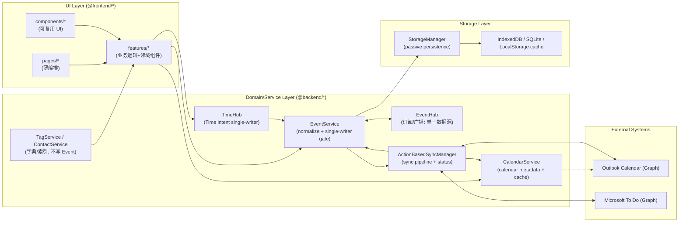

# Event Field Contract（Executable Spec）

> 目的：把字段契约写成“可执行规范（Executable Spec）”。任何工程师仅依赖本文即可回答：
> - 字段是什么意思（语义/适用范围/默认值）
> - 谁能写、谁在读（Single Writer + Readers）
> - 页面用哪个 resolver/哪个 time anchor（避免语义漂移）
> - 与外部同步（Outlook Calendar / Microsoft To Do）的映射与冲突策略
>
> 本文是新的 Single Source of Truth（SSOT）。历史文档：
> - 旧版契约（历史事实 + 过程）：docs/refactor/EVENT_FIELD_CONTRACT.md
> - 重构计划（how-to）：docs/refactor/FIELD_CONTRACT_REFACTOR_PLAN_v2.22.md

---

## 0. Scope（范围）

### 0.1 In Scope
- `Event`（唯一主实体）的字段语义、写入所有权、默认值策略、跨模块读写规则。
- Resolver 口径（Title / Time anchor）强制化。
- 外部同步映射（Outlook Calendar、Microsoft To Do）的字段表与方向规则（outbound/inbound）。

### 0.2 Out of Scope
- Signal 模型的完整落地（作为独立实体另案）；本文只约束 Event 不用 `isXxx` 模拟 Signal。
  - 现状：代码库当前没有业务意义的 `Signal`/`signals` 实体、Store 或 `SignalService`（仅在 PRD/设计稿中存在概念定义）。
  - 因而：Signal **目前没有“管辖范围/Owner”**；任何“重点标注/疑问/行动项”等信号需求，不得通过给 `Event` 加 `isXxx` 或回写派生字段来偷跑。
  - 未来：当 Signal 落地时，应作为独立实体/独立存储，由专门的 Owner（例如 `SignalService`）负责写入与一致性，`Event` 只允许通过引用或 derived index 使用。
- 大规模 UI 改造；本文只定义“写入边界/读口径/映射表”。

---

## 1. Canonical Types（权威类型）

- `Event` 与 `EventTitle`：src/types.ts
- Outlook/To Do 支持字段清单与映射：src/utils/outlookFieldMapping.ts
- 同步路由：src/utils/syncRouter.ts
- App 目录分层与模块边界（v2.22 口径）：docs/architecture/APP_ARCHITECTURE_PRD.md
- 执行口径（唯一实施入口）：docs/refactor/REFACTOR_MASTER_PLAN_v2.22.md
- 最新目标目录树（稳定结构参考）：docs/refactor/CODE_STRUCTURE_TARGET_TREE_v2.0_2026-01-03.md

---

## 2. Hard Rules（违反即 Bug）

1) **Canonical vs Derived 分离**：派生值只用于显示/排序/同步 payload，不得回写污染 `Event` 存储（除 repair/migration 工具路径）。
2) **Single Writer**：每个字段域只有一个 Owner；其他模块要改必须通过 Owner API，或携带明确 `intent` 并通过校验。
3) **时间字段允许为空（不要用页面规则兜底）**：任何 Event 都允许没有 calendar block（`startTime/endTime/isAllDay` 均可为 `undefined`），包括 Task/Plan/Note。
  - **路由规则仍然严格**：只有 `startTime && endTime` 才允许路由到 Calendar（见 syncRouter）。
  - **禁止“为了展示/排序而落库注入虚拟时间”**：例如把 Note 的 `startTime = createdAt`、或把 Task 的时间补成当天 00:00–23:59 都视为污染 canonical。
  - **展示/排序必须走 resolver**：时间轴位置用派生的 Timeline Anchor（见 5.2 #4），不改写 Core 时间字段。
4) **数组默认保留 `undefined`**：除非用户显式清空（`intent=user_clear`），否则禁止把 `tags/calendarIds/todoListIds/attendees/...` 默认写成 `[]`。
5) **Storage 被动持久化**：Storage 层不得覆盖 `updatedAt/startTime/endTime/syncStatus` 等业务字段。
6) **时间字符串格式全局禁止 ISO**：
  - **所有持久化时间字段**（Core/Sync/Meta/Derived/Snapshot）必须使用本地格式 `YYYY-MM-DD HH:mm:ss`，**严禁使用 ISO 8601**（禁止 `T` 分隔符、`Z` 后缀）。
  - **业务字段**：`startTime/endTime/createdAt/updatedAt/dueDateTime/deletedAt/checked/unchecked` 必须使用 `formatTimeForStorage()`。
  - **诊断/快照字段**：`lastNonBlankAt/bestSnapshot.capturedAt/EventSnapshot.capturedAt` 同样必须使用 `formatTimeForStorage()`，不得例外。
  - **DO** ：`formatTimeForStorage(new Date())`  `"2024-03-21 14:30:00"`
  - **DON'T** ：`new Date().toISOString()`  `"2024-03-21T14:30:00.123Z"`（禁止）
  - **Lintable 检查**：全局搜索 `toISOString()`/`toJSON()`，确保仅出现在前端日志/调试代码，不得用于 Event 字段赋值。
  - Storage 层仍然禁止擅自改写任何业务时间字段的格式。

---

## 3. Field Layers（字段分层）

- **Core（业务真相）**：用户意图与业务事实；可过滤、可同步、不可随意改写。
- **Sync（外部镜像/状态）**：外部系统映射与同步状态；只允许 Sync Owner 写。
- **Derived（可丢弃）**：可从 Core 计算重建；禁止主路径回写。
- **UI-only（临时态）**：只存在于 React state；严禁落库。

---

## 4. Owners（字段域所有权）

本节分两层：
1) **App 数据/服务/存储架构图**（结构口径：RefactorMaster + App Architecture）；
2) **Field Domains（A–I）**（可执行分治边界，新增字段/新增写入口必须对齐到某个域）。

### 4.1 App 数据/服务/存储架构图（唯一口径）

> 目的：替代“Owner 概览表”的重复信息，用一张图回答：
> - 数据从哪里来（UI/外部 Sync）
> - 谁能写入 Core（Single Writer）
> - 通过哪条管线落库（Storage）
> - Sync 如何与外部系统交互（Outlook Calendar / Microsoft To Do）



- **Single Writer（核心）**：UI/Sync 不直接写 Core 字段；必须通过 `EventService`（以及 Time 相关的 `TimeHub`）的 normalize/merge/校验链路。
- **Domain 单一数据源**：UI 读取以 `EventHub` 订阅视图为准（避免 UI 自建 `allEvents` 真相缓存；详见 `REFACTOR_MASTER_PLAN_v2.22`）。
- **Storage 被动**：`StorageManager` 只做持久化/查询，不擅自改写业务字段（详见 Hard Rules #5）。
- **字典/元数据服务**：`CalendarService` / `TagService` / `ContactService` 提供查询与缓存；不直接改写 Core 字段（Core 写入仍走 `EventService` / `TimeHub` / Sync merge）。

### 4.2 Field Domains（建议：A–I）

> 这是你提供的“原版分治表”的正式落地版本：它比上面的概览更强，因为包含 **Identity/Structure/System Trajectory/Derived** 这些最容易发生越权写与语义混载的域。

| Domain | 内容 | Owner（唯一写入方） | 其他模块权限 |
|---|---|---|---|
| A Identity & Classification | `id`, `deletedAt`, `source`（外部系统来源） | `EventService`（create/update 入口） | 只读；禁止用字段表达“视图纳入/多重角色”（见下：facet + view_membership） |
| B Content | `title.*`, `eventlog`, `description`（同步承载） | `EventService.normalizeEvent` + `EventEditModal`（输入） | 只读；禁止各页面自行回写派生内容 |
| C Time Intent & Fields | `startTime/endTime/isAllDay/timeSpec` + fuzzy 字段 | `TimeHub`（意图单一真相） | 只读；`TimeCalendar` 作为创建入口可写初值；Sync external merge 可写 |
| D Task/Plan Semantics | `checkType/checked/unchecked/isCompleted/dueDateTime/priority/recurringConfig` | `PlanManager/Task` 入口 + `EventService`（checkin 等） | 只读；禁止用 `isTask/isPlan/isDeadline` 这类布尔标记表达角色/纳入（见 7：facet） |
| I Context（Tags/People/Place） | `tags/location/organizer/attendees/reminder` | `EventService.normalizeEvent` + external merge 例外 | 只读；Tag/Contact 的字典维护不等于 Event 字段写入 |
| E Sync | `syncMode/syncStatus/externalId/calendarIds/todoListIds/synced*` | `ActionBasedSyncManager` +（部分用户意图字段由 UI 写） | UI 仅可写“用户意图”（如选择 `calendarIds/todoListIds`）；状态/外部映射仅 Sync 写 |
| F Structure | `parentEventId`（真相）/ `position`（展示） | `Plan/EventTree` | 结构真相仅来自 `parentEventId + position`；`childEventIds` 已从代码侧移除（历史数据若存在也会被忽略） |
| G System Trajectory（subordinate） | subordinate 判定（短期以 `EventService.isSubordinateEvent` 为准，长期迁移到 Signal/Telemetry 另案） | 建议迁移到 Telemetry/Signal（另案）；短期按 `EventService.isSubordinateEvent` 口径 | subordinate 属于“系统轨迹”，默认不进入主视图；其实现细节不在本 SSOT 作为架构真相 |
| H Derived/Index（不可回写） | `_isDeleted/_deletedAt/_isVirtualTime/bulletLevel?` 等 | Derived/Repair 工具路径 | **禁止**主路径回写 |

> 说明（本次口径定稿）：**不引入 `kind/recordClass/origin` 到 Event 模型**。
> - Event 可以同时拥有多个“角色”（calendar item + 可打钩 task + 被收录到 lib_store 等），不适合用单一枚举字段收敛。
> - “角色/纳入/可见性”统一用 **facet（派生谓词）** 表达，并把结果物化到 **view_membership / 各引用表（lib_store/workspace_store/sky_store）**。
> - `shouldShow(viewId)` 只负责计算/更新索引（derived），**不得回写 Event**。

### 4.3 Storage Stores（IndexedDB/SQLite：最小存储契约）

> 原则（只写“会影响契约”的 schema）：
> - `Event` 永远是唯一 Canonical 真相；其余表都是 Derived/Index/Cache（可重建）。
> - Storage schema 只有在影响 **跨模块语义 / 写入边界 / 查询能力** 时才进入 SSOT。

#### 4.3.1 Stores 总览（先看表，后看细节）

| Store | 定位 | Truth Level | Owner（唯一写入方） | 关键列（只列影响契约的） | 关键索引（只列必须理解的） | 重建/迁移 |
|---|---|---|---|---|---|---|
| `events` | 主表：Event 真相 | Canonical | `EventService`→`StorageManager` | `Event` 全量字段 | `id`（PK），（按实现可能有 `startTime` 等索引） | N/A |
| `event_stats` | 轻量索引/统计（性能优化） | Derived/Index | `EventService`（写入/更新） + Repair/Migration | `id`、`parentEventId`、`rootEventId`、`tags[]`、`calendarIds[]`、`startTime/endTime`、`updatedAt` | `parentEventId`、`rootEventId`（已存在）；（范围查询常需要 `startTime`） | `StorageManager.migrateToEventStats`（可重建） |
| `view_membership` | 视图纳入索引（可重建） | Derived/Index | `ViewMembershipService`（或等价服务） | `viewId`、`eventId`（必要时附带 `anchor`/`orderKey`） | `[viewId+eventId]` | 可全量重建（不影响 events 真相） |
| `sync_queue` | 同步动作队列 | Derived/System | `ActionBasedSyncManager` | `id`、`status`、`updatedAt` 等队列字段 | `status`/时间索引（按实现） | 可清理/可重放 |
| `tags` | 标签字典（含软删除） | Dictionary | `TagService` | `id`、`name`、`deletedAt`… | `id`/`deletedAt`（按实现） | 可从外部/本地恢复（另案） |
| `lib_store`（建议新增） | Library 精选事件引用表 | UI Local | Library 模块（独立 store，不写 Event） | `eventId`、`createdAt`、`order` | `eventId` | 本地为主；多端一致另案 |
| `workspace_store`（建议新增） | Workspace 侧边栏快捷入口引用表 | UI Local | Workspace 模块（独立 store，不写 Event） | `eventId`、`order`、`group` | `eventId` | 本地为主；多端一致另案 |
| `sky_store`（建议新增） | Sky Pin 全局顶部快捷入口引用表 | UI Local | Sky 模块（独立 store，不写 Event） | `eventId`、`pinnedAt`、`position` | `eventId`、`pinnedAt` | 本地为主；多端一致另案 |

#### 4.3.2 Store Spec：`events`

- **定位**：存储完整 `Event`（Core/Sync 字段）。
- **写入链路**：UI/Sync → `EventService.normalize/merge` → `StorageManager`。
- **不变量**：Storage 必须被动；不得改写 `updatedAt/startTime/endTime/syncStatus/...`（Hard Rules #5）。

#### 4.3.3 Store Spec：`event_stats`

- **定位**：轻量索引/统计表，目标是“快”：让 Tree 统计与某些范围/过滤不必加载全量 `Event`。
- **Schema（以代码为准）**：`src/services/storage/types.ts` 的 `EventStats`：
  - `id: string`（= eventId，PK）
  - `parentEventId?: string | null`（Tree 直接父指针引用）
  - `rootEventId?: string`（派生 root 索引，可重建）
  - `tags: string[]`、`calendarIds: string[]`
  - `startTime: string`、`endTime: string`（用于范围查询/性能；**不是语义真相**）
  - `source?: string`、`updatedAt: string`
- **索引（必须理解）**：
  - `parentEventId`、`rootEventId`（已存在：用于 count/query）。
  - 范围查询通常依赖 `startTime`（按 IndexedDB schema 实现）。
- **契约口径（避免误用）**：
  - `event_stats` 允许滞后/缺失；不得作为业务判断真相来源。
  - 不允许为了 TimeLog 查询而污染 `Event.startTime`（Hard Rules #3）。
  - 若需要“TimeLog 可查询 + 稳定排序”，应把 **派生锚点** 物化为 `event_stats.timelineAnchor`（Derived/Index，可重建），而不是用 `startTime=createdAt` 这种 Core 污染。

#### 4.3.4 Store Spec：`sync_queue`

- **定位**：同步动作队列（重放/失败重试/状态机）。
- **Owner**：`ActionBasedSyncManager`。
- **不变量**：不得承载业务真相；队列项可清理、可重放。

#### 4.3.5 Store Spec：`tags`

- **定位**：标签字典（可软删除），用于 UI 展示与过滤。
- **Owner**：`TagService`。
- **不变量**：字典维护 ≠ 写 `Event.tags`；Event 的 tags 仍由 Event Owner 写入与 merge。

#### 4.3.6 Store Spec：`lib_store`（建议新增）

- **定位**：Workspace/SkyPin 等“快捷入口”，仅保存 `eventId` 引用 + 排序/分组元信息。
- **Owner**：对应 UI 模块（独立 store，不写 Event）。
- **同步边界**：默认本地；若未来多端一致，走应用自有同步（另案）。

---

## 5. Resolver Contracts（页面必须显式声明）

### 5.1 Title Resolver
- UI 展示标题：必须使用 `resolveDisplayTitle(event)`（只读派生，不回写）。
- 外部同步标题：必须使用 `resolveSyncTitle(event)`（只读派生，不回写）。

### 5.2 Time Anchor（允许四种口径；排序/展示必须声明）
1) **Calendar block（发生区间）**：`startTime/endTime/isAllDay`
2) **Deadline（截止）**：`dueDateTime`
3) **Anchor（派生、只读）**：
   - strict-time：`timeSpec.resolved`
   - derived anchor：`resolveCalendarDateRange(event)`
4) **Timeline Anchor（时间轴锚点：派生、只读、不可落库）**：`resolveTimelineAnchor(event, scope)`
  - 目的：TimeLog/Timeline 等视图需要一个“可排序的位置”，但不能用“落库注入虚拟 startTime”来达成。
  - 推荐优先级（scope='timelog' 的默认口径）：
    - 有 calendar block：用 `startTime`（发生区间的开始）
    - 否则若有 `timeSpec.resolved`：用其 resolved（允许 Note/Task/Plan 仅用于锚点展示）
    - 否则：用 `createdAt`（Meta；所有事件必须有，作为稳定 fallback）
  - 不变量：Timeline Anchor **只用于展示/排序/分组**，不得回写到 `startTime/endTime`。

> 说明：这四种 anchor 是“语义口径”，不是“页面特例”。页面不应定义“哪些页面时间可以为空”；任何事件都可以为空，页面只需选择合适的 anchor 与过滤规则。

---

## 6. Field Registry（字段总表：语义 + 默认值 + 外部映射）

> 说明：此表只列 Core/Sync 的“稳定字段”。UI-only 与 derived 不允许落库，不在此表中作为 contract 字段。

| Field | Layer | 默认值策略 | Owner | 用途（简述） | External Sync |
|---|---|---|---|---|---|
| `id` | Core | 必填 | create 入口 | 主键 | 不同步（本地） |
| `title.*` | Core | 允许缺省 | Content | 三层标题架构 | Calendar.subject / Todo.title（通过 resolver） |
| `eventlog` | Core | `undefined` | Content | 富文本正文真相 | 不直接同步（会派生到 `description`） |
| `description` | Core | `undefined` | Content | 同步承载（纯文本 + 签名） | Calendar.body / Todo.body |
| `timeSpec` | Core | `undefined` | Time | 时间意图真相 | 不直接同步（映射为 start/end） |
| `startTime` | Core | Task/Plan 允许 `undefined` | Time | 日历开始（本地格式） | Calendar.start |
| `endTime` | Core | Task/Plan 允许 `undefined` | Time | 日历结束（本地格式） | Calendar.end |
| `isAllDay` | Core | 允许 `undefined` | Time | 全天标志 | Calendar.isAllDay |
| `tags` | Core | 默认 `undefined` | Context | 标签 ID 列表（本地分类） | 不同步（本地字段，merge 保护） |
| `location` | Core | 默认 `undefined` | Context | 地点（string 或对象） | Calendar.location |
| `organizer` | Core | 默认 `undefined` | Context | 组织者（只读/外部回灌为主） | Calendar.organizer（inbound 为主） |
| `attendees` | Core | 默认 `undefined` | Context | 参会人（Contact[]） | Calendar.attendees |
| `reminder` | Core | 默认 `undefined` | Context | 提醒（分钟） | Calendar.reminderMinutesBeforeStart 等 |
| `dueDateTime` | Core | `undefined` | Task/Plan | 截止（deadline） | Todo.dueDateTime（推荐唯一来源） |
| `syncMode` | Sync | `undefined` | Sync | receive-only 等策略 | 路由阻断（receive-only 不推送） |
| `calendarIds` | Sync(intent) | 默认 `undefined` | UI(intent) | 选择目标日历 | 影响 Calendar target 选择（实现细节） |
| `todoListIds` | Sync(intent) | 默认 `undefined` | UI(intent) | 选择目标 To Do List | 影响 Todo target 选择（实现细节） |
| `externalId` | Sync | `undefined` | Sync | 外部映射（outlook-/todo-） | 双向映射 key |
| `syncStatus` | Sync | `undefined` | Sync | pending/synced/error 等 | Sync 状态 |
| `createdAt` | Meta | create 时写入 | Meta | 创建时间（本地格式） | inbound 可来自远端 |
| `updatedAt` | Meta | 实质变更才更新 | Meta | 仲裁依据 | inbound 可来自远端；Storage 禁止覆盖 |
| `deletedAt` | Meta | `undefined/null/ISO` | Meta | 软删除 tombstone | outbound delete / inbound delete 合并 |

### 6.1 Exhaustive Field Inventory（MECE：按 Domain A–I 全量列出）

> 这是“MECE 全量覆盖”的关键：**以 `src/types.ts` 的 `Event` interface 为准**，逐字段归入 A–I 之一。
> 若代码新增了字段但未在此清单登记：视为 contract 违规（需要补 Field Card/Owner/默认值策略）。

#### A. Identity & Classification（身份/分类）
- `id`
- `deletedAt`
- `source`（`local/outlook/google/icloud`）
- `fourDNoteSource`（legacy）
- 兼容/展示分类：`type`（legacy）、`category`（legacy/展示）

> 约束（本 SSOT 的架构真相）：**分类/角色/视图纳入**不允许依赖 `isXxx` / `type/category` 等“缓存/标记字段”。
> - 这些字段即使仍存在于历史数据或当前 schema，也必须被视为 **out-of-contract 的 legacy**（只允许兼容读，禁止作为新逻辑的判定依据）。

**Legacy（out-of-contract，仅兼容读，不得用于新逻辑）**
- 分类 flags（历史残留/并存）：`isPlan/isTask/isTimeCalendar/isTimer/isTimeLog/isOutsideApp/isDeadline/isNote`
- 以及任何把“模块入口/页面角色”写进 Event 的布尔标记

> **本方案口径：facet + view_membership（不新增 kind）**
> - Event 的“角色”允许并存：
>   - Calendar item：由 `startTime/endTime/isAllDay/timeSpec.resolved` 推导（布局/面板只读推导，不回写 `category`）。
>   - Task（可打钩能力）：由 `checkType`（以及相关完成/签到字段）推导；不与 Calendar 角色互斥。
>   - Library/Workspace/Sky：由 `lib_store/workspace_store/sky_store` 引用决定。
> - “是否纳入某个 view”由 `shouldShow(viewId)` 计算，并物化到 `view_membership`（derived），**不得写回 Event 字段**。

> 注：`workspace sidebar` 与 `pin to sky` 更推荐做成“独立的本地 workspace_store/sky_store（按 eventId 引用）”，而不是写进 Event，避免无谓 diff 与 merge 冲突；见 9.12/9.13。

#### B. Content（内容真相与承载）
- `title`（`EventTitle`：`fullTitle/colorTitle/simpleTitle/formatMap`）
- `eventlog`（`string | EventLog`）
- `description`（纯文本，同步承载）
- Plan 兼容字段：`content`（deprecated）、`emoji`、`color`、`notes`

#### C. Time Intent & Fields（时间意图与日历区间）
- Calendar block：`startTime/endTime/isAllDay`
- 意图对象：`timeSpec`
- 模糊时间/状态：`displayHint/isFuzzyDate/timeFieldState/isFuzzyTime/fuzzyTimeName`

#### D. Task/Plan Semantics（任务/计划语义）
- 任务语义（可打钩/签到/周期）：`checkType/checked/unchecked/recurringConfig`
- 截止语义：`dueDateTime`
- 完成/优先级：`isCompleted/priority`
- 签到/打卡：`checked/unchecked/checkType/recurringConfig`
- 兼容：`mode`（legacy）、`reminder`（若被当作任务提醒则需要明确域归属；当前实现更贴近 Calendar/Sync）

#### I. Context（Tags / People / Place）
- 标签：`tags`
- 地点：`location`
- 组织者/参与者：`organizer/attendees`
- 提醒：`reminder`

#### E. Sync（同步意图/状态/外部映射）
- 统一模式：`syncMode`
- 用户意图：`calendarIds/todoListIds/subEventConfig/hasCustomSyncConfig`
- 同步状态：`syncStatus/lastSyncTime`
- 外部映射：`externalId`
- 多日历映射（Plan/Actual）：`syncedPlanCalendars/syncedActualCalendars`
- 旧字段（deprecated）：`syncedPlanEventId/syncedActualEventId/syncedOutlookEventId`
- 配置对象（历史/并存）：`planSyncConfig/actualSyncConfig`

#### F. Structure（结构真相）
- 树结构真相：`parentEventId`
- 同级排序：`position`
- 双向链接：`linkedEventIds/backlinks`
- Historical residual：`childEventIds`（已移除；若历史数据仍存在，读写路径会忽略）

#### G. System Trajectory（系统轨迹 / subordinate）
- subordinate 判定（短期以 `EventService.isSubordinateEvent` 为准，长期迁移到 Signal/Telemetry 另案）
- 计时相关：`timerSessionId`

#### H. Derived / Internal / Repair-only（不可回写的内部/派生）
- 临时 ID 追踪：`_isTempId/_originalTempId`
- 内容生命周期诊断：`lastNonBlankAt`（注释中明确为 ISO 8601）
- 最佳快照：`bestSnapshot`（内部结构允许包含 ISO 8601 时间戳，如 `capturedAt`）

---

## 7. Field Cards（固定格式：新增/争议字段必须先写）

### Field Card：`title`（三层标题架构 v2.14）
- 层级：Core
- 语义（一句话）：标题的多表示形式（完整富文本 / 去元素富文本 / 纯文本），用于编辑、展示、搜索与外部同步。
- 结构：`EventTitle`（`fullTitle/colorTitle/simpleTitle/formatMap`）
- Writers：UI（用户编辑输入）→ `EventService.normalizeTitle/normalizeEvent`（canonical 化）
- Readers：
  - UI：只读派生 `resolveDisplayTitle(event)`
  - Sync：只读派生 `resolveSyncTitle(event)`（通常落到 `simpleTitle`）
- 默认值：允许缺省；缺省时由 resolver 兜底展示/同步（但不得回写）
- 不变量：
  - 禁止把 resolver 的派生结果写回 `event.title.*`（避免默认值注入与 diff 噪音）。
  - 禁止把 `eventlog/description/tags` 的派生摘要回写进 `title`。

### Field Card：`dueDateTime`（Task 截止时间 / deadline）
- 层级：Core
- 语义（一句话）：任务必须完成的截止时间点，用于过期/提醒/同步到 To Do。
- 适用对象：task-like 事件（具备任务语义：例如存在 `checkType` 或相关签到/完成字段）
- Writers：Plan/Task 入口（用户显式设置）；external merge（如果未来实现 inbound task sync）
- Readers：Plan（过期过滤/排序）、Dashboard（倒计时/范围过滤）、Sync（To Do 映射）
- 默认值：`undefined`（无截止就不写）
- 不变量：
  - 不得把 `endTime` 当作 `dueDateTime` 的别名（除非明确双写策略 + 迁移门禁）。
- External Sync（To Do）：
  - Outbound：`dueDateTime` → Graph `dueDateTime`（注意 Graph 字段包含 `{ dateTime, timeZone }`）。
  - Inbound：若未来实现 To Do inbound，仅允许 external_sync intent 写入此字段。

### Field Card：`updatedAt`（仲裁时间戳）
- 层级：Meta
- 语义（一句话）：用于“最后写入胜出（LWW）”仲裁、同步去重、EventHistory 判定的核心时间戳。
- Writers：`EventService`（实质变更才更新）/ `TimeHub`（时间变更）/ external merge（远端 lastModified）
- Readers：Sync（去重/冲突）、EventHistory（是否记录）、UI（排序/最近更新）
- 默认值：create 时必填；update 时仅在实质变更才更新
- 不变量：
  - Storage 层不得覆盖传入的 `updatedAt`。
  - 禁止“无实质变更但强制更新时间”（会放大噪音）。

### Field Card：`startTime/endTime/isAllDay`（Calendar block 发生区间）
- 层级：Core
- 语义（一句话）：事件在日历上的发生区间（calendar block）。
- 适用对象：需要路由到 Calendar 的事件必须具备（`startTime && endTime`）；其他事件允许缺失（包括 Task/Plan/Note）。
- Writers：TimeHub（用户意图真相）；TimeCalendar 创建入口可写初值；external merge 例外
- Readers：TimeCalendar（按天/范围）、Sync（Calendar 映射）、TimeLog（时间轴锚点只读推导；不要求显式 calendar block）
- 默认值：Task/Plan 保持 `undefined`；禁止虚拟时间注入
- 默认值：Task/Plan/Note 保持 `undefined`；禁止虚拟时间注入（例如为 TimeLog 展示把 `startTime=createdAt`）
- 不变量：
  - `startTime && endTime` 才允许路由到 Calendar（见 syncRouter）。

### Contract Card（Derived）：`facet` + `view_membership`（多重角色与视图纳入）
- 层级：Derived/Index（**不是 Event 字段**）
- 语义（一句话）：Event 的“多重角色”与“是否纳入某个 view”统一由派生谓词表达，并把纳入结果物化到 `view_membership`（可重建索引）。
- Writers：
  - `shouldShow(viewId)` / `ViewMembershipService`：只写 `view_membership`（以及 lib_store/workspace_store/sky_store 等引用表），**不得回写 Event**。
  - UI：只允许通过显式动作更新“引用表/用户意图字段”（例如加入 Library → 写 `lib_store`）。
- Readers：所有模块（Plan/TimeLog/TimeCalendar/SyncRouter/Search）。
- 不变量：
  - 禁止引入/依赖 `kind` 来表达互斥类型；禁止将 facet 结果写回 Event（避免循环依赖与 merge 冲突）。
  - `category/type/isDeadline` 等“结果缓存”字段仅允许 legacy 兼容读；新逻辑必须从 facet 推导。

### Executable Spec：`view_membership`（索引如何维护）

> 目标：把 “view_membership 架构真相” 直接写进 SSOT，避免再维护第二份架构文档。

**核心事实（必须遵守）**
- `view_membership` 是 Derived/Index：可重建、可清空重算、不得回写 Event。
- membership（纳入）与排序锚点（anchor/orderKey）分离：
  - membership 只回答：`eventId` 是否属于 `viewId`
  - anchor/orderKey 只回答：在该 view 内怎么排序/分组（派生，可更新）

**数据输入（唯一来源）**
- Event 变更：来自 `EventService`（create/update/delete/merge）
- 引用表变更：来自 `lib_store/workspace_store/sky_store`（新增/移除/排序）

**最小触发字段（只列 contract 级依赖）**
- TimeLog（membership）：`deletedAt` + subordinate 判定（通过 `EventService.isSubordinateEvent(event)`）
- TimeLog（排序锚点）：`startTime/endTime/timeSpec/createdAt`（用于 `resolveTimelineAnchor`）
- Library/Workspace/Sky：不走 `view_membership`，直接由对应引用表决定纳入（`lib_store/workspace_store/sky_store`）
- TimeCalendar：不走 `view_membership`（AllDay/Task/Deadline 是 UI panels；显示/隐藏由 CalendarSettings 控制，分类由 ToastUI category 派生）

**应当写入到 `view_membership` 的列（建议最小集）**
- `viewId: string`
- `eventId: string`
- `anchor?: string`（可选：排序锚点，使用本地时间字符串或可比较的 orderKey）
- `updatedAt: string`（Meta，用于诊断与增量维护；不作为业务真相）

**增量维护算法（伪代码，契约级）**

```ts
type ViewId = 'timelog' | string;

function onEventUpsert(event: Event) {
  // 1) membership
  const inTimeLog = shouldShow_TimeLog(event);
  upsertOrDeleteMembership('timelog', event.id, inTimeLog);

  // 2) ordering (independent from membership)
  if (inTimeLog) {
    const anchor = resolveTimelineAnchor(event, 'timelog');
    updateMembershipAnchor('timelog', event.id, anchor);
  }
}

function onEventDelete(eventId: string) {
  deleteAllMembershipRowsForEvent(eventId);
}

function shouldShow_TimeLog(event: Event): boolean {
  if (event.deletedAt != null) return false;
  if (EventService.isSubordinateEvent(event)) return false;
  return true; // 默认全部纳入（包括 Note/Task/Plan/子事件）
}
```

> 说明：`shouldShow_*` 的实现必须保持“最小依赖字段”，避免历史爆炸；更复杂的 UI 过滤属于 UI 策略（另案），不得写入 Event。

### Field Card：`tags/calendarIds/todoListIds`（数组字段：默认值策略）
- 层级：Core（tags）/ Sync(intent)（calendarIds、todoListIds）
- 语义（一句话）：用户的分类与外部同步目标选择。
- Writers：UI（用户显式操作）+ `EventService.normalizeEvent`（按 intent 归一化）
- 默认值：保持 `undefined`（未设置）；只有用户显式“清空”才写 `[]`
- 不变量：
  - 非 `intent=user_clear` 时：任何写入口写入 `[]` 都必须被归一化为 `undefined`。
  - 禁止由“序列化/反序列化/创建模板”注入空数组作为默认值。

### Field Card：`location/organizer/attendees/reminder`（地点/参与者/提醒）
- 层级：Core
- 语义（一句话）：事件的“地点与参与者”上下文，以及 Calendar 提醒策略。
- Writers：
  - UI（EventEditModal/Calendar 编辑）→ `EventService.normalizeEvent`（canonical 化）
  - external merge 例外（Outlook inbound）→ 仍需通过 `EventService` merge 链路写入
- Readers：TimeCalendar（展示）、Sync（Outlook 映射）、EventDetail/Modal（编辑回填）
- 默认值：保持 `undefined`（未设置）；仅当用户显式设置时写入
- 不变量：
  - `organizer` 以外部回灌为主；本地编辑若不支持则不得伪造。
  - `attendees` 仅同步有 email 的联系人（详见 outlookFieldMapping）。
  - `reminder` 为分钟；`undefined` 表示未设置。
- External Sync（Outlook Calendar）：
  - Outbound：`location/attendees/reminder` → Graph 对应字段（见 8.2）
  - Inbound：仅允许 Sync merge 写入上述字段；不得覆盖本地专属字段（如 `tags`）。

### Field Card：`externalId`（外部映射键）
- 层级：Sync
- 语义（一句话）：本地 Event 与外部系统对象的一对一映射键（前缀区分系统）。
- Writers：Sync（external create / merge / migration）
- Readers：Sync（update/delete 路由）、TimeCalendar（筛选 not-synced）、诊断工具
- 约定：
  - Outlook Calendar：`externalId` 形如 `outlook-<graphEventId>`
  - Microsoft To Do：`externalId` 形如 `todo-<graphTaskId>`
- 不变量：UI 不得直接写入；只能通过 Sync 生成/变更。

### Field Card：`syncStatus`（同步状态：系统态）
- 层级：Sync
- 语义（一句话）：系统同步状态（例如 pending/synced/error），用于 UI 展示与队列管理。
- Writers：Sync（ActionBasedSyncManager / 同步服务）
- Readers：UI（状态徽标/诊断）、SyncQueue
- 默认值：允许 `undefined`（未配置/未参与同步）；禁止 UI/序列化层默认注入
- 不变量：
  - UI 仅写 intent（如 calendarIds/todoListIds/syncMode），不得“推断写”syncStatus。

### Field Card：`calendarIds/todoListIds`（用户同步意图）
- 层级：Sync(intent)
- 语义（一句话）：用户选择把事件同步到哪些外部容器（calendar 或 todo list）。
- Writers：UI（显式选择/清空）
- 默认值：保持 `undefined`；只有用户显式清空才写 `[]`（`intent=user_clear`）
- Readers：Sync（选择目标容器）

### Field Card：`deletedAt`（软删除）
- 层级：Meta
- 语义（一句话）：软删除时间戳；读路径默认不可见，但可用于避免“复活”。
- Writers：EventService delete 链路；external merge（远端删除映射）
- Readers：所有模块过滤器（默认排除）、Sync（tombstone/删除同步）、EventHistory（记录删除）
- 默认值：`undefined` 或 `null` 表示未删除；非空值以 ISO 8601 字符串为准（与 `src/types.ts` 当前 schema 对齐）
- 不变量：
  - 已删除事件默认不进入任何主视图；如需展示痕迹只能用 derived（不回写）。

### Field Card：`parentEventId/position`（结构真相）
- 层级：Core
- 语义（一句话）：EventTree/Plan 的父子结构与同级排序真相。
- Writers：Plan/EventTree 结构操作（移动、缩进、排序）
- Readers：Plan、EventTree、批量子树操作
- 不变量：
  - `childEventIds` 已移除；若历史数据仍存在，不得作为结构真相回写/依赖。

---

## 8. External Sync Mapping（外部字段表）

### 8.1 Routing（决定同步目标）
- 规则（契约口径）：
  - `syncMode==='receive-only'` → 不推送（target=none）
  - task-like（由 facet 推导：例如存在 `checkType` 或 `dueDateTime`）→ target=todo
  - `startTime && endTime` → target=calendar
  - 其他 → target=none

### 8.2 Outlook Calendar（Outbound：Event → Graph event）

| 4DNote | Graph field | 说明 |
|---|---|---|
| `resolveSyncTitle(event)`（通常来自 `title.simpleTitle`） | `subject` | 纯文本标题 |
| `description` | `body.content` | `contentType='text'` |
| `startTime` | `start.dateTime` | `timeZone='Asia/Shanghai'`（当前映射实现） |
| `endTime` | `end.dateTime` | 同上 |
| `isAllDay` | `isAllDay` | 仅当 boolean 时写 |
| `location` | `location.displayName` | 递归提取 displayName |
| `attendees[]` | `attendees[]` | 仅同步有 email 的联系人 |
| `reminder` | `isReminderOn/reminderMinutesBeforeStart` | 仅当设置 |

Inbound（Graph → Event）：以 Sync merge 规则为准；禁止把 payload 的“虚拟 endTime”回写本地。

### 8.3 Microsoft To Do（Outbound：Task → Graph todoTask）

| 4DNote | Graph field | 说明 |
|---|---|---|
| `resolveSyncTitle(event)` | `title` | 纯文本标题 |
| `description` | `body.content` | `contentType='text'` |
| `dueDateTime`（推荐唯一来源） | `dueDateTime.dateTime` | 当前 Graph 写入使用 `timeZone='UTC'` |

注意：当前仓库存在历史实现把 `endTime || startTime` 当作 To Do due（deadline）写入；这是“语义复用风险”，若采用本 contract，应在实现中收敛为 `dueDateTime`。

---

## 9. Module Contracts（按模块：读/写/过滤/禁止回写）

> 目标：本节让工程师能直接回答：
> - 这个模块**读哪些字段**（从哪层读：EventHub / EventService / TimeHub）
> - 这个模块**能写哪些字段**（写入必须走哪个 Owner API）
> - 这个模块**怎么过滤/怎么分组**（避免“不同页面不同真相”）
> - 这个模块**时间锚点**用哪个 resolver（避免 time anchor 漂移）
> - 与 Sync 的边界是什么（哪些字段禁止被远端覆盖/哪些字段只允许 Sync 写）

### 9.0 通用规则（所有模块必须遵守）

**读路径（Single Source of Truth）**
- 列表/范围查询：优先走 `EventService.getEventsByRange/getTimelineEvents/queryEvents`（避免 UI 自建 `allEvents` 真相）。
- 单事件强一致读：`EventHub.getSnapshotAsync(eventId)` 或直接 `await EventService.getEventById(eventId)`。
- 时间派生与写入：统一走 `TimeHub`（或 `EventHub.setEventTime` 代理）。

**写路径（Single Writer）**
- 除 Tag/Contact 字典等“非 Event 实体”外，任何 Event 字段写入必须通过 `EventService`（时间类字段通过 `TimeHub` 代理到 `EventService`）。
- UI 只能写 **用户意图**（例如编辑标题/正文、选择 tags、选择 calendarIds/todoListIds）；系统态（`externalId/syncStatus/lastSyncTime` 等）只允许 Sync/Service 写。

**过滤（默认不可见）**
- `deletedAt != null`：默认排除（除非是回收站/诊断工具页面）。
- subordinate（由 `EventService.isSubordinateEvent(event)` 判定）：默认排除，只有该模块显式声明纳入才可展示/统计。

**默认值（避免 diff 噪音）**
- 数组字段（`tags/calendarIds/todoListIds/attendees/...`）：默认必须保持 `undefined`；只有用户显式清空时才允许写 `[]`（`intent=user_clear`）。
- 字符串“空值”（例如 `location:''`、`description:''`）：默认不写（保持 `undefined`）；需要展示空态由 UI 处理，不得通过“默认写入空串”制造噪音。

**时间格式**
- 业务时间字符串必须使用 `src/utils/timeUtils.ts`：`formatTimeForStorage/parseLocalTimeString`；禁止 `toISOString()`。
- Sync 允许在 outbound payload 中临时添加“虚拟时间”（例如 Note 事件为了通过 Graph 的 Calendar 校验），但**禁止**把虚拟字段持久化回本地（见 `docs/architecture/SYNC_MECHANISM_PRD.md`）。

---

### 9.T 统一模板（所有模块按此顺序书写）

> 目的：让评审/实现/测试都能机械化对齐。模块若不支持某项，显式写 `N/A`。

**定位（What/Why）**
- 该模块在业务链路中的职责与边界。

**读（Read）**
- 从哪一层读取（`EventService` 列表/范围、`EventHub` 单事件快照、`TimeHub` 时间意图）。
- 读哪些字段（只需列出“它真正依赖的字段域/关键字段”，避免泛泛列全量）。

**写（Write）**
- 能写哪些字段域/字段（必须走哪个 Owner API：`EventService` / `TimeHub` / Sync merge）。
- 写入时的 normalize/校验要点（禁止默认值注入）。

**过滤（Filter/Scope）**
- 默认排除规则（`deletedAt`、subordinate），以及该模块例外纳入的条件。

**时间锚点（Time Anchor）**
- 使用哪一种 anchor（Calendar block / Deadline / Derived anchor），以及对应 resolver。

**同步边界（Sync Boundary）**
- 哪些字段是本地专属（必须 merge 保护）
- 哪些字段只允许 Sync 写（系统态）

**禁止项（Forbidden）**
- 不允许的读/写/回写/推断行为（避免“模块自建真相/派生回写/写系统态”）。

**动作（Actions：Create / Save / Delete）**
- 本地发起（UI / 本地脚本）：分别说明 Create/Save/Delete 的入口、最小写集与归一化要求。
- 远端发起（External Sync inbound）：分别说明 Create/Save/Delete 的入口、允许写入集合与保护集合。
- 远端执行（External Sync outbound）：分别说明 outbound 触发条件与禁止持久化的临时字段（如虚拟时间）。

---

### 9.1 EventEditModalV2（统一编辑入口：Create/Edit）

**定位（What/Why）**：用户显式编辑 Event 的主入口；它可以触发 Content/Context/Task/Time/Sync-intent 的变更，但不拥有系统态。

**读（Read）**
- 标题显示：`resolveDisplayTitle(event)`（只读派生，不回写）。
- 时间显示/编辑：TimeHub 快照（`TimeHub.getSnapshot(eventId)`）+ `startTime/endTime/isAllDay`（作为展示派生，真相是 `timeSpec`）。
- 结构展示（EventTree/关联）：通过 `EventService.getEventTreeContext(eventId)` 决定 gate（不依赖全量 events 预加载）。

**写（Write：必须通过 Owner API）**
- Content：`title`、`eventlog`、`description`（如需同步承载，必须由 `EventService.normalizeEventLog/normalizeEvent` 统一生成/归一化）。
- Context：`tags/location/organizer/attendees/reminder`（写入仍需走 `EventService` merge/normalize；Outlook 映射只会同步“可用 email 的联系人”，见 8.2）。
- Time：任何 `startTime/endTime/isAllDay/timeSpec` 变更必须走 `TimeHub`（或 `EventHub.setEventTime`）。
- Task/Plan：`checkType/checked/unchecked/isCompleted/dueDateTime/priority/recurringConfig`（由 Plan/Task 语义 Owner 校验，EditModal 只作为 UI 输入面）。
- Sync intent：`calendarIds/todoListIds/syncMode`（仅用户意图字段）。

**过滤（Filter/Scope）**
- N/A（编辑入口不做列表过滤；仅在打开时遵循上层传入 eventId 的可见性 gate）。

**时间锚点（Time Anchor）**
- 编辑 UI 展示：Calendar block（`startTime/endTime/isAllDay`）+ TimeHub intent（`timeSpec`）。
- 排序/分组：N/A（由宿主列表视图决定）。

**同步边界（Sync Boundary）**
- 可写的仅为用户意图字段（如 `calendarIds/todoListIds/syncMode`）；系统态（`externalId/syncStatus/lastSyncTime`）只允许 Sync 写。
- 外部回灌字段（`location/organizer/attendees/reminder/startTime/endTime/isAllDay/title/description`）只能通过 Sync merge → `EventService` 写入，不得绕过。

**禁止项（Forbidden）**
- 时间完整性：`startTime` 和 `endTime` 必须同时存在或同时为空（禁止只写一个）。
- 禁止默认值注入：不得在 UI 保存时把缺失数组写为 `[]`、把缺失字符串写为 `''`。
- 禁止写系统态：不得直接写 `externalId/syncStatus/lastSyncTime`。

**动作（Actions）**
- 本地发起 Create：通过 `EventService.createEvent`（或等价入口）；最小写集为用户输入（Content/Context/Time/Task/Sync-intent），其余保持 `undefined` 并交由 normalize。
- 本地发起 Save：通过 `EventService.updateEvent`/`TimeHub`；必须携带明确 intent（特别是数组清空 `intent=user_clear`）。
- 本地发起 Delete：通过 `EventService.deleteEvent`（写 `deletedAt` tombstone）；UI 不得物理删除。
- 远端发起（inbound）Create/Save/Delete：不在本模块直接发生；由 Sync → `EventService` merge 链路完成。
- 远端执行（outbound）：不在本模块直接发生；由 Sync 决策触发与队列。

**参考**
- docs/architecture/APP_ARCHITECTURE_PRD.md（1.3.5 规则）
- docs/architecture/EVENTHUB_TIMEHUB_ARCHITECTURE.md
- docs/PRD/EVENTEDITMODAL_MODULE_PRD.md（联系人/同步语义说明；以 `src/types.ts` 为准）

---

### 9.2 TimeCalendar（Calendar 视图：创建/拖拽/范围加载）

**定位（What/Why）**：以“日历发生区间（calendar block）”为主的视图与交互；创建与拖拽调整只产生**时间意图**，其他字段由编辑入口补充。

**读（Read）**
- 列表来源：按范围加载（优先 `EventService.getEventsByRange`；避免全表 getAllEvents 作为真相）。
- 显示标题：`resolveDisplayTitle(event)`。
- 显示时间：`startTime/endTime/isAllDay`（展示用），写入以 TimeHub 为准。

**写（Write）**
- 创建（用户拖拽选择时间段）：至少提供 `title`（空）、`startTime/endTime/isAllDay`、`createdAt/updatedAt`；其余字段保持 `undefined`，并交由 `EventService.normalizeEvent` 做缺省归一化。
- 拖拽/拉伸更新时间：只允许修改时间字段（走 `TimeHub`/`EventHub.setEventTime`）。
- Sync intent：允许用户选择 `calendarIds`（目标日历容器）；不得直接写 `syncStatus/externalId`。

**过滤（Filter/Scope：TimeCalendar 显示过滤，架构口径）**
- 事件需要满足以下任一条件才可见（并且默认排除 `deletedAt != null` 与 subordinate）：
  - `calendarIds` 命中可见日历；或
  - 本地创建标记（例如 `fourDNoteSource`）且命中本地可见组；或
  - `tags` 命中可见标签。

**时间锚点（Time Anchor）**
- Calendar block：`startTime/endTime/isAllDay`（展示与布局）；变更写入走 TimeHub。

**同步边界（Sync Boundary：契约口径）**
- “新建默认不强制同步”的行为由 Service/Sync 决策：
  - 若没有用户显式选择 `calendarIds/todoListIds` 且无外部映射：应保持 local-only（通过 `syncStatus`/`syncMode` 或等价策略表达）；
  - 一旦用户显式选择了目标容器：应进入 pending 流程，由 Sync 推送。
  - UI 不得自行推断并写 `syncStatus`。

**禁止项（Forbidden）**
- 禁止 UI 建立全量 events 真相缓存作为来源（必须按范围加载或走 service 查询）。
- 禁止写系统态（`externalId/syncStatus/lastSyncTime`）。

**动作（Actions）**
- 本地发起 Create：拖拽创建 → `EventService.createEvent`（时间字段写入走 `TimeHub` 或由 `EventService.normalizeEvent` 统一入库）；除时间与 minimal meta 外其余字段保持 `undefined`。
- 本地发起 Save：拖拽/拉伸 → 只允许时间变更（`TimeHub`）；其他字段变更必须回到 EditModal/Plan 等入口。
- 本地发起 Delete：N/A（TimeCalendar 不提供删除入口则不做；若提供，必须走 `EventService.deleteEvent` 写 `deletedAt`）。
- 远端发起（inbound）Create/Save/Delete：由 Sync merge 决策后更新本地；TimeCalendar 仅表现结果。
- 远端执行（outbound）：由 Sync 队列触发；TimeCalendar 不得直接发起 Graph 调用。

**参考**
- docs/architecture/APP_ARCHITECTURE_PRD.md（1.3.1 创建、1.3.6 过滤、1.3.7 字段保护）
- docs/PRD/TIMECALENDAR_MODULE_PRD.md

---

### 9.3 Plan（PlanManager / PlanSlate：文本解析 + 结构编辑）

**定位（What/Why）**：Plan 是“结构化文本 → Event”的批量编辑器；它既写 Content，也写 Structure（树关系），并可通过解析写入 Task/Time 语义。

**读（Read）**
- 列表/快照：由 EventHub/EventService 提供领域数据；Plan 的 focus/filter/snapshot 属于会话态，不得回写到 Event。
- 标题显示：`resolveDisplayTitle(event)`（不回写）。
- 结构读取：`parentEventId + position` 为真相。

**写（Write：必须通过 `EventService` / `TimeHub`）**
- Content：
  - `title.fullTitle/title.simpleTitle`（PlanSlate 富文本 → 标题三层架构）；
  - `eventlog`（富文本正文）与同步承载 `description`（由 normalize 生成）。
- Context：`tags`（从 `#tag` mention 提取；默认 `undefined`，显式清空才写 `[]`）。
- Task/Plan：`checkType/checked/unchecked/isCompleted/dueDateTime/priority/recurringConfig`（由模块语义决定）。
- Time：
  - 从 `@date`/date mention 解析出的**显式时间**才允许写入 `timeSpec/startTime/endTime/isAllDay`；
  - 未解析到显式时间时必须保持时间字段 `undefined`（禁止注入虚拟时间）。
- Structure：Tab/Shift+Tab 形成的层级必须写 `parentEventId`；同级顺序写 `position`（如有）。

**过滤（Filter/Scope）**
- 顶层列表：`!parentEventId` 作为 top-level（示例口径见 APP_ARCHITECTURE_PRD）。
- 子列表：按 `parentEventId === parentId` 派生查询，不维护 child 数组字段。

**时间锚点（Time Anchor）**
- Plan 的时间展示：优先显示 Derived anchor（如 `resolveCalendarDateRange(event)`）或 timeSpec.resolved；写入只在解析到显式时间时发生。

**同步边界（Sync Boundary）**
- Plan 只写用户意图（内容/结构/显式时间/任务语义）；系统态与外部映射字段由 Sync 维护。
- `tags/parentEventId/linkedEventIds/...` 等本地专属字段必须受 Sync merge 保护。

**禁止项（Forbidden）**
- 禁止把“解析失败/缺省”的结果写为默认值（例如把时间字段补成当天 00:00–23:59）。
- 禁止维护任何“父侧反向列表”作为结构真相；只写子节点自身的 `parentEventId`（必要时更新 `position`）。

**动作（Actions）**
- 本地发起 Create：输入行创建 → `EventService.createEvent`；最小写集为 `title`（允许空）+（可选）解析得到的 tags/task/time/structure。
- 本地发起 Save：文本变更批量更新 → `EventService.updateEventBatch`（或等价）；时间变更走 `TimeHub`。
- 本地发起 Delete：删除行/节点 → `EventService.deleteEvent` 写 `deletedAt`；不得物理删除。
- 远端发起（inbound）Create/Save/Delete：Plan 不直接执行；同步结果只读呈现。
- 远端执行（outbound）：Plan 不直接执行；由 Sync 读取本地变更后推送。

**参考**
- docs/architecture/APP_ARCHITECTURE_PRD.md（1.3.4 创建、1.3.6 过滤）
- docs/PRD/PLANMANAGER_MODULE_PRD.md（Tab/Shift+Tab 行为与状态分类）
- docs/PRD/EVENTTREE_MODULE_PRD.md（ADR-001）

---

### 9.4 EventTree（结构/关联：ADR-001）

**定位（What/Why）**：EventTree 负责树关系与关联关系的展示/编辑；结构真相只允许来自 `parentEventId`。

**读（Read）**
- gate/root/count：优先使用 stats-backed 的树上下文 API（目标口径：`EventService.getEventTreeContext(eventId)`），避免依赖全量 events 是否加载。
- 子节点查询：`parentEventId` 派生（可通过 stats 索引优化，不扫全表）。

**写（Write）**
- reparent：只写子节点自身的 `parentEventId`（必要时更新 `position`）。
- 关联：`linkedEventIds/backlinks` 的双向维护必须由 Owner API 统一处理（避免单边脏链）。

**过滤（Filter/Scope）**
- 默认排除 `deletedAt != null` 与 subordinate；若展示“系统事件/计时记录”，必须显式声明纳入集合。

**时间锚点（Time Anchor）**
- N/A（结构模块不以时间为主锚；如需在树中展示时间，只能读 `resolveCalendarDateRange(event)`，禁止回写）。

**同步边界（Sync Boundary）**
- 结构字段（`parentEventId/position/linkedEventIds/backlinks`）属于本地结构真相，必须受 Sync inbound merge 保护（除非未来明确支持远端结构同步，另案）。

**禁止项（Forbidden）**
- `parentEventId` 是唯一结构真相；`event_stats` 为派生索引，可重建，不能反向成为真相。

> 兼容性说明：当前仓库已移除 `childEventIds` 的读写/遍历路径；历史数据若仍存在该字段，会被忽略。本 contract 以 ADR-001 为准：结构真相仅来自 `parentEventId + position`。

**动作（Actions）**
- 本地发起 Create：N/A（EventTree 不是创建入口；创建由 Plan/Calendar/EditModal 负责）。
- 本地发起 Save：reparent/排序/关联 → 通过结构 Owner API（最终落到 `EventService` 更新 `parentEventId/position/linkedEventIds/backlinks`）。
- 本地发起 Delete：N/A（若提供删除，必须走 `EventService.deleteEvent` 写 `deletedAt`）。
- 远端发起（inbound）Create/Save/Delete：默认不涉及结构字段；若远端事件变化导致本地更新，只能落在允许 merge 的字段集合。
- 远端执行（outbound）：结构字段不参与 outbound（除非另案定义映射）。

**参考**
- docs/PRD/EVENTTREE_MODULE_PRD.md

---

### 9.5 TimeLog（Timeline：时间轴视图）

**定位（What/Why）**：TimeLog 是“按时间锚点聚合”的视图；它不是写入口，主要负责纳入规则与锚点口径。

**读（Read）**
- 列表来源：优先 `EventService.getTimelineEvents` 或范围查询（而不是 UI 全量快照）。
- 标题显示：`resolveDisplayTitle(event)`。

**写（Write）**
- TimeLog 允许用户快速记录“碎碎念 Note”（典型只写 `eventlog`，可无 `title`、无 calendar block、无 tags）。
- 写入必须通过 `EventService.createEvent/updateEvent`；不得为了锚点展示写入 `startTime/endTime`。

**过滤（Filter/Scope：架构示例口径）**
- 默认排除 `deletedAt != null`。
- timelineEvents（最终口径）：
  - 排除 subordinate（系统轨迹）：由 `EventService.isSubordinateEvent(event)`（短期）或 Signal（长期）决定。
  - 不因 `parentEventId` 排除：用户子事件也应纳入 TimeLog（树结构用于组织/展开，不是纳入开关）。
  - 其余事件默认全部纳入（包括“无 calendar block 的笔记/碎碎念”与无时间的 task）。

> 说明：TimeLog 是“时间锚点聚合视图”，不是“类型过滤器”。
> - “笔记/碎碎念”不靠 `kind/isNote` 标记，而是自然落在“无 calendar block、仅有 eventlog”的数据形态上。
> - Library/Workspace/Sky 收录不影响是否纳入 TimeLog；如需单独过滤属于 UI 策略（另案）。

**时间锚点（Time Anchor）**
- 分组/排序使用 **Timeline Anchor**：`resolveTimelineAnchor(event, 'timelog')`（派生，不回写）。
- 说明：当 Note 没有 calendar block 时，Timeline Anchor 默认回退到 `createdAt`，用于时间轴位置显示；这比“写入 startTime=createdAt”更干净。

**同步边界（Sync Boundary）**
- TimeLog 不写 Sync 字段；只消费同步后的结果数据。

**禁止项（Forbidden）**
- 禁止在 TimeLog 内生成或写回任何派生锚点字段。
- 禁止把“可见性/纳入规则”写回到 Event 字段（这些属于 UI 过滤策略）。

**动作（Actions）**
- 本地发起 Create：快速记录 Note → `EventService.createEvent`，最小写集：`eventlog` + `createdAt/updatedAt`；`title/tags/startTime/endTime/isAllDay` 允许全部缺省。
  - 支持“创建过去的事件/笔记”：用户若显式选择日期/时间，则写入 `timeSpec`（或 calendar block，取决于用户选择的是锚点还是发生区间）；否则保持时间字段为空。
- 本地发起 Save：编辑 `eventlog`（与可选的 `title/tags`）→ `EventService.updateEvent`；不得注入虚拟时间。
- 本地发起 Delete：允许删除 → `EventService.deleteEvent` 写 `deletedAt`。
- 远端发起（inbound）Create/Save/Delete：由 Sync 处理并呈现结果；注意 external inbound 不得覆盖本地 Note/Library 分类字段。
- 远端执行（outbound）：TimeLog 不直接触发；由 Sync 决策。

**参考**
- docs/architecture/APP_ARCHITECTURE_PRD.md（1.3.2 创建、1.3.6 过滤）
- docs/architecture/EVENTHUB_TIMEHUB_ARCHITECTURE.md（范围列表建议走 EventService）

---

### 9.6 Timer（计时器：Start/Running/Stop 生命周期）

**定位（What/Why）**：Timer 是“用户专注时间”的主动记录器；运行中强调本地持久化与 UI 即时反馈，停止后才进入同步队列。

**读（Read）**
- 运行中状态：UI 使用全局 timer 会话态（不落库），事件对象作为持久化容器。

**写（Write）**
- Start：创建或更新一个 `isTimer===true` 的事件（时间字段使用 `formatTimeForStorage`），并写入 `tags`（若用户选择了标签）。
- Running：允许周期性保存进展（例如更新 `endTime/updatedAt`），但不得触发同步推送。
- Stop：写入最终 `endTime` 并触发进入 pending 流程（由 Sync/Service 决策状态字段）。
- 二次计时升级：当对已完成的独立 Timer 再次启动时，可通过 `parentEventId` 将其升级到父子结构；结构真相仍遵循 ADR-001。

**过滤（Filter/Scope）**
- Timer 事件属于 subordinate，默认不进入 TimeCalendar/Plan/TimeLog 主视图；仅 Timer 模块与诊断工具显式纳入。

**时间锚点（Time Anchor）**
- Calendar block：`startTime/endTime`（Timer 的发生区间）；写入必须使用本地时间格式。

**同步边界（Sync Boundary）**
- 运行中禁止同步；停止后再进入同步（具体状态字段由 Sync/Service 写入）。

**禁止项（Forbidden）**
- 禁止运行中写入/触发 outbound 同步。
- 禁止 Timer 模块写系统态字段（`externalId/syncStatus/lastSyncTime`）。

**动作（Actions）**
- 本地发起 Create：Start（新建 Timer Event）→ `EventService.createEvent`；必须写 `isTimer=true` 与 `startTime`，其余最小化（避免注入空数组/空串）。
- 本地发起 Save：Running 周期保存 → 仅允许 `endTime/updatedAt` 等最小字段；Stop 结束保存 → 写最终 `endTime`。
- 本地发起 Delete：若支持删除 Timer 记录，必须走 `EventService.deleteEvent` 写 `deletedAt`。
- 远端发起（inbound）Create/Save/Delete：默认不应创建 Timer（本地专属轨迹）；若未来支持另案。
- 远端执行（outbound）：仅 Stop 后可入队；运行中禁止。

**参考**
- docs/PRD/TIMER_MODULE_PRD.md
- docs/architecture/APP_ARCHITECTURE_PRD.md（1.3.3 Timer 创建）
- docs/architecture/EVENTHUB_TIMEHUB_ARCHITECTURE.md（事件更新通知与读路径）

---

### 9.7 TagManager / TagService（标签字典，不是 Event 字段 Owner）

**定位（What/Why）**：管理 Tag 实体（层级/颜色/emoji/日历映射）；它不是 `Event.tags` 的 Writer。

**读（Read：与 Event 的关系）**
- 读取 Event（通过 `EventService`）用于统计分析与“标签关联事件”查询。

**写（Write：与 Event 的关系）**
- 不得直接写任何 Event 字段。
- 标签的 `calendarMapping` 只能影响“创建/编辑事件时的默认容器选择”（由 EventEditModal/TimeCalendar/Plan 通过 intent 写入 `calendarIds`）。

**过滤（Filter/Scope）**
- N/A（标签实体本身的过滤不在本文；与 Event 的关系仅通过查询呈现）。

**时间锚点（Time Anchor）**
- N/A。

**同步边界（Sync Boundary）**
- Tag 实体如何与外部系统映射属于 TagManager 领域；但不得反向越权写 `Event.tags`。

**禁止项（Forbidden）**
- 禁止把“标签字典更新”当作 Event 的变更写入（避免噪音）。

**动作（Actions）**
- 本地发起 Create/Save/Delete：针对 Tag 实体（非 Event），不在本文展开；与 Event 的 Create/Save/Delete 无直接写入关系。
- 远端发起（inbound）Create/Save/Delete：N/A（除非标签也参与外部同步，另案）。
- 远端执行（outbound）：N/A。

**参考**
- docs/PRD/TAGMANAGER_MODULE_PRD.md

---

### 9.8 EventService / EventHub / TimeHub（领域写门禁 + 缓存/时间代理）

**定位**：
- `EventService`：唯一持久化真相源 + normalize/merge/校验门禁。
- `EventHub`：单事件缓存 + 订阅/预加载（不维护全量数组快照）。
- `TimeHub`：时间意图真相（`timeSpec`）+ `start/end/allDay` 派生写入代理。

**写门禁（必须满足）**
- 本地专属字段保护：Sync merge 必须过滤本地专属字段集合（例如 `tags/parentEventId/linkedEventIds/.../subordinate markers/...`，示例集合见 APP_ARCHITECTURE_PRD 1.3.7）。
- `updatedAt` 只在实质变更时更新；Storage 不得覆盖。

**过滤（Filter/Scope）**
- N/A（服务层提供查询能力；过滤策略由各模块通过 query 参数表达，但默认规则必须一致：排除 `deletedAt/subordinate`，除非显式声明）。

**时间锚点（Time Anchor）**
- `TimeHub` 负责 time intent（`timeSpec`）与 calendar block 写入代理；派生锚点（如 `resolveCalendarDateRange`）只能读。

**同步边界（Sync Boundary）**
- `EventService` 是所有 inbound/outbound merge 的唯一门禁；Sync 不得绕开。
- 系统态字段只允许 Sync 写；UI 写入的仅为 intent。

**禁止项（Forbidden）**
- 禁止 Storage 层覆盖业务字段（Hard Rules #5）。
- 禁止服务层把 resolver 派生回写到 Core。

**动作（Actions）**
- 本地发起 Create：`EventService.createEvent` 负责 Meta 初始化与 normalize；Time 由 `TimeHub` 代理。
- 本地发起 Save：`EventService.updateEvent`（内容/结构/上下文）+ `TimeHub`（时间）+ 统一更新 `updatedAt`（仅实质变更）。
- 本地发起 Delete：`EventService.deleteEvent` 写 `deletedAt` tombstone。
- 远端发起（inbound）Create/Save/Delete：Sync → `EventService.mergeExternal`（或等价）→ 过滤本地专属字段 → 写入允许集合。
- 远端执行（outbound）：Sync 从本地变更与路由规则决定 payload；禁止把虚拟时间等临时字段落库。

**参考**
- docs/architecture/EVENTHUB_TIMEHUB_ARCHITECTURE.md
- docs/architecture/APP_ARCHITECTURE_PRD.md（1.3.7）

---

### 9.9 Sync（ActionBasedSyncManager + syncRouter：路由/映射/合并）

**定位（What/Why）**：外部系统（Outlook Calendar / Microsoft To Do）与本地 Event 之间的增量同步管线；它拥有 Sync 域字段（状态/外部映射）。

**读（Read）**
- 同步范围：按 TimeCalendar 可视范围与预加载策略执行（典型为 ±3 个月或按实现配置）。
- IndexMap：允许从 `EventService.getAllEvents()` 重建内存索引（启动时一次）。

**写（Write）**
- 只允许写 Sync 域字段：`externalId/syncStatus/lastSyncTime` 以及外部 merge 的允许字段集合（Outlook: `title/description/startTime/endTime/location/isAllDay/attendees/organizer` 等）。
- 任何 inbound/outbound 写入必须走 `EventService` merge 链路，并携带 `source:'external-sync'` 或等价标记，确保本地专属字段保护生效。

**过滤（Filter/Scope）**
- 同步目标由 `syncRouter` 决定（receive-only 不推送；task→todo；start+end→calendar）。

**时间锚点（Time Anchor）**
- Calendar outbound 使用 calendar block（`startTime/endTime/isAllDay`）；Todo outbound 使用 deadline（优先 `dueDateTime`）。

**同步边界（Sync Boundary）**
- 系统态（`externalId/syncStatus/lastSyncTime` 等）只允许 Sync 写。
- 本地专属字段（示例：`tags/parentEventId/linkedEventIds/.../subordinate markers/...`）必须在 inbound merge 时保护，不被远端覆盖。

**禁止项（Forbidden）**
- 禁止回写 resolver 派生字段（例如把 `resolveDisplayTitle` 的结果写回 `title.simpleTitle`）。
- 禁止把 outbound 所需的“虚拟时间”持久化回本地（Note 事件仅允许在 payload 临时补齐）。

**动作（Actions）**
- 本地发起 Create/Save/Delete：本地变更只产生 intent 与 Core/Meta 的更新；是否触发 outbound 由 Sync 根据路由/队列决策。
- 远端发起（inbound）Create：Graph 新对象 → 生成/匹配 `externalId` → `EventService` 创建本地 Event（仅允许字段集合）→ 写 `syncStatus`。
- 远端发起（inbound）Save：Graph 更新 → `EventService` merge（保护本地专属字段）→ 更新 `lastSyncTime/syncStatus`。
- 远端发起（inbound）Delete：Graph 删除 → 写 `deletedAt` tombstone（或等价删除策略）并更新同步状态。
- 远端执行（outbound）Create/Save/Delete：从本地变更与路由计算 payload；允许临时“虚拟时间”仅存在于 payload，禁止落库。

**参考**
- docs/PRD/ACTIONBASEDSYNCMANAGER_PRD.md
- docs/architecture/SYNC_MECHANISM_PRD.md

---

### 9.10 EventHistoryService（审计：记录有意义的变更）

**定位（What/Why）**：记录 Event 的 create/update/delete/checkin 等变更，用于审计与调试；它不能成为业务写入的驱动力。

**读（Read）**
- 读取 Event 变更流（或变更前后快照）用于生成审计记录。

**写（Write）**
- 只写 EventHistory 实体/日志（非 Event）；不得写回 Event 字段。

**过滤（Filter/Scope）**
- 仅记录“有意义”的业务变更；忽略噪音字段（见下）。

**时间锚点（Time Anchor）**
- 使用 `updatedAt` 作为变更时间主锚（必要时可记录来源时间，如 external lastModified），但不得改变 Event 的时间真相。

**同步边界（Sync Boundary）**
- Sync 引发的变更也会被审计，但必须能区分来源（例如 `source:'external-sync'`），避免误判为用户操作。

**禁止项（Forbidden）**
- 禁止 EventHistory “为了去噪”而修改 Event（只能在记录层面处理）。

**动作（Actions）**
- 本地发起 Create/Save/Delete：监听 `EventService` 写入口产生的变更并记录（不反向影响写链路）。
- 远端发起（inbound）Create/Save/Delete：同样记录，但必须标注 external 来源，且遵守噪音抑制规则。
- 远端执行（outbound）：N/A。

**变更检测口径（避免历史爆炸）**
- 忽略自动字段与派生噪音：例如 `updatedAt/position/fourDNoteSource/localVersion/lastSyncTime/...`。
- `tags`：排序+去重后比较。
- `description`：可按实现忽略或剥离签名后比较（避免签名重写制造噪音）。
- `eventlog`：只比较核心文本/忽略 block timestamp 元数据（按实现策略）。

**参考**
- docs/PRD/EVENTHISTORY_MODULE_PRD.md

---

### 9.11 Library（Explorer：文档库 / 长期维护的 Doc）

**定位（What/Why）**：Library 是“长期维护内容”的入口（类似 explorer）；用户通过 tag 或 EventTree 管理 doc。它的核心不是时间轴，而是“可维护性与组织”。

**读（Read）**
- 列表来源：`EventService.queryEvents`（或等价）按条件查询；避免 UI 自建全量缓存。
- 纳入条件：由 `lib_store` 引用表决定（`eventId` 属于 lib_store 即纳入）；并可结合 `tags/parentEventId` 做组织。
- 展示：标题用 `resolveDisplayTitle(event)`；内容预览来自 `eventlog/description`（只读）。

**写（Write）**
- Library 不直接写内容字段（编辑仍走 EventEditModal/Plan 等入口）；Library 只负责：
  - “添加到 Library/移出 Library”：写 `lib_store`（新增/删除引用）。
- 其他字段变更仍必须走 Owner API（`EventService`/`TimeHub`）。

**过滤（Filter/Scope）**
- 默认排除：`deletedAt != null`、subordinate。
- 默认不纳入：纯 Timer/TimeLog 系统轨迹事件（除非显式升级为 doc）。

**时间锚点（Time Anchor）**
- Library 的排序/最近修改：以 `updatedAt` 为主（Meta）。
- 若需要按“发生时间/锚点”展示：只允许用 `resolveTimelineAnchor(event, 'library')`（派生），不得写回 Core 时间字段。

**同步边界（Sync Boundary）**
- `lib_store` 属于应用内的“内容策展引用表”（UI Local）：
  - 外部 Graph 系统无此概念；external inbound merge 不涉及该表。
  - 若未来引入 4DNote 自有多端同步，可将其纳入“应用自有同步域”（与 Graph 解耦）。

**禁止项（Forbidden）**
- 禁止为了让 doc 在 Library“看起来有时间”而写 `startTime=createdAt`。

**动作（Actions）**
- 本地发起 Create：
  - “新建文档”推荐实现为：创建一个 Note（最小写集：`eventlog` 可为空）→ 将其 `eventId` 写入 `lib_store`（升级）。
- 本地发起 Save：只涉及 `lib_store` 引用的 add/remove；其余保存走编辑入口。
- 本地发起 Delete：走 `EventService.deleteEvent`（写 `deletedAt`）。
- 远端发起（inbound）Create/Save/Delete：N/A（除非未来引入应用自有同步；Graph inbound 不应触碰 `lib_store`）。
- 远端执行（outbound）：N/A。

---

### 9.12 Sidebar Workspace（内容面板事件选择器：快捷方式工作区）

**定位（What/Why）**：内容面板的“事件选择器”将演进为 Workspace：用户把常用 Event 以快捷方式固定在侧边栏，便于快速打开/切换。

**读（Read）**
- Workspace 只维护“引用列表”：`eventId[]` + UI 元数据（排序/分组）。
- 事件数据读取：对每个 `eventId` 通过 `EventHub.getSnapshotAsync`（或订阅）获取；列表查询不需要全表。

**写（Write）**
- **推荐最佳实践**：Workspace 数据不写入 Event；而是写入“本地 workspace_store（独立于 Event）”。
  - 这样可以避免：无意义的 Event diff、与 external sync merge 冲突、以及“快捷方式”跨设备语义不清。
- 若短期必须写入 Event：也只能写本地专属字段，并明确在 Sync inbound merge 中保护（不推荐）。

**过滤（Filter/Scope）**
- Workspace 不参与 `deletedAt/subordinate` 的业务过滤；但 UI 需对已删除/不可见的引用给出降级处理（例如隐藏或提示）。

**时间锚点（Time Anchor）**
- N/A（Workspace 是快捷方式列表，不以时间为主锚）。

**同步边界（Sync Boundary）**
- Workspace/workspace_store 默认为本地数据：
  - 不通过 Graph 同步；
  - 如未来需要多端一致，应该走应用自有同步/账号空间（另案）。

**禁止项（Forbidden）**
- 禁止为了 Workspace 排序而写入 Event 的 `position/startTime/...` 等业务字段。

**动作（Actions）**
- 本地发起 Create：无（Workspace 本身是集合）。
- 本地发起 Save：
  - “添加到侧边栏工作区”：向 workspace_store 添加 `eventId`；
  - “移除”：从 workspace_store 删除 `eventId`；
  - “排序”：只改 workspace_store 的顺序/分组元数据。
- 本地发起 Delete：无（删除事件仍走 `EventService.deleteEvent`）。
- 远端发起（inbound）Create/Save/Delete：N/A。
- 远端执行（outbound）：N/A。

---

### 9.13 Sky Pin（Pin to Sky：全局顶部快捷胶囊）

**定位（What/Why）**：用户可把正在编辑/常用的 Event pin 到全局顶部（无论在哪个菜单都能快速呼出查阅/编辑）。这是“全局快捷入口”，不是 Event 的业务字段。

**读（Read）**
- Pin 列表：来自本地 sky_store（`pinnedEventIds[]` + 排序/最近使用信息）。
- 事件内容：通过 `EventHub` 订阅或 `getSnapshotAsync` 读取。

**写（Write）**
- Pin/unpin 不写 Event；只写 sky_store。
- 若需要“固定时刻/固定视图状态”，也应写入 sky_store（UI-only），不进 Event。

**过滤（Filter/Scope）**
- 若 pin 的 event 已删除（`deletedAt != null`），应自动移除或降级提示（不回写 Event）。

**时间锚点（Time Anchor）**
- N/A。

**同步边界（Sync Boundary）**
- 默认本地；未来多端一致另案。

**禁止项（Forbidden）**
- 禁止为了 pin 状态写入 Event 字段（避免扩散为业务真相与 merge 冲突）。

**动作（Actions）**
- 本地发起 Save：pin/unpin/reorder → 更新对应的引用表（lib_store / sky_store / workspace_store）。
- 本地发起 Delete：删除事件仍走 `EventService.deleteEvent`；pin 状态随 UI 自动清理。
- 远端发起（inbound）Create/Save/Delete：N/A。
- 远端执行（outbound）：N/A。

---

## 10. Deprecations（遗留字段口径）

- `type`：legacy，仅用于兼容；新代码不应依赖其作为真相。
- `content`：已废弃（使用 `title.fullTitle`）。
- `childEventIds`：已移除（历史数据若存在会被忽略），结构真相来自 `parentEventId + position`。
- `fourDNoteSource`：历史字段，逐步迁移到 `source`（读取层可双读）。

---

## 11. Verification Gates（验收门禁）

- Storage 更新不得覆盖传入 `updatedAt`。
- 非 `intent=user_clear` 时，数组字段 `[]` 必须被归一化为 `undefined`。
- Task/Plan/Note 允许 `startTime/endTime/isAllDay` 全 `undefined`，且保存/重开不会被注入默认值。
- TimeLog/Timeline 的锚点展示必须使用 `resolveTimelineAnchor`（派生），不得通过“写入 startTime=createdAt”实现。
- UI 展示标题全部走 `resolveDisplayTitle`；Sync 标题全部走 `resolveSyncTitle`。
- `syncRouter` 的路由规则与本文一致（receive-only 不推送；task→todo；start+end→calendar）。
- `deletedAt` 必须为 `null` 或 ISO 8601 字符串；不得写入本地格式时间字符串。
