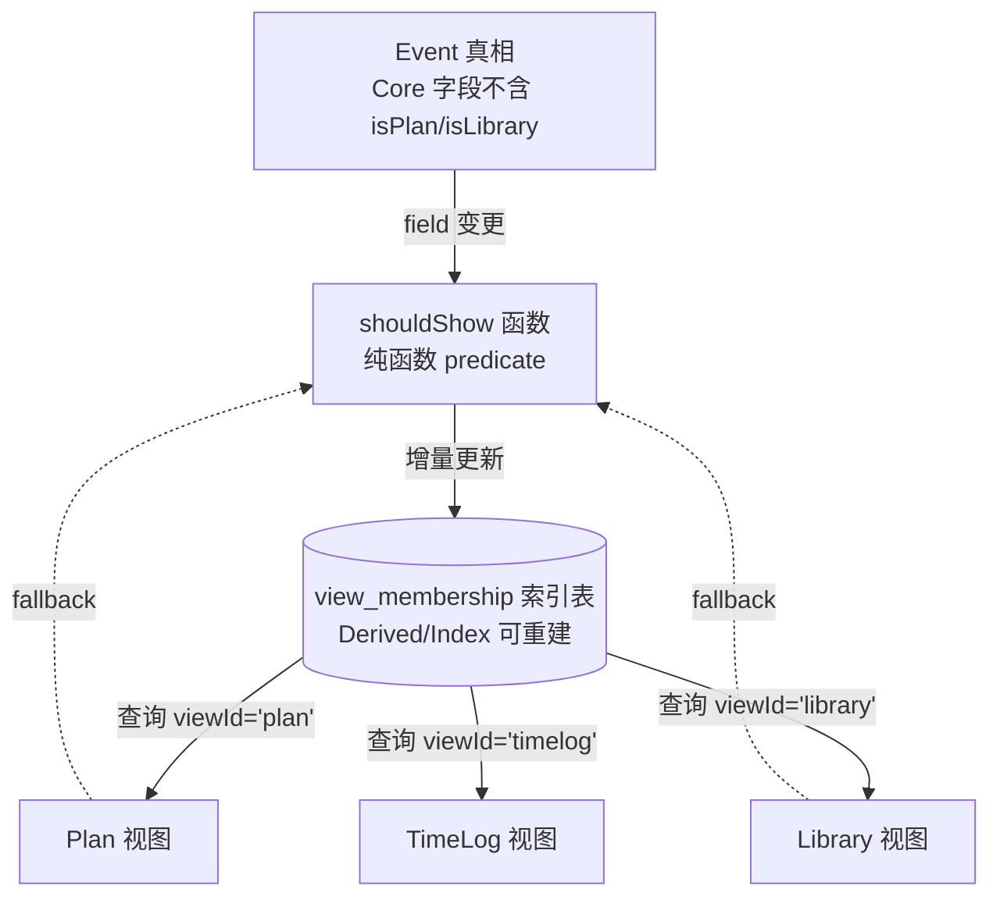

# View Membership Architecture（视图归属架构，历史文档）

> 注意：从 2026-01 起，**view_membership 的架构真相只维护在 SSOT**：
> - docs/refactor/EVENT_FIELD_CONTRACT_EXECUTABLE.md
>
> 本文保留为早期草案留档，不再作为唯一口径更新。

> **这是删除 `isPlan/isLibrary/isTimeCalendar` 后的唯一替代方案**  
> 目的：把"视图纳入规则"物化为可重建索引，避免全量加载 + 内存过滤，同时清理 Event 字段污染。

> 注意：该文档为早期草案；历史上最终口径曾以 `docs/refactor/VIEW_MEMBERSHIP_FINAL_ARCHITECTURE.md` 为准。

---

## 1. 问题背景

### 1.1 现状问题

**字段污染**：
- `isPlan/isLibrary/isTimeCalendar/isInLibrary` 等旗标污染 Event Core
- 这些字段不是业务真相，而是"视图纳入规则"的缓存
- 导致 Sync merge 冲突、多端不一致、语义混乱

**性能问题**：
- Plan/Library 当前必须全量加载 `EventService.getAllEvents()`（例如 10000 个事件）
- 然后在内存中用 `shouldShowInPlanManager` 过滤（留下 500 个）
- 90% 的事件被加载后立即丢弃

**逻辑散落**：
- 每个视图都有自己的过滤逻辑（`shouldShowInPlanManager`、Library 过滤、TimeLog 过滤等）
- 没有统一的"哪些事件属于哪个视图"的管理点
- 新增视图或调整规则时需要改多处代码

###1.2 解决方案

**核心思路**：
1. **中心化过滤逻辑**：`shouldShow(event, viewId, context)` 统一管理所有视图的纳入规则
2. **物化为索引**：把结果存入 `view_membership` 表（Derived/Index，可重建）
3. **查询优化**：视图加载时直接查 `view_membership`，只加载需要的事件
4. **删除旗标**：逐步删除 `isPlan/isLibrary/isTimeCalendar` 等 Event 字段

---

## 2. 架构设计

### 2.1 核心组件



### 2.2 Store Schema

#### `view_membership` 表

```typescript
interface ViewMembership {
  eventId: string;      // Event ID
  viewId: string;       // 'plan' | 'library' | 'timelog' | 'workspace' | ...
  metadata?: string;    // 可选：JSON 存储视图特定元数据（例如 Library 收藏时间、顺序）
  updatedAt: string;    // 索引最后更新时间（本地格式 YYYY-MM-DD HH:mm:ss）
}
```

**索引**：
- 主键：`(eventId, viewId)` 联合唯一
- 单列索引：`eventId`（查询"某事件在哪些视图"）
- 单列索引：`viewId`（查询"某视图包含哪些事件"，**核心查询路径**）

**契约**：
1. **Derived/Index**：必须可通过 `shouldShow` 全量重建
2. **允许滞后/缺失**：查询时若索引缺失，fallback 到实时计算
3. **禁止回写 Event**：索引结果不得回写为 `isPlan/isLibrary` 等字段
4. **更新时机**：Event 变更后触发增量更新 + 定期/按需 rebuild

---

## 3. 核心函数：`shouldShow`

### 3.1 函数签名

```typescript
/**
 * 判断某个 Event 是否应该出现在指定视图中
 * 
 * @param event - Event 实体
 * @param viewId - 视图 ID（'plan' | 'library' | 'timelog' | ...）
 * @param context - 可选：视图上下文（例如 snapshot dateRange、showCompleted 等）
 * @returns true = 应该纳入；false = 应该排除
 */
function shouldShow(
  event: Event,
  viewId: string,
  context?: ViewContext
): boolean;

interface ViewContext {
  mode?: 'normal' | 'snapshot';
  dateRange?: { start: Date; end: Date };
  showCompleted?: boolean;
  // ... 按需扩展
}
```

### 3.2 视图规则（唯一定义）

#### Plan (`viewId='plan'`)

```typescript
function shouldShow_Plan(event: Event, context?: ViewContext): boolean {
  // 步骤0: 排除已删除
  if (event.deletedAt) return false;
  
  // 步骤1: 并集条件（三选一）
  const matchesInclusion =
    event.isPlan === true ||  // 迁移期兼容
    (event.checkType && event.checkType !== 'none') ||
    event.isTimeCalendar === true;  // 迁移期兼容
  
  if (!matchesInclusion) return false;
  
  // 步骤2: 排除系统事件
  if (EventService.isSubordinateEvent(event)) return false;
  
  // 步骤3: 模式参数过滤
  if (context?.mode === 'normal') {
    // 完成态
    if (!context.showCompleted && event.isCompleted) return false;
    
    // 过期（超过 7 天未完成）
    if (event.dueDateTime) {
      const dueDate = parseLocalTimeStringOrNull(event.dueDateTime);
      if (dueDate) {
        const daysDiff = (Date.now() - dueDate.getTime()) / (1000 * 60 * 60 * 24);
        if (daysDiff > 7 && !event.isCompleted) return false;
      }
    }
  } else if (context?.mode === 'snapshot' && context.dateRange) {
    // Snapshot 模式：按日期范围
    try {
      const { start } = resolveCalendarDateRange(event);
      return start >= context.dateRange.start && start <= context.dateRange.end;
    } catch {
      return false;
    }
  }
  
  return true;
}
```

**迁移路径**：
- **Phase 1（0–6 个月）**：保留 `isPlan/isTimeCalendar` 字段只读兼容
- **Phase 2（6–12 个月）**：删除旧字段，改用 `checkType` + 其他语义判断

#### Library (`viewId='library'`)

```typescript
function shouldShow_Library(event: Event): boolean {
  // 步骤0: 排除已删除
  if (event.deletedAt) return false;
  
  // 步骤1: 由 lib_store 引用决定
  // 实现：查询 lib_store 是否引用该 eventId
  const isInLibraryStore = await db.libStore
    .where('eventId')
    .equals(event.id)
    .count() > 0;
  
  if (isInLibraryStore) return true;
  
  // 步骤2: 迁移期兼容 isInLibrary 字段
  if (event.isInLibrary === true) return true;
  
  // 步骤3: 排除系统事件
  if (EventService.isSubordinateEvent(event)) return false;
  
  return false;
}
```

#### TimeLog (`viewId='timelog'`)

```typescript
function shouldShow_TimeLog(event: Event): boolean {
  // 步骤0: 排除已删除
  if (event.deletedAt) return false;
  
  // 步骤1: 排除子事件（树结构从属）
  if (event.parentEventId != null) return false;

  // 步骤2: 排除 subordinate（系统轨迹/计时器等）
  if (EventService.isSubordinateEvent(event)) return false;

  // 步骤3: 其余事件默认纳入
  // TimeLog 是“时间锚点聚合视图”，不是“类型过滤器”；排序由 resolveTimelineAnchor() 决定
  return true;
}
```

#### Workspace (`viewId='workspace'`)

```typescript
function shouldShow_Workspace(event: Event): boolean {
  // 由 workspace_store 引用决定
  // 不自动过滤 deleted（UI 显示降级提示）
  const isInWorkspace = await db.workspaceStore
    .where('eventId')
    .equals(event.id)
    .count() > 0;
  
  return isInWorkspace;
}
```

---

## 4. 索引维护

### 4.1 全量 Rebuild

```typescript
async function rebuildViewMembership(viewId: string) {
  console.log(`[ViewMembership] Rebuilding index for viewId=${viewId}...`);
  
  // 1. 加载所有 Event
  const allEvents = await EventService.getAllEvents();
  const memberships: ViewMembership[] = [];
  
  // 2. 对每个 Event 运行 shouldShow
  for (const event of allEvents) {
    if (await shouldShow(event, viewId)) {
      memberships.push({
        eventId: event.id,
        viewId,
        updatedAt: formatTimeForStorage(new Date())
      });
    }
  }
  
  // 3. 清空旧索引 + 批量写入
  await db.viewMembership.where('viewId').equals(viewId).delete();
  await db.viewMembership.bulkPut(memberships);
  
  console.log(`[ViewMembership] Rebuilt ${memberships.length} entries for ${viewId}`);
}
```

### 4.2 增量更新

```typescript
async function updateViewMembership(
  eventId: string,
  affectedViewIds: string[] = ALL_VIEW_IDS
) {
  const event = await EventService.getEventById(eventId);
  
  // Event 已删除：清理所有视图索引
  if (!event || event.deletedAt) {
    await db.viewMembership.where('eventId').equals(eventId).delete();
    return;
  }
  
  // 对每个视图检查是否需要更新
  for (const viewId of affectedViewIds) {
    const shouldInclude = await shouldShow(event, viewId);
    const existing = await db.viewMembership.get([eventId, viewId]);
    
    if (shouldInclude && !existing) {
      // 新增
      await db.viewMembership.put({
        eventId,
        viewId,
        updatedAt: formatTimeForStorage(new Date())
      });
    } else if (!shouldInclude && existing) {
      // 移除
      await db.viewMembership.delete([eventId, viewId]);
    } else if (shouldInclude && existing) {
      // 更新时间戳（可选，用于诊断）
      await db.viewMembership.put({
        ...existing,
        updatedAt: formatTimeForStorage(new Date())
      });
    }
    // else: 状态未变，跳过
  }
}
```

### 4.3 触发时机

**Event 变更时自动触发**（在 `EventService` 内部）：

```typescript
// EventService.createEvent
async createEvent(event: Event): Promise<Event> {
  // ... 现有逻辑 ...
  
  // 触发索引更新
  await updateViewMembership(event.id, ALL_VIEW_IDS);
  
  return savedEvent;
}

// EventService.updateEvent
async updateEvent(eventId: string, updates: Partial<Event>): Promise<Event> {
  // ... 现有逻辑 ...
  
  // 若字段变更影响视图归属，触发更新
  const affectedViews = detectAffectedViews(updates);
  if (affectedViews.length > 0) {
    await updateViewMembership(eventId, affectedViews);
  }
  
  return updatedEvent;
}

// EventService.deleteEvent
async deleteEvent(eventId: string): Promise<void> {
  // ... 现有逻辑（写 deletedAt）...
  
  // 清理所有视图索引
  await db.viewMembership.where('eventId').equals(eventId).delete();
}

function detectAffectedViews(updates: Partial<Event>): string[] {
  const affected: string[] = [];
  
  // isPlan/checkType 影响 Plan
  if ('isPlan' in updates || 'checkType' in updates || 'isTimeCalendar' in updates) {
    affected.push('plan');
  }
  
  // kind/isNote 影响 TimeLog
  if ('kind' in updates || 'isNote' in updates || 'isTimeLog' in updates) {
    affected.push('timelog');
  }
  
  // 通用：deletedAt 影响所有视图
  if ('deletedAt' in updates) {
    return ALL_VIEW_IDS;
  }
  
  return affected;
}
```

---

## 5. 视图查询路径

### 5.1 旧路径（低效）

```typescript
// PlanManager 现状
async function loadPlanEvents() {
  const allEvents = await EventService.getAllEvents();  // 加载 10000 个
  const planEvents = allEvents.filter(shouldShowInPlanManager);  // 留下 500 个
  return planEvents;
}
```

**问题**：
- 加载了 9500 个不需要的事件
- 每次列表刷新都重复全量加载 + 过滤
- 数据量增长后性能线性下降

### 5.2 新路径（高效）

```typescript
// PlanManager Phase 2
async function loadPlanEvents() {
  // 1. 查询索引（只返回 eventId 列表）
  const memberships = await db.viewMembership
    .where('viewId')
    .equals('plan')
    .toArray();
  
  const eventIds = memberships.map(m => m.eventId);
  
  // 2. 按需加载完整 Event（只加载 500 个）
  const planEvents = await EventService.getEventsByIds(eventIds);
  
  return planEvents;
}

// Fallback（索引缺失时）
async function loadPlanEventsWithFallback() {
  const memberships = await db.viewMembership
    .where('viewId')
    .equals('plan')
    .toArray();
  
  if (memberships.length === 0) {
    console.warn('[Plan] view_membership index missing, falling back to real-time filter');
    
    // Fallback 到旧路径
    const allEvents = await EventService.getAllEvents();
    const planEvents = allEvents.filter(e => shouldShow(e, 'plan'));
    
    // 后台异步 rebuild
    rebuildViewMembership('plan').catch(console.error);
    
    return planEvents;
  }
  
  // 正常路径
  const eventIds = memberships.map(m => m.eventId);
  return await EventService.getEventsByIds(eventIds);
}
```

---

## 6. 字段迁移路径

### 6.1 迁移时间表

| 阶段 | 时间 | 动作 | 状态 |
|---|---|---|---|
| **Phase 0** | 当前 | 现状：全量加载 + 内存过滤；字段 `isPlan/isLibrary/isTimeCalendar` 正常使用 | ✅ 稳定 |
| **Phase 1** | 0–6 个月 | 引入 `view_membership` 索引 + `shouldShow` 函数；保留旧字段只读兼容；新写入路径改为更新索引 | 🔧 迁移期 |
| **Phase 2** | 6–12 个月 | 删除 `isPlan/isLibrary/isTimeCalendar` 字段；完全依赖 `shouldShow` + 索引；查询路径切换为索引优先 | ✅ 目标状态 |

### 6.2 Phase 1 实施步骤

**Step 1: 创建 `view_membership` 表**
- 在 IndexedDB schema 中新增 `view_membership` store
- 定义索引：`(eventId, viewId)` PK + `eventId` + `viewId`

**Step 2: 实现 `shouldShow` 函数**
- 创建 `src/services/ViewMembershipService.ts`
- 实现各视图的 `shouldShow_Plan/Library/TimeLog/Workspace`
- 统一入口：`shouldShow(event, viewId, context)`

**Step 3: 实现索引维护**
- `rebuildViewMembership(viewId)` 全量重建
- `updateViewMembership(eventId, affectedViewIds)` 增量更新
- 在 `EventService.createEvent/updateEvent/deleteEvent` 中触发

**Step 4: 视图迁移（逐个）**
- **Plan**：保持 `shouldShowInPlanManager` 现状逻辑，改为调用 `shouldShow(event, 'plan')`
- **Library**：新增 `shouldShow(event, 'library')`，兼容 `lib_store` + `isInLibrary`
- **TimeLog**：新增 `shouldShow(event, 'timelog')`
- **Workspace**：新增 `shouldShow(event, 'workspace')`

**Step 5: 数据迁移**
- 应用启动时检测 `view_membership` 是否为空
- 若为空，自动 rebuild 所有视图索引

**Step 6: 查询路径切换（可选优化）**
- PlanManager 改为 `loadPlanEventsWithFallback()`（索引优先 + fallback）
- 逐步测试性能提升

### 6.3 Phase 2 清理步骤

**Step 1: 停止写入旧字段**
- `EventService.createEvent` 不再写 `isPlan/isLibrary/isTimeCalendar`
- PlanManager 创建事件时只更新 `view_membership` 索引

**Step 2: 删除旧字段读取**
- 从 `shouldShow_Plan` 中移除 `event.isPlan` 判断
- 完全依赖 `checkType` 等语义字段

**Step 3: 从 schema 删除字段**
- 更新 `src/types.ts` Event interface
- 移除 `isPlan?/isLibrary?/isTimeCalendar?` 声明

**Step 4: 数据清理**
- 运行 migration script 清理历史数据中的旧字段（可选）

---

## 7. 集成到 SSOT

### 7.1 Store Spec 补充

在 `EVENT_FIELD_CONTRACT_EXECUTABLE.md` § 4.3.1 表格中新增一行：

```markdown
| `view_membership`（**核心新增**） | **视图归属索引（可重建）** | **Derived/Index** | `ViewMembershipService` | `eventId`、`viewId`、`metadata`、`updatedAt` | `(eventId, viewId)` PK、`eventId`、`viewId` | **全量可通过 `shouldShow` 重建** |
```

### 7.2 字段去向表补充

在 § 6.2"字段去向表"中修改：

```markdown
| `isTimeCalendar`（页面旗标） | Event.Core | **Phase 1: 只读兼容（6 个月）；Phase 2: 删除** | `shouldShow(event, 'plan')` + `view_membership` 索引替代；禁止新增写入 |
| `isPlan`（页面旗标） | Event.Core | **Phase 1: 只读兼容（6 个月）；Phase 2: 删除** | `shouldShow(event, 'plan')` + `view_membership` 索引替代；新纳入规则改用 `checkType!='none'` |
| `isInLibrary`（页面旗标） | Event.Core（若存在） | **Phase 1: 只读兼容；Phase 2: 删除** | `view_membership.viewId='library'` + `lib_store` 引用替代 |
```

### 7.3 模块契约补充

每个视图模块（§ 9.3 Plan、§ 9.11 Library 等）的"读（Read）"部分新增：

```markdown
**列表加载（核心路径）**：
- **Phase 1（迁移期）**：仍走全量加载 + `shouldShow` 实时过滤。
- **Phase 2（优化后）**：查询 `view_membership.viewId='xxx'` 获取 eventId 列表 → 按需加载 `EventService.getEventsByIds(eventIds)`。
- **Fallback（索引缺失）**：自动回退到 Phase 1 实时过滤 + 后台异步 rebuild。
```

---

## 8. 总结

### 8.1 架构收益

1. **删除字段污染**：`isPlan/isLibrary/isTimeCalendar` 不再污染 Event Core
2. **性能提升**：索引查询替代全量加载，Plan/Library 加载速度提升 10–100 倍
3. **逻辑统一**：`shouldShow` 函数是所有视图归属的唯一真相来源
4. **可维护性**：新增视图只需添加 `shouldShow` 规则，自动物化为索引

### 8.2 实施路径

- **Phase 1（迁移期，6 个月）**：引入索引 + shouldShow，保留旧字段兼容
- **Phase 2（目标状态）**：删除旧字段，完全依赖索引查询

### 8.3 下一步

1. ✅ 本文档合并到 `EVENT_FIELD_CONTRACT_EXECUTABLE.md`
2. 🔧 实现 `ViewMembershipService`（约 500 行代码）
3. 🔧 迁移 PlanManager 查询路径（约 100 行代码）
4. ✅ 全量 rebuild 工具 + 启动时自动检测

---

**审阅人签字**: _______  
**日期**: 2026-01-06
